# VendHub OS — Блок-схемы и диаграммы

> **54 диаграммы**, покрывающие все бизнес-процессы системы управления вендинговыми автоматами.
> GitHub рендерит Mermaid-код нативно. Отдельные .mermaid файлы в `docs/diagrams/`.

---

## A1. Полный жизненный цикл транзакции

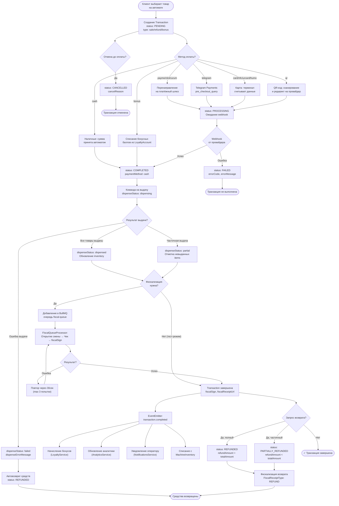
```mermaid
flowchart TD
    START(["Клиент выбирает товар на автомате"]) --> CREATE["Создание Transaction\nstatus: PENDING\ntype: sale/refund/bonus"]
    CREATE --> PAYMENT_METHOD{"Метод оплаты?"}

    PAYMENT_METHOD -->|"cash"| CASH["Наличные: сумма\nпринята автоматом"]
    PAYMENT_METHOD -->|"payme/click/uzum"| ONLINE["Перенаправление\nна платёжный шлюз"]
    PAYMENT_METHOD -->|"telegram"| TG_PAY["Telegram Payments\npre_checkout_query"]
    PAYMENT_METHOD -->|"card/nfc/uzcard/humo"| CARD["Карта: терминал\nсчитывает данные"]
    PAYMENT_METHOD -->|"bonus"| BONUS["Списание бонусных\nбаллов из LoyaltyAccount"]
    PAYMENT_METHOD -->|"qr"| QR["QR-код: сканирование\nи редирект на провайдер"]

    CASH --> PAID["status: COMPLETED\npaymentMethod: cash"]
    ONLINE --> PROCESSING["status: PROCESSING\nОжидание webhook"]
    TG_PAY --> PROCESSING
    CARD --> PROCESSING
    BONUS --> PAID
    QR --> PROCESSING

    PROCESSING --> WEBHOOK{"Webhook\nот провайдера"}
    WEBHOOK -->|"Успех"| PAID
    WEBHOOK -->|"Ошибка"| FAILED["status: FAILED\nerrorCode, errorMessage"]

    PAID --> DISPENSE["Команда на выдачу\ndispenseStatus: dispensing"]
    DISPENSE --> DISPENSE_RESULT{"Результат выдачи?"}

    DISPENSE_RESULT -->|"Все товары выданы"| DISPENSED["dispenseStatus: dispensed\nОбновление inventory"]
    DISPENSE_RESULT -->|"Частичная выдача"| PARTIAL["dispenseStatus: partial\nОтметка невыданных items"]
    DISPENSE_RESULT -->|"Ошибка выдачи"| DISP_FAIL["dispenseStatus: failed\ndispenseErrorMessage"]

    DISPENSED --> FISCAL{"Фискализация\nнужна?"}
    PARTIAL --> FISCAL
    DISP_FAIL --> AUTO_REFUND["Автовозврат средств\nstatus: REFUNDED"]

    FISCAL -->|"Да"| FISCAL_QUEUE["Добавление в BullMQ\nочередь fiscal-queue"]
    FISCAL -->|"Нет (тест-режим)"| COMPLETE

    FISCAL_QUEUE --> FISCAL_PROCESS["FiscalQueueProcessor:\nОткрытие смены → Чек → fiscalSign"]
    FISCAL_PROCESS --> FISCAL_OK{"Результат?"}
    FISCAL_OK -->|"Успех"| COMPLETE["Transaction завершена\nfiscalSign, fiscalReceiptUrl"]
    FISCAL_OK -->|"Ошибка"| FISCAL_RETRY["Повтор через 30сек\n(max 3 попытки)"]
    FISCAL_RETRY --> FISCAL_PROCESS

    COMPLETE --> EVENTS["EventEmitter:\ntransaction.completed"]
    EVENTS --> LOYALTY["Начисление бонусов\n(LoyaltyService)"]
    EVENTS --> ANALYTICS["Обновление аналитики\n(AnalyticsService)"]
    EVENTS --> NOTIFY["Уведомление оператору\n(NotificationsService)"]
    EVENTS --> INVENTORY_UPD["Списание с\nMachineInventory"]

    FAILED --> END_FAIL(["Транзакция не выполнена"])
    AUTO_REFUND --> END_REFUND(["Средства возвращены"])

    %% Отдельная ветка: ручной возврат
    COMPLETE --> MANUAL_REFUND{"Запрос возврата?"}
    MANUAL_REFUND -->|"Да, полный"| FULL_REFUND["status: REFUNDED\nrefundAmount = totalAmount"]
    MANUAL_REFUND -->|"Да, частичный"| PART_REFUND["status: PARTIALLY_REFUNDED\nrefundAmount < totalAmount"]
    MANUAL_REFUND -->|"Нет"| END_OK(["✓ Транзакция завершена"])

    FULL_REFUND --> REFUND_FISCAL["Фискализация возврата\nFiscalReceiptType: REFUND"]
    PART_REFUND --> REFUND_FISCAL
    REFUND_FISCAL --> END_REFUND

    %% Отмена
    CREATE --> CANCEL{"Отмена до оплаты?"}
    CANCEL -->|"Да"| CANCELLED["status: CANCELLED\ncancelReason"]
    CANCELLED --> END_CANCEL(["Транзакция отменена"])
```

---

## A2. Payme — обработка webhook

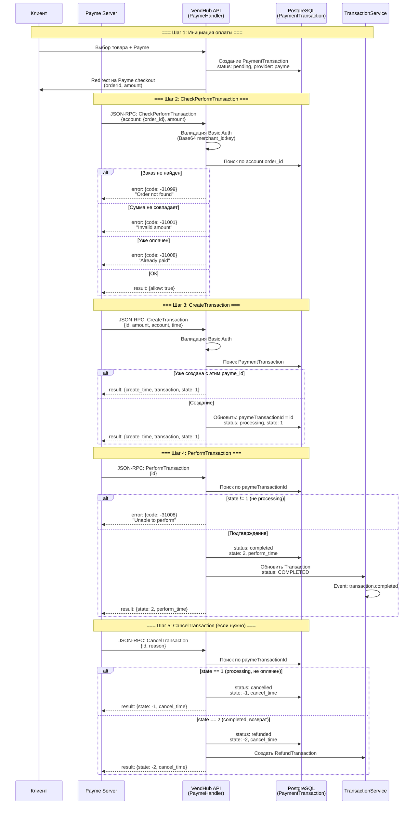
```mermaid
sequenceDiagram
    participant C as Клиент
    participant P as Payme Server
    participant API as VendHub API<br/>(PaymeHandler)
    participant DB as PostgreSQL<br/>(PaymentTransaction)
    participant TX as TransactionService

    Note over C,TX: === Шаг 1: Инициация оплаты ===
    C->>API: Выбор товара + Payme
    API->>DB: Создание PaymentTransaction<br/>status: pending, provider: payme
    API->>C: Redirect на Payme checkout<br/>(orderId, amount)

    Note over P,DB: === Шаг 2: CheckPerformTransaction ===
    P->>API: JSON-RPC: CheckPerformTransaction<br/>{account: {order_id}, amount}
    API->>API: Валидация Basic Auth<br/>(Base64 merchant_id:key)
    API->>DB: Поиск по account.order_id
    alt Заказ не найден
        API-->>P: error: {code: -31099}<br/>"Order not found"
    else Сумма не совпадает
        API-->>P: error: {code: -31001}<br/>"Invalid amount"
    else Уже оплачен
        API-->>P: error: {code: -31008}<br/>"Already paid"
    else ОК
        API-->>P: result: {allow: true}
    end

    Note over P,DB: === Шаг 3: CreateTransaction ===
    P->>API: JSON-RPC: CreateTransaction<br/>{id, amount, account, time}
    API->>API: Валидация Basic Auth
    API->>DB: Поиск PaymentTransaction
    alt Уже создана с этим payme_id
        API-->>P: result: {create_time, transaction, state: 1}
    else Создание
        API->>DB: Обновить: paymeTransactionId = id<br/>status: processing, state: 1
        API-->>P: result: {create_time, transaction, state: 1}
    end

    Note over P,DB: === Шаг 4: PerformTransaction ===
    P->>API: JSON-RPC: PerformTransaction<br/>{id}
    API->>DB: Поиск по paymeTransactionId
    alt state != 1 (не processing)
        API-->>P: error: {code: -31008}<br/>"Unable to perform"
    else Подтверждение
        API->>DB: status: completed<br/>state: 2, perform_time
        API->>TX: Обновить Transaction<br/>status: COMPLETED
        TX->>TX: Event: transaction.completed
        API-->>P: result: {state: 2, perform_time}
    end

    Note over P,DB: === Шаг 5: CancelTransaction (если нужно) ===
    P->>API: JSON-RPC: CancelTransaction<br/>{id, reason}
    API->>DB: Поиск по paymeTransactionId
    alt state == 1 (processing, не оплачен)
        API->>DB: status: cancelled<br/>state: -1, cancel_time
        API-->>P: result: {state: -1, cancel_time}
    else state == 2 (completed, возврат)
        API->>DB: status: refunded<br/>state: -2, cancel_time
        API->>TX: Создать RefundTransaction
        API-->>P: result: {state: -2, cancel_time}
    end
```

---

## A3. Click — обработка webhook

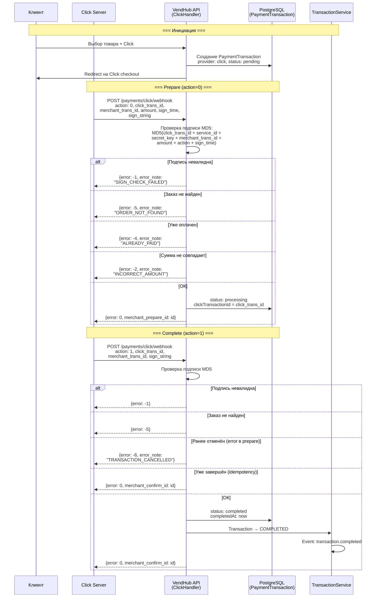
```mermaid
sequenceDiagram
    participant C as Клиент
    participant CL as Click Server
    participant API as VendHub API<br/>(ClickHandler)
    participant DB as PostgreSQL<br/>(PaymentTransaction)
    participant TX as TransactionService

    Note over C,TX: === Инициация ===
    C->>API: Выбор товара + Click
    API->>DB: Создание PaymentTransaction<br/>provider: click, status: pending
    API->>C: Redirect на Click checkout

    Note over CL,DB: === Prepare (action=0) ===
    CL->>API: POST /payments/click/webhook<br/>action: 0, click_trans_id,<br/>merchant_trans_id, amount, sign_time,<br/>sign_string
    API->>API: Проверка подписи MD5:<br/>MD5(click_trans_id + service_id +<br/>secret_key + merchant_trans_id +<br/>amount + action + sign_time)
    alt Подпись невалидна
        API-->>CL: {error: -1, error_note:<br/>"SIGN_CHECK_FAILED"}
    else Заказ не найден
        API-->>CL: {error: -5, error_note:<br/>"ORDER_NOT_FOUND"}
    else Уже оплачен
        API-->>CL: {error: -4, error_note:<br/>"ALREADY_PAID"}
    else Сумма не совпадает
        API-->>CL: {error: -2, error_note:<br/>"INCORRECT_AMOUNT"}
    else ОК
        API->>DB: status: processing<br/>clickTransactionId = click_trans_id
        API-->>CL: {error: 0, merchant_prepare_id: id}
    end

    Note over CL,DB: === Complete (action=1) ===
    CL->>API: POST /payments/click/webhook<br/>action: 1, click_trans_id,<br/>merchant_trans_id, sign_string
    API->>API: Проверка подписи MD5
    alt Подпись невалидна
        API-->>CL: {error: -1}
    else Заказ не найден
        API-->>CL: {error: -5}
    else Ранее отменён (error в prepare)
        API-->>CL: {error: -6, error_note:<br/>"TRANSACTION_CANCELLED"}
    else Уже завершён (idempotency)
        API-->>CL: {error: 0, merchant_confirm_id: id}
    else ОК
        API->>DB: status: completed<br/>completedAt: now
        API->>TX: Transaction → COMPLETED
        TX->>TX: Event: transaction.completed
        API-->>CL: {error: 0, merchant_confirm_id: id}
    end
```

---

## A4. Uzum Bank — обработка webhook

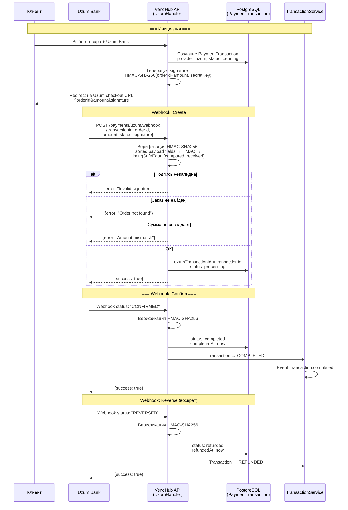
```mermaid
sequenceDiagram
    participant C as Клиент
    participant UZ as Uzum Bank
    participant API as VendHub API<br/>(UzumHandler)
    participant DB as PostgreSQL<br/>(PaymentTransaction)
    participant TX as TransactionService

    Note over C,TX: === Инициация ===
    C->>API: Выбор товара + Uzum Bank
    API->>DB: Создание PaymentTransaction<br/>provider: uzum, status: pending
    API->>API: Генерация signature:<br/>HMAC-SHA256(orderId+amount, secretKey)
    API->>C: Redirect на Uzum checkout URL<br/>?orderId&amount&signature

    Note over UZ,DB: === Webhook: Create ===
    UZ->>API: POST /payments/uzum/webhook<br/>{transactionId, orderId,<br/>amount, status, signature}
    API->>API: Верификация HMAC-SHA256:<br/>sorted payload fields → HMAC →<br/>timingSafeEqual(computed, received)
    alt Подпись невалидна
        API-->>UZ: {error: "Invalid signature"}
    else Заказ не найден
        API-->>UZ: {error: "Order not found"}
    else Сумма не совпадает
        API-->>UZ: {error: "Amount mismatch"}
    else ОК
        API->>DB: uzumTransactionId = transactionId<br/>status: processing
        API-->>UZ: {success: true}
    end

    Note over UZ,DB: === Webhook: Confirm ===
    UZ->>API: Webhook status: "CONFIRMED"
    API->>API: Верификация HMAC-SHA256
    API->>DB: status: completed<br/>completedAt: now
    API->>TX: Transaction → COMPLETED
    TX->>TX: Event: transaction.completed
    API-->>UZ: {success: true}

    Note over UZ,DB: === Webhook: Reverse (возврат) ===
    UZ->>API: Webhook status: "REVERSED"
    API->>API: Верификация HMAC-SHA256
    API->>DB: status: refunded<br/>refundedAt: now
    API->>TX: Transaction → REFUNDED
    API-->>UZ: {success: true}
```

---

## A5. Аутентификация — полный цикл

```mermaid
flowchart TD
    subgraph LOGIN ["Ветка: Логин"]
        L_START(["Пользователь вводит\nemail + пароль"]) --> L_ATTEMPTS["Проверка LoginAttempt\n(за последние 30 мин)"]
        L_ATTEMPTS --> L_LOCKED{"attempts ≥ 5?"}
        L_LOCKED -->|"Да"| L_LOCKOUT["403: Account locked\n30 мин ожидания"]
        L_LOCKED -->|"Нет"| L_FIND["Поиск User по email\n(active, not deleted)"]
        L_FIND --> L_FOUND{"User найден?"}
        L_FOUND -->|"Нет"| L_BAD["401: Invalid credentials\n+ запись LoginAttempt"]
        L_FOUND -->|"Да"| L_BCRYPT["bcrypt.compare\n(password, hash)"]
        L_BCRYPT --> L_MATCH{"Пароль верный?"}
        L_MATCH -->|"Нет"| L_BAD
        L_MATCH -->|"Да"| L_2FA{"2FA включена?"}

        L_2FA -->|"Нет"| L_SESSION
        L_2FA -->|"Да"| L_CHALLENGE["Выдача challengeToken\n(JWT, short-lived, 5 мин)"]
        L_CHALLENGE --> L_TOTP(["Пользователь вводит\n6-значный TOTP"])
        L_TOTP --> L_VERIFY_TOTP["TwoFactorService:\nverify TOTP code"]
        L_VERIFY_TOTP --> L_TOTP_OK{"Код верный?"}
        L_TOTP_OK -->|"Нет"| L_BAD_TOTP["401: Invalid TOTP"]
        L_TOTP_OK -->|"Да"| L_SESSION

        L_SESSION["Создание UserSession\n(sessionId, device, ip, expiresAt)\nТТЛ: 7 дней"]
        L_SESSION --> L_JWT["Генерация JWT:\n{sub, email, role, organizationId,\nsessionId, jti: uuid}"]
        L_JWT --> L_TOKENS["Access Token (15 мин)\n+ Refresh Token (7 дней)"]
        L_TOKENS --> L_METRICS["MetricsService:\nlogin_success counter"]
        L_METRICS --> L_OK(["✓ Вход выполнен"])
    end

    subgraph INVITE ["Ветка: Регистрация по инвайту"]
        I_START(["Переход по ссылке\n/register?code=xxx"]) --> I_FIND["InvitesService:\nfindByCode(code)"]
        I_FIND --> I_VALID{"code валидный?\nactive + not expired\n+ currentUses < maxUses"}
        I_VALID -->|"Нет"| I_BAD["400: Invalid invite"]
        I_VALID -->|"Да"| I_REG["Создание User:\nrole из invite,\norganizationId из invite"]
        I_REG --> I_HASH["bcrypt.hash(password, 10)"]
        I_HASH --> I_SAVE["Сохранение User\n+ инкремент invite.currentUses"]
        I_SAVE --> I_OK(["✓ Регистрация завершена\n→ Переход на логин"])
    end

    subgraph RESET ["Ветка: Сброс пароля"]
        R_START(["Запрос сброса\nпо email"]) --> R_TOKEN["Генерация PasswordResetToken\ncrypto.randomBytes(32)\nТТЛ: 1 час"]
        R_TOKEN --> R_EMAIL["Отправка email\nс ссылкой /reset?token=xxx"]
        R_EMAIL --> R_CLICK(["Пользователь переходит\nпо ссылке"])
        R_CLICK --> R_VERIFY["Проверка токена:\nnot expired, not used"]
        R_VERIFY --> R_POLICY["PasswordPolicyService:\nпроверка нового пароля\n(длина, сложность, история)"]
        R_POLICY --> R_HASH["bcrypt.hash(newPassword, 10)"]
        R_HASH --> R_SAVE["Обновление пароля\n+ invalidation всех sessions\n+ пометка токена used"]
        R_SAVE --> R_OK(["✓ Пароль обновлён"])
    end

    subgraph CRON ["Cron-задачи (ежедневно)"]
        C1["3:00 AM — cleanupExpiredResetTokens\nУдаление просроченных токенов сброса"]
        C2["4:00 AM — cleanupExpiredSessions\nУдаление истекших UserSession"]
        C3["5:00 AM — cleanupOldLoginAttempts\nОчистка старых попыток входа"]
    end
```

---

## A6. RBAC — маршрут запроса

```mermaid
flowchart TD
    REQ(["HTTP Request\nAuthorization: Bearer {jwt}"]) --> PUBLIC{"Декоратор\n@Public()?"}

    PUBLIC -->|"Да"| CONTROLLER["✓ Controller\n(публичный эндпойнт)"]
    PUBLIC -->|"Нет"| JWT_GUARD["JwtAuthGuard\n(extends AuthGuard('jwt'))"]

    JWT_GUARD --> JWT_STRATEGY["JwtStrategy:\n1. Извлечение JWT из header\n2. Верификация подписи\n3. Проверка expiration\n4. Декодирование payload"]
    JWT_STRATEGY --> BLACKLIST{"TokenBlacklistService:\njti в blacklist?"}

    BLACKLIST -->|"Да (revoked)"| DENY_401["401 Unauthorized\nToken revoked"]
    BLACKLIST -->|"Нет"| SESSION_CHECK{"UserSession\nactive + not expired?"}

    SESSION_CHECK -->|"Нет"| DENY_401
    SESSION_CHECK -->|"Да"| INJECT_USER["Инъекция в request:\nuser.id, user.email,\nuser.role, user.organizationId,\nuser.sessionId"]

    INJECT_USER --> ROLES_GUARD["RolesGuard:\nПроверка @Roles() декоратора"]
    ROLES_GUARD --> HAS_ROLES{"@Roles() указан\nна endpoint?"}

    HAS_ROLES -->|"Нет"| ORG_GUARD
    HAS_ROLES -->|"Да"| ROLE_CHECK{"user.role ∈\nallowedRoles?"}

    ROLE_CHECK -->|"Нет"| DENY_403["403 Forbidden\nInsufficient role"]
    ROLE_CHECK -->|"Да"| ORG_GUARD["OrganizationGuard:\nОпределение organizationId"]

    ORG_GUARD --> ORG_SOURCE{"Источник orgId?"}
    ORG_SOURCE -->|"params.organizationId"| ORG_VERIFY["Проверка:\nuser принадлежит org"]
    ORG_SOURCE -->|"body.organizationId"| ORG_VERIFY
    ORG_SOURCE -->|"Отсутствует"| ORG_INJECT["Инъекция из\nuser.organizationId"]

    ORG_VERIFY --> ORG_MATCH{"orgId совпадает\nс user.organizationId?"}
    ORG_MATCH -->|"Нет (owner может всё)"| IS_OWNER{"user.role\n== owner?"}
    IS_OWNER -->|"Нет"| DENY_403_ORG["403 Forbidden\nOrganization mismatch"]
    IS_OWNER -->|"Да"| THROTTLE
    ORG_MATCH -->|"Да"| THROTTLE
    ORG_INJECT --> THROTTLE

    THROTTLE["ThrottlerGuard:\nRate limiting\n(default: 60 req/min)"]
    THROTTLE --> THROTTLE_CHECK{"Лимит\nпревышен?"}
    THROTTLE_CHECK -->|"Да"| DENY_429["429 Too Many Requests"]
    THROTTLE_CHECK -->|"Нет"| CONTROLLER_AUTH["✓ Controller\n(авторизованный запрос)"]

    CONTROLLER_AUTH --> INTERCEPTORS["Interceptors:\nTransform → Logging →\nTimeout (30s) → Metrics"]
    INTERCEPTORS --> HANDLER["Route Handler\n(с @CurrentUser() декоратором)"]
```

---

## A7. Фискализация Multikassa

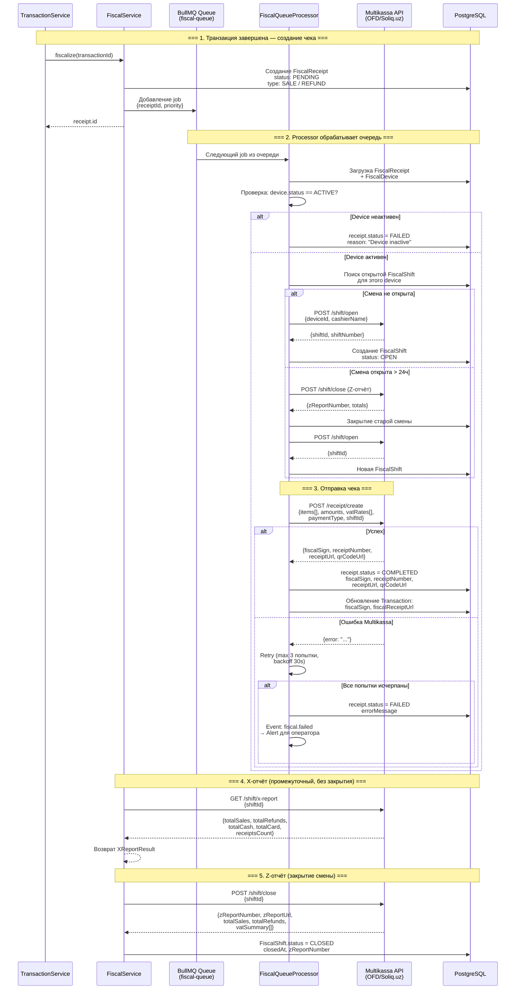
```mermaid
sequenceDiagram
    participant TX as TransactionService
    participant FS as FiscalService
    participant Q as BullMQ Queue<br/>(fiscal-queue)
    participant P as FiscalQueueProcessor
    participant MK as Multikassa API<br/>(OFD/Soliq.uz)
    participant DB as PostgreSQL

    Note over TX,DB: === 1. Транзакция завершена — создание чека ===
    TX->>FS: fiscalize(transactionId)
    FS->>DB: Создание FiscalReceipt<br/>status: PENDING<br/>type: SALE / REFUND
    FS->>Q: Добавление job<br/>{receiptId, priority}
    FS-->>TX: receipt.id

    Note over Q,DB: === 2. Processor обрабатывает очередь ===
    Q->>P: Следующий job из очереди

    P->>DB: Загрузка FiscalReceipt<br/>+ FiscalDevice
    P->>P: Проверка: device.status == ACTIVE?

    alt Device неактивен
        P->>DB: receipt.status = FAILED<br/>reason: "Device inactive"
    else Device активен
        P->>DB: Поиск открытой FiscalShift<br/>для этого device

        alt Смена не открыта
            P->>MK: POST /shift/open<br/>{deviceId, cashierName}
            MK-->>P: {shiftId, shiftNumber}
            P->>DB: Создание FiscalShift<br/>status: OPEN
        else Смена открыта > 24ч
            P->>MK: POST /shift/close (Z-отчёт)
            MK-->>P: {zReportNumber, totals}
            P->>DB: Закрытие старой смены
            P->>MK: POST /shift/open
            MK-->>P: {shiftId}
            P->>DB: Новая FiscalShift
        end

        Note over P,MK: === 3. Отправка чека ===
        P->>MK: POST /receipt/create<br/>{items[], amounts, vatRates[],<br/>paymentType, shiftId}
        alt Успех
            MK-->>P: {fiscalSign, receiptNumber,<br/>receiptUrl, qrCodeUrl}
            P->>DB: receipt.status = COMPLETED<br/>fiscalSign, receiptNumber,<br/>receiptUrl, qrCodeUrl
            P->>DB: Обновление Transaction:<br/>fiscalSign, fiscalReceiptUrl
        else Ошибка Multikassa
            MK-->>P: {error: "..."}
            P->>P: Retry (max 3 попытки,<br/>backoff 30s)
            alt Все попытки исчерпаны
                P->>DB: receipt.status = FAILED<br/>errorMessage
                P->>P: Event: fiscal.failed<br/>→ Alert для оператора
            end
        end
    end

    Note over FS,DB: === 4. X-отчёт (промежуточный, без закрытия) ===
    FS->>MK: GET /shift/x-report<br/>{shiftId}
    MK-->>FS: {totalSales, totalRefunds,<br/>totalCash, totalCard,<br/>receiptsCount}
    FS-->>FS: Возврат XReportResult

    Note over FS,DB: === 5. Z-отчёт (закрытие смены) ===
    FS->>MK: POST /shift/close<br/>{shiftId}
    MK-->>FS: {zReportNumber, zReportUrl,<br/>totalSales, totalRefunds,<br/>vatSummary[]}
    FS->>DB: FiscalShift.status = CLOSED<br/>closedAt, zReportNumber
```

---

## A8. 3-уровневая система инвентаря

```mermaid
flowchart TD
    subgraph LEVELS ["3 уровня хранения"]
        WH["🏭 Уровень 1: Склад\n(WarehouseInventory)\nЦентральное хранение"]
        OP["🚛 Уровень 2: Оператор\n(OperatorInventory)\nВ пути / на руках"]
        MC["🤖 Уровень 3: Автомат\n(MachineInventory)\nЗагружен в машину"]
    end

    subgraph TRANSFERS ["Трансферы между уровнями"]
        T1["Склад → Оператор\nВыдача на маршрут"]
        T2["Оператор → Автомат\nЗагрузка при обслуживании"]
        T3["Автомат → Оператор\nВыемка остатков"]
        T4["Оператор → Склад\nВозврат после маршрута"]
    end

    WH -->|"transferWarehouseToOperator"| T1
    T1 --> OP
    OP -->|"transferOperatorToMachine"| T2
    T2 --> MC
    MC -->|"transferMachineToOperator"| T3
    T3 --> OP
    OP -->|"transferOperatorToWarehouse"| T4
    T4 --> WH

    subgraph TRANSFER_FLOW ["Алгоритм каждого трансфера"]
        TF1["1. Pessimistic lock\n(SELECT FOR UPDATE)"] --> TF2["2. Проверка остатка\n(quantity ≥ requested)"]
        TF2 --> TF3{"Достаточно?"}
        TF3 -->|"Нет"| TF_ERR["BadRequest:\nInsufficient quantity"]
        TF3 -->|"Да"| TF4["3. Уменьшение баланса\nисточника"]
        TF4 --> TF5["4. Увеличение/создание\nбаланса получателя"]
        TF5 --> TF6["5. Создание\nInventoryMovement"]
        TF6 --> TF7["6. Event emit:\ninventory.transferred"]
    end

    subgraph RESERVATION ["Резервирование"]
        R1(["Запрос резервирования"]) --> R2["Создание InventoryReservation\nstatus: ACTIVE\nexpiresAt: +2 часа"]
        R2 --> R3["Уменьшение available\n(не actual) quantity"]
        R3 --> R4{"Действие?"}
        R4 -->|"Подтверждение"| R5["status: FULFILLED\nСписание actual quantity"]
        R4 -->|"Отмена"| R6["status: CANCELLED\nВозврат available"]
        R4 -->|"Истечение"| R7["Cron каждые 10мин:\nstatus: EXPIRED\nВозврат available"]
    end

    subgraph ADJUSTMENT ["Корректировки"]
        A1(["Ручная корректировка"]) --> A2["Создание InventoryAdjustment\ntype: INCREASE/DECREASE/WRITE_OFF"]
        A2 --> A3["reason: damaged/expired/\ncounting_error/theft/other"]
        A3 --> A4["Обновление баланса\nсоответствующего уровня"]
        A4 --> A5["Audit trail:\nAdjustment → userId, notes"]
    end

    MC -->|"Продажа"| SALE["Автоматическое списание\nпри продаже (TransactionService)\n→ MachineInventory -= qty"]
```

---

## B1. Жизненный цикл заказа

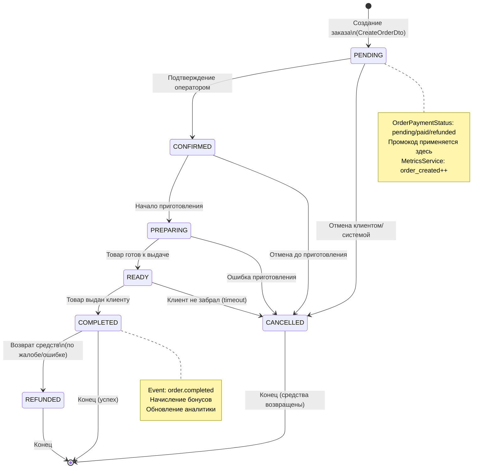
```mermaid
stateDiagram-v2
    [*] --> PENDING : Создание заказа\n(CreateOrderDto)

    PENDING --> CONFIRMED : Подтверждение оператором
    PENDING --> CANCELLED : Отмена клиентом/системой

    CONFIRMED --> PREPARING : Начало приготовления
    CONFIRMED --> CANCELLED : Отмена до приготовления

    PREPARING --> READY : Товар готов к выдаче
    PREPARING --> CANCELLED : Ошибка приготовления

    READY --> COMPLETED : Товар выдан клиенту
    READY --> CANCELLED : Клиент не забрал (timeout)

    COMPLETED --> REFUNDED : Возврат средств\n(по жалобе/ошибке)

    CANCELLED --> [*] : Конец (средства возвращены)
    REFUNDED --> [*] : Конец
    COMPLETED --> [*] : Конец (успех)

    note right of PENDING
        OrderPaymentStatus: pending/paid/refunded
        Промокод применяется здесь
        MetricsService: order_created++
    end note

    note right of COMPLETED
        Event: order.completed
        Начисление бонусов
        Обновление аналитики
    end note
```

---

## B10. Система лояльности

```mermaid
flowchart TD
    subgraph EARN ["Начисление баллов"]
        E1(["Событие:\nпокупка/реферал/квест/промо"]) --> E2["BonusEngineService:\nопределение множителя\n(по уровню, по акции)"]
        E2 --> E3["Расчёт баллов:\nbasePoints × multiplier"]
        E3 --> E4["Создание PointsTransaction:\ntype: EARN\nsource: PURCHASE/REFERRAL/\nQUEST/PROMO/MANUAL"]
        E4 --> E5["expiryDate =\ncalculateExpiryDate()\n(обычно +365 дней)"]
        E5 --> E6["Обновление User:\ntotalPoints += earned"]
        E6 --> E7["Проверка уровня:\ngetLoyaltyLevelByPoints()"]
        E7 --> E8{"Новый уровень?"}
        E8 -->|"Да"| E9["Event: loyalty.level_up\n→ Уведомление клиенту\n→ Бонус за уровень"]
        E8 -->|"Нет"| E10["Event: loyalty.points_earned"]
    end

    subgraph SPEND ["Списание баллов"]
        S1(["Клиент использует баллы"]) --> S2["Проверка баланса:\navailablePoints ≥ required"]
        S2 --> S3{"Достаточно?"}
        S3 -->|"Нет"| S4["400: Insufficient points"]
        S3 -->|"Да"| S5["FIFO списание:\nсамые старые баллы\nсписываются первыми"]
        S5 --> S6["PointsTransaction:\ntype: SPEND"]
        S6 --> S7["Обновление User:\ntotalPoints -= spent"]
    end

    subgraph LEVELS ["Уровни лояльности"]
        LV1["BRONZE: 0+ баллов"]
        LV2["SILVER: 500+ баллов\n(5% бонус)"]
        LV3["GOLD: 2000+ баллов\n(10% бонус)"]
        LV4["PLATINUM: 5000+ баллов\n(15% бонус)"]
        LV5["DIAMOND: 10000+ баллов\n(20% бонус)"]
        LV1 --> LV2 --> LV3 --> LV4 --> LV5
    end

    subgraph QUESTS ["Квесты (Quest + UserQuest)"]
        Q1["Quest: QuestType\n(purchase_count / spend_amount /\nvisit_days / referral_count)"] --> Q2["QuestPeriod:\nDAILY / WEEKLY / MONTHLY"]
        Q2 --> Q3["UserQuest создаётся\nпри первом событии"]
        Q3 --> Q4["@OnEvent: progress tracking\nincrement currentProgress"]
        Q4 --> Q5{"currentProgress\n≥ targetValue?"}
        Q5 -->|"Нет"| Q6["Продолжение"]
        Q5 -->|"Да"| Q7["status: COMPLETED\n→ Клиент может claim"]
        Q7 --> Q8["Claim reward:\nначисление rewardPoints\nчерез LoyaltyService"]
        Q8 --> Q9["status: CLAIMED"]
    end

    subgraph CRONS ["Cron-задачи"]
        CR1["01:00 — Expire old points\n(where expiryDate < now)"]
        CR2["00:30 — Recalculate levels\n(bulk update Users)"]
        CR3["00:00 daily — Reset daily quests"]
        CR4["00:00 Monday — Reset weekly quests"]
        CR5["00:00 1st — Reset monthly quests"]
        CR6["02:00 — Expire completed quests\n(claimDeadline passed)"]
    end
```

---

## B11. Импорт данных

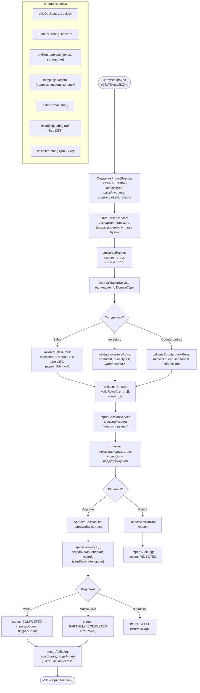
```mermaid
flowchart TD
    START(["Загрузка файла\n(CSV/Excel/JSON)"]) --> SESSION["Создание ImportSession\nstatus: PENDING\nDomainType: sales/inventory/\ncounterparties/products"]

    SESSION --> DETECT["DataParserService:\nАвтодетект формата\n(по расширению + magic bytes)"]
    DETECT --> PARSE["UniversalParser:\nпарсинг строк\n→ ParsedRow[]"]
    PARSE --> VALIDATE["DataValidationService:\nваличация по DomainType"]

    VALIDATE --> VAL_TYPE{"Тип данных?"}
    VAL_TYPE -->|"Sales"| VAL_SALES["validateSalesRows:\nmachineId?, amount > 0,\ndate valid, paymentMethod?"]
    VAL_TYPE -->|"Inventory"| VAL_INV["validateInventoryRows:\nproductId, quantity > 0,\nwarehouseId?"]
    VAL_TYPE -->|"Counterparties"| VAL_CP["validateCounterpartyRows:\nname required, inn format,\ncontact info"]

    VAL_SALES --> RESULT
    VAL_INV --> RESULT
    VAL_CP --> RESULT

    RESULT["ValidationResult:\nvalidRows[], errors[],\nwarnings[]"]

    RESULT --> CLASSIFY["ImportSessionService:\nклассификация\n(авто или ручная)"]
    CLASSIFY --> PREVIEW["Preview:\nпоказ валидных строк\n+ ошибки + предупреждения"]
    PREVIEW --> DECISION{"Решение?"}

    DECISION -->|"Approve"| APPROVE["ApproveSessionDto:\napprovedById, notes"]
    DECISION -->|"Reject"| REJECT["RejectSessionDto:\nreason"]

    APPROVE --> APPLY["Применение к БД:\nсоздание/обновление records\n(skipDuplicates option)"]
    APPLY --> APPLY_RESULT{"Результат"}
    APPLY_RESULT -->|"Успех"| SUCCESS["status: COMPLETED\nimportedCount, skippedCount"]
    APPLY_RESULT -->|"Частичный"| PARTIAL["status: PARTIALLY_COMPLETED\nerrorRows[]"]
    APPLY_RESULT -->|"Ошибка"| FAILED["status: FAILED\nerrorMessage"]

    SUCCESS --> AUDIT["ImportAuditLog:\nrecord каждого действия\n(userId, action, details)"]
    PARTIAL --> AUDIT
    REJECT --> AUDIT_REJ["ImportAuditLog:\naction: REJECTED"]

    AUDIT --> END(["✓ Импорт завершён"])

    subgraph OPTIONS ["Опции импорта"]
        O1["skipDuplicates: boolean"]
        O2["updateExisting: boolean"]
        O3["dryRun: boolean (только валидация)"]
        O4["mapping: Record (переименование колонок)"]
        O5["dateFormat: string"]
        O6["encoding: string (utf-8/cp1251)"]
        O7["delimiter: string (для CSV)"]
    end
```

---

## B12. Маршрутизация уведомлений

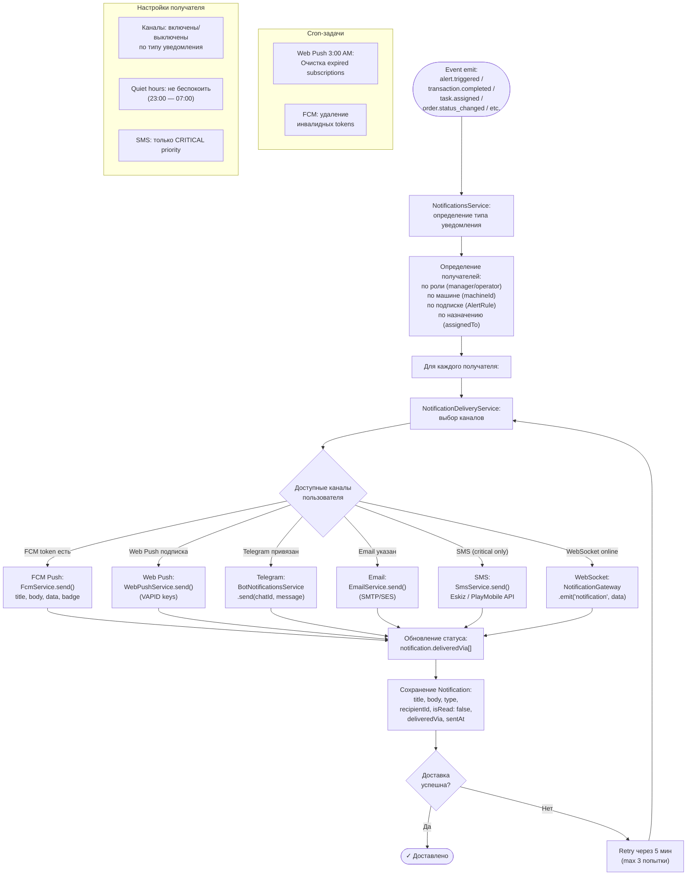
```mermaid
flowchart TD
    EVENT(["Event emit:\nalert.triggered /\ntransaction.completed /\ntask.assigned /\norder.status_changed / etc."]) --> NOTIFY["NotificationsService:\nопределение типа уведомления"]

    NOTIFY --> RECIPIENTS["Определение получателей:\nпо роли (manager/operator)\nпо машине (machineId)\nпо подписке (AlertRule)\nпо назначению (assignedTo)"]

    RECIPIENTS --> FOREACH["Для каждого получателя:"]
    FOREACH --> DELIVERY["NotificationDeliveryService:\nвыбор каналов"]

    DELIVERY --> CHANNELS{"Доступные каналы\nпользователя"}

    CHANNELS -->|"FCM token есть"| FCM["FCM Push:\nFcmService.send()\ntitle, body, data, badge"]
    CHANNELS -->|"Web Push подписка"| WEBPUSH["Web Push:\nWebPushService.send()\n(VAPID keys)"]
    CHANNELS -->|"Telegram привязан"| TG["Telegram:\nBotNotificationsService\n.send(chatId, message)"]
    CHANNELS -->|"Email указан"| EMAIL["Email:\nEmailService.send()\n(SMTP/SES)"]
    CHANNELS -->|"SMS (critical only)"| SMS["SMS:\nSmsService.send()\nEskiz / PlayMobile API"]
    CHANNELS -->|"WebSocket online"| WS["WebSocket:\nNotificationGateway\n.emit('notification', data)"]

    FCM --> STATUS["Обновление статуса:\nnotification.deliveredVia[]"]
    WEBPUSH --> STATUS
    TG --> STATUS
    EMAIL --> STATUS
    SMS --> STATUS
    WS --> STATUS

    STATUS --> SAVE["Сохранение Notification:\ntitle, body, type,\nrecipientId, isRead: false,\ndeliveredVia, sentAt"]

    SAVE --> RETRY{"Доставка\nуспешна?"}
    RETRY -->|"Да"| DONE(["✓ Доставлено"])
    RETRY -->|"Нет"| RETRY_QUEUE["Retry через 5 мин\n(max 3 попытки)"]
    RETRY_QUEUE --> DELIVERY

    subgraph CRON_CLEANUP ["Cron-задачи"]
        CL1["Web Push 3:00 AM:\nОчистка expired subscriptions"]
        CL2["FCM: удаление\nинвалидных tokens"]
    end

    subgraph PREFERENCES ["Настройки получателя"]
        P1["Каналы: включены/выключены\nпо типу уведомления"]
        P2["Quiet hours: не беспокоить\n(23:00 — 07:00)"]
        P3["SMS: только CRITICAL priority"]
    end
```

---

## B13. B2C клиентский поток

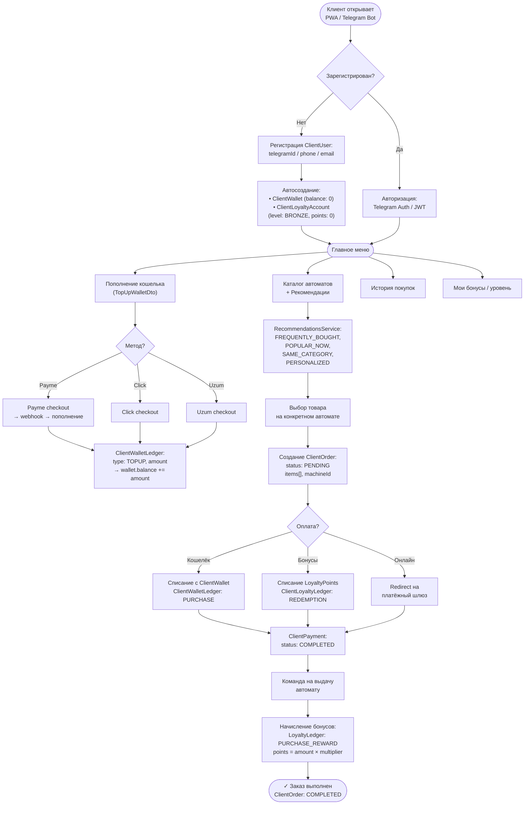
```mermaid
flowchart TD
    START(["Клиент открывает\nPWA / Telegram Bot"]) --> REG{"Зарегистрирован?"}

    REG -->|"Нет"| REGISTER["Регистрация ClientUser:\ntelegramId / phone / email"]
    REG -->|"Да"| LOGIN["Авторизация:\nTelegram Auth / JWT"]

    REGISTER --> CREATE_WALLET["Автосоздание:\n• ClientWallet (balance: 0)\n• ClientLoyaltyAccount\n  (level: BRONZE, points: 0)"]
    CREATE_WALLET --> MAIN_MENU

    LOGIN --> MAIN_MENU(["Главное меню"])

    MAIN_MENU --> TOPUP["Пополнение кошелька\n(TopUpWalletDto)"]
    MAIN_MENU --> CATALOG["Каталог автоматов\n+ Рекомендации"]
    MAIN_MENU --> HISTORY["История покупок"]
    MAIN_MENU --> LOYALTY_VIEW["Мои бонусы / уровень"]

    TOPUP --> TOPUP_METHOD{"Метод?"}
    TOPUP_METHOD -->|"Payme"| TOPUP_PAYME["Payme checkout\n→ webhook → пополнение"]
    TOPUP_METHOD -->|"Click"| TOPUP_CLICK["Click checkout"]
    TOPUP_METHOD -->|"Uzum"| TOPUP_UZUM["Uzum checkout"]
    TOPUP_PAYME --> WALLET_UPDATE["ClientWalletLedger:\ntype: TOPUP, amount\n→ wallet.balance += amount"]
    TOPUP_CLICK --> WALLET_UPDATE
    TOPUP_UZUM --> WALLET_UPDATE

    CATALOG --> RECS["RecommendationsService:\nFREQUENTLY_BOUGHT,\nPOPULAR_NOW,\nSAME_CATEGORY,\nPERSONALIZED"]
    RECS --> SELECT["Выбор товара\nна конкретном автомате"]

    SELECT --> ORDER["Создание ClientOrder:\nstatus: PENDING\nitems[], machineId"]
    ORDER --> PAY{"Оплата?"}

    PAY -->|"Кошелёк"| PAY_WALLET["Списание с ClientWallet\nClientWalletLedger: PURCHASE"]
    PAY -->|"Бонусы"| PAY_BONUS["Списание LoyaltyPoints\nClientLoyaltyLedger: REDEMPTION"]
    PAY -->|"Онлайн"| PAY_ONLINE["Redirect на\nплатёжный шлюз"]

    PAY_WALLET --> ORDER_PAID["ClientPayment:\nstatus: COMPLETED"]
    PAY_BONUS --> ORDER_PAID
    PAY_ONLINE --> ORDER_PAID

    ORDER_PAID --> DISPENSE["Команда на выдачу\nавтомату"]
    DISPENSE --> EARN["Начисление бонусов:\nLoyaltyLedger: PURCHASE_REWARD\npoints = amount × multiplier"]
    EARN --> COMPLETE(["✓ Заказ выполнен\nClientOrder: COMPLETED"])
```

---

## B14. Промокоды

```mermaid
flowchart TD
    subgraph CREATE_PROMO ["Создание промокода (Admin)"]
        C1(["Admin создаёт промокод"]) --> C2["Параметры:\ncode, discountType (percent/fixed),\ndiscountValue, maxUses,\nperUserLimit, validFrom, validTo,\nminOrderAmount, applicableProducts[]"]
        C2 --> C3["Сохранение PromoCode\nstatus: ACTIVE\nusedCount: 0"]
    end

    subgraph APPLY_PROMO ["Применение промокода (Клиент)"]
        A1(["Клиент вводит код"]) --> A2["Поиск PromoCode\nпо code"]
        A2 --> A3{"Найден?"}
        A3 -->|"Нет"| A_ERR1["404: Promo code not found"]
        A3 -->|"Да"| A4{"status == ACTIVE?"}
        A4 -->|"Нет"| A_ERR2["400: Promo code inactive"]
        A4 -->|"Да"| A5{"validFrom ≤ now\n≤ validTo?"}
        A5 -->|"Нет"| A_ERR3["400: Promo code expired\nor not yet active"]
        A5 -->|"Да"| A6{"usedCount\n< maxUses?"}
        A6 -->|"Нет"| A_ERR4["400: Promo code\nfully redeemed"]
        A6 -->|"Да"| A7{"minOrderAmount\nсоблюдён?"}
        A7 -->|"Нет"| A_ERR5["400: Minimum order\namount not met"]
        A7 -->|"Да"| A8["⚡ PESSIMISTIC LOCK\n(Transaction isolation)"]

        A8 --> A9["Повторная проверка\nperUserLimit внутри lock:\nCOUNT(PromoCodeRedemption)\nWHERE userId = current"]
        A9 --> A10{"Лимит на\nпользователя?"}
        A10 -->|"Превышен"| A_ERR6["400: Per-user\nlimit exceeded"]
        A10 -->|"ОК"| A11["Расчёт скидки:\npercent → amount × (value/100)\nfixed → amount - value"]
        A11 --> A12["Создание\nPromoCodeRedemption:\npromoCodeId, userId,\norderId, discountAmount"]
        A12 --> A13["Инкремент:\npromoCode.usedCount++"]
        A13 --> A14["COMMIT transaction"]
        A14 --> A_OK(["✓ Скидка применена"])
    end

    subgraph CRON_EXPIRE ["Cron: каждый час"]
        CR1["Поиск PromoCode:\nstatus: ACTIVE\nAND validTo < now"] --> CR2["status: EXPIRED"]
    end
```

---

## B2. Жизненный цикл задачи

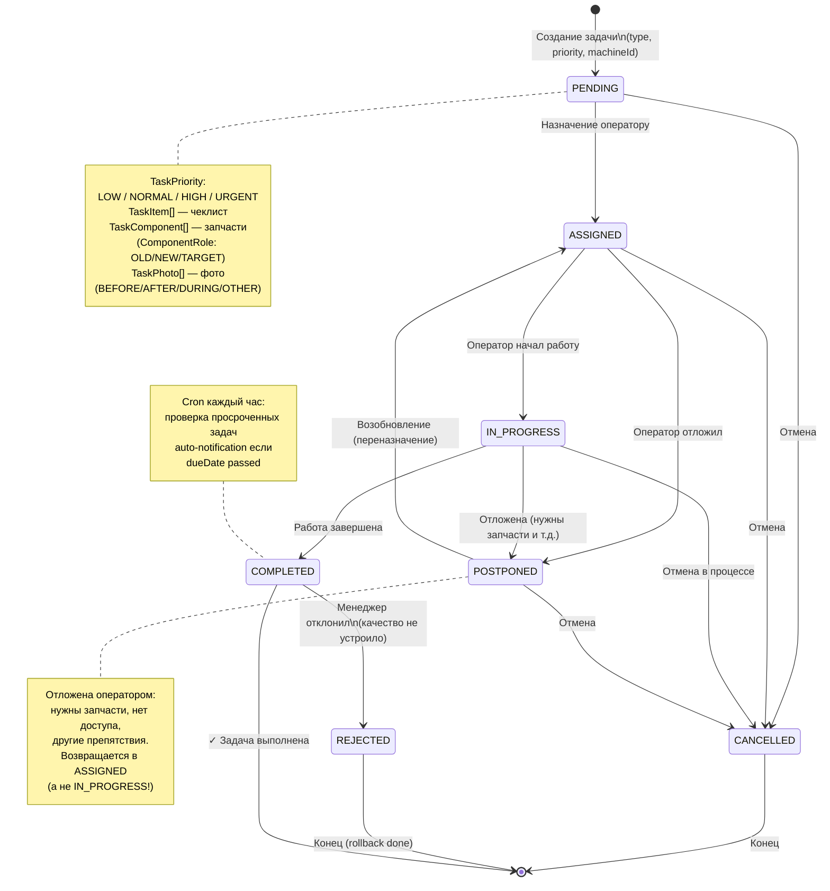
```mermaid
stateDiagram-v2
    [*] --> PENDING : Создание задачи\n(type, priority, machineId)

    PENDING --> ASSIGNED : Назначение оператору
    PENDING --> CANCELLED : Отмена

    ASSIGNED --> IN_PROGRESS : Оператор начал работу
    ASSIGNED --> POSTPONED : Оператор отложил
    ASSIGNED --> CANCELLED : Отмена

    IN_PROGRESS --> COMPLETED : Работа завершена
    IN_PROGRESS --> POSTPONED : Отложена (нужны запчасти и т.д.)
    IN_PROGRESS --> CANCELLED : Отмена в процессе

    POSTPONED --> ASSIGNED : Возобновление (переназначение)
    POSTPONED --> CANCELLED : Отмена

    COMPLETED --> REJECTED : Менеджер отклонил\n(качество не устроило)

    CANCELLED --> [*] : Конец
    REJECTED --> [*] : Конец (rollback done)
    COMPLETED --> [*] : ✓ Задача выполнена

    note right of PENDING
        TaskPriority:
        LOW / NORMAL / HIGH / URGENT
        TaskItem[] — чеклист
        TaskComponent[] — запчасти
        (ComponentRole: OLD/NEW/TARGET)
        TaskPhoto[] — фото
        (BEFORE/AFTER/DURING/OTHER)
    end note

    note right of POSTPONED
        Отложена оператором:
        нужны запчасти, нет доступа,
        другие препятствия.
        Возвращается в ASSIGNED
        (а не IN_PROGRESS!)
    end note

    note left of COMPLETED
        Cron каждый час:
        проверка просроченных задач
        auto-notification если
        dueDate passed
    end note
```

---

## B3. Техобслуживание

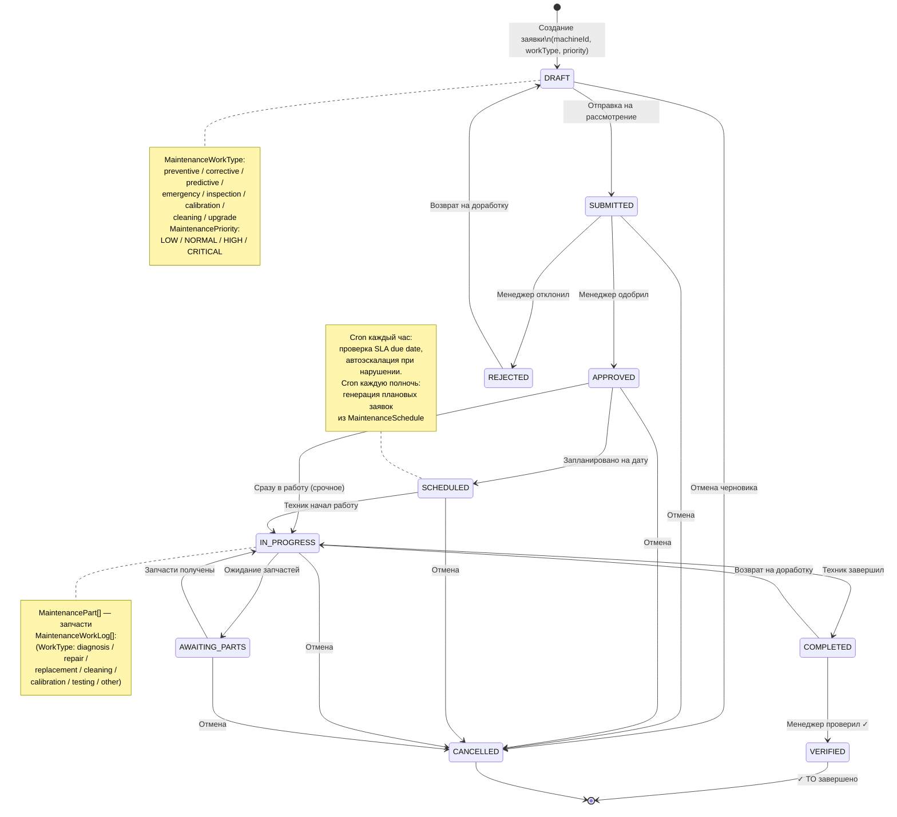
```mermaid
stateDiagram-v2
    [*] --> DRAFT : Создание заявки\n(machineId, workType, priority)

    DRAFT --> SUBMITTED : Отправка на рассмотрение
    DRAFT --> CANCELLED : Отмена черновика

    SUBMITTED --> APPROVED : Менеджер одобрил
    SUBMITTED --> REJECTED : Менеджер отклонил
    SUBMITTED --> CANCELLED : Отмена

    REJECTED --> DRAFT : Возврат на доработку

    APPROVED --> SCHEDULED : Запланировано на дату
    APPROVED --> IN_PROGRESS : Сразу в работу (срочное)
    APPROVED --> CANCELLED : Отмена

    SCHEDULED --> IN_PROGRESS : Техник начал работу
    SCHEDULED --> CANCELLED : Отмена

    IN_PROGRESS --> AWAITING_PARTS : Ожидание запчастей
    IN_PROGRESS --> COMPLETED : Техник завершил
    IN_PROGRESS --> CANCELLED : Отмена

    AWAITING_PARTS --> IN_PROGRESS : Запчасти получены
    AWAITING_PARTS --> CANCELLED : Отмена

    COMPLETED --> VERIFIED : Менеджер проверил ✓
    COMPLETED --> IN_PROGRESS : Возврат на доработку

    VERIFIED --> [*] : ✓ ТО завершено
    CANCELLED --> [*]

    note right of DRAFT
        MaintenanceWorkType:
        preventive / corrective / predictive /
        emergency / inspection / calibration /
        cleaning / upgrade
        MaintenancePriority:
        LOW / NORMAL / HIGH / CRITICAL
    end note

    note right of IN_PROGRESS
        MaintenancePart[] — запчасти
        MaintenanceWorkLog[]:
        (WorkType: diagnosis / repair /
        replacement / cleaning /
        calibration / testing / other)
    end note

    note left of SCHEDULED
        Cron каждый час:
        проверка SLA due date,
        автоэскалация при нарушении.
        Cron каждую полночь:
        генерация плановых заявок
        из MaintenanceSchedule
    end note
```

---

## B4. Заявки на материалы

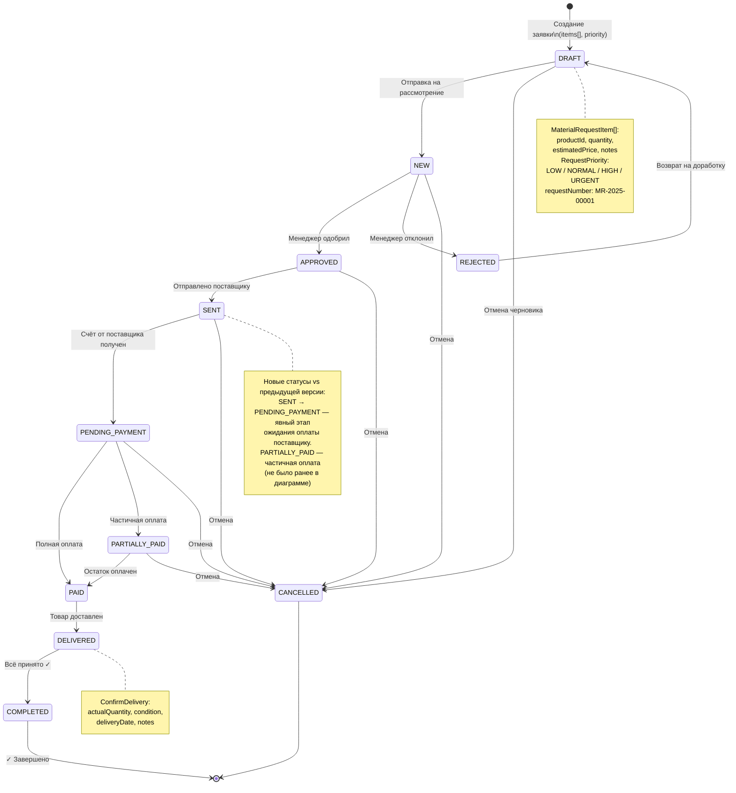
```mermaid
stateDiagram-v2
    [*] --> DRAFT : Создание заявки\n(items[], priority)

    DRAFT --> NEW : Отправка на рассмотрение
    DRAFT --> CANCELLED : Отмена черновика

    NEW --> APPROVED : Менеджер одобрил
    NEW --> REJECTED : Менеджер отклонил
    NEW --> CANCELLED : Отмена

    REJECTED --> DRAFT : Возврат на доработку

    APPROVED --> SENT : Отправлено поставщику
    APPROVED --> CANCELLED : Отмена

    SENT --> PENDING_PAYMENT : Счёт от поставщика получен
    SENT --> CANCELLED : Отмена

    PENDING_PAYMENT --> PAID : Полная оплата
    PENDING_PAYMENT --> PARTIALLY_PAID : Частичная оплата
    PENDING_PAYMENT --> CANCELLED : Отмена

    PARTIALLY_PAID --> PAID : Остаток оплачен
    PARTIALLY_PAID --> CANCELLED : Отмена

    PAID --> DELIVERED : Товар доставлен

    DELIVERED --> COMPLETED : Всё принято ✓

    COMPLETED --> [*] : ✓ Завершено
    CANCELLED --> [*]

    note right of DRAFT
        MaterialRequestItem[]:
        productId, quantity,
        estimatedPrice, notes
        RequestPriority:
        LOW / NORMAL / HIGH / URGENT
        requestNumber: MR-2025-00001
    end note

    note right of SENT
        Новые статусы vs предыдущей версии:
        SENT → PENDING_PAYMENT — явный этап
        ожидания оплаты поставщику.
        PARTIALLY_PAID — частичная оплата
        (не было ранее в диаграмме)
    end note

    note right of DELIVERED
        ConfirmDelivery:
        actualQuantity, condition,
        deliveryDate, notes
    end note
```

---

## B5. Сбор наличных

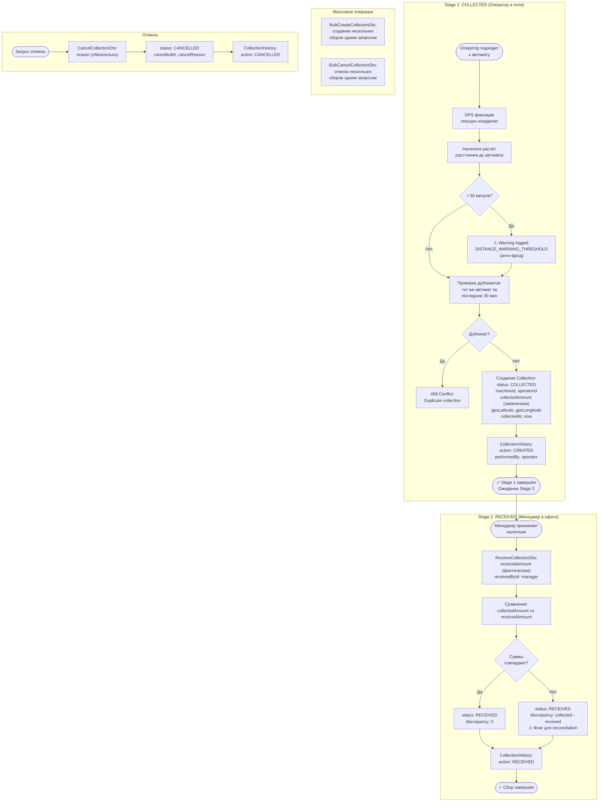
```mermaid
flowchart TD
    subgraph STAGE1 ["Stage 1: COLLECTED (Оператор в поле)"]
        S1_START(["Оператор подходит\nк автомату"]) --> S1_GPS["GPS фиксация\nтекущих координат"]
        S1_GPS --> S1_DISTANCE["Haversine расчёт\nрасстояния до автомата"]
        S1_DISTANCE --> S1_DIST_CHECK{"> 50 метров?"}
        S1_DIST_CHECK -->|"Да"| S1_WARN["⚠ Warning logged:\nDISTANCE_WARNING_THRESHOLD\n(анти-фрод)"]
        S1_DIST_CHECK -->|"Нет"| S1_DUP
        S1_WARN --> S1_DUP

        S1_DUP["Проверка дубликатов:\nтот же автомат за\nпоследние 30 мин"]
        S1_DUP --> S1_DUP_CHECK{"Дубликат?"}
        S1_DUP_CHECK -->|"Да"| S1_CONFLICT["409 Conflict:\nDuplicate collection"]
        S1_DUP_CHECK -->|"Нет"| S1_CREATE

        S1_CREATE["Создание Collection:\nstatus: COLLECTED\nmachineId, operatorId\ncollectedAmount (заявленная)\ngpsLatitude, gpsLongitude\ncollectedAt: now"]
        S1_CREATE --> S1_HISTORY["CollectionHistory:\naction: CREATED\nperformedBy: operator"]
        S1_HISTORY --> S1_DONE(["✓ Stage 1 завершён\nОжидание Stage 2"])
    end

    subgraph STAGE2 ["Stage 2: RECEIVED (Менеджер в офисе)"]
        S2_START(["Менеджер принимает\nналичные"]) --> S2_RECEIVE["ReceiveCollectionDto:\nreceivedAmount (фактическая)\nreceivedById: manager"]
        S2_RECEIVE --> S2_COMPARE["Сравнение:\ncollectedAmount vs receivedAmount"]
        S2_COMPARE --> S2_MATCH{"Суммы\nсовпадают?"}
        S2_MATCH -->|"Да"| S2_OK["status: RECEIVED\ndiscrepancy: 0"]
        S2_MATCH -->|"Нет"| S2_DISCREPANCY["status: RECEIVED\ndiscrepancy: collected - received\n⚠ Флаг для reconciliation"]
        S2_OK --> S2_HISTORY["CollectionHistory:\naction: RECEIVED"]
        S2_DISCREPANCY --> S2_HISTORY
        S2_HISTORY --> S2_DONE(["✓ Сбор завершён"])
    end

    subgraph BULK ["Массовые операции"]
        B1["BulkCreateCollectionDto:\nсоздание нескольких\nсборов одним запросом"]
        B2["BulkCancelCollectionDto:\nотмена нескольких\nсборов одним запросом"]
    end

    subgraph CANCEL_FLOW ["Отмена"]
        C1(["Запрос отмены"]) --> C2["CancelCollectionDto:\nreason (обязательно)"]
        C2 --> C3["status: CANCELLED\ncancelledAt, cancelReason"]
        C3 --> C4["CollectionHistory:\naction: CANCELLED"]
    end

    S1_DONE --> S2_START
```

---

## B6. Жалобы и возвраты

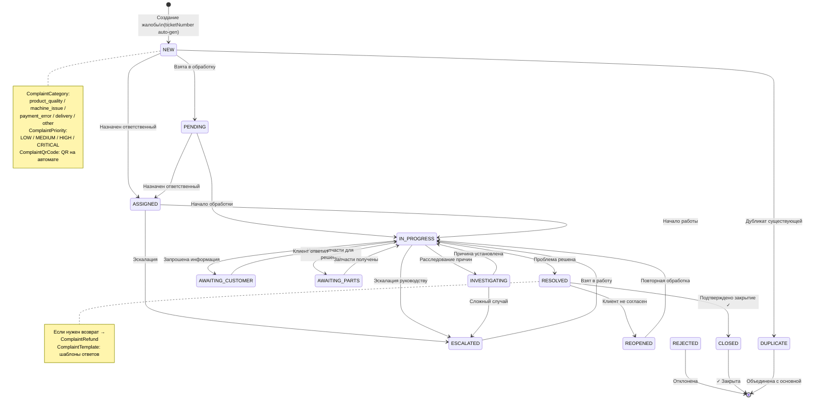
```mermaid
stateDiagram-v2
    [*] --> NEW : Создание жалобы\n(ticketNumber auto-gen)

    NEW --> PENDING : Взята в обработку
    NEW --> ASSIGNED : Назначен ответственный
    NEW --> DUPLICATE : Дубликат существующей

    PENDING --> ASSIGNED : Назначен ответственный
    PENDING --> IN_PROGRESS : Начало обработки

    ASSIGNED --> IN_PROGRESS : Начало работы
    ASSIGNED --> ESCALATED : Эскалация

    IN_PROGRESS --> INVESTIGATING : Расследование причин
    IN_PROGRESS --> AWAITING_CUSTOMER : Запрошена информация
    IN_PROGRESS --> AWAITING_PARTS : Нужны запчасти для решения
    IN_PROGRESS --> RESOLVED : Проблема решена
    IN_PROGRESS --> ESCALATED : Эскалация руководству

    INVESTIGATING --> IN_PROGRESS : Причина установлена
    INVESTIGATING --> ESCALATED : Сложный случай

    AWAITING_CUSTOMER --> IN_PROGRESS : Клиент ответил
    AWAITING_PARTS --> IN_PROGRESS : Запчасти получены

    ESCALATED --> IN_PROGRESS : Взят в работу

    RESOLVED --> CLOSED : Подтверждено закрытие ✓
    RESOLVED --> REOPENED : Клиент не согласен

    REOPENED --> IN_PROGRESS : Повторная обработка

    REJECTED --> [*] : Отклонена
    CLOSED --> [*] : ✓ Закрыта
    DUPLICATE --> [*] : Объединена с основной

    note right of NEW
        ComplaintCategory:
        product_quality / machine_issue /
        payment_error / delivery / other
        ComplaintPriority:
        LOW / MEDIUM / HIGH / CRITICAL
        ComplaintQrCode: QR на автомате
    end note

    note right of RESOLVED
        Если нужен возврат →
        ComplaintRefund
        ComplaintTemplate: шаблоны ответов
    end note

```

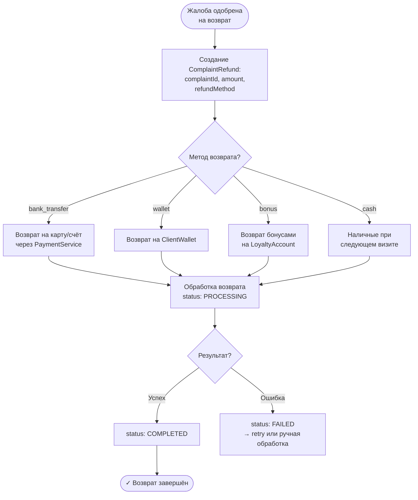
```mermaid

flowchart TD
    R_START(["Жалоба одобрена\nна возврат"]) --> R_CREATE["Создание ComplaintRefund:\ncomplaintId, amount,\nrefundMethod"]
    R_CREATE --> R_METHOD{"Метод возврата?"}

    R_METHOD -->|"bank_transfer"| R_BANK["Возврат на карту/счёт\nчерез PaymentService"]
    R_METHOD -->|"wallet"| R_WALLET["Возврат на ClientWallet"]
    R_METHOD -->|"bonus"| R_BONUS["Возврат бонусами\nна LoyaltyAccount"]
    R_METHOD -->|"cash"| R_CASH["Наличные при\nследующем визите"]

    R_BANK --> R_PROCESS["Обработка возврата\nstatus: PROCESSING"]
    R_WALLET --> R_PROCESS
    R_BONUS --> R_PROCESS
    R_CASH --> R_PROCESS

    R_PROCESS --> R_RESULT{"Результат?"}
    R_RESULT -->|"Успех"| R_OK["status: COMPLETED"]
    R_RESULT -->|"Ошибка"| R_FAIL["status: FAILED\n→ retry или ручная обработка"]
    R_OK --> R_DONE(["✓ Возврат завершён"])
```

---

## B7. Алерты и инциденты

```mermaid
flowchart TD
    subgraph CRON_5MIN ["Cron: каждые 5 минут — AlertEngine"]
        CE1["Загрузка всех AlertRule\nwhere: enabled = true"] --> CE2["Для каждого правила:"]
        CE2 --> CE3["Сбор метрики по machineId\n(temperature, fill_level,\nerror_count, revenue, etc.)"]
        CE3 --> CE4["evaluateMetric(value, condition, threshold)"]
        CE4 --> CE5{"Условие\nвыполнено?"}

        CE5 -->|"Нет"| CE_SKIP["Пропуск"]
        CE5 -->|"Да"| CE6{"Cooldown\nпрошёл?"}

        CE6 -->|"Нет (недавно срабатывал)"| CE_SKIP
        CE6 -->|"Да"| CE7["Создание AlertHistory:\nstatus: TRIGGERED\nmetricValue, threshold"]

        CE7 --> CE8{"autoCreateIncident\n= true?"}
        CE8 -->|"Да"| CE9["Создание Incident:\ntype по AlertRule\npriority по severity\nmachineId, description"]
        CE8 -->|"Нет"| CE10["Только Alert\n(без инцидента)"]

        CE9 --> CE11["Event emit:\nalert.triggered"]
        CE10 --> CE11
        CE11 --> CE12["NotificationService:\nотправка по каналам\n(push/email/telegram/websocket)"]
    end

    subgraph EVALUATE_CONDITIONS ["evaluateMetric — условия"]
        EC1["GREATER_THAN: value > threshold"]
        EC2["LESS_THAN: value < threshold"]
        EC3["EQUALS: value == threshold"]
        EC4["NOT_EQUALS: value != threshold"]
        EC5["BETWEEN: threshold ≤ value ≤ thresholdMax"]
        EC6["OUTSIDE: value < threshold OR value > thresholdMax"]
    end

    subgraph CRON_30MIN ["Cron: каждые 30 минут — Auto-resolve"]
        AR1["Поиск AlertHistory\nstatus: TRIGGERED\nolderthan: autoResolveMinutes"] --> AR2["status: AUTO_RESOLVED\nresolvedAt: now"]
    end

    subgraph CRON_10MIN ["Cron: каждые 10 минут — AlertEvaluator"]
        AE1["Дополнительная оценка:\nкомплексные метрики\n(комбинации условий)"] --> AE2["Обновление AlertHistory\nили создание нового"]
    end

    subgraph INCIDENT_FLOW ["Жизненный цикл инцидента"]
        I1["NEW"] -->|"Назначение"| I2["ASSIGNED"]
        I2 -->|"Начало работы"| I3["IN_PROGRESS"]
        I3 -->|"Решено"| I4["RESOLVED"]
        I4 -->|"Подтверждение"| I5["CLOSED"]
        I3 -->|"Эскалация"| I6["ESCALATED"]
        I6 --> I3
    end
```

---

## B8. Сверка / Reconciliation

```mermaid
flowchart TD
    START(["Запуск сверки\n(dateFrom, dateTo,\nsources[], machineIds[])"]) --> CREATE["Создание ReconciliationRun\nstatus: PENDING"]

    CREATE --> IMPORT["Импорт HW-данных\n(ImportHwSalesDto)\nФайлы от автоматов:\nDEX/EVA/CSV"]
    IMPORT --> PARSE["Парсинг строк →\nHwImportedSale\n(machineId, timestamp,\nproductCode, amount, paymentType)"]

    PARSE --> STATUS_PROC["status: IN_PROGRESS"]

    STATUS_PROC --> MATCH_TX["Сопоставление с Transaction:\nпо machineId + timestamp\n(±5 мин окно)"]

    MATCH_TX --> MATCH_PAY["Сопоставление с\nPaymentTransaction:\nпо providerTransactionId"]

    MATCH_PAY --> ANALYZE["Анализ расхождений"]

    ANALYZE --> MISMATCH_TYPES{"Типы расхождений"}

    MISMATCH_TYPES --> M1["MISSING_IN_HW\nЕсть в DB, нет в HW\n(возможно: сбой DEX)"]
    MISMATCH_TYPES --> M2["MISSING_IN_DB\nЕсть в HW, нет в DB\n(возможно: офлайн продажа)"]
    MISMATCH_TYPES --> M3["AMOUNT_MISMATCH\nСумма не совпадает\n(разница > порог)"]
    MISMATCH_TYPES --> M4["TIME_MISMATCH\nВремя не совпадает\n(разница > 5 мин)"]
    MISMATCH_TYPES --> M5["PAYMENT_MISMATCH\nМетод оплаты\nне совпадает"]

    M1 --> CREATE_MISMATCH["Создание\nReconciliationMismatch\ndля каждого расхождения"]
    M2 --> CREATE_MISMATCH
    M3 --> CREATE_MISMATCH
    M4 --> CREATE_MISMATCH
    M5 --> CREATE_MISMATCH

    CREATE_MISMATCH --> RESOLVE{"Разрешение?"}

    RESOLVE -->|"Автоматическое"| AUTO_RESOLVE["Мелкие расхождения:\nautomatically resolved\n(< порог суммы)"]
    RESOLVE -->|"Ручное"| MANUAL_RESOLVE["ResolveMismatchDto:\nresolution, resolvedById,\nnotes"]

    AUTO_RESOLVE --> SUMMARY
    MANUAL_RESOLVE --> SUMMARY

    SUMMARY["Итоговая статистика:\ntotalHwSales, totalDbTransactions,\nmatchedCount, mismatchCount,\ntotalDiscrepancy"]

    SUMMARY --> COMPLETE["status: COMPLETED\ncompletedAt: now"]
    COMPLETE --> END(["✓ Сверка завершена\nОтчёт доступен"])
```

---

## B9. Рейс (Trip)

```mermaid
stateDiagram-v2
    [*] --> ACTIVE : Создание и старт рейса\n(driverId, vehicleId,\ntransportType, startOdometer)

    ACTIVE --> COMPLETED : Все точки посещены\n(endedAt, endOdometer)
    ACTIVE --> CANCELLED : Ручная отмена
    ACTIVE --> AUTO_CLOSED : Cron: автозакрытие\n(нет GPS > 2ч)

    COMPLETED --> [*]
    CANCELLED --> [*]
    AUTO_CLOSED --> [*]

    note right of ACTIVE
        TransportType:
        CAR / MOTORCYCLE / BICYCLE /
        ON_FOOT / PUBLIC_TRANSPORT

        GPS-трекинг:
        TripPoint (lat, lon, speed, accuracy)
        каждые N секунд

        TripStop: автодетекция остановок
        TripTaskLink: привязка задач
        TripAnomaly: отклонения
    end note

    note left of COMPLETED
        TripReconciliation:
        fuelUsed vs estimated
        distanceActual vs planned
    end note

    note right of AUTO_CLOSED
        trips.cron.ts:
        Периодическая проверка
        ACTIVE рейсов без GPS-данных
        более 2 часов → AUTO_CLOSED
    end note

```

```mermaid

flowchart TD
    subgraph GPS_FLOW ["GPS Processing (real-time)"]
        G1["Новая GPS-точка\nот мобильного приложения"] --> G2["GpsProcessingService:\nсохранение TripPoint"]
        G2 --> G3["Haversine: расстояние\nот предыдущей точки"]
        G3 --> G4{"Скорость\n> 80 km/h?"}
        G4 -->|"Да"| G5["TripAnomaly:\nSPEED_LIMIT\nseverity по значению"]
        G4 -->|"Нет"| G6{"Отклонение от\nмаршрута > 500м?"}
        G6 -->|"Да"| G7["TripAnomaly:\nROUTE_DEVIATION"]
        G6 -->|"Нет"| G8{"Стоянка > 30 мин?"}
        G8 -->|"Да"| G9{"На точке маршрута?"}
        G9 -->|"Нет"| G10["TripAnomaly:\nUNAUTHORIZED_STOP"]
        G9 -->|"Да"| G11["TripStop: плановая остановка\n→ TripTaskLink: ARRIVED"]
        G8 -->|"Нет"| G12["Продолжение трекинга"]
    end

    subgraph ANOMALY_SEVERITY ["Severity (AnomalySeverity)"]
        AS1["LOW: мелкое отклонение"]
        AS2["MEDIUM: заметное отклонение"]
        AS3["HIGH: существенное нарушение"]
        AS4["CRITICAL: требует немедленного внимания"]
    end
```

---

## C1. Управление автоматами

```mermaid
stateDiagram-v2
    [*] --> ACTIVE : Создание автомата\n(machineNumber, model, locationId)

    ACTIVE --> LOW_STOCK : fillLevel < threshold\n(автоматически)
    ACTIVE --> ERROR : Критическая ошибка\n(MachineErrorLog)
    ACTIVE --> MAINTENANCE : Плановое ТО
    ACTIVE --> OFFLINE : Потеря связи
    ACTIVE --> DISABLED : Вручную отключён

    LOW_STOCK --> ACTIVE : Пополнение запасов
    LOW_STOCK --> ERROR : Ошибка при low stock
    LOW_STOCK --> MAINTENANCE : ТО при low stock

    ERROR --> ACTIVE : Ошибка устранена\n(resolveError)
    ERROR --> MAINTENANCE : Назначен ремонт

    MAINTENANCE --> ACTIVE : ТО завершено
    MAINTENANCE --> ERROR : Ремонт не помог
    MAINTENANCE --> DISABLED : Выведен из эксплуатации

    OFFLINE --> ACTIVE : Связь восстановлена
    OFFLINE --> ERROR : Offline + ошибка

    DISABLED --> ACTIVE : Повторная активация
    DISABLED --> [*] : Списание\n(writeoff processor)

    note right of ACTIVE
        MachineConnectionStatus:
        ONLINE / OFFLINE / UNSTABLE / UNKNOWN
        MachineSlot[]: планограмма
        MachineComponent[]: компоненты
    end note

    note left of ERROR
        MachineErrorLog:
        errorCode, message,
        severity, resolvedAt
    end note

    note right of DISABLED
        BullMQ: machine-writeoff
        DisposalReason:
        worn_out / damaged /
        obsolete / sold / other
        → bookValue расчёт
        → soft-delete
    end note

```

```mermaid

flowchart TD
    subgraph SLOT_OPS ["Операции со слотами (планограмма)"]
        SO1["RefillSlot: пополнение\nproductId, quantity"]
        SO2["UpdateSlot: смена товара\nновый productId, price"]
        SO3["ClearSlot: очистка\n(списание остатка)"]
    end

    subgraph COMPONENT_OPS ["Компоненты оборудования"]
        CO1["InstallComponent:\ncomponentType, serialNumber"]
        CO2["ReplaceComponent: замена"]
        CO3["MachineErrorLog:\nlogError → resolveError"]
    end

    subgraph LOCATION_OPS ["Перемещения"]
        LO1["MoveMachine:\noldLocationId → newLocationId"]
        LO2["MachineLocationHistory:\nкаждое перемещение записывается"]
    end

    subgraph MAINTENANCE_SCHEDULE ["Расписание ТО"]
        MS1["MachineMaintenanceSchedule:\nfrequency (daily/weekly/monthly)"]
        MS2["lastPerformedAt → nextDueAt"]
        MS3["Cron: автогенерация\nMaintenanceRequest"]
    end
```

---

## C10. Парсинг платёжных отчётов

```mermaid
flowchart TD
    subgraph UPLOAD ["Загрузка"]
        U1(["Загрузка файла от банка\n(Excel/CSV)"]) --> U2["PaymentReportUpload:\nfilename, fileType,\nuploadedBy, status: PENDING"]
    end

    subgraph WATCH ["Автообнаружение (опционально)"]
        W1["FolderWatcherService:\nмониторинг директории\nна новые файлы"] --> W2["Автозагрузка при\nпоявлении файла"]
        W2 --> U2
    end

    U2 --> DETECT["PaymentReportDetectorService:\nОпределение провайдера"]

    DETECT --> DETECT_LOGIC{"Формат файла?"}
    DETECT_LOGIC -->|"Payme headers"| DET_PAYME["provider: PAYME"]
    DETECT_LOGIC -->|"Click headers"| DET_CLICK["provider: CLICK"]
    DETECT_LOGIC -->|"Uzum headers"| DET_UZUM["provider: UZUM"]
    DETECT_LOGIC -->|"Не распознан"| DET_UNKNOWN["provider: UNKNOWN\n→ ручная классификация"]

    DET_PAYME --> PARSE
    DET_CLICK --> PARSE
    DET_UZUM --> PARSE

    PARSE["PaymentReportParserService:\nПарсинг строк файла"]
    PARSE --> ROWS["Для каждой строки →\nPaymentReportRow:\ntransactionId, amount,\ndate, status, merchantId,\ncommission, netAmount"]

    ROWS --> MATCH["Сопоставление с\nPaymentTransaction:\nпо providerTransactionId"]

    MATCH --> MATCH_RESULT{"Результат\nсопоставления"}
    MATCH_RESULT -->|"Совпал"| MATCHED["status: MATCHED\ntransactionId linked"]
    MATCH_RESULT -->|"Не найден в DB"| UNMATCHED["status: UNMATCHED\n→ ручная проверка"]
    MATCH_RESULT -->|"Сумма разная"| MISMATCH["status: AMOUNT_MISMATCH\ndiscrepancy = report - db"]

    MATCHED --> ANALYTICS
    UNMATCHED --> ANALYTICS
    MISMATCH --> ANALYTICS

    ANALYTICS["PaymentReportAnalyticsService:\n• totalTransactions\n• totalAmount\n• totalCommission\n• matchRate %\n• discrepancyTotal"]

    ANALYTICS --> COMPLETE["PaymentReportUpload:\nstatus: COMPLETED\nprocessedRows, matchedRows,\nunmatchedRows"]
    COMPLETE --> DONE(["✓ Отчёт обработан"])
```

---

## C11. Audit trail

```mermaid
flowchart TD
    subgraph CAPTURE ["Автоматический перехват (TypeORM Subscriber)"]
        EVENT(["Любая операция с entity:\nINSERT / UPDATE / SOFT_DELETE"]) --> SUBSCRIBER["AuditSubscriber:\nafterInsert / afterUpdate /\nafterSoftRemove"]

        SUBSCRIBER --> EXTRACT["Извлечение данных:\n• entityName (таблица)\n• entityId (UUID)\n• action (CREATE/UPDATE/DELETE)\n• oldValues (для UPDATE)\n• newValues (текущие)\n• userId (из request context)\n• ipAddress\n• userAgent"]

        EXTRACT --> FILTER{"Фильтрация:\nIgnore entities?\n(AuditLog, LoginAttempt,\nMetrics — чтобы не\nсоздавать рекурсию)"}

        FILTER -->|"Игнорировать"| SKIP["Пропуск"]
        FILTER -->|"Записать"| SAVE["Сохранение AuditLog:\n{\n  entity, entityId,\n  action, oldValues,\n  newValues, changedFields[],\n  userId, ipAddress,\n  timestamp\n}"]
    end

    subgraph QUERY ["Запросы аудита (AuditService)"]
        Q1["findByEntity(entityName, entityId)\n→ История изменений объекта"]
        Q2["findByUser(userId, dateRange)\n→ Все действия пользователя"]
        Q3["findByAction(action, dateRange)\n→ Все операции типа"]
        Q4["search(fullTextQuery)\n→ Поиск по содержимому"]
    end

    subgraph REPORTING ["Отчётность (AuditReportingService)"]
        R1["Агрегация по периоду:\n• Кол-во изменений по entity\n• Кол-во действий по user\n• Топ-измемнённые сущности"]
        R2["Детектирование аномалий:\n• Массовые удаления\n• Изменения вне рабочих часов\n• Необычная активность"]
        R3["Экспорт в Excel:\nдля внешнего аудита"]
    end

    SAVE --> QUERY
    QUERY --> REPORTING
```

---

## C12. Биллинг: инвойсы

```mermaid
stateDiagram-v2
    [*] --> DRAFT : Создание инвойса\n(auto-номер, items, client)

    DRAFT --> SENT : Отправка клиенту\n(sentAt = now)
    DRAFT --> CANCELLED : Отмена черновика

    SENT --> PARTIALLY_PAID : Частичная оплата\n(BillingPayment, amount < total)
    SENT --> PAID : Полная оплата\n(paidAmount >= totalAmount)
    SENT --> OVERDUE : Cron: dueDate < now\nи paidAmount < totalAmount
    SENT --> CANCELLED : Аннулирование

    PARTIALLY_PAID --> PAID : Остаток оплачен
    PARTIALLY_PAID --> OVERDUE : Cron: просрочка

    OVERDUE --> PARTIALLY_PAID : Частичная оплата
    OVERDUE --> PAID : Полная оплата

    PAID --> [*] : ✓ Оплачен
    CANCELLED --> [*] : ✗ Отменён

    note right of DRAFT
        Автогенерация номера:
        INV-2026-00001
        Items[]: description,
        quantity, unitPrice, vatRate
        Расчёт: subtotal, vatAmount,
        totalAmount
    end note

    note right of PAID
        BillingPayment[]:
        paymentMethod, amount,
        paymentDate, reference
        BillingPaymentStatus:
        PENDING → COMPLETED / FAILED
    end note

    note left of OVERDUE
        Cron: проверка каждый день
        Уведомление клиенту
        о просрочке
    end note
```

---

## C13. HR: сотрудники

```mermaid
flowchart TD
    subgraph HIRE ["Приём на работу"]
        H1(["Создание сотрудника"]) --> H2["Employee:\nfirstName, lastName,\nposition, departmentId,\nhireDate, salary"]
        H2 --> H3["status: ACTIVE\nrole: operator/manager/etc."]
    end

    subgraph DEPT ["Структура"]
        D1["Department:\nname, managerId,\nparentDepartmentId"]
        D2["Position:\ntitle, level,\nsalaryRange"]
    end

    subgraph ATTENDANCE ["Табель (AttendanceService)"]
        A1(["Начало рабочего дня"]) --> A2["CheckIn:\nemployeeId, checkInTime,\nlocation (GPS)"]
        A2 --> A3(["Конец рабочего дня"])
        A3 --> A4["CheckOut:\ncheckOutTime, totalHours"]
        A4 --> A5["Расчёт:\nregularHours, overtimeHours,\nlateMinutes"]
    end

    subgraph LEAVE ["Отпуска (LeaveService)"]
        L1(["Заявка на отпуск"]) --> L2["LeaveRequest:\ntype (annual/sick/personal),\nstartDate, endDate, reason"]
        L2 --> L3{"Одобрение\nменеджером?"}
        L3 -->|"Approve"| L4["status: APPROVED\n→ Обновление баланса\nleaveBalance -= days"]
        L3 -->|"Reject"| L5["status: REJECTED\nrejectReason"]
    end

    subgraph PAYROLL ["Расчёт зарплаты (PayrollService)"]
        P1(["Конец периода"]) --> P2["CalculatePayroll:\nemployeeId, periodStart, periodEnd"]
        P2 --> P3["Расчёт:\nbaseSalary\n+ overtimeHours × rate\n- leaveDays × dailyRate\n- deductions\n+ bonuses"]
        P3 --> P4["Payroll record:\ngrossAmount, deductions,\nnetAmount, status: CALCULATED"]
        P4 --> P5{"Утверждение?"}
        P5 -->|"Да"| P6["status: APPROVED → PAID\npaidAt: now"]
        P5 -->|"Нет"| P7["status: REJECTED\n→ пересчёт"]
    end

    subgraph REVIEW ["Performance Review"]
        R1(["Оценка сотрудника"]) --> R2["PerformanceReview:\nreviewerId, period,\nrating (1-5), goals[],\nstrengths, improvements"]
        R2 --> R3["status: COMPLETED\n→ влияет на бонусы"]
    end

    subgraph TERMINATE ["Увольнение"]
        T1(["Увольнение"]) --> T2["TerminateEmployee:\nterminationDate, reason,\nfinalPaymentAmount"]
        T2 --> T3["status: TERMINATED\n→ деактивация User\n→ отзыв доступов"]
    end

    H3 --> ATTENDANCE
    H3 --> LEAVE
    H3 --> PAYROLL
    H3 --> REVIEW
    H3 --> TERMINATE
```

---

## C14. Рабочее время и табели

```mermaid
flowchart TD
    subgraph WORKLOG ["WorkLog — запись рабочего времени"]
        WL1(["Начало работы"]) --> WL2["ClockIn:\nuserId, activityType\n(field_work / office / travel /\nmaintenance / training)"]
        WL2 --> WL3["Создание WorkLog:\nstatus: DRAFT\nworkLogType: REGULAR/OVERTIME/\nON_CALL/TRAINING"]
        WL3 --> WL4(["Конец работы"])
        WL4 --> WL5["ClockOut:\nclockedOutAt = now\nduration = out - in"]
        WL5 --> WL6["status: SUBMITTED"]
        WL6 --> WL7{"Одобрение\nменеджером?"}
        WL7 -->|"Approve"| WL8["status: APPROVED\napprovedBy, approvedAt"]
        WL7 -->|"Reject"| WL9["status: REJECTED\nrejectReason\n→ сотрудник корректирует"]
    end

    subgraph TIMEOFF ["TimeOff — отгулы и отпуска"]
        TO1(["Заявка на отгул"]) --> TO2["TimeOffRequest:\ntimeOffType (VACATION / SICK /\nPERSONAL / MATERNITY / OTHER)\nstartDate, endDate, reason"]
        TO2 --> TO3["status: PENDING"]
        TO3 --> TO4{"Решение?"}
        TO4 -->|"Approve"| TO5["status: APPROVED"]
        TO4 -->|"Reject"| TO6["status: REJECTED"]
    end

    subgraph TIMESHEET ["Timesheet — агрегация за период"]
        TS1(["Создание Timesheet\n(период: месяц)"]) --> TS2["Сбор всех WorkLog[]\nза period: startDate → endDate"]
        TS2 --> TS3["Расчёт итогов:\ntotalRegularHours\ntotalOvertimeHours\ntotalDaysWorked\ntotalTimeOff"]
        TS3 --> TS4["status: DRAFT"]
        TS4 --> TS5{"Утверждение?"}
        TS5 -->|"Approve"| TS6["status: APPROVED\n→ используется для Payroll"]
        TS5 -->|"Reject"| TS7["status: REJECTED\n→ корректировка WorkLog'ов"]
    end

    subgraph CRON_WL ["Cron: 1-го числа каждого месяца"]
        CR1["Автогенерация Timesheet\nза прошлый месяц\nдля каждого сотрудника"]
    end

    subgraph STATS ["Статистика (WorkLogStatsDto)"]
        ST1["По сотруднику:\nсреднее рабочее время,\nпроцент переработок,\nчастота опозданий"]
        ST2["По отделу:\nобщие часы, FTE,\nутилизация"]
    end

    WL8 --> TIMESHEET
    TIMEOFF --> TIMESHEET
```

---

## C2. Telegram Bot для клиентов

```mermaid
sequenceDiagram
    participant U as Клиент
    participant TG as Telegram
    participant BOT as Customer Bot<br/>(Telegraf)
    participant API as VendHub API
    participant DB as PostgreSQL

    Note over U,DB: === Регистрация ===
    U->>TG: /start
    TG->>BOT: Message: /start
    BOT->>API: ClientService: findOrCreate<br/>(telegramId, firstName, lastName)
    API->>DB: ClientUser + ClientWallet +<br/>ClientLoyaltyAccount
    BOT->>TG: Главное меню<br/>(InlineKeyboard)
    TG->>U: Добро пожаловать!

    Note over U,DB: === Каталог ===
    U->>TG: Кнопка "Каталог"
    TG->>BOT: callback: catalog
    BOT->>API: CustomerCatalogService:<br/>getMachines(nearLocation?)
    API-->>BOT: Machine[] + Product[]
    BOT->>TG: Список автоматов<br/>→ Товары с ценами
    TG->>U: Выберите товар

    Note over U,DB: === Заказ ===
    U->>TG: Выбор товара
    TG->>BOT: callback: order_{productId}_{machineId}
    BOT->>API: CustomerOrdersService:<br/>createOrder(items, machineId)
    API->>DB: ClientOrder: PENDING
    BOT->>TG: Подтверждение заказа<br/>+ Кнопка "Оплатить"

    Note over U,DB: === Оплата через Telegram Payments ===
    U->>TG: Кнопка "Оплатить"
    TG->>BOT: pre_checkout_query
    BOT->>API: TelegramPaymentsService:<br/>validatePreCheckout(orderId)
    API-->>BOT: OK / Error
    BOT->>TG: answerPreCheckoutQuery(true)
    TG->>U: Платёжная форма
    U->>TG: Подтверждение оплаты
    TG->>BOT: successful_payment
    BOT->>API: TelegramPaymentsService:<br/>processPayment(telegramPaymentId)
    API->>DB: TelegramPayment: COMPLETED<br/>ClientOrder: CONFIRMED
    API->>API: Команда на выдачу
    BOT->>TG: ✓ Оплата принята!<br/>Заберите товар

    Note over U,DB: === Бонусы ===
    U->>TG: Кнопка "Мои бонусы"
    TG->>BOT: callback: loyalty
    BOT->>API: CustomerLoyaltyService:<br/>getBalance(clientUserId)
    API-->>BOT: {points, level, nextLevel}
    BOT->>TG: 🏆 Ваш уровень: GOLD<br/>💰 Баллы: 2,450

    Note over U,DB: === Жалоба ===
    U->>TG: Кнопка "Жалоба"
    TG->>BOT: callback: complaint
    BOT->>API: CustomerComplaintsService:<br/>create(category, description)
    API->>DB: Complaint: NEW
    BOT->>TG: Жалоба #12345 принята
```

---

## C3. Telegram Bot для персонала

```mermaid
flowchart TD
    START(["Сотрудник: /start\nв Telegram"]) --> ACCESS{"Есть доступ\nв системе?"}

    ACCESS -->|"Нет"| REQ_ACCESS["Создание AccessRequest:\ntelegramId, username\nstatus: NEW"]
    REQ_ACCESS --> WAIT["Ожидание одобрения\nадминистратором"]
    WAIT --> ADMIN_DECISION{"Admin решение?"}
    ADMIN_DECISION -->|"Approve"| LINK_USER["Привязка telegramId\nк существующему User\n(или создание нового)"]
    ADMIN_DECISION -->|"Reject"| DENIED(["❌ Доступ отклонён"])
    LINK_USER --> MAIN_MENU

    ACCESS -->|"Да"| MAIN_MENU(["Главное меню\n(BotMenuService)"])

    MAIN_MENU --> CMD_STATUS["📊 Статус автомата"]
    MAIN_MENU --> CMD_TASKS["📋 Мои задачи"]
    MAIN_MENU --> CMD_COLLECT["💰 Сбор наличных"]
    MAIN_MENU --> CMD_REPORT["📈 Отчёт"]
    MAIN_MENU --> CMD_NOTIFY["🔔 Уведомления"]

    subgraph MACHINE_OPS ["bot-machine-ops.service.ts"]
        CMD_STATUS --> M1["Ввод номера автомата\nили выбор из списка"]
        M1 --> M2["Получение:\nstatus, lastSale, fillLevel,\nerrors, temperature"]
        M2 --> M3["Отображение\nинлайн-карточки"]
    end

    subgraph TASK_OPS ["bot-task-ops.service.ts"]
        CMD_TASKS --> T1["Список назначенных задач\n(assigned to me, IN_PROGRESS)"]
        T1 --> T2{"Действие?"}
        T2 -->|"Начать"| T3["Task → IN_PROGRESS\nstartedAt: now"]
        T2 -->|"Завершить"| T4["Загрузка фото\n→ Task → COMPLETED"]
        T2 -->|"Комментарий"| T5["Добавление\nTaskComment"]
    end

    subgraph COLLECTION_OPS ["Сбор наличных"]
        CMD_COLLECT --> CO1["Выбор автомата"]
        CO1 --> CO2["GPS фиксация\n(Telegram location)"]
        CO2 --> CO3["Ввод суммы"]
        CO3 --> CO4["CollectionsService:\ncreate (Stage 1)"]
    end

    subgraph ADMIN_OPS ["bot-admin.service.ts"]
        CMD_REPORT --> A1["Сводка за день:\nпродажи, выручка,\nсборы, ошибки"]
    end

    subgraph NOTIFICATIONS ["bot-notifications.service.ts"]
        CMD_NOTIFY --> N1["Настройки уведомлений:\n✅ Алерты\n✅ Задачи\n❌ Продажи"]
    end
```

---

## C4. WebSocket real-time

```mermaid
sequenceDiagram
    participant Client as Web/Mobile Client
    participant SIO as Socket.IO Server
    participant GW as BaseGateway
    participant JWT as JwtService
    participant BL as TokenBlacklistService
    participant MGW as MachineEventsGateway
    participant OGW as OrderEventsGateway
    participant NGW as NotificationGateway

    Note over Client,NGW: === Подключение и авторизация ===
    Client->>SIO: connect(url, {auth: {token: jwt}})
    SIO->>GW: handleConnection(socket)
    GW->>JWT: verify(token)
    alt Token невалидный
        GW-->>Client: disconnect("Unauthorized")
    else Token валидный
        GW->>BL: isBlacklisted(jti)?
        alt В blacklist
            GW-->>Client: disconnect("Token revoked")
        else OK
            GW->>GW: socket.data = {userId, role, orgId}
            GW->>SIO: socket.join(`org:${orgId}`)
            GW-->>Client: connected ✓
        end
    end

    Note over Client,NGW: === Подписка на автоматы ===
    Client->>MGW: emit("subscribe:machine",<br/>{machineId})
    MGW->>MGW: Проверка доступа:<br/>user.orgId == machine.orgId?
    MGW->>SIO: socket.join(`machine:${machineId}`)
    MGW-->>Client: ack("subscribed")

    Note over Client,NGW: === Real-time события автоматов ===
    Note right of MGW: Сервер отправляет при изменениях:
    MGW->>Client: emit("machine:status",<br/>{machineId, status, timestamp})
    MGW->>Client: emit("machine:telemetry",<br/>{temperature, fillLevels, errors})
    MGW->>Client: emit("machine:error",<br/>{errorCode, message, severity})
    MGW->>Client: emit("machine:sale",<br/>{productId, amount, paymentMethod})

    Note over Client,NGW: === Real-time события заказов ===
    OGW->>Client: emit("order:created",<br/>{orderId, machineId, items})
    OGW->>Client: emit("order:status_changed",<br/>{orderId, oldStatus, newStatus})

    Note over Client,NGW: === Уведомления ===
    NGW->>Client: emit("notification",<br/>{id, title, body, type, createdAt})
    Client->>NGW: emit("notification:read",<br/>{notificationId})

    Note over Client,NGW: === Переподключение ===
    Client->>SIO: reconnect (auto, exponential backoff)
    SIO->>GW: handleConnection (повторная авторизация)
```

---

## C5. Рецепты и расход ингредиентов

```mermaid
flowchart TD
    SALE(["Транзакция: продажа\nproductId, machineId"]) --> FIND_RECIPE["Поиск Recipe\nпо productId"]
    FIND_RECIPE --> HAS_RECIPE{"Рецепт найден?"}

    HAS_RECIPE -->|"Нет (простой товар)"| SIMPLE["Списание 1 шт\nиз MachineInventory"]
    HAS_RECIPE -->|"Да (составной)"| INGREDIENTS["Загрузка RecipeIngredient[]\n(ingredientId, quantity, unit)"]

    INGREDIENTS --> FOREACH["Для каждого ингредиента:"]
    FOREACH --> CALC["Расчёт requiredQuantity:\nrecipeQuantity × orderQuantity"]

    CALC --> FIFO["FIFO Depletion:\nProductsBatchService\n.depleteFromBatch()"]

    subgraph FIFO_ALGO ["Алгоритм FIFO списания"]
        F1["Загрузка IngredientBatch[]\nWHERE productId = ingredientId\nAND status = IN_STOCK\nAND remainingQuantity > 0\nORDER BY expiryDate ASC"] --> F2["Итерация по партиям\n(ближайший срок первым)"]
        F2 --> F3{"remaining ≥\nrequired?"}
        F3 -->|"Да"| F4["Списание из этой партии\nremainingQuantity -= required"]
        F3 -->|"Нет"| F5["Списание всей партии\nremainingQuantity = 0\nstatus = DEPLETED"]
        F5 --> F6["required -= depleted\nПереход к следующей партии"]
        F6 --> F2
        F4 --> F7["Запись BatchMovement:\ntype: CONSUME\nreferenceId: transactionId"]
    end

    FIFO --> SALE_ING["Создание SaleIngredient:\ntransactionId, ingredientId,\nquantity, batchId"]

    SALE_ING --> CHECK_LOW{"Остаток партии\n< low_stock_threshold?"}
    CHECK_LOW -->|"Да"| ALERT["Alert: LOW_STOCK\ningredientId, machineId\n→ уведомление оператору"]
    CHECK_LOW -->|"Нет"| DONE

    ALERT --> DONE(["✓ Ингредиенты списаны"])

    subgraph EXPIRY_CHECK ["Контроль сроков годности"]
        EX1["Проверка при загрузке:\nexpiryDate < today + 7 дней?"]
        EX1 -->|"Да"| EX2["Warning: EXPIRING_SOON\n→ приоритет на FIFO"]
        EX1 -->|"Просрочен"| EX3["status: EXPIRED\n→ WRITE_OFF movement"]
    end

    SIMPLE --> DONE
```

---

## C6. Партии ингредиентов

```mermaid
flowchart TD
    subgraph LIFECYCLE ["Жизненный цикл партии"]
        CREATE(["Приход партии"]) --> BATCH["CreateBatch:\nbatchNumber, quantity,\nexpiryDate, supplierId,\npurchasePrice, unitOfMeasure,\nstorageLocation"]
        BATCH --> STATUS_IN["status: IN_STOCK\nremainingQuantity = quantity\ntotalCost = price × qty"]
    end

    STATUS_IN --> MOVEMENTS{"Движения\n(BatchMovement)"}

    MOVEMENTS -->|"RECEIVE"| MV_RECEIVE["Приход:\nremainingQty += quantity\n(дозакупка)"]
    MOVEMENTS -->|"ISSUE"| MV_ISSUE["Выдача оператору:\nremainingQty -= quantity"]
    MOVEMENTS -->|"LOAD"| MV_LOAD["Загрузка в автомат:\nremainingQty -= quantity"]
    MOVEMENTS -->|"CONSUME"| MV_CONSUME["Расход при продаже:\nremainingQty -= quantity\n(через RecipeConsumption)"]
    MOVEMENTS -->|"WRITE_OFF"| MV_WRITEOFF["Списание:\nremainingQty -= quantity\nreason: damaged/expired/other"]
    MOVEMENTS -->|"RETURN"| MV_RETURN["Возврат:\nremainingQty += quantity"]
    MOVEMENTS -->|"ADJUST"| MV_ADJUST["Корректировка:\nremainingQty = newValue\n(по результатам инвентаризации)"]

    subgraph MOVEMENT_TX ["Каждое движение — в транзакции"]
        MT1["1. BEGIN TRANSACTION"] --> MT2["2. Загрузка batch\n(SELECT FOR UPDATE)"]
        MT2 --> MT3{"Outgoing?\n(ISSUE/LOAD/CONSUME/WRITE_OFF)"}
        MT3 -->|"Да"| MT4{"remaining\n≥ requested?"}
        MT4 -->|"Нет"| MT5["BadRequest:\nInsufficient quantity"]
        MT4 -->|"Да"| MT6["remaining -= qty"]
        MT3 -->|"Нет (incoming)"| MT7["remaining += qty"]
        MT6 --> MT8["Создание BatchMovement:\nmovementType, quantity,\nperformedBy, referenceId"]
        MT7 --> MT8
        MT8 --> MT9["EntityEventsService:\nзапись EntityEvent\n(TrackedEntityType.BATCH)"]
        MT9 --> MT10["3. COMMIT TRANSACTION"]
    end

    MV_RECEIVE --> CHECK
    MV_ISSUE --> CHECK
    MV_LOAD --> CHECK
    MV_CONSUME --> CHECK
    MV_WRITEOFF --> CHECK
    MV_RETURN --> CHECK
    MV_ADJUST --> CHECK

    CHECK{"remainingQty\n== 0?"}
    CHECK -->|"Да"| DEPLETED["status: DEPLETED"]
    CHECK -->|"Нет"| STILL_IN["status: IN_STOCK"]
```

---

## C7. Оптимизация маршрутов

```mermaid
flowchart TD
    START(["Запрос оптимизации\nмаршрута"]) --> INPUT["Входные данные:\n• Список задач (Task[])\n• Локации автоматов (Location[])\n• Текущая позиция оператора\n• Транспортное средство (Vehicle)"]

    INPUT --> PRIORITY["Приоритизация задач:\n1. CRITICAL (аварийные)\n2. HIGH (low stock)\n3. MEDIUM (плановое ТО)\n4. LOW (профилактика)"]

    PRIORITY --> CLUSTER["Кластеризация\nпо географии:\nблизкие точки → группы"]

    CLUSTER --> OPTIMIZE["Алгоритм оптимизации:\nMinimize total distance\n+ учёт приоритетов\n+ учёт временных окон\n(локация работает 09:00-18:00)"]

    OPTIMIZE --> ROUTE["Создание Route:\n• orderedStops[]\n• estimatedDistance\n• estimatedDuration\n• estimatedFuelCost"]

    ROUTE --> ASSIGN["Назначение оператору:\nassignedToId,\nscheduledDate"]

    ASSIGN --> TRIP_LINK["Создание Trip:\nrouteId → привязка\nTripTaskLink[] для\nкаждой остановки"]

    TRIP_LINK --> DONE(["✓ Маршрут оптимизирован\nи назначен"])

    subgraph FACTORS ["Факторы оптимизации"]
        FA1["Расстояние между точками\n(Haversine / Google Distance Matrix)"]
        FA2["Приоритет задачи\n(вес при сортировке)"]
        FA3["Временные окна локаций\n(часы работы)"]
        FA4["Вместимость транспорта\n(Vehicle.capacity)"]
        FA5["Текущие пробки\n(опционально, через API)"]
    end
```

---

## C8. Подрядчики и комиссии

```mermaid
flowchart TD
    subgraph CONTRACT_SETUP ["Настройка контракта"]
        CS1(["Создание Contractor:\nname, inn, contactInfo"]) --> CS2["Создание Contract:\ncontractNumber, startDate, endDate\ncommissionType: percent / fixed\ncommissionRate: 15%"]
        CS2 --> CS3["Привязка к автоматам:\nmachineIds[] или\nlocationIds[]"]
    end

    subgraph COMMISSION_CALC ["Расчёт комиссии"]
        CC1(["Транзакция на\nпривязанном автомате"]) --> CC2["CommissionService:\nопределение контракта\nпо machineId"]
        CC2 --> CC3{"Контракт\nнайден и активен?"}
        CC3 -->|"Нет"| CC_SKIP["Пропуск (нет комиссии)"]
        CC3 -->|"Да"| CC4["Расчёт:\npercent → amount × rate/100\nfixed → фиксированная сумма"]
        CC4 --> CC5["Создание записи комиссии:\ncontractorId, transactionId,\ncommissionAmount, calculatedAt"]
    end

    subgraph PAYOUT ["Выплата"]
        PO1(["Период закрыт\n(месяц/неделя)"]) --> PO2["Агрегация комиссий\nпо contractorId за период"]
        PO2 --> PO3["Формирование акта:\ntotalCommission, periodFrom,\nperiodTo, transactionCount"]
        PO3 --> PO4["Утверждение менеджером"]
        PO4 --> PO5["Выплата:\nstatus: PAID\npaymentDate, paymentMethod"]
    end
```

---

## C9. Инвентаризация

```mermaid
flowchart TD
    START(["Запуск инвентаризации"]) --> CREATE["Создание StockTake:\nwarehouseId, scheduledDate,\nassignedTo: userId,\nstatus: PLANNED"]

    CREATE --> COUNTING["status: IN_PROGRESS\nФизический подсчёт товаров"]

    COUNTING --> FOREACH["Для каждого продукта:"]
    FOREACH --> INPUT["Ввод фактических данных:\nproductId, actualQuantity,\nbatchNumber (опционально),\nnotes"]

    INPUT --> COMPARE["Сверка с системными данными:\nsystemQuantity = SUM(WarehouseInventory\nWHERE productId AND warehouseId)"]

    COMPARE --> DIFF{"discrepancy =\nactual - system"}
    DIFF -->|"= 0"| MATCH["✓ Совпадение\nstatus: MATCHED"]
    DIFF -->|"> 0 (излишек)"| SURPLUS["⬆ Излишек: +N\nstatus: SURPLUS"]
    DIFF -->|"< 0 (недостача)"| SHORTAGE["⬇ Недостача: -N\nstatus: SHORTAGE"]

    MATCH --> SUMMARY
    SURPLUS --> ADJ_UP["Создание InventoryAdjustment:\ntype: INCREASE\nreason: counting_surplus\nquantity: discrepancy"]
    SHORTAGE --> ADJ_DOWN["Создание InventoryAdjustment:\ntype: DECREASE\nreason: counting_error / theft /\ndamage / expiry"]

    ADJ_UP --> APPROVE{"Утверждение\nменеджером?"}
    ADJ_DOWN --> APPROVE

    APPROVE -->|"Да"| APPLY["Применение корректировок:\nWarehouseInventory += / -=\nInventoryMovement record"]
    APPROVE -->|"Нет"| REJECT["Отклонение:\nкорректировка не применена\n→ повторный подсчёт"]

    APPLY --> SUMMARY["Итоговый отчёт:\ntotalProducts, matched,\nsurplus, shortage,\ntotalDiscrepancyValue"]

    SUMMARY --> CLOSE["status: COMPLETED\ncompletedAt: now"]
    CLOSE --> DONE(["✓ Инвентаризация завершена"])
```

---

## D1. Рекомендации товаров

```mermaid
flowchart TD
    REQ(["Запрос рекомендаций:\nRecommendationContext"]) --> CACHE{"Cache hit?\n(TTL: 5 мин)"}

    CACHE -->|"Да"| CACHED["Возврат из cache"]
    CACHE -->|"Нет"| CONTEXT["Парсинг контекста:\nuserId?, machineId?,\ncategoryId?, timeOfDay?,\nlimit = 10"]

    CONTEXT --> PARALLEL["Параллельный запуск стратегий:"]

    PARALLEL --> S1["FREQUENTLY_BOUGHT:\nТоп товары этого пользователя\n(по истории Order)"]
    PARALLEL --> S2["BASED_ON_HISTORY:\nПохожие товары на\nпоследние покупки"]
    PARALLEL --> S3["POPULAR_NOW:\nТренды за последние 24ч\n(по всем пользователям)"]
    PARALLEL --> S4["SIMILAR_USERS:\nКоллаборативная фильтрация\n(похожие покупатели)"]
    PARALLEL --> S5["SAME_CATEGORY:\nТовары той же категории\nчто последняя покупка"]
    PARALLEL --> S6["COMPLEMENTARY:\nДополняющие товары\n(часто покупают вместе)"]
    PARALLEL --> S7["NEW_ARRIVAL:\nНовые товары\n(createdAt < 30 дней)"]
    PARALLEL --> S8["ON_SALE:\nТовары со скидками\n(activePromotion)"]
    PARALLEL --> S9["TRENDING:\nРастущие продажи\n(vs прошлая неделя)"]
    PARALLEL --> S10["PERSONALIZED:\nНа основе timeOfDay\n(утро → кофе, вечер → снеки)"]

    S1 --> MERGE["Merge + Score:\nкаждый товар получает score\nна основе стратегии + weight"]
    S2 --> MERGE
    S3 --> MERGE
    S4 --> MERGE
    S5 --> MERGE
    S6 --> MERGE
    S7 --> MERGE
    S8 --> MERGE
    S9 --> MERGE
    S10 --> MERGE

    MERGE --> DEDUP["Дедупликация:\nесли товар из нескольких\nстратегий → суммирование score"]
    DEDUP --> SORT["Сортировка по score DESC"]
    SORT --> LIMIT["Ограничение: limit items"]
    LIMIT --> SAVE_CACHE["Сохранение в cache\n(TTL: 5 мин)"]
    SAVE_CACHE --> RESULT(["RecommendedProduct[]:\nproduct, score,\nreason, reasonText"])

    subgraph CRON_POPULAR ["Cron: каждый час"]
        CP1["Пересчёт POPULAR_NOW\nдля каждого machineId"]
        CP2["Обновление cache\nprefix: recommendations:popular:"]
    end
```

---

## D2. Calculated State

```mermaid
flowchart TD
    REQ(["Запрос: getMachineState\n(machineId, organizationId)"]) --> CACHE{"Cache hit?\nkey: machine-state:{id}\nTTL: 5 мин"}

    CACHE -->|"Да"| RETURN["Возврат\nMachineCalculatedState"]
    CACHE -->|"Нет"| VERIFY["Проверка Machine:\nexists + belongs to org"]

    VERIFY --> PARALLEL["Параллельный сбор данных:"]

    PARALLEL --> BUNKERS["🫙 BunkerState[]:\nДля каждого Container:\n• slotNumber\n• productName\n• currentLevel (из fillLevel)\n• maxCapacity\n• fillPercentage\n• lastRefillAt\n• estimatedDaysUntilEmpty"]

    PARALLEL --> COMPONENTS["⚙️ ComponentState[]:\nДля каждого EquipmentComponent:\n• componentType\n• status\n• installDate\n• warrantyEnd\n• hoursUsed\n• nextMaintenanceAt"]

    PARALLEL --> CLEANING["🧹 CleaningState:\n• lastCleanedAt\n• cleanedByUserId\n• nextCleaningDue\n• daysUntilCleaning\n• cleaningOverdue: boolean"]

    PARALLEL --> PNL["💰 MachinePnL:\nЗа последние 30 дней:\n• totalRevenue (из Transaction)\n• totalCost (из SaleIngredient costs)\n• grossProfit\n• profitMargin %\n• transactionCount\n• avgTransactionValue"]

    PARALLEL --> ERRORS["❌ Последние ошибки:\nMachineErrorLog[]\n(active, unresolved)"]

    PARALLEL --> EVENTS["📊 Последние события:\nEntityEvent[]\n(последние 20 по machineId)"]

    BUNKERS --> AGGREGATE
    COMPONENTS --> AGGREGATE
    CLEANING --> AGGREGATE
    PNL --> AGGREGATE
    ERRORS --> AGGREGATE
    EVENTS --> AGGREGATE

    AGGREGATE["MachineCalculatedState:\n{\n  machine: basic info,\n  bunkers: BunkerState[],\n  components: ComponentState[],\n  cleaning: CleaningState,\n  pnl: MachinePnL,\n  activeErrors: ErrorLog[],\n  recentEvents: EntityEvent[],\n  healthScore: 0-100\n}"]

    AGGREGATE --> HEALTH["Расчёт healthScore:\n100 - (errors × 10)\n- (overdue maintenance × 5)\n- (low fill × 3)\n- (offline penalty)"]

    HEALTH --> SAVE_CACHE["Сохранение в cache\n(TTL: 300 сек)"]
    SAVE_CACHE --> RETURN
```

---

## D3. Генерация отчётов

```mermaid
flowchart TD
    subgraph REQUEST ["Запрос отчёта"]
        R1(["Ручной запрос\nили Scheduler"]) --> R2["Параметры:\nReportType, dateRange,\norganizationId, machineIds[],\nformat: xlsx/pdf"]
    end

    R2 --> CREATE["Создание Report:\nstatus: GENERATING\nrequestedBy, type"]

    CREATE --> STRATEGY{"ReportType?"}

    STRATEGY -->|"SALES"| GEN_SALES["Сбор данных:\nTransaction[] за период\n+ группировка по\nmachine/product/day"]
    STRATEGY -->|"INVENTORY"| GEN_INV["Сбор данных:\nWarehouse/Operator/Machine\nInventory + movements"]
    STRATEGY -->|"FINANCIAL"| GEN_FIN["DashboardAnalyticsService:\nrevenue, costs, profit,\ncash_flow, commissions"]
    STRATEGY -->|"MAINTENANCE"| GEN_MAINT["MaintenanceRequest[]\nstatus, duration, parts cost,\nSLA compliance"]
    STRATEGY -->|"TRIP"| GEN_TRIP["Trip[]: distance, fuel,\nstops, anomalies,\nefficiency metrics"]
    STRATEGY -->|"EMPLOYEE"| GEN_EMP["Attendance, payroll,\nperformance, leave\nsummary"]

    GEN_SALES --> FORMAT
    GEN_INV --> FORMAT
    GEN_FIN --> FORMAT
    GEN_MAINT --> FORMAT
    GEN_TRIP --> FORMAT
    GEN_EMP --> FORMAT

    FORMAT{"Формат?"}
    FORMAT -->|"XLSX"| EXCEL["VendHubExcelExportService:\nформирование рабочей книги\n• Сводная страница\n• Детальные данные\n• Графики\n• Фильтры"]
    FORMAT -->|"PDF"| PDF["Генерация PDF\n(через puppeteer/pdfkit)"]

    EXCEL --> STORAGE["StorageService:\nсохранение файла\n(MinIO / S3)"]
    PDF --> STORAGE

    STORAGE --> COMPLETE["Report:\nstatus: COMPLETED\nfileUrl, fileSize,\ngeneratedAt"]

    COMPLETE --> NOTIFY["Уведомление:\n'Ваш отчёт готов'\n+ ссылка на скачивание"]
    COMPLETE --> SNAPSHOT["AnalyticsSnapshot:\nсохранение ключевых\nметрик для сравнения"]

    NOTIFY --> DONE(["✓ Отчёт готов"])

    subgraph SCHEDULER ["ReportsScheduler"]
        SC1["Конфигурация:\nreportType, frequency\n(daily/weekly/monthly),\nrecipients[], parameters"]
        SC2["Cron: запуск по расписанию\n→ вызов ReportsGenerator"]
        SC3["Автоотправка на email\nполучателям"]
        SC1 --> SC2 --> SC3
    end
```

---

## D4. Инвестор: дивиденды

```mermaid
flowchart TD
    subgraph SETUP ["Настройка инвестора"]
        S1(["Создание InvestorProfile"]) --> S2["Данные:\nuserId, investmentAmount,\nownershipPercentage,\ncontractStartDate, contractEndDate"]
        S2 --> S3["Привязка к автоматам:\nmachineIds[] или\nlocationIds[]"]
    end

    subgraph CALC ["Расчёт дивидендов (за период)"]
        C1(["Конец расчётного периода\n(месяц/квартал)"]) --> C2["Сбор транзакций:\nTransaction[] WHERE machineId\nIN investor.machineIds\nAND period = current"]

        C2 --> C3["Расчёт выручки:\ntotalRevenue = SUM(amount)\nпо привязанным автоматам"]

        C3 --> C4["Вычет расходов:\n- ингредиенты (SaleIngredient cost)\n- обслуживание (MaintenancePart)\n- аренда (LocationContract)\n- комиссия подрядчика"]

        C4 --> C5["Чистая прибыль:\nnetProfit = totalRevenue - totalExpenses"]

        C5 --> C6["Доля инвестора:\ndividendAmount =\nnetProfit × ownershipPercentage / 100"]
    end

    C6 --> PAYMENT["Создание DividendPayment:\ninvestorId, periodFrom, periodTo,\ngrossRevenue, expenses,\nnetProfit, dividendAmount,\nstatus: PENDING"]

    PAYMENT --> APPROVE{"Утверждение\nадминистратором?"}
    APPROVE -->|"Да"| PAY["status: APPROVED\n→ Выплата инвестору"]
    APPROVE -->|"Нет"| RECALC["Пересчёт / корректировка"]

    PAY --> PAID["status: PAID\npaidAt, paymentMethod,\npaymentReference"]
    PAID --> DONE(["✓ Дивиденды выплачены"])

    subgraph DASHBOARD ["Инвестор-дашборд"]
        D1["Общая сумма инвестиций"]
        D2["ROI за период"]
        D3["История выплат"]
        D4["Выручка по автоматам"]
        D5["Прогноз на следующий месяц"]
    end
```

---

## D5. Интеграции

```mermaid
flowchart TD
    subgraph SETUP ["Настройка интеграции"]
        S1(["Выбор шаблона\nIntegrationTemplate"]) --> S2["Или создание\nкастомной интеграции"]
        S1 --> S3
        S2 --> S3["Конфигурация Integration:\nname, category, baseUrl,\nauthType, credentials"]

        S3 --> AUTH{"AuthType?"}
        AUTH -->|"API_KEY"| A1["apiKey в header\nили query param"]
        AUTH -->|"BASIC"| A2["username:password\nBase64 encoded"]
        AUTH -->|"OAUTH2"| A3["clientId + clientSecret\n→ token endpoint"]
        AUTH -->|"HMAC"| A4["secret key для\nподписи запросов"]
    end

    subgraph TESTING ["Тестирование (IntegrationTesterService)"]
        T1(["Запуск теста"]) --> T2["Отправка тестового\nзапроса на baseUrl/health"]
        T2 --> T3{"Ответ 200?"}
        T3 -->|"Да"| T4["✓ Интеграция работает\nstatus: ACTIVE"]
        T3 -->|"Нет"| T5["✗ Ошибка подключения\nstatus: ERROR\nerrorMessage"]
    end

    subgraph CATEGORIES ["Категории интеграций"]
        C1["PAYMENT:\nPayme, Click, Uzum Bank"]
        C2["SMS:\nEskiz, PlayMobile"]
        C3["STORAGE:\nMinIO, S3"]
        C4["FISCAL:\nMultikassa (OFD)"]
        C5["MAPS:\nGoogle Maps, Yandex"]
        C6["ANALYTICS:\nPrometheus, custom"]
        C7["CRM:\nвнешние CRM-системы"]
        C8["TELEMETRY:\nIoT протоколы автоматов"]
    end

    subgraph EXECUTION ["Выполнение запросов"]
        E1(["Событие в системе"]) --> E2["PaymentExecutorService:\nвыбор активной интеграции\nпо category"]
        E2 --> E3["Формирование запроса:\nmethod, url, headers,\nbody, signature"]
        E3 --> E4["Отправка HTTP запроса"]
        E4 --> E5["IntegrationLog:\nrequest, response,\nstatusCode, duration"]
        E5 --> E6{"Успех?"}
        E6 -->|"Да"| E7["Обработка ответа"]
        E6 -->|"Нет"| E8["Retry (max 3)\nили alert"]
    end
```

---

## D6. Система приглашений

```mermaid
flowchart TD
    subgraph CREATE_INVITE ["Создание инвайта (Admin)"]
        CI1(["Admin/Manager\nсоздаёт приглашение"]) --> CI2{"role == OWNER?"}
        CI2 -->|"Да"| CI_ERR["400: Cannot create\ninvite for owner role"]
        CI2 -->|"Нет"| CI3["Генерация кода:\ncrypto.randomBytes(6).toString('hex')\n→ 12 hex символов"]
        CI3 --> CI4["Создание Invite:\ncode, role (admin/manager/\noperator/warehouse/accountant/viewer),\norganizationId, maxUses,\nexpiresAt (default: 24ч),\ndescription"]
        CI4 --> CI5["status: ACTIVE\ncurrentUses: 0"]
        CI5 --> CI6["Отправка ссылки:\n/register?code=xxx\n(email / Telegram / копирование)"]
    end

    subgraph USE_INVITE ["Использование инвайта"]
        UI1(["Получатель переходит\nпо ссылке"]) --> UI2["InvitesService:\nfindByCode(code)"]
        UI2 --> UI3{"Инвайт найден?"}
        UI3 -->|"Нет"| UI_ERR1["404: Invite not found"]
        UI3 -->|"Да"| UI4{"status == ACTIVE?"}
        UI4 -->|"Нет"| UI_ERR2["400: Invite inactive"]
        UI4 -->|"Да"| UI5{"expiresAt > now?"}
        UI5 -->|"Нет"| UI_ERR3["400: Invite expired"]
        UI5 -->|"Да"| UI6{"currentUses < maxUses?"}
        UI6 -->|"Нет"| UI_ERR4["400: Invite fully used"]
        UI6 -->|"Да"| UI7["Форма регистрации:\nemail, password, firstName,\nlastName"]
    end

    UI7 --> REGISTER["AuthService.registerWithInvite():\n1. Проверка email уникальности\n2. bcrypt.hash(password, 10)\n3. Создание User:\n   role = invite.role\n   organizationId = invite.organizationId\n   status: ACTIVE\n4. invite.currentUses++\n5. invite.usedById = user.id\n6. invite.usedAt = now"]

    REGISTER --> CHECK_MAX{"currentUses\n>= maxUses?"}
    CHECK_MAX -->|"Да"| EXHAUST["invite.status = USED\n(полностью использован)"]
    CHECK_MAX -->|"Нет"| STILL_ACTIVE["Инвайт остаётся\nACTIVE для\nследующих пользователей"]

    EXHAUST --> DONE(["✓ Пользователь\nзарегистрирован\nс ролью из инвайта"])
    STILL_ACTIVE --> DONE
```

---

## E1. MDM Справочники

```mermaid
flowchart TD
    subgraph STRUCTURE ["Структура справочника (EAV)"]
        DIR(["Создание Directory:\nname, slug, description,\nscope: HQ/ORGANIZATION/LOCATION"]) --> FIELDS["Добавление DirectoryField[]:\nfieldName, fieldType (text/number/\ndate/boolean/select/reference),\nisRequired, defaultValue,\nsortOrder, validationRules"]
        FIELDS --> ENTRIES["Наполнение DirectoryEntry[]:\nname, code, parentId (иерархия),\ndata: Record (EAV — гибкие поля\nпо определённым fields),\nsortOrder, isActive"]
    end

    subgraph HIERARCHY ["Иерархия записей"]
        H1["Entry: Ташкент (parentId: null)"]
        H2["  └ Entry: Чиланзар (parentId: Ташкент)"]
        H3["    └ Entry: Точка №42 (parentId: Чиланзар)"]
        H1 --> H2 --> H3
        H4["getHierarchy() → HierarchyNode[]\n(рекурсивное дерево с children[])"]
        H5["moveEntry() → перемещение\nв другую ветку иерархии"]
    end

    subgraph SOURCES ["Внешние источники (DirectorySource)"]
        S1(["Создание DirectorySource:\ndirectoryId, sourceType,\nconfiguration"]) --> S2{"sourceType?"}
        S2 -->|"URL"| S3["Периодический fetch\nJSON/CSV по URL"]
        S2 -->|"API"| S4["REST API запрос\nс auth headers"]
        S2 -->|"FILE"| S5["Загруженный файл\n(Excel/CSV)"]
        S2 -->|"TEXT"| S6["Ручной текстовый\nввод"]
    end

    subgraph SYNC ["Синхронизация"]
        SY1(["triggerSync(sourceId)"]) --> SY2["Создание DirectorySyncLog:\nstatus: STARTED"]
        SY2 --> SY3["fetchSourceData():\nзагрузка данных из источника"]
        SY3 --> SY4["Парсинг и маппинг\nна DirectoryField[]"]
        SY4 --> SY5["Сравнение с существующими\nEntries (по code/name)"]
        SY5 --> SY6["Создание новых /\nОбновление изменённых /\nДеактивация удалённых"]
        SY6 --> SY7{"Результат?"}
        SY7 -->|"Все ОК"| SY8["SyncLog status: SUCCESS\ncreated, updated, deleted counts"]
        SY7 -->|"Частично"| SY9["status: PARTIAL\nerrors[] + processed count"]
        SY7 -->|"Ошибка"| SY10["status: FAILED\nerrorMessage"]
    end

    subgraph AUDIT ["Аудит изменений"]
        A1["Каждое изменение Entry →\nDirectoryEntryAudit:\naction: CREATE/UPDATE/DELETE\noldValues, newValues,\nperformedBy, timestamp"]
        A2["findAuditLogs(directoryId)\nfindEntryAuditLogs(entryId)\n→ полная история изменений"]
    end

    subgraph SEARCH ["Поиск"]
        SE1["searchEntries(query, directoryId):\nполнотекстовый поиск\nпо name, code, data полям"]
        SE2["findAllEntries(filters):\nпагинация, фильтрация\nпо isActive, parentId"]
    end

    ENTRIES --> SOURCES
    ENTRIES --> AUDIT
    ENTRIES --> SEARCH
    SOURCES --> SYNC
```

---

## E2. Реферальная программа

```mermaid
stateDiagram-v2
    [*] --> PENDING : Реферал зарегистрировался\nпо коду приглашающего

    PENDING --> ACTIVATED : Реферал сделал\nпервый заказ\n(@OnEvent order.completed)
    PENDING --> CANCELLED : Аккаунт удалён\nили мошенничество

    ACTIVATED --> REWARDED : Бонусы начислены\nобоим участникам

    REWARDED --> [*] : ✓ Завершено
    CANCELLED --> [*]

```

```mermaid

flowchart TD
    subgraph GET_CODE ["1. Получение реф-кода"]
        GC1(["Пользователь запрашивает\nсвой реферальный код"]) --> GC2{"Код уже есть?"}
        GC2 -->|"Да"| GC3["Возврат существующего\nreferralCode"]
        GC2 -->|"Нет"| GC4["generateUniqueCode():\n6 символов (A-Z, 0-9)\nПроверка уникальности"]
        GC4 --> GC5["Сохранение в User\n→ Возврат кода + shareUrl:\nhttps://vendhub.uz/ref/{code}"]
    end

    subgraph APPLY ["2. Применение кода"]
        AP1(["Новый пользователь\nвводит реферальный код"]) --> AP2["Поиск User по referralCode"]
        AP2 --> AP3{"Код найден?"}
        AP3 -->|"Нет"| AP_ERR1["404: Referral code not found"]
        AP3 -->|"Да"| AP4{"Self-referral?\n(referrerId == userId)"}
        AP4 -->|"Да"| AP_ERR2["400: Cannot refer yourself"]
        AP4 -->|"Нет"| AP5{"Уже есть Referral\nдля этого userId?"}
        AP5 -->|"Да"| AP_ERR3["409: Already referred"]
        AP5 -->|"Нет"| AP6["Создание Referral:\nreferrerId, referredUserId,\nstatus: PENDING"]
    end

    subgraph ACTIVATE ["3. Активация (event-driven)"]
        AC1(["@OnEvent: order.completed\nreferredUserId сделал заказ"]) --> AC2["Поиск Referral\nstatus: PENDING"]
        AC2 --> AC3{"Найден?"}
        AC3 -->|"Нет"| AC_SKIP["Пропуск (не реферал)"]
        AC3 -->|"Да"| AC4["activateReferral():\nstatus: ACTIVATED"]
        AC4 --> AC5["Начисление бонусов\nчерез LoyaltyService:"]
        AC5 --> AC6["Referrer получает:\nLOYALTY_BONUSES.referral\n(source: REFERRAL)"]
        AC5 --> AC7["Referred получает:\nLOYALTY_BONUSES.referred_welcome\n(source: REFERRAL)"]
        AC6 --> AC8["status: REWARDED\nrewardedAt: now"]
        AC7 --> AC8
    end

    subgraph STATS ["4. Статистика"]
        ST1["getReferralSummary(userId):\ntotalReferred, totalActivated,\ntotalRewarded, totalPointsEarned"]
        ST2["getStats(organizationId):\nconversionRate, avgTimeToActivation,\ntopReferrers[]"]
        ST3["getUserReferrals(userId):\nсписок приглашённых\nс их статусами"]
    end
```

---

## E3. Оборудование

```mermaid
stateDiagram-v2
    [*] --> NEW : Создание компонента\n(type, serialNumber, purchaseDate)

    NEW --> INSTALLED : install в автомат\n(ComponentMovementType.INSTALL)
    NEW --> DECOMMISSIONED : Брак при приёмке

    INSTALLED --> IN_USE : Автомат запущен

    IN_USE --> NEEDS_MAINTENANCE : Износ / ошибка /\nплановый срок ТО
    IN_USE --> IN_REPAIR : Поломка

    NEEDS_MAINTENANCE --> IN_REPAIR : Начало ремонта
    NEEDS_MAINTENANCE --> IN_USE : Мелкое ТО на месте

    IN_REPAIR --> REPAIRED : Ремонт завершён
    IN_REPAIR --> DECOMMISSIONED : Ремонт невозможен

    REPAIRED --> INSTALLED : Повторная установка
    REPAIRED --> DECOMMISSIONED : Снято с эксплуатации

    DECOMMISSIONED --> DISPOSED : Утилизация

    DISPOSED --> [*]

    note right of IN_USE
        EquipmentComponentType:
        hopper / grinder / brew_unit /
        mixer / pump / heater /
        dispenser / compressor / board /
        motor / valve / sensor /
        filter / tank / conveyor /
        display / card_reader / other
    end note

    note left of IN_REPAIR
        ComponentMaintenanceType:
        cleaning / lubrication /
        calibration / repair /
        replacement / inspection /
        software_update / preventive
    end note

```

```mermaid

flowchart TD
    subgraph MOVEMENTS ["Перемещения компонентов (ComponentMovementType)"]
        MV1["INSTALL: склад → автомат"]
        MV2["REMOVE: автомат → склад"]
        MV3["SEND_TO_WASH: → мойка"]
        MV4["RETURN_FROM_WASH: мойка →"]
        MV5["SEND_TO_DRYING: → сушка"]
        MV6["RETURN_FROM_DRYING: сушка →"]
        MV7["MOVE_TO_WAREHOUSE: → склад"]
        MV8["MOVE_TO_MACHINE: → автомат"]
        MV9["SEND_TO_REPAIR: → ремонт"]
        MV10["RETURN_FROM_REPAIR: ремонт →"]
    end

    subgraph LOCATION ["Текущее местоположение (ComponentLocationType)"]
        L1["MACHINE: установлен в автомате"]
        L2["WAREHOUSE: на складе"]
        L3["WASHING: на мойке"]
        L4["DRYING: на сушке"]
        L5["REPAIR: в ремонте"]
    end

    subgraph HOPPER ["Типы бункеров (HopperType)"]
        HT1["HopperTypeService:\nname, capacity, compatibleProducts[],\ncleaningIntervalDays"]
    end

    subgraph SPARE ["Запчасти (SparePart)"]
        SP1["SparePartService:\nname, sku, currentQuantity,\nminQuantity, unitPrice,\nadjustQuantity() для прихода/расхода"]
    end

    subgraph WASHING ["Расписание мойки (WashingSchedule)"]
        WS1["WashingScheduleService:\nmachineId, componentId,\nfrequencyDays, lastWashedAt,\nnextWashDue"]
        WS2["completeWash():\nобновление lastWashedAt,\nрасчёт nextWashDue"]
        WS3["checkOverdueWashes():\nпоиск просроченных → Alert"]
        WS1 --> WS2 --> WS3
    end
```

---

## E4. Контроль доступа к автоматам

```mermaid
flowchart TD
    subgraph GRANT ["Выдача доступа"]
        G1(["Admin выдаёт доступ"]) --> G2["grantAccess():\nmachineId, userId,\naccessLevel (view/operate/manage),\ngrantedByUserId"]
        G2 --> G3{"Уже есть активный\nдоступ для этого\nuser+machine?"}
        G3 -->|"Да"| G4["409 Conflict:\nAccess already exists"]
        G3 -->|"Нет"| G5["Создание MachineAccess:\nisActive: true\ngrantedAt: now\nexpiresAt (опционально)"]
    end

    subgraph REVOKE ["Отзыв доступа"]
        R1(["Admin отзывает доступ"]) --> R2["revokeAccess():\nmachineId, userId,\nreason"]
        R2 --> R3["isActive: false\nrevokedAt: now\nrevokeReason"]
    end

    subgraph CHECK ["Проверка доступа (runtime)"]
        CH1(["Запрос на действие\nс автоматом"]) --> CH2["hasAccess(userId, machineId):\nSELECT WHERE\nisActive = true\nAND (expiresAt IS NULL\n  OR expiresAt > now)"]
        CH2 --> CH3{"Доступ есть?"}
        CH3 -->|"Да"| CH4["getAccessRole():\nвозврат accessLevel"]
        CH3 -->|"Нет"| CH5["403 Forbidden"]
        CH4 --> CH6{"accessLevel\nдостаточен?"}
        CH6 -->|"Да"| CH7["✓ Действие разрешено"]
        CH6 -->|"Нет"| CH5
    end

    subgraph TEMPLATES ["Шаблоны доступа (AccessTemplate)"]
        T1(["Создание шаблона"]) --> T2["AccessTemplate:\nname, description"]
        T2 --> T3["AccessTemplateRow[]:\nmachineId, accessLevel\n(набор машин + уровни)"]
        T3 --> T4(["Применение шаблона\nк пользователю"])
        T4 --> T5["applyTemplate():\nДля каждой строки шаблона\n→ grantAccess()\nмассовая выдача доступов"]
    end

    subgraph QUERIES ["Запросы"]
        Q1["getAccessByMachine(machineId):\nкто имеет доступ к автомату"]
        Q2["getAccessByUser(userId):\nк каким автоматам есть доступ"]
        Q3["findAll(filters):\nполный список с пагинацией"]
    end
```

---

## E5. Рейтинги операторов

```mermaid
flowchart TD
    subgraph CALCULATE ["Расчёт рейтинга оператора"]
        C1(["calculateRating(operatorId, period)"]) --> C2["Сбор метрик за период:"]

        C2 --> M1["📋 Задачи:\ncompletedTasks, totalTasks,\ntaskCompletionRate,\navgCompletionTime,\nonTimeRate (% в срок)"]

        C2 --> M2["💰 Сборы наличных:\ncollectionsCount,\ntotalCollected,\ndiscrepancyRate\n(расхождения сумм)"]

        C2 --> M3["🔧 Обслуживание:\nmaintenanceCompleted,\navgRepairTime,\nfirstTimeFixRate\n(% без повторных ремонтов)"]

        C2 --> M4["⭐ Отзывы:\ncustomerRatings (1-5),\ncomplaintsCount,\ncomplaintResolutionRate"]

        C2 --> M5["🚛 Маршруты:\nroutesCompleted,\nrouteEfficiency (%),\nanomalyCount (нарушения)"]

        M1 --> WEIGHTS["Взвешенный расчёт:\ntaskScore × 0.30 +\ncollectionScore × 0.20 +\nmaintenanceScore × 0.25 +\ncustomerScore × 0.15 +\nrouteScore × 0.10"]
        M2 --> WEIGHTS
        M3 --> WEIGHTS
        M4 --> WEIGHTS
        M5 --> WEIGHTS

        WEIGHTS --> RATING["Создание/обновление\nOperatorRating:\noverallScore: 0-100,\nindividualScores{},\nperiodStart, periodEnd"]
    end

    subgraph RANKING ["Ранжирование"]
        RK1["recalculateRanks():\nСортировка операторов\nпо overallScore DESC"] --> RK2["rank: 1, 2, 3...\n(в рамках организации)"]
        RK2 --> RK3["Обновление OperatorRating\nдля каждого оператора"]
    end

    subgraph LEADERBOARD ["Таблица лидеров"]
        LB1["getLeaderboard(organizationId):\nТоп-N операторов\nс overallScore, rank,\nchangeFromPrevious (+/-),\nindividualScores"]
    end

    subgraph HISTORY ["История оператора"]
        HI1["getOperatorHistory(operatorId):\nВсе рейтинги по периодам\n→ тренд улучшения/ухудшения"]
    end

    subgraph SUMMARY ["Сводка по организации"]
        SM1["getOrganizationSummary():\navgScore, topPerformers[],\nlowPerformers[],\nscoreDistribution,\ntrendVsPrevious"]
    end

    RATING --> RANKING
    RANKING --> LEADERBOARD
```

---

## E6. Достижения

```mermaid
flowchart TD
    subgraph CONDITIONS ["Типы условий (AchievementConditionType)"]
        CT1["ORDER_COUNT: количество заказов"]
        CT2["ORDER_AMOUNT: сумма заказов (UZS)"]
        CT3["STREAK_DAYS: серия дней подряд"]
        CT4["UNIQUE_PRODUCTS: уникальных напитков"]
        CT5["UNIQUE_MACHINES: уникальных автоматов"]
        CT6["REFERRAL_COUNT: приглашённых друзей"]
        CT7["QUEST_COMPLETED: выполненных квестов"]
        CT8["LOYALTY_LEVEL: достичь уровня"]
        CT9["FIRST_ORDER: первый заказ"]
        CT10["REVIEW_COUNT: оставленных отзывов"]
        CT11["EARLY_BIRD: заказ до 8 утра"]
        CT12["NIGHT_OWL: заказ после 22:00"]
        CT13["WEEKEND_WARRIOR: заказы в выходные"]
        CT14["PROMO_USED: использованных промокодов"]
    end

    subgraph LIFECYCLE ["Жизненный цикл достижения"]
        CREATE(["Admin создаёт Achievement:\nname, description, iconUrl,\nconditionType, targetValue,\nrewardPoints, isActive"]) --> ACTIVE["Achievement доступно\nвсем пользователям"]

        ACTIVE --> EVENT(["Событие в системе\n(заказ, реферал, квест...)"])
        EVENT --> CHECK["checkAndUpdateProgress():\nconditionType, currentValue, userId"]

        CHECK --> EVAL{"Тип оценки?"}

        EVAL -->|"Инкрементальный\n(ORDER_COUNT, STREAK_DAYS,\nREFERRAL_COUNT...)"| INCREMENT["currentProgress++\nили currentProgress += value"]

        EVAL -->|"Уникальные значения\n(UNIQUE_PRODUCTS,\nUNIQUE_MACHINES)"| UNIQUE["COUNT(DISTINCT items)\nиз Orders пользователя"]

        EVAL -->|"Разовый\n(FIRST_ORDER,\nEARLY_BIRD)"| ONCE["currentProgress = 1\n(если условие выполнено)"]

        INCREMENT --> PROGRESS_CHECK
        UNIQUE --> PROGRESS_CHECK
        ONCE --> PROGRESS_CHECK

        PROGRESS_CHECK{"currentProgress\n≥ targetValue?"}
        PROGRESS_CHECK -->|"Нет"| UPDATE_PROGRESS["Обновление UserAchievement:\ncurrentProgress, lastCheckedAt"]
        PROGRESS_CHECK -->|"Да"| UNLOCKED["🏆 UserAchievement:\nstatus: UNLOCKED\nunlockedAt: now\n→ Event: achievement.unlocked"]
    end

    subgraph CLAIM ["Получение награды"]
        UNLOCKED --> CLAIM_BTN(["Клиент нажимает\n'Забрать награду'"])
        CLAIM_BTN --> CLAIM_ACTION["claimReward():\nLoyaltyService.earnPoints()\nsource: ACHIEVEMENT\namount: rewardPoints"]
        CLAIM_ACTION --> CLAIMED["status: CLAIMED\nclaimedAt: now"]

        CLAIM_ALL["claimAllRewards():\nмассовое получение\nвсех unlocked наград"]
    end

    subgraph STATS ["Статистика"]
        S1["getUserAchievementsSummary:\ntotalAchievements, unlocked,\nclaimed, totalPointsEarned,\ncompletionRate %"]
        S2["getAchievementStats:\npopularity (% users unlocked),\navgTimeToUnlock"]
    end
```

---

## E7. VHM24 Integration

```mermaid
flowchart TD
    subgraph TASK_LINK ["1. Привязка задач к рейсам"]
        TL1(["Создание рейса с задачами"]) --> TL2["linkTasksToTrip(tripId, taskIds[]):\nДля каждой задачи:\n→ поиск machineId\n→ получение координат машины\n→ создание TripTaskLink"]
        TL2 --> TL3["TripTaskLink:\ntripId, taskId, machineId,\nlat, lon, verifiedByGps: false"]
    end

    subgraph GPS_VERIFY ["2. GPS-верификация задач"]
        GV1(["TripStop создана\n(водитель остановился)"]) --> GV2["verifyTaskByStop(tripId, stopId):\nДля каждого TripTaskLink\nна этом рейсе:"]
        GV2 --> GV3["Haversine расстояние:\nstop.lat/lon vs task.lat/lon"]
        GV3 --> GV4{"distance ≤ 100м?\n(DEFAULT_VERIFICATION_RADIUS)"}
        GV4 -->|"Да"| GV5["✓ verifiedByGps: true\nverifiedAt: now\nverificationDistance: meters"]
        GV4 -->|"Нет"| GV6["Пропуск\n(слишком далеко)"]

        GV7(["Рейс завершён"]) --> GV8["verifyAllTasksOnTripEnd():\nФинальная проверка\nвсех непроверенных задач\nпо последним GPS-точкам"]
    end

    subgraph MANUAL_VERIFY ["3. Ручная верификация"]
        MV1(["Менеджер подтверждает\nвручную"]) --> MV2["manualVerifyTask():\nverifiedByGps: false\nmanuallyVerified: true\nverifiedBy: userId\nnotes: причина"]
    end

    subgraph SYNC ["4. Синхронизация автоматов"]
        SY1(["syncMachines(organizationId)"]) --> SY2["Загрузка машин\nиз VendHub OS"]
        SY2 --> SY3["Для каждой машины\nс координатами:"]
        SY3 --> SY4["Создание/обновление\nMachineLocationSync:\nmachineId, lat, lon,\ngeofenceRadius, syncStatus"]
        SY4 --> SY5{"Результат?"}
        SY5 -->|"Успех"| SY6["SyncStatus: SYNCED"]
        SY5 -->|"Ошибка"| SY7["SyncStatus: FAILED\nerrorMessage"]
    end

    subgraph WEBHOOKS ["5. Обработка Webhook'ов от VHM24"]
        WH1(["POST /vhm24/webhook\n{event, data, timestamp}"]) --> WH2{"event type?"}
        WH2 -->|"machine.created"| WH3["Создание Machine\nв VendHub OS"]
        WH2 -->|"machine.updated"| WH4["Обновление полей\nMachine"]
        WH2 -->|"machine.deleted"| WH5["Soft-delete Machine"]
        WH2 -->|"task.assigned"| WH6["Создание Task\nиз внешней системы"]
        WH2 -->|"task.completed"| WH7["Обновление Task\nstatus: COMPLETED"]
    end

    GPS_VERIFY --> RECONCILIATION["TripReconciliationService:\nСверка GPS-данных\nс фактическим выполнением"]
```

---

## E8. Геолокация

```mermaid
flowchart TD
    subgraph GEOCODING ["Геокодинг"]
        GC1(["Адрес → Координаты"]) --> GC2["geocodeAddress(address):\nGoogle Maps Geocoding API"]
        GC2 --> GC3["GeocodingResult:\nformattedAddress, lat, lon,\nplaceId, components:\n{country, city, district,\nstreet, building, postalCode}"]
    end

    subgraph REVERSE ["Обратный геокодинг"]
        RV1(["Координаты → Адрес"]) --> RV2["reverseGeocode({lat, lon}):\nGoogle Maps Reverse Geocoding"]
        RV2 --> RV3["GeocodingResult:\nформатированный адрес\nиз координат GPS"]
    end

    subgraph NEARBY ["Поиск ближайших автоматов"]
        NB1(["Координаты клиента\n+ радиус (м)"]) --> NB2["findNearbyMachines():\nSQL с Haversine formula\n(SELECT ... ORDER BY distance)"]
        NB2 --> NB3["NearbyMachine[]:\nmachine + distance (м)\n+ duration (сек, ~5 km/h)"]
    end

    subgraph BOUNDS ["Автоматы в области"]
        BD1(["Прямоугольник на карте\n(minLat, maxLat, minLon, maxLon)"]) --> BD2["getMachinesInBounds():\nWHERE lat BETWEEN min AND max\nAND lon BETWEEN min AND max"]
        BD2 --> BD3["Machine[] в видимой\nобласти карты"]
    end

    subgraph DIRECTIONS ["Маршруты"]
        DR1(["Точка A → Точка B"]) --> DR2["getDirections():\nGoogle Maps Directions API"]
        DR2 --> DR3["Маршрут:\ntotalDistance, totalDuration,\nsteps[]: instruction,\ndistance, duration"]
    end

    subgraph MATRIX ["Матрица расстояний"]
        MX1(["Массив точек"]) --> MX2["getDistanceMatrix():\nGoogle Maps Distance Matrix"]
        MX2 --> MX3["Пары:\n{distance, duration}\nдля каждого origin→destination"]
    end

    subgraph USAGE ["Где используется"]
        U1["Collections → Haversine\nпроверка расстояния оператора\nдо автомата (< 50м)"]
        U2["Trips → GPS-трекинг,\nдетекция остановок,\nаномалий маршрута"]
        U3["Route Optimization →\nматрица расстояний\nдля оптимизации порядка"]
        U4["Client PWA →\nближайшие автоматы\nна карте"]
        U5["VHM24 Integration →\nGPS-верификация\nвыполнения задач"]
    end
```

---

## E9. Monitoring / Prometheus

```mermaid
flowchart TD
    subgraph COLLECTION ["Сбор метрик (MonitoringService)"]
        subgraph HTTP_METRICS ["HTTP метрики"]
            HM1["MetricsInterceptor:\nкаждый HTTP запрос"]
            HM1 --> HM2["incrementHttpRequests(\nmethod, route, statusCode)\n→ Counter: http_requests_total"]
            HM1 --> HM3["observeHttpDuration(\nmethod, route, duration)\n→ Histogram: http_request_duration_seconds\nbuckets: 0.01, 0.05, 0.1, 0.25, 0.5, 1, 5"]
        end

        subgraph DB_METRICS ["Database метрики"]
            DM1["TypeORM queries"]
            DM1 --> DM2["observeDbQueryDuration(\nqueryType, duration)\n→ Histogram: db_query_duration_seconds"]
        end

        subgraph QUEUE_METRICS ["BullMQ метрики"]
            QM1["Job завершён/failed"]
            QM1 --> QM2["incrementQueueJobs(\nqueueName, status)\n→ Counter: queue_jobs_total"]
        end

        subgraph WS_METRICS ["WebSocket метрики"]
            WM1["Gauge: websocket_connections_active\n(текущее кол-во подключений)"]
        end

        subgraph TELEMETRY ["Телеметрия автоматов"]
            TM1["incrementTelemetryEvents(\neventType, machineId)\n→ Counter: machine_telemetry_events_total"]
        end

        subgraph APP_METRICS ["Бизнес-метрики"]
            AM1["Counter: auth_login_success_total"]
            AM2["Counter: auth_login_failure_total"]
            AM3["Counter: transactions_total"]
            AM4["Counter: orders_total"]
        end
    end

    subgraph EXPORT ["Экспорт"]
        EX1["GET /metrics\n→ Prometheus text format\n(getMetrics())"]
        EX2["GET /health\n→ JSON health check\n(getHealthMetrics()):\n• uptime\n• memory usage\n• active connections\n• queue sizes\n• db pool status"]
    end

    subgraph INFRA ["Инфраструктура мониторинга"]
        PR["Prometheus Server\nscrape /metrics\nкаждые 15 сек"]
        GR["Grafana Dashboards:\n• API Performance\n• Machine Telemetry\n• Transaction Volume\n• Queue Health\n• Error Rates"]
        LK["Loki:\nлоги из LoggingInterceptor\n→ centralized log search"]
        AL["Alertmanager:\nPrometheus rules\n→ Telegram/email alerts"]

        EX1 --> PR
        PR --> GR
        PR --> AL
    end

    COLLECTION --> EXPORT
```

---

## F1. Системная архитектура

```mermaid
flowchart TD
    subgraph CLIENTS ["Клиенты"]
        WEB["🖥 Admin Panel\n(Next.js 16 + React 19\nApp Router)"]
        PWA["📱 Client PWA\n(Vite + React 19)"]
        MOBILE["📲 Mobile App\n(React Native + Expo 52)"]
        TG_STAFF["🤖 Telegram Bot\nДля персонала (Telegraf)"]
        TG_CLIENT["🤖 Telegram Bot\nДля клиентов (Telegraf)"]
        SITE["🌐 Landing Site\n(Next.js, vendhub.uz)"]
    end

    subgraph API_LAYER ["API Layer (NestJS 11, порт 4000)"]
        GATEWAY["API Gateway:\nCORS, Helmet, Compression,\nThrottler, Swagger /docs"]
        AUTH_GUARD["Guards:\nJWT → Roles → Organization → Throttler"]
        INTERCEPTORS["Interceptors:\nTransform → Logging → Timeout → Metrics"]
        CONTROLLERS["84 модуля\n(REST API, prefix: /api/v1)"]

        GATEWAY --> AUTH_GUARD --> INTERCEPTORS --> CONTROLLERS
    end

    subgraph REALTIME ["Real-time Layer"]
        WS_GW["Socket.IO Gateway\n(4 namespaces):\n/machines\n/orders\n/notifications\n/general"]
    end

    subgraph QUEUE ["Очереди (BullMQ 5)"]
        Q_FISCAL["fiscal-queue\n(фискализация чеков)"]
        Q_WRITEOFF["machine-writeoff\n(списание автоматов)"]
        Q_NOTIFY["notification-queue\n(push/email/sms)"]
    end

    subgraph DATA ["Data Layer"]
        PG["🐘 PostgreSQL 16\n• 120+ таблиц\n• TypeORM + Migrations\n• SnakeNamingStrategy\n• Connection pool (10)"]
        REDIS["🔴 Redis 7\n• BullMQ queues\n• Cache (cache-manager)\n• Token blacklist\n• Socket.IO adapter\n• Session store"]
        MINIO["📦 MinIO / S3\n• Файлы, фото\n• Отчёты (xlsx/pdf)\n• Аватарки, логотипы"]
    end

    subgraph EXTERNAL ["Внешние сервисы"]
        PAYME["Payme\n(JSON-RPC)"]
        CLICK["Click\n(REST/MD5)"]
        UZUM["Uzum Bank\n(REST/HMAC)"]
        MULTIKASSA["Multikassa / OFD\n(фискализация)"]
        ESKIZ["Eskiz SMS"]
        PLAYMOBILE["PlayMobile SMS"]
        GOOGLE["Google Maps API\n(geo, directions)"]
        SMTP["SMTP / SES\n(email)"]
        FCM_EXT["Firebase FCM\n(push)"]
    end

    subgraph MONITORING_INFRA ["Мониторинг"]
        PROM["Prometheus\n(scrape /metrics)"]
        GRAFANA["Grafana\n(dashboards)"]
        LOKI["Loki\n(centralized logs)"]
        PROM --> GRAFANA
    end

    subgraph INFRA ["Инфраструктура"]
        DOCKER["Docker Compose\n(dev)"]
        K8S["Kubernetes\n(prod)"]
        HELM["Helm Charts"]
        TERRAFORM["Terraform\n(IaC)"]
        NGINX["Nginx\n(reverse proxy)"]
    end

    WEB --> GATEWAY
    PWA --> GATEWAY
    MOBILE --> GATEWAY
    TG_STAFF --> CONTROLLERS
    TG_CLIENT --> CONTROLLERS
    SITE --> GATEWAY

    WEB --> WS_GW
    PWA --> WS_GW
    MOBILE --> WS_GW

    CONTROLLERS --> PG
    CONTROLLERS --> REDIS
    CONTROLLERS --> MINIO
    CONTROLLERS --> Q_FISCAL
    CONTROLLERS --> Q_WRITEOFF
    WS_GW --> REDIS

    CONTROLLERS --> PAYME
    CONTROLLERS --> CLICK
    CONTROLLERS --> UZUM
    CONTROLLERS --> MULTIKASSA
    CONTROLLERS --> ESKIZ
    CONTROLLERS --> PLAYMOBILE
    CONTROLLERS --> GOOGLE
    CONTROLLERS --> SMTP
    CONTROLLERS --> FCM_EXT

    CONTROLLERS --> PROM
    CONTROLLERS --> LOKI
```

---

## F2. Event Bus — карта событий

```mermaid
flowchart LR
    subgraph EMITTERS ["Источники событий (emit)"]
        TX_SVC["TransactionService"]
        ORDER_SVC["OrdersService"]
        LOYALTY_SVC["LoyaltyService"]
        ALERT_SVC["AlertsService"]
        COMPLAINT_SVC["ComplaintsService"]
        TASK_SVC["TasksService"]
        MAINT_SVC["MaintenanceService"]
        COLLECTION_SVC["CollectionsService"]
        AUTH_SVC["AuthService"]
        REFERRAL_SVC["ReferralsService"]
        CONTRACTOR_SVC["ContractorsService"]
        EMPLOYEE_SVC["EmployeesService"]
        MACHINE_SVC["MachinesService"]
        WORKLOG_SVC["WorkLogsService"]
        INVENTORY_SVC["InventoryService"]
    end

    subgraph EVENTS ["События"]
        E1["transaction.completed"]
        E2["transaction.partial"]
        E3["order.completed"]
        E4["order.status_changed"]
        E5["loyalty.level_up"]
        E6["loyalty.points_earned"]
        E7["alert.triggered"]
        E8["complaint.created"]
        E9["complaint.resolved"]
        E10["task.assigned"]
        E11["task.completed"]
        E12["maintenance.completed"]
        E13["collection.verified"]
        E14["referral.completed"]
        E15["achievement.unlocked"]
        E16["inventory.low_stock"]
        E17["machine.error"]
        E18["machine.status_changed"]
    end

    subgraph LISTENERS ["Подписчики (@OnEvent)"]
        ANALYTICS_L["AnalyticsListener:\nОбновление AnalyticsSnapshot\nпо transaction.completed,\ncollection.verified,\nmaintenance.completed,\norder.completed"]
        QUEST_L["QuestProgressService:\nОбновление прогресса квестов\nпо order.completed,\nreferral.completed,\nloyalty.level_up"]
        REFERRAL_L["ReferralsService:\nАктивация реферала\nпо order.completed"]
        NOTIFY_L["NotificationsService:\nОтправка уведомлений\nпо alert.triggered,\ntask.assigned, etc."]
        WEBSOCKET_L["WebSocket Gateways:\nReal-time push клиентам\nпо machine.*, order.*"]
        AUDIT_L["AuditSubscriber:\nЗапись в audit log\n(через TypeORM)"]
    end

    TX_SVC --> E1
    TX_SVC --> E2
    ORDER_SVC --> E3
    ORDER_SVC --> E4
    LOYALTY_SVC --> E5
    LOYALTY_SVC --> E6
    ALERT_SVC --> E7
    COMPLAINT_SVC --> E8
    COMPLAINT_SVC --> E9
    TASK_SVC --> E10
    TASK_SVC --> E11
    MAINT_SVC --> E12
    COLLECTION_SVC --> E13
    REFERRAL_SVC --> E14
    INVENTORY_SVC --> E16
    MACHINE_SVC --> E17
    MACHINE_SVC --> E18

    E1 --> ANALYTICS_L
    E3 --> ANALYTICS_L
    E12 --> ANALYTICS_L
    E13 --> ANALYTICS_L

    E3 --> QUEST_L
    E14 --> QUEST_L
    E5 --> QUEST_L

    E3 --> REFERRAL_L

    E7 --> NOTIFY_L
    E8 --> NOTIFY_L
    E10 --> NOTIFY_L
    E16 --> NOTIFY_L
    E17 --> NOTIFY_L

    E4 --> WEBSOCKET_L
    E17 --> WEBSOCKET_L
    E18 --> WEBSOCKET_L
```

---

## F3. Cron-задачи

```mermaid
flowchart TD
    subgraph EVERY_5MIN ["Каждые 5 минут"]
        C5_1["AlertEngineService:\nevaluateAllRules()\n→ Проверка метрик\nпо всем AlertRule"]
    end

    subgraph EVERY_10MIN ["Каждые 10 минут"]
        C10_1["AlertEvaluatorService:\nevaluateComplex()\n→ Комплексные алерты"]
        C10_2["InventoryReservationService:\ncleanupExpired()\n→ Очистка просроченных\nрезерваций"]
    end

    subgraph EVERY_HOUR ["Каждый час"]
        CH_1["TasksService:\ncheckOverdueTasks()\n→ Уведомления о\nпросроченных задачах"]
        CH_2["PromoCodesService:\ndeactivateExpired()\n→ Деактивация\nпросроченных промокодов"]
        CH_3["MaintenanceService:\ncheckSlaViolations()\n→ Эскалация при\nнарушении SLA"]
        CH_4["RecommendationsService:\nrefreshPopularCache()\n→ Пересчёт popular\nproducts cache"]
    end

    subgraph DAILY ["Ежедневно"]
        subgraph MIDNIGHT ["00:00 (Asia/Tashkent)"]
            CD_1["QuestsService:\nresetDailyQuests()\n→ Сброс ежедневных квестов"]
            CD_2["MaintenanceService:\ngenerateScheduledMaintenance()\n→ Создание плановых заявок\nиз MaintenanceSchedule"]
        end

        subgraph HALF_PAST ["00:30"]
            CD_3["LoyaltyService:\nrecalculateLevels()\n→ Пересчёт уровней\nвсех пользователей"]
        end

        subgraph ONE_AM ["01:00"]
            CD_4["LoyaltyService:\nexpireOldPoints()\n→ Списание просроченных\nбонусных баллов"]
        end

        subgraph TWO_AM ["02:00"]
            CD_5["QuestService:\nexpireCompletedQuests()\n→ Удаление старых\nнеистребованных наград"]
        end

        subgraph THREE_AM ["03:00"]
            CD_6["AuthService:\ncleanupExpiredResetTokens()\n→ Удаление просроченных\nтокенов сброса пароля"]
            CD_7["WebPushService:\ncleanupExpiredSubscriptions()\n→ Удаление невалидных\npush-подписок"]
        end

        subgraph FOUR_AM ["04:00"]
            CD_8["AuthService:\ncleanupExpiredSessions()\n→ Удаление истекших\nUserSession"]
        end

        subgraph FIVE_AM ["05:00"]
            CD_9["AuthService:\ncleanupOldLoginAttempts()\n→ Очистка старых\nзаписей попыток входа"]
        end
    end

    subgraph WEEKLY ["Еженедельно"]
        CW_1["QuestsService (Пн 00:00):\nresetWeeklyQuests()\n→ Сброс еженедельных квестов"]
    end

    subgraph MONTHLY ["Ежемесячно"]
        CM_1["QuestsService (1-е число 00:00):\nresetMonthlyQuests()\n→ Сброс ежемесячных квестов"]
        CM_2["WorkLogsService (1-е число 00:00):\nautoGenerateTimesheets()\n→ Создание табелей\nза прошлый месяц"]
    end

    subgraph SCHEDULE_NOTE ["Важно для DevOps"]
        NOTE1["Timezone: Asia/Tashkent (UTC+5)\nвезде где указано"]
        NOTE2["AlertEngine (5мин) — самый\nчастый и нагруженный cron"]
        NOTE3["Ночное окно 00:00-05:00 —\nосновная масса задач очистки.\nНе добавлять тяжёлые задачи\nв этот интервал!"]
    end
```

---
