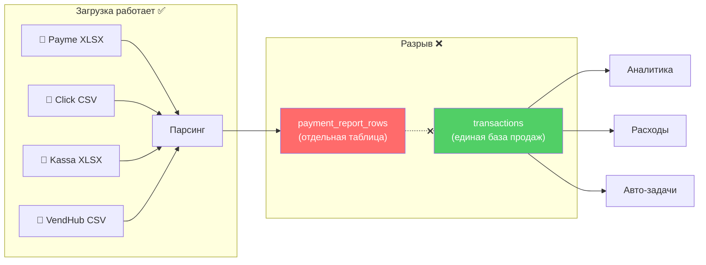
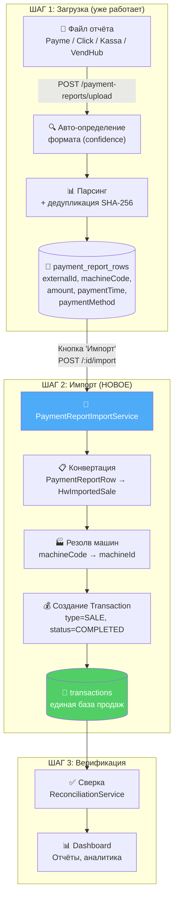
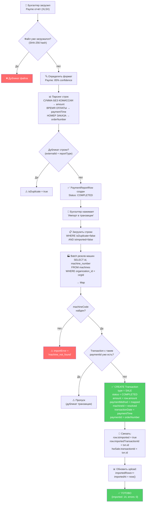
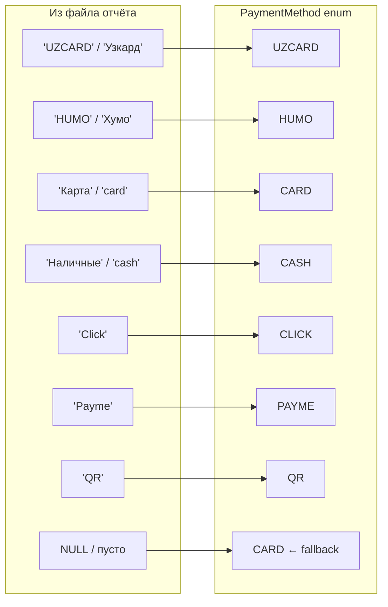
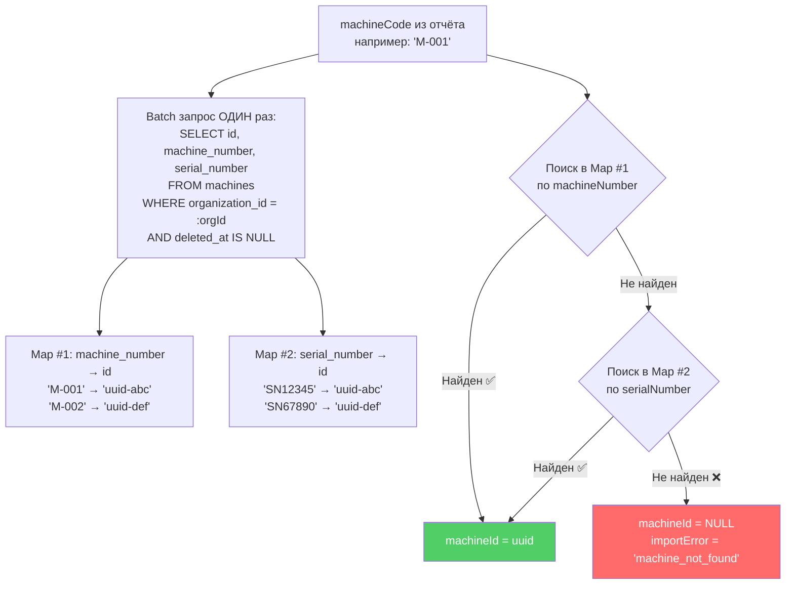
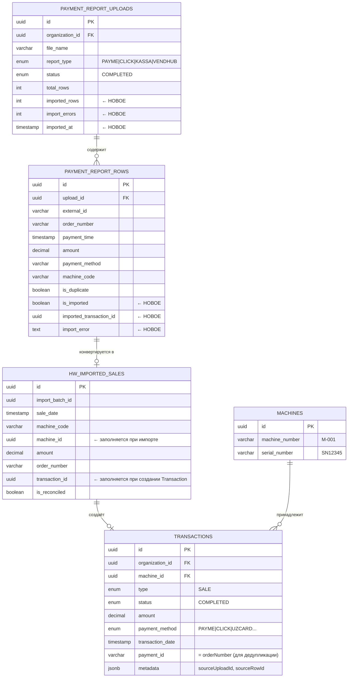
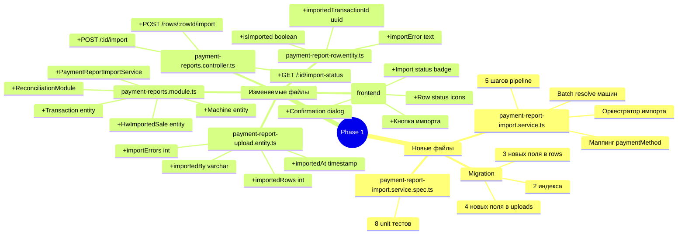
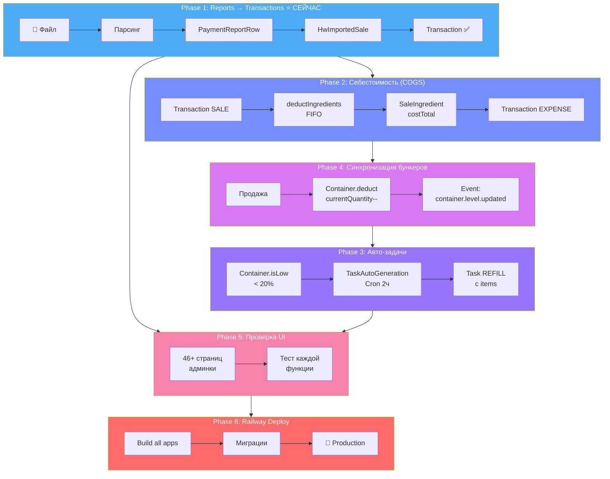

# Phase 1: Payment Reports → Transactions Pipeline

> Визуальный план превращения загруженных платёжных отчётов в единую базу транзакций

---

## 1. Проблема (сейчас)



**Данные застревают в `payment_report_rows` и не попадают в `transactions`.**
Без этого невозможны: расчёт расходов, автозадачи, аналитика продаж.

---

## 2. Решение (целевое)



---

## 3. Поток данных (детально)



---

## 4. Маппинг платёжных методов



---

## 5. Резолв кода машины



---

## 6. Таблицы и связи (ER-диаграмма)



---

## 7. Что создаём / что меняем



---

## 8. UI — как выглядит для пользователя

### Список загрузок (таблица)

```
┌──────────────────────────────────────────────────────────────────────────┐
│  📊 Платёжные отчёты                                                     │
├──────────┬────────────┬────────┬──────────┬──────────┬───────────────────┤
│ Файл     │ Тип        │ Строк  │ Сумма    │ Статус   │ Импорт            │
├──────────┼────────────┼────────┼──────────┼──────────┼───────────────────┤
│ jan.xlsx  │ 💜 Payme   │ 1,247  │ 45.2M    │ ✅ Готов │ ✅ 1,247/1,247    │
│ jan.csv   │ 🔵 Click   │ 892    │ 28.1M    │ ✅ Готов │ ⚠️ 880/892       │
│ feb.xlsx  │ 💜 Payme   │ 1,103  │ 41.8M    │ ✅ Готов │ ⏳ Не импортирован │
│ kassa.xlsx│ 🟢 Касса   │ 2,341  │ 67.5M    │ ✅ Готов │ ⏳ Не импортирован │
└──────────┴────────────┴────────┴──────────┴──────────┴───────────────────┘
```

### Просмотр строк загрузки (с кнопкой импорта)

```
┌──────────────────────────────────────────────────────────────────────────┐
│  📄 feb.xlsx — Payme (confidence: 92%)                                   │
│                                                                          │
│  [🔄 Импорт в транзакции]   [📊 Аналитика]   [🔍 Фильтры]              │
├──────┬──────────┬──────────┬──────────┬────────────┬─────────────────────┤
│ №    │ Заказ    │ Сумма    │ Время    │ Метод      │ Машина  │ Статус    │
├──────┼──────────┼──────────┼──────────┼────────────┼─────────┼───────────┤
│ 1    │ ORD-4521 │ 12,000   │ 10:23    │ Узкард     │ M-001   │ ⏳        │
│ 2    │ ORD-4522 │ 8,500    │ 10:45    │ Наличные   │ M-003   │ ⏳        │
│ 3    │ ORD-4523 │ 15,000   │ 11:02    │ Хумо       │ M-001   │ ⏳        │
│ ...  │          │          │          │            │         │           │
│ 1103 │ ORD-5623 │ 9,200    │ 22:15    │ Payme      │ M-007   │ ⏳        │
└──────┴──────────┴──────────┴──────────┴────────────┴─────────┴───────────┘
```

### Dialog подтверждения импорта

```
┌─────────────────────────────────────────┐
│  🔄 Импорт в транзакции                │
│                                          │
│  Файл:   feb.xlsx (Payme)               │
│  Строк:  1,103                          │
│  Сумма:  41,800,000 UZS                 │
│                                          │
│  ℹ️  Строки будут проверены:            │
│  • Код машины → привязка к автомату     │
│  • Дедупликация по номеру заказа        │
│  • Неизвестные машины → пропускаются    │
│                                          │
│  [Отмена]          [✅ Импортировать]    │
└─────────────────────────────────────────┘
```

### Результат импорта (toast)

```
✅ Импорт завершён
   Импортировано: 1,091 из 1,103
   Машина не найдена: 12 строк (M-099, M-100)
   Сумма: 41,350,000 UZS
```

### После импорта — статус каждой строки

```
┌──────┬──────────┬──────────┬────────────┬─────────┬───────────────────┐
│ №    │ Заказ    │ Сумма    │ Метод      │ Машина  │ Статус            │
├──────┼──────────┼──────────┼────────────┼─────────┼───────────────────┤
│ 1    │ ORD-4521 │ 12,000   │ UZCARD     │ M-001   │ ✅ → TXN-abc123  │
│ 2    │ ORD-4522 │ 8,500    │ CASH       │ M-003   │ ✅ → TXN-def456  │
│ 45   │ ORD-4565 │ 7,000    │ HUMO       │ M-099   │ ❌ Машина M-099   │
│      │          │          │            │         │    не найдена      │
│ 1103 │ ORD-5623 │ 9,200    │ PAYME      │ M-007   │ ✅ → TXN-xyz789  │
└──────┴──────────┴──────────┴────────────┴─────────┴───────────────────┘
```

---

## 9. Общая картина (все 6 фаз)



---

## 10. Файлы для Phase 1

| Действие  | Файл                                             | Описание                                                    |
| --------- | ------------------------------------------------ | ----------------------------------------------------------- |
| ✨ CREATE | `services/payment-report-import.service.ts`      | Оркестратор (5 шагов)                                       |
| ✨ CREATE | `services/payment-report-import.service.spec.ts` | 8 unit тестов                                               |
| ✨ CREATE | `database/migrations/...-AddImportFields.ts`     | 7 новых колонок + 2 индекса                                 |
| ✏️ MODIFY | `entities/payment-report-row.entity.ts`          | +3 поля: isImported, importedTransactionId, importError     |
| ✏️ MODIFY | `entities/payment-report-upload.entity.ts`       | +4 поля: importedRows, importErrors, importedAt, importedBy |
| ✏️ MODIFY | `payment-reports.controller.ts`                  | +3 endpoint'а                                               |
| ✏️ MODIFY | `payment-reports.module.ts`                      | +imports, +providers                                        |
| ✏️ MODIFY | `page.tsx` (frontend)                            | +кнопка, +dialog, +badges                                   |

**Переиспользуем** (не трогаем):

- `ReconciliationService.importHwSales()` — batch import в HwImportedSale
- `ReconciliationService.processReconciliation()` — сверка
- `SalesImportService` — паттерн progress tracking
