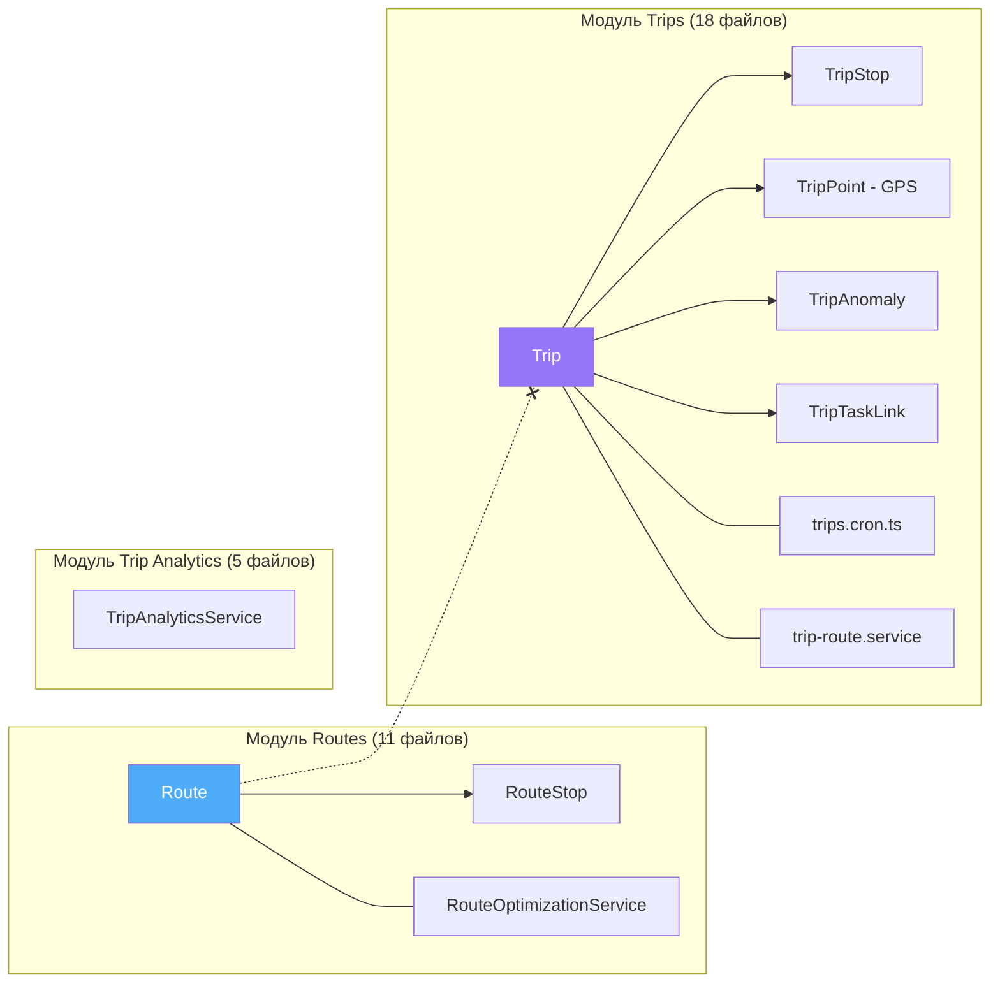
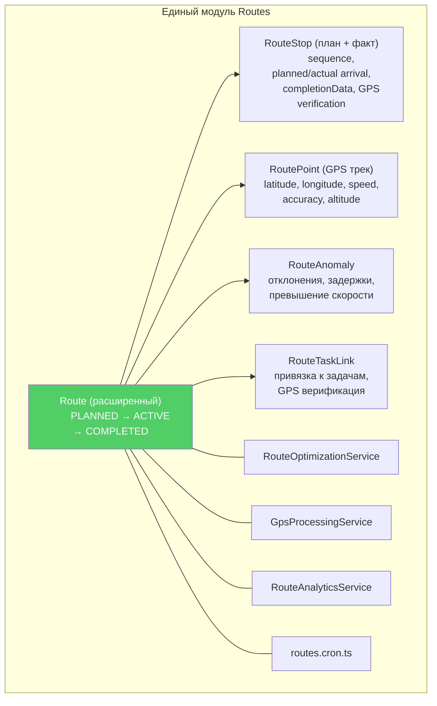
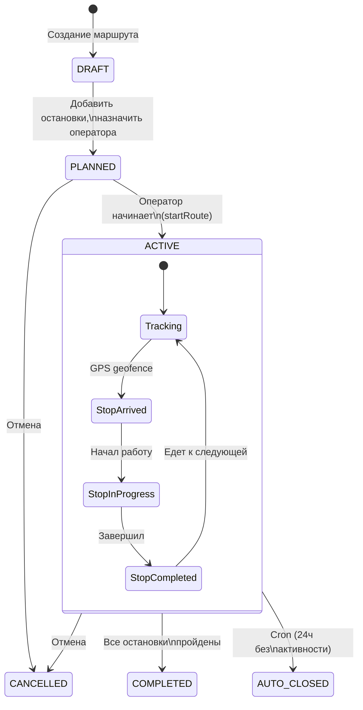
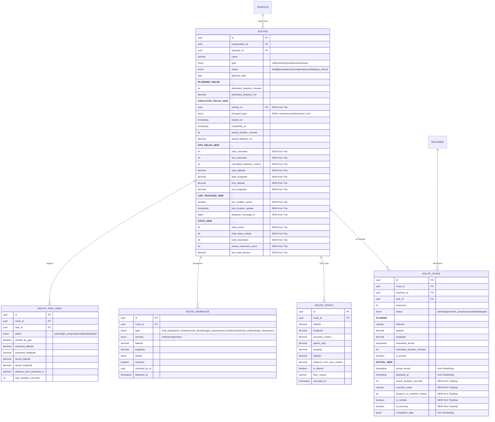
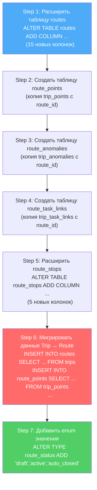

# Объединение Маршрутов и Рейсов — Детальный план

> Route = план + исполнение + GPS трек + аналитика — один модуль вместо двух

---

## 1. Проблема (сейчас)



**34 файла, 3 модуля, дублирование полей, запутанная навигация**

---

## 2. Решение (целевое)



**1 модуль, ~15 файлов, единый жизненный цикл**

---

## 3. Единый жизненный цикл Route



---

## 4. Расширенная Route Entity



---

## 5. Сравнение: что откуда берётся

### Route Entity (расширение)

| Поле                                      | Источник     | Действие                                |
| ----------------------------------------- | ------------ | --------------------------------------- |
| `organizationId, name, type, status`      | Route        | **KEEP**                                |
| `operatorId`                              | Route        | **KEEP** (rename-friendly к employeeId) |
| `plannedDate`                             | Route        | **KEEP**                                |
| `estimatedDuration/Distance`              | Route        | **KEEP**                                |
| `startedAt, completedAt`                  | Route + Trip | **KEEP** (уже есть)                     |
| `actualDuration/Distance`                 | Route + Trip | **KEEP**                                |
| `notes, metadata`                         | Route + Trip | **KEEP**                                |
| `vehicleId`                               | Trip         | **ADD**                                 |
| `transportType`                           | Trip         | **ADD**                                 |
| `startOdometer, endOdometer`              | Trip         | **ADD**                                 |
| `calculatedDistanceMeters`                | Trip         | **ADD**                                 |
| `start/endLatitude, start/endLongitude`   | Trip         | **ADD**                                 |
| `liveLocationActive, lastLocationUpdate`  | Trip         | **ADD**                                 |
| `telegramMessageId`                       | Trip         | **ADD**                                 |
| `totalPoints, totalStops, totalAnomalies` | Trip         | **ADD**                                 |
| `visitedMachinesCount`                    | Trip         | **ADD**                                 |
| `taxiTotalAmount`                         | Trip         | **ADD**                                 |

### Route Status Enum (объединённый)

```typescript
export enum RouteStatus {
  DRAFT = "draft", // Черновик (новое)
  PLANNED = "planned", // from Route
  ACTIVE = "active", // from Trip (= Route.IN_PROGRESS)
  COMPLETED = "completed", // from both
  CANCELLED = "cancelled", // from both
  AUTO_CLOSED = "auto_closed", // from Trip
}
```

### RouteStop (расширение)

| Поле                                          | Источник                   | Действие |
| --------------------------------------------- | -------------------------- | -------- |
| `routeId, machineId, sequence, status`        | RouteStop                  | **KEEP** |
| `taskId, address, lat/lng`                    | RouteStop                  | **KEEP** |
| `estimatedArrival, actualArrival, departedAt` | RouteStop                  | **KEEP** |
| `estimatedDurationMinutes, isPriority`        | RouteStop                  | **KEEP** |
| `completionData, notes, metadata`             | RouteStop                  | **KEEP** |
| `machineName, machineAddress`                 | TripStop                   | **ADD**  |
| `distanceToMachineMeters`                     | TripStop                   | **ADD**  |
| `actualDurationSeconds`                       | TripStop (durationSeconds) | **ADD**  |
| `isVerified`                                  | TripStop                   | **ADD**  |
| `isAnomaly`                                   | TripStop                   | **ADD**  |

### Новые дочерние entities (из Trip)

| Entity          | Что делает      | Действие                                                               |
| --------------- | --------------- | ---------------------------------------------------------------------- |
| `RoutePoint`    | GPS точки трека | **CREATE** (rename TripPoint → RoutePoint, `tripId` → `routeId`)       |
| `RouteAnomaly`  | Аномалии        | **CREATE** (rename TripAnomaly → RouteAnomaly, `tripId` → `routeId`)   |
| `RouteTaskLink` | Привязка задач  | **CREATE** (rename TripTaskLink → RouteTaskLink, `tripId` → `routeId`) |

---

## 6. Миграция базы данных



---

## 7. Backend: что менять

### Файлы для МОДИФИКАЦИИ (routes module):

| Файл                                   | Изменения                                                                       |
| -------------------------------------- | ------------------------------------------------------------------------------- |
| `routes/entities/route.entity.ts`      | +15 полей из Trip, +3 enum значения, +4 OneToMany relations                     |
| `routes/routes.service.ts`             | +методы: startRoute, endRoute, recordPoint, addAnomaly, liveLocation, autoClose |
| `routes/routes.controller.ts`          | +endpoints: POST /:id/start, POST /:id/end, POST /:id/points, GET /:id/track    |
| `routes/routes.module.ts`              | +imports: new entities, Vehicle, GpsProcessingService, ScheduleModule           |
| `routes/route-optimization.service.ts` | без изменений                                                                   |
| `routes/dto/create-route.dto.ts`       | +vehicleId, +transportType optional fields                                      |

### Файлы для СОЗДАНИЯ:

| Файл                                         | Содержимое                                                                      |
| -------------------------------------------- | ------------------------------------------------------------------------------- |
| `routes/entities/route-point.entity.ts`      | GPS точка (из TripPoint, `tripId` → `routeId`)                                  |
| `routes/entities/route-anomaly.entity.ts`    | Аномалия (из TripAnomaly, `tripId` → `routeId`)                                 |
| `routes/entities/route-task-link.entity.ts`  | Связь с задачей (из TripTaskLink, `tripId` → `routeId`)                         |
| `routes/services/gps-processing.service.ts`  | GPS обработка (из trips/services/gps-processing.service.ts)                     |
| `routes/services/route-analytics.service.ts` | Аналитика (из trips/services/trip-analytics.service.ts + trip-analytics module) |
| `routes/routes.cron.ts`                      | Auto-close (из trips/trips.cron.ts)                                             |
| `routes/dto/start-route.dto.ts`              | DTO для начала маршрута                                                         |
| `routes/dto/record-point.dto.ts`             | DTO для GPS точки                                                               |
| Migration file                               | Расширение таблиц + миграция данных                                             |

### Файлы для УДАЛЕНИЯ (после миграции):

| Модуль            | Файлов | Что удаляем                                                 |
| ----------------- | ------ | ----------------------------------------------------------- |
| `trips/`          | 18     | Весь модуль (entity, service, controller, cron, dto, specs) |
| `trip-analytics/` | 5      | Весь модуль (перенесён в routes/services/)                  |
| **Итого**         | **23** |                                                             |

---

## 8. Frontend: что менять

### Страницы для МОДИФИКАЦИИ:

| Страница                  | Изменения                                                                                   |
| ------------------------- | ------------------------------------------------------------------------------------------- |
| `routes/page.tsx`         | Добавить вкладки: Планирование / Активные / Завершённые. Показывать GPS данные для активных |
| `routes/[id]/page.tsx`    | Карта с GPS треком, остановки на карте, аномалии, live tracking статус                      |
| `routes/builder/page.tsx` | Добавить выбор транспорта и оператора                                                       |

### Страницы для СОЗДАНИЯ:

| Страница                     | Что                                                       |
| ---------------------------- | --------------------------------------------------------- |
| `routes/[id]/track/page.tsx` | Live tracking карта (из trips/tracker)                    |
| `routes/analytics/page.tsx`  | Аналитика маршрутов (из trips/analytics + trip-analytics) |

### Страницы для УДАЛЕНИЯ:

| Страница                   | Куда перенесено                        |
| -------------------------- | -------------------------------------- |
| `trips/page.tsx`           | → routes/page.tsx (вкладка "Активные") |
| `trips/[id]/page.tsx`      | → routes/[id]/page.tsx                 |
| `trips/analytics/page.tsx` | → routes/analytics/page.tsx            |
| `trips/tracker/page.tsx`   | → routes/[id]/track/page.tsx           |
| `trip-analytics/page.tsx`  | → routes/analytics/page.tsx            |

### Sidebar навигация:

```
БЫЛО:                          СТАЛО:
├── Маршруты                    ├── Маршруты
│   ├── Список                  │   ├── Список (3 вкладки)
│   ├── Конструктор             │   ├── Конструктор
│   └── [id]                    │   ├── Аналитика
├── Рейсы                       │   ├── [id] (с картой)
│   ├── Список                  │   └── [id]/track (live)
│   ├── Трекер                  │
│   ├── Аналитика               │ (Рейсы и Аналитика рейсов — УДАЛЕНЫ)
│   └── [id]                    │
├── Аналитика рейсов            │
```

---

## 9. API Endpoints (объединённые)

### Существующие (routes):

```
GET    /routes              — список маршрутов (+ фильтр по status)
POST   /routes              — создать маршрут
GET    /routes/:id          — детали маршрута
PATCH  /routes/:id          — обновить маршрут
DELETE /routes/:id          — удалить маршрут
POST   /routes/:id/optimize — оптимизировать порядок остановок
```

### Новые (из trips):

```
POST   /routes/:id/start    — начать маршрут (PLANNED → ACTIVE)
POST   /routes/:id/end      — завершить маршрут (ACTIVE → COMPLETED)
POST   /routes/:id/points   — записать GPS точку
GET    /routes/:id/track    — получить GPS трек
GET    /routes/:id/anomalies — получить аномалии

PATCH  /routes/:id/stops/:stopId/arrive   — отметить прибытие
PATCH  /routes/:id/stops/:stopId/complete — отметить выполнение
PATCH  /routes/:id/stops/:stopId/skip     — пропустить

GET    /routes/active        — активные маршруты (live tracking)
GET    /routes/analytics     — аналитика маршрутов
```

---

## 10. Порядок реализации

```mermaid
flowchart TD
    subgraph "Sprint 1: Backend Entity (2-3 часа)"
        S1A["Создать migration:\n+15 колонок в routes\n+5 колонок в route_stops\n+3 enum значения"]
        S1B["Создать entities:\nRoutePoint, RouteAnomaly,\nRouteTaskLink"]
        S1C["Расширить Route entity:\n+15 полей, +4 relations"]
        S1A --> S1B --> S1C
    end

    subgraph "Sprint 2: Backend Services (2-3 часа)"
        S2A["Перенести GpsProcessingService\nв routes/services/"]
        S2B["Расширить RoutesService:\nstartRoute, endRoute,\nrecordPoint, addAnomaly"]
        S2C["Перенести RoutesAnalyticsService\nиз trip-analytics"]
        S2D["Перенести routes.cron.ts\nиз trips"]
        S2A --> S2B --> S2C --> S2D
    end

    subgraph "Sprint 3: Backend Controller (1 час)"
        S3A["Добавить endpoints:\n/start, /end, /points,\n/track, /active, /analytics"]
        S3B["Обновить module:\nimports, providers"]
        S3A --> S3B
    end

    subgraph "Sprint 4: Frontend (2-3 часа)"
        S4A["Обновить routes/page.tsx:\n3 вкладки"]
        S4B["Обновить routes/[id]:\nкарта + GPS трек"]
        S4C["Создать routes/analytics"]
        S4D["Обновить sidebar:\nубрать Рейсы"]
        S4A --> S4B --> S4C --> S4D
    end

    subgraph "Sprint 5: Cleanup (1 час)"
        S5A["Удалить trips/ module\n(18 файлов)"]
        S5B["Удалить trip-analytics/\n(5 файлов)"]
        S5C["Удалить frontend trips/\n(5 страниц)"]
        S5D["Обновить app.module.ts"]
        S5A --> S5B --> S5C --> S5D
    end

    S1C --> S2A
    S2D --> S3A
    S3B --> S4A
    S4D --> S5A

    subgraph "Sprint 6: Verify (30 мин)"
        S6A["tsc --noEmit"]
        S6B["pnpm test"]
        S6C["Deploy"]
    end
    S5D --> S6A --> S6B --> S6C
```



---

## 11. Файлы — полный чек-лист

### Создать (9 файлов):

- [ ] `routes/entities/route-point.entity.ts`
- [ ] `routes/entities/route-anomaly.entity.ts`
- [ ] `routes/entities/route-task-link.entity.ts`
- [ ] `routes/services/gps-processing.service.ts`
- [ ] `routes/services/route-analytics.service.ts`
- [ ] `routes/routes.cron.ts`
- [ ] `routes/dto/start-route.dto.ts`
- [ ] `routes/dto/record-point.dto.ts`
- [ ] `database/migrations/XXXXX-MergeTripsIntoRoutes.ts`

### Модифицировать (8 файлов):

- [ ] `routes/entities/route.entity.ts` — +15 полей, +4 relations
- [ ] `routes/routes.service.ts` — +6 методов
- [ ] `routes/routes.controller.ts` — +8 endpoints
- [ ] `routes/routes.module.ts` — +imports, +providers
- [ ] `routes/dto/create-route.dto.ts` — +vehicleId, +transportType
- [ ] `web/dashboard/routes/page.tsx` — 3 вкладки
- [ ] `web/dashboard/routes/[id]/page.tsx` — GPS карта
- [ ] `web/components/sidebar` — убрать Рейсы

### Удалить (23 файла):

- [ ] `trips/` — весь модуль (18 файлов)
- [ ] `trip-analytics/` — весь модуль (5 файлов)

### Frontend удалить (5 страниц):

- [ ] `web/dashboard/trips/page.tsx`
- [ ] `web/dashboard/trips/[id]/page.tsx`
- [ ] `web/dashboard/trips/analytics/page.tsx`
- [ ] `web/dashboard/trips/tracker/page.tsx`
- [ ] `web/dashboard/trip-analytics/page.tsx`

**Итого: 9 создать + 8 модифицировать + 28 удалить = 45 операций**

---

## 12. Риски и митигация

| Риск                                | Митигация                                               |
| ----------------------------------- | ------------------------------------------------------- |
| Потеря данных Trip при миграции     | Migration включает INSERT INTO routes SELECT FROM trips |
| Telegram bot использует Trip entity | Проверить bot module, обновить импорты                  |
| Внешние ссылки на trip_id           | Grep по всем модулям перед удалением                    |
| Большой объём изменений             | Делать по спринтам, компилировать после каждого         |
