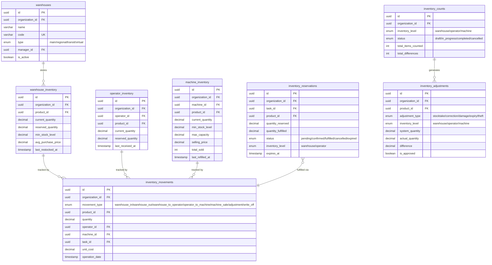

# VendHub OS -- Системная документация и диаграммы

> Полный набор диаграмм для документирования архитектуры, процессов, данных и взаимодействий системы VendHub OS.
> Все диаграммы написаны в формате Mermaid и могут быть отрендерены в GitHub, Notion, Obsidian и других инструментах.

---

## Содержание

1. [System Overview](#system-overview) -- Обзор системы
   - 1.1 System Architecture Diagram
   - 1.2 Module Dependency Diagram
   - 1.3 Deployment Diagram
2. [ERD (Entity Relationship Diagrams)](#erd-entity-relationship-diagrams) -- Схемы базы данных
   - 2.1 Core (Organizations, Users, RBAC)
   - 2.2 Machines & Locations
   - 2.3 Products & Recipes
   - 2.4 Inventory (3-Level System)
   - 2.5 Tasks, Routes & Trips
   - 2.6 Financial (Transactions, Payments, Orders)
3. [Flowcharts](#flowcharts) -- Блок-схемы алгоритмов
   - 3.1 User Authentication (Login)
   - 3.2 Order Processing
   - 3.3 Task Lifecycle (Refill)
   - 3.4 Inventory Movement (3-Level Flow)
   - 3.5 Payment Processing (Payme/Click)
   - 3.6 Cash Collection Process
   - 3.7 Maintenance Request Workflow
   - 3.8 Location Lifecycle
4. [UML Diagrams](#uml-diagrams) -- UML-диаграммы
   - 4.1 Use Case Diagram
   - 4.2 Class Diagram
   - 4.3 Sequence Diagrams (4 сценария)
   - 4.4 Activity Diagrams (3 процесса)
   - 4.5 State Diagrams (5 сущностей)
5. [BPMN (Business Process Diagrams)](#bpmn-business-process-diagrams) -- Бизнес-процессы
   - 5.1 Vending Machine Sales Process
   - 5.2 Daily Operations Workflow
   - 5.3 New Machine Installation
   - 5.4 Financial Reconciliation (Monthly)
   - 5.5 Customer Complaint Resolution
   - 5.6 Employee Trip Tracking

---

## SYSTEM OVERVIEW

VendHub OS -- это единая платформа управления вендинговыми автоматами для рынка Узбекистана. Система построена как monorepo на базе Turborepo и включает 5 приложений (NestJS API, Next.js Admin, Vite PWA, Telegram Bot, React Native Mobile), 60+ API-модулей, интеграции с локальными платежными системами (Payme, Click, Uzum Bank), фискальными сервисами (Soliq/OFD) и мониторинг на базе Prometheus + Grafana + Loki.

---

### 1. System Architecture Diagram

Высокоуровневая архитектура показывает все приложения, инфраструктурные компоненты, внешние интеграции и потоки данных между ними.


---

### 2. Module Dependency Diagram

VendHub API содержит 60+ NestJS-модулей, организованных в функциональные группы. Диаграмма показывает зависимости между модульными группами.


---

### 3. Deployment Diagram

Диаграмма развертывания показывает все Docker-сервисы, их порты, volumes для персистентности и сетевые соединения.


---


---

## ERD (Entity Relationship Diagrams)

### ERD 1: Core (Organizations, Users, RBAC)

Диаграмма показывает ядро системы: организационную иерархию, систему пользователей с 7 ролями, двухфакторную аутентификацию и управление сессиями.


### ERD 2: Machines and Locations

Диаграмма охватывает управление вендинговыми автоматами и точками размещения. Автоматы привязаны к локациям через зоны, имеют слоты для продуктов и журнал ошибок.


### ERD 3: Products and Recipes

Каталог продуктов и рецептурная система. Продукты могут быть готовыми товарами или ингредиентами. Рецепты поддерживают версионирование, партии ингредиентов обеспечивают FIFO-учет.


### ERD 4: Inventory (3-Level System)

Трехуровневая система инвентаризации: склад, оператор, автомат. Движения товаров отслеживаются через inventory_movements. Система резервирования предотвращает конфликты.



### ERD 5: Tasks, Routes and Trips

Система управления задачами, маршрутизация операторов и GPS-трекинг поездок. Задачи связаны с инвентарём и фотофиксацией. Маршруты оптимизируют посещения автоматов.


### ERD 6: Financial (Transactions, Payments, Orders)

Финансовый блок: транзакции с фискализацией через OFD/Soliq.uz, платежи через Payme/Click/Uzum, заказы клиентов, инкассация наличных, комиссионные расчеты и ежедневные сводки.


---

## Flowcharts

### Flowchart 1: User Authentication (Login)

Процесс аутентификации: проверка учетных данных, контроль блокировки аккаунта, двухфакторная аутентификация через TOTP/SMS, выдача JWT + Refresh Token.


### Flowchart 2: Order Processing (Customer Purchase)

Полный цикл покупки: выбор продукта, обработка оплаты через Payme/Click/Uzum/наличные, выдача товара, фискализация через OFD, начисление бонусов.


### Flowchart 3: Task Lifecycle (Refill)

Жизненный цикл задачи на заправку: от создания менеджером до подтверждения. Включает резервирование инвентаря, передачу оператору, фотофиксацию до/после, возможность отклонения.


### Flowchart 4: Inventory Movement (3-Level Flow)

Полный цикл движения товаров через 3 уровня: склад -> оператор -> автомат -> продажа. Включает обратные потоки, корректировки и списания.


### Flowchart 5: Payment Processing (Payme/Click)

Обработка электронных платежей: валидация webhook-подписей, обновление статусов, фискализация, обработка возвратов.


### Flowchart 6: Cash Collection Process

Инкассация наличных: от обнаружения порога до верификации. Система сравнивает ожидаемые суммы с фактическими, выявляет расхождения более 5%.


### Flowchart 7: Maintenance Request Workflow

Обслуживание автомата: от обнаружения проблемы до верификации. Поддерживает ожидание запчастей, учет работ и расчет простоя.


### Flowchart 8: Location Lifecycle

Жизненный цикл локации от первого контакта до закрытия. Включает переговоры, подписание контракта, установку автоматов и продление/расторжение.


---

## UML Diagrams

### A) Use Case Diagram

Диаграмма показывает 9 акторов (7 внутренних ролей + 2 внешних) и их use cases в соответствии с RBAC-моделью VendHub OS.


### B) Class Diagram

Доменная модель VendHub OS: 20 ключевых сущностей с атрибутами, методами и связями. Organization -- корень мультитенантной иерархии.


### C) Sequence Diagrams

#### C1: Customer Purchase via Vending Machine

Полный цикл покупки: выбор товара, валидация, оплата через Payme, webhook, фискализация, начисление лояльности.


#### C2: Task Execution (Refill)

Полный цикл задачи на заправку: создание, валидация инвентаря, назначение оператора, перемещение товаров, фотофиксация, одобрение.

```mermaid
sequenceDiagram
    actor Mgr as Manager
    participant API as API
    participant TaskSvc as Task Service
    participant InvSvc as Inventory Service
    actor Op as Operator
    participant Mobile as Mobile App
    participant NotifSvc as Notification Service

    Mgr->>API: POST /tasks (type=refill, machineId)
    API->>TaskSvc: Create refill task
    TaskSvc->>InvSvc: Check warehouse stock
    InvSvc-->>TaskSvc: Stock available
    TaskSvc->>InvSvc: Reserve warehouse stock
    TaskSvc->>TaskSvc: Assign operator
    TaskSvc-->>API: Task created (ASSIGNED)
    API->>NotifSvc: Send notification
    NotifSvc->>Mobile: Push notification
    NotifSvc->>Op: Telegram notification
    Op->>Mobile: View task details
    Mobile->>API: PATCH /tasks/{id}/accept
    Op->>Mobile: Confirm warehouse pickup
    Mobile->>API: POST /inventory/movements (warehouse_to_operator)
    API->>InvSvc: Transfer stock to operator
    Op->>Mobile: Arrive at machine
    Mobile->>API: POST /tasks/{id}/photo (before)
    Op->>Mobile: Load products
    Mobile->>API: POST /inventory/movements (operator_to_machine)
    API->>InvSvc: Transfer stock to machine
    Op->>Mobile: Take after photo
    Mobile->>API: POST /tasks/{id}/photo (after)
    Op->>Mobile: Submit completion
    Mobile->>API: PATCH /tasks/{id}/complete
    API->>NotifSvc: Notify manager
    Mgr->>API: PATCH /tasks/{id}/approve
    API->>TaskSvc: Approve task
```

#### C3: Authentication with 2FA

Аутентификация с двухфакторной проверкой через TOTP (otplib). Сессии хранятся в Redis с настраиваемым TTL.

```mermaid
sequenceDiagram
    actor User
    participant FE as Frontend
    participant Auth as Auth API
    participant UserSvc as User Service
    participant TwoFA as TwoFactor Service
    participant Session as Session Service
    participant Redis as Redis

    User->>FE: Enter email + password
    FE->>Auth: POST /auth/login
    Auth->>UserSvc: Validate credentials
    UserSvc->>UserSvc: Verify bcrypt hash
    UserSvc-->>Auth: Credentials valid
    Auth->>TwoFA: Check 2FA enabled
    TwoFA-->>Auth: 2FA enabled
    Auth-->>FE: 200 (requiresTwoFactor=true, tempToken)
    FE->>User: Show TOTP input
    User->>FE: Enter 6-digit code
    FE->>Auth: POST /auth/2fa/verify (tempToken, code)
    Auth->>TwoFA: Verify TOTP code
    TwoFA->>TwoFA: Validate via otplib
    TwoFA-->>Auth: TOTP valid
    Auth->>Auth: Generate JWT (15min)
    Auth->>Auth: Generate refresh token (7d)
    Auth->>Session: Create session
    Session->>Redis: SETEX session (TTL 7d)
    Redis-->>Session: OK
    Auth-->>FE: 200 (accessToken, refreshToken, user)
    FE->>FE: Store tokens

    Note over FE,Auth: Token Refresh Flow
    FE->>Auth: POST /auth/refresh (refreshToken)
    Auth->>Session: Validate session
    Session->>Redis: GET session
    Redis-->>Session: Valid
    Auth->>Auth: Generate new access token
    Auth-->>FE: New access token
```

#### C4: Real-time Machine Telemetry

Телеметрия в реальном времени: автоматы отправляют данные каждые 30 секунд через WebSocket, система проверяет пороги и рассылает алерты.

```mermaid
sequenceDiagram
    participant VM as Vending Machine
    participant WSGw as WebSocket Gateway
    participant TelSvc as Telemetry Service
    participant AlertSvc as Alert Service
    participant Redis as Redis
    participant TgBot as Telegram Bot
    participant Dashboard as Admin Dashboard

    VM->>WSGw: Connect (machineToken)
    WSGw->>WSGw: Validate token
    WSGw-->>VM: Connected

    loop Every 30 seconds
        VM->>WSGw: emit telemetry data
        WSGw->>TelSvc: Process payload
        TelSvc->>TelSvc: Validate and normalize
        TelSvc->>Redis: HSET machine telemetry
        TelSvc->>AlertSvc: Check thresholds
        alt Threshold exceeded
            AlertSvc->>AlertSvc: Create alert
            AlertSvc->>TgBot: Send notification
        end
        TelSvc->>Redis: PUBLISH telemetry channel
        Redis->>Dashboard: Subscription message
        Dashboard->>Dashboard: Update live map
    end

    alt Connection lost
        WSGw->>TelSvc: Handle disconnect
        TelSvc->>Redis: Set status offline
        TelSvc->>AlertSvc: Trigger offline alert
        AlertSvc->>TgBot: Notify offline
    end
```

### D) Activity Diagrams

#### D1: Inventory Replenishment Cycle

Полный цикл пополнения запасов от обнаружения низкого остатка до заправки автомата. 4 роли: System, Manager, Warehouse, Operator.

```mermaid
flowchart TD
    Start([Start]) --> DetectLow

    subgraph System["System (Automated)"]
        DetectLow[Detect low stock]
        DetectLow --> CheckThreshold{Below threshold?}
        CheckThreshold -- No --> Monitor[Continue monitoring]
        Monitor --> DetectLow
        CheckThreshold -- Yes --> CreateAlert[Create alert]
        CreateAlert --> NotifyManager[Notify manager]
    end

    NotifyManager --> ReviewAlert

    subgraph ManagerLane["Manager"]
        ReviewAlert[Review alert]
        ReviewAlert --> AssessNeeds[Assess needs]
        AssessNeeds --> CreateTask[Create refill task]
        CreateTask --> AssignOperator[Assign operator]
        AssignOperator --> CheckRoute{Add to route?}
        CheckRoute -- Yes --> AddToRoute[Add to route]
        CheckRoute -- No --> CreateRoute[Create new route]
    end

    AddToRoute --> ReserveStock
    CreateRoute --> ReserveStock

    subgraph WarehouseLane["Warehouse"]
        ReserveStock[Reserve stock]
        ReserveStock --> CheckAvail{Sufficient?}
        CheckAvail -- No --> CreatePO[Create purchase order]
        CreatePO --> ReceiveGoods[Receive goods]
        ReceiveGoods --> ReserveStock
        CheckAvail -- Yes --> PreparePickup[Prepare items]
        PreparePickup --> OperatorPickup[Hand to operator]
        OperatorPickup --> RecordMovement1[Record warehouse_to_operator]
    end

    RecordMovement1 --> TravelToMachine

    subgraph OperatorLane["Operator"]
        TravelToMachine[Travel to machine]
        TravelToMachine --> PhotoBefore[Take before photo]
        PhotoBefore --> LoadProducts[Load products]
        LoadProducts --> RecordMovement2[Record operator_to_machine]
        RecordMovement2 --> PhotoAfter[Take after photo]
        PhotoAfter --> SubmitCompletion[Submit completion]
    end

    SubmitCompletion --> ManagerReview

    subgraph ManagerApproval["Manager Approval"]
        ManagerReview[Review with photos]
        ManagerReview --> Approve{Approve?}
        Approve -- Yes --> MarkComplete[Mark complete]
        Approve -- No --> RejectTask[Reject]
        RejectTask --> TravelToMachine
    end

    MarkComplete --> UpdateStatus

    subgraph SystemFinal["System Final"]
        UpdateStatus[Update machine status]
        UpdateStatus --> ClearAlert[Clear alert]
        ClearAlert --> EndState([End])
    end
```

#### D2: Monthly Financial Reconciliation

Ежемесячная финансовая сверка: агрегация, расчет комиссий, сверка с банковскими выписками, подготовка налоговой отчетности.

```mermaid
flowchart TD
    Start([Month End Trigger]) --> Aggregate

    Aggregate[Aggregate daily summaries] --> SplitByType{Split by payment}

    SplitByType --> CashFlow[Calculate cash collections]
    SplitByType --> CardFlow[Calculate card payments]

    CashFlow --> CompareCash[Compare collected vs expected]
    CompareCash --> CashMatch{Match?}
    CashMatch -- No --> FlagCash[Flag discrepancy]
    CashMatch -- Yes --> CashOK[Cash reconciled]

    CardFlow --> MatchProvider[Match with provider statements]
    MatchProvider --> CardMatch{All matched?}
    CardMatch -- No --> FlagCard[Flag unmatched]
    CardMatch -- Yes --> CardOK[Cards reconciled]

    CashOK --> CalcCommissions
    CardOK --> CalcCommissions
    FlagCash --> ManagerReview
    FlagCard --> ManagerReview

    CalcCommissions[Calculate commissions] --> CalcRent[Calculate rent payments]
    CalcRent --> CalcTax[Calculate VAT and taxes]
    CalcTax --> GenerateReports[Generate reports]

    ManagerReview[Manager reviews] --> ResolveDisc{Resolved?}
    ResolveDisc -- Yes --> AdjustEntries[Create adjustments]
    AdjustEntries --> GenerateReports
    ResolveDisc -- No --> Escalate[Escalate to admin]
    Escalate --> AdjustEntries

    GenerateReports --> ExportAccounting[Export to accounting]
    ExportAccounting --> FiscalReport[Generate fiscal report]
    FiscalReport --> End([Month Closed])
```

#### D3: New Organization Onboarding

Полный путь подключения новой организации: регистрация, верификация, KYC, настройка, подключение платежей, запуск.

```mermaid
flowchart TD
    Start([Start]) --> Registration

    Registration[Submit registration] --> ValidateEmail{Email valid?}
    ValidateEmail -- No --> ShowError[Validation error]
    ShowError --> Registration
    ValidateEmail -- Yes --> CreatePending[Create pending org]

    CreatePending --> SendVerification[Send email verification]
    SendVerification --> WaitVerify{Verified?}
    WaitVerify -- No --> Timeout{48h timeout?}
    Timeout -- No --> WaitVerify
    Timeout -- Yes --> Expire[Expire registration]

    WaitVerify -- Yes --> KYCUpload[Upload KYC documents]
    KYCUpload --> UploadBusiness[Business registration docs]
    UploadBusiness --> UploadID[ID documents]
    UploadID --> SubmitReview[Submit for review]

    SubmitReview --> AdminReview[Admin reviews]
    AdminReview --> Decision{Approved?}
    Decision -- No --> NeedInfo{More info?}
    NeedInfo -- Yes --> NotifyOwner[Request docs]
    NotifyOwner --> KYCUpload
    NeedInfo -- No --> Reject[Reject application]

    Decision -- Yes --> ActivateOrg[Activate organization]
    ActivateOrg --> SetSubscription[Set subscription tier]
    SetSubscription --> ConfigDefaults[Configure defaults]
    ConfigDefaults --> CreateOwner[Create owner account]

    CreateOwner --> InviteUsers[Invite team members]
    InviteUsers --> RegisterMachines[Register machines]
    RegisterMachines --> AssignLocations[Create locations]
    AssignLocations --> ConfigPayments[Configure payments]

    ConfigPayments --> PaymeSetup[Setup Payme]
    ConfigPayments --> ClickSetup[Setup Click]
    ConfigPayments --> UzumSetup[Setup Uzum]

    PaymeSetup --> VerifyPayments
    ClickSetup --> VerifyPayments
    UzumSetup --> VerifyPayments

    VerifyPayments{Providers verified?}
    VerifyPayments -- No --> FixConfig[Fix configuration]
    FixConfig --> ConfigPayments
    VerifyPayments -- Yes --> TestTx[Run test transaction]
    TestTx --> GoLive[Organization LIVE]
    GoLive --> End([End])
```

### E) State Diagrams

#### E1: Machine Status

Все операционные состояния вендингового автомата. Offline -- транзитное состояние при потере связи, Disabled требует действия администратора.

```mermaid
stateDiagram-v2
    [*] --> Active : Machine registered and connected

    Active --> LowStock : Stock below threshold
    LowStock --> Active : Refill completed

    Active --> Error : Hardware/software error
    Error --> Maintenance : Repair task created

    Maintenance --> Active : Repair completed
    Maintenance --> Error : Repair failed

    Active --> Offline : Connection lost
    LowStock --> Offline : Connection lost
    Error --> Offline : Connection lost
    Maintenance --> Offline : Connection lost

    Offline --> Active : Restored (was Active)
    Offline --> LowStock : Restored (was LowStock)
    Offline --> Error : Restored (was Error)
    Offline --> Maintenance : Restored (was Maintenance)

    Active --> Disabled : Admin disables
    LowStock --> Disabled : Admin disables
    Error --> Disabled : Admin disables
    Maintenance --> Disabled : Admin disables
    Offline --> Disabled : Admin disables

    Disabled --> Active : Admin re-enables
    Disabled --> [*] : Decommissioned
```

#### E2: Order Status

Жизненный цикл заказа от создания до завершения или отмены. Возврат возможен для завершенных и частично оплаченных заказов.

```mermaid
stateDiagram-v2
    [*] --> Pending : Order created

    Pending --> Confirmed : Payment initiated
    Pending --> Cancelled : Timeout or user cancels

    Confirmed --> Preparing : Payment confirmed
    Confirmed --> Cancelled : Payment failed

    Preparing --> Ready : Product prepared
    Preparing --> Cancelled : Machine error

    Ready --> Completed : Product dispensed
    Ready --> Cancelled : Dispensing failed

    Completed --> Refunded : Refund approved
    Cancelled --> Refunded : Partial refund

    Completed --> [*]
    Refunded --> [*]
    Cancelled --> [*]
```

#### E3: Task Status

Жизненный цикл задачи со всеми валидными переходами. Postponed позволяет оператору отложить, Rejected отправляет на переделку.

```mermaid
stateDiagram-v2
    [*] --> Pending : Task created

    Pending --> Assigned : Operator assigned
    Pending --> Cancelled : Manager cancels

    Assigned --> InProgress : Operator starts
    Assigned --> Postponed : Operator postpones
    Assigned --> Cancelled : Manager cancels

    InProgress --> Completed : Operator submits
    InProgress --> Postponed : Operator postpones
    InProgress --> Cancelled : Manager cancels

    Postponed --> Assigned : Rescheduled
    Postponed --> Cancelled : Manager cancels

    Completed --> Rejected : Manager rejects

    Rejected --> Assigned : Reassigned for redo

    Cancelled --> [*]
    Completed --> [*] : Approved by manager
```

#### E4: Maintenance Request Status

Процесс обслуживания от черновика до верификации. Включает статус AwaitingParts для ожидания запчастей и цикл верификации.

```mermaid
stateDiagram-v2
    [*] --> Draft : Request initiated

    Draft --> Submitted : Details completed
    Draft --> Cancelled : Creator cancels

    Submitted --> Approved : Admin approves
    Submitted --> Rejected : Admin rejects

    Rejected --> Draft : Revised
    Rejected --> Cancelled : Permanently cancelled

    Approved --> Scheduled : Date set
    Approved --> Cancelled : Cancelled

    Scheduled --> InProgress : Technician begins
    Scheduled --> Cancelled : Cancelled

    InProgress --> AwaitingParts : Parts needed
    InProgress --> Completed : Work finished

    AwaitingParts --> InProgress : Parts received

    Completed --> Verified : QA passed
    Completed --> InProgress : QA failed rework

    Verified --> [*] : Closed

    Cancelled --> [*]
```

#### E5: Location Status

Жизненный цикл локации от поиска до закрытия. Закрытые локации могут быть переоценены для повторного использования.

```mermaid
stateDiagram-v2
    [*] --> Prospecting : Location identified

    Prospecting --> ContractPending : Terms negotiated
    Prospecting --> Closed : Deemed unsuitable

    ContractPending --> Active : Contract signed
    ContractPending --> Prospecting : Renegotiation
    ContractPending --> Closed : Talks failed

    Active --> Suspended : Issue or overdue
    Active --> Closing : Termination initiated

    Suspended --> Active : Issue resolved
    Suspended --> Closing : Termination

    Closing --> Closed : Machines removed

    Closed --> Prospecting : Re-evaluation
    Closed --> [*] : Archived
```

## BPMN (Business Process Diagrams)

---

### BPMN 1: Vending Machine Sales Process

**Opisanie / Описание:** Процесс покупки товара через вендинговый автомат -- от выбора товара покупателем до выдачи товара и фискализации чека. Включает проверку наличия товара, выбор способа оплаты (наличные, Payme, Click, Uzum, Telegram Stars), авторизацию платежа и генерацию фискального чека через OFD/Soliq.uz. При ошибках (нет товара, отклонение платежа) процесс корректно завершается с уведомлением пользователя.

**Участники (Pools/Lanes):**
- Customer (Покупатель)
- Vending Machine (Автомат)
- VendHub API (Бэкенд)
- Payment Provider (Payme / Click / Uzum)
- Fiscal Service (OFD / Soliq.uz)

**Ключевые события:**
- Start: Покупатель подходит к автомату
- Intermediate: Уведомление о статусе оплаты, таймаут оплаты
- End: Товар выдан (успех), Отказ в продаже (ошибка)

**Шлюзы:**
- Exclusive Gateway: Выбор метода оплаты (Cash / Card / QR)
- Exclusive Gateway: Товар в наличии? (Да / Нет)
- Exclusive Gateway: Платеж одобрен? (Да / Нет)

```mermaid
flowchart TB
    subgraph Customer_Pool["Customer"]
        C_START(("Start:<br/>Approach Machine"))
        C_SELECT["Select Product<br/>on Display"]
        C_PAY_CHOICE["Choose Payment<br/>Method"]
        C_CONFIRM["Confirm<br/>Payment"]
        C_RECEIVE["Receive Product<br/>and Receipt"]
        C_END_OK(("End:<br/>Purchase Complete"))
        C_END_FAIL(("End:<br/>Purchase Failed"))
    end

    subgraph Machine_Pool["Vending Machine"]
        M_DISPLAY["Display Product<br/>Menu and Prices"]
        M_CHECK_STOCK{"Stock<br/>Available?"}
        M_NO_STOCK["Display: Out of<br/>Stock Message"]
        M_SHOW_PAY["Show Payment<br/>Options"]
        M_PAY_TYPE{"Payment<br/>Method?"}
        M_ACCEPT_CASH["Accept Cash<br/>via Bill Validator"]
        M_SHOW_QR["Display QR Code<br/>for Payment"]
        M_WAIT_PAY["Wait for Payment<br/>Confirmation"]
        M_TIMEOUT{"Payment<br/>Timeout?"}
        M_DISPENSE["Dispense<br/>Product"]
        M_SHOW_RECEIPT["Display Digital<br/>Receipt / QR"]
        M_SHOW_ERROR["Display Error:<br/>Payment Failed"]
    end

    subgraph API_Pool["VendHub API"]
        A_VALIDATE["Validate Order<br/>Check Price + Stock"]
        A_CREATE_ORDER["Create Order<br/>Record in DB"]
        A_INIT_PAY["Initialize<br/>Payment Request"]
        A_PROCESS_CASH["Process Cash<br/>Payment Locally"]
        A_VERIFY_PAY["Verify Payment<br/>Status"]
        A_PAY_OK{"Payment<br/>Confirmed?"}
        A_UPDATE_INV["Update Inventory<br/>Decrement Stock"]
        A_RECORD_TX["Record Transaction<br/>in Ledger"]
        A_REQUEST_FISCAL["Request Fiscal<br/>Receipt"]
        A_SEND_NOTIF["Send Low-Stock<br/>Alert if Needed"]
        A_CANCEL["Cancel Order<br/>Release Hold"]
    end

    subgraph PayProvider_Pool["Payment Provider"]
        P_AUTH["Authorize<br/>Payment"]
        P_CONFIRM["Confirm<br/>Settlement"]
        P_DECLINE["Decline<br/>Payment"]
    end

    subgraph Fiscal_Pool["Fiscal Service (OFD)"]
        F_GENERATE["Generate Fiscal<br/>Receipt"]
        F_STORE["Store Fiscal Data<br/>for Tax Report"]
        F_RETURN["Return Receipt<br/>Number + QR"]
    end

    %% Customer flow
    C_START --> C_SELECT
    C_SELECT --> M_DISPLAY
    M_DISPLAY --> M_CHECK_STOCK
    M_CHECK_STOCK -->|No| M_NO_STOCK
    M_NO_STOCK --> C_END_FAIL
    M_CHECK_STOCK -->|Yes| A_VALIDATE

    A_VALIDATE --> A_CREATE_ORDER
    A_CREATE_ORDER --> M_SHOW_PAY
    M_SHOW_PAY --> C_PAY_CHOICE
    C_PAY_CHOICE --> M_PAY_TYPE

    M_PAY_TYPE -->|"Cash"| M_ACCEPT_CASH
    M_PAY_TYPE -->|"QR / Mobile"| M_SHOW_QR

    M_ACCEPT_CASH --> A_PROCESS_CASH
    A_PROCESS_CASH --> A_PAY_OK

    M_SHOW_QR --> C_CONFIRM
    C_CONFIRM --> A_INIT_PAY
    A_INIT_PAY --> P_AUTH

    P_AUTH -->|Approved| P_CONFIRM
    P_AUTH -->|Declined| P_DECLINE

    P_CONFIRM --> A_VERIFY_PAY
    P_DECLINE --> A_PAY_OK

    A_VERIFY_PAY --> A_PAY_OK

    A_PAY_OK -->|Yes| A_UPDATE_INV
    A_PAY_OK -->|No| A_CANCEL

    A_CANCEL --> M_SHOW_ERROR
    M_SHOW_ERROR --> C_END_FAIL

    A_UPDATE_INV --> A_RECORD_TX
    A_RECORD_TX --> A_REQUEST_FISCAL
    A_REQUEST_FISCAL --> F_GENERATE
    F_GENERATE --> F_STORE
    F_STORE --> F_RETURN
    F_RETURN --> M_DISPENSE
    M_DISPENSE --> M_SHOW_RECEIPT
    M_SHOW_RECEIPT --> C_RECEIVE
    C_RECEIVE --> C_END_OK

    A_RECORD_TX --> A_SEND_NOTIF

    %% Timeout handling
    M_SHOW_QR --> M_WAIT_PAY
    M_WAIT_PAY --> M_TIMEOUT
    M_TIMEOUT -->|Yes| A_CANCEL
    M_TIMEOUT -->|No| A_VERIFY_PAY
```

---

### BPMN 2: Daily Operations Workflow

**Opisanie / Описание:** Ежедневный операционный цикл управления вендинговыми автоматами. Ночью система автоматически анализирует данные, генерирует оповещения о низком остатке, создает задачи на обслуживание. Утром менеджер просматривает дашборд, приоритизирует задачи, формирует маршруты и назначает операторов. Складской персонал готовит товар по заявкам. Операторы выполняют маршруты -- пополнение, инкассация, чистка -- и отправляют отчеты с фотоподтверждением.

**Участники (Pools/Lanes):**
- System (Automated -- ночная аналитика, cron-задачи)
- Manager (Менеджер операций)
- Warehouse Staff (Складской персонал)
- Operator (Полевой оператор)

**Ключевые события:**
- Start: Timer Event -- 00:00 ночной запуск аналитики
- Intermediate: Уведомления (Telegram/Push) менеджеру, оператору, складу
- End: Маршрут завершен, отчет принят

**Шлюзы:**
- Parallel Gateway: Параллельное создание задач (пополнение + инкассация + обслуживание)
- Exclusive Gateway: Тип задачи (refill / collect / clean / repair)
- Exclusive Gateway: Требуется ли склад?

```mermaid
flowchart TB
    subgraph System_Pool["System (Automated)"]
        S_START(("Timer: 00:00<br/>Nightly Run"))
        S_ANALYTICS["Run Overnight<br/>Analytics"]
        S_CHECK_STOCK["Check All Machine<br/>Stock Levels"]
        S_GEN_ALERTS["Generate Low-Stock<br/>and Error Alerts"]
        S_PARALLEL_START{{"Parallel<br/>Gateway"}}
        S_CREATE_REFILL["Create Auto-Tasks:<br/>Refill"]
        S_CREATE_COLLECT["Create Auto-Tasks:<br/>Cash Collection"]
        S_CREATE_MAINT["Schedule Preventive<br/>Maintenance"]
        S_PARALLEL_END{{"Parallel<br/>Join"}}
        S_OPTIMIZE_ROUTES["Optimize Routes<br/>by Geography"]
        S_NOTIFY_MANAGER["Send Morning<br/>Summary to Manager"]
    end

    subgraph Manager_Pool["Manager"]
        MG_RECEIVE["Receive Morning<br/>Notification"]
        MG_DASHBOARD["Review Dashboard<br/>KPIs and Alerts"]
        MG_PRIORITIZE["Prioritize Tasks<br/>by Urgency"]
        MG_ADJUST["Adjust Routes<br/>and Assignments"]
        MG_ASSIGN["Assign Operators<br/>to Routes"]
        MG_NOTIFY_WH["Send Material<br/>Requests to Warehouse"]
        MG_MONITOR["Monitor Operator<br/>Progress Live"]
        MG_REVIEW["Review Completed<br/>Trip Reports"]
        MG_APPROVE{"Reports<br/>Approved?"}
        MG_REQUEST_FIX["Request Corrections<br/>from Operator"]
        MG_CLOSE["Close Daily<br/>Operations"]
        MG_END(("End:<br/>Day Closed"))
    end

    subgraph Warehouse_Pool["Warehouse Staff"]
        WH_RECEIVE["Receive Material<br/>Request"]
        WH_CHECK_STOCK["Check Warehouse<br/>Stock Availability"]
        WH_NEEDS_ORDER{"Stock<br/>Sufficient?"}
        WH_ORDER["Create Purchase<br/>Order"]
        WH_PREPARE["Prepare Stock<br/>for Operators"]
        WH_PACK["Pack Route-Specific<br/>Crates"]
        WH_HANDOFF["Hand Off Stock<br/>to Operator"]
        WH_UPDATE_INV["Update Warehouse<br/>Inventory"]
    end

    subgraph Operator_Pool["Operator"]
        OP_RECEIVE["Receive Route<br/>Assignment via App"]
        OP_PICKUP["Pick Up Stock<br/>from Warehouse"]
        OP_START_TRIP["Start Trip<br/>Share Live Location"]
        OP_ARRIVE["Arrive at Machine<br/>Check-in via GPS"]
        OP_TASK_TYPE{"Task<br/>Type?"}
        OP_REFILL["Refill Machine<br/>Log Quantities"]
        OP_COLLECT["Collect Cash<br/>Count and Log"]
        OP_CLEAN["Clean Machine<br/>Photo Before/After"]
        OP_REPAIR["Execute Repair<br/>Log Parts Used"]
        OP_PHOTO["Take Confirmation<br/>Photos"]
        OP_NEXT{"More Machines<br/>on Route?"}
        OP_SUBMIT["Submit Trip<br/>Report"]
        OP_END(("End:<br/>Route Complete"))
    end

    %% System flow
    S_START --> S_ANALYTICS
    S_ANALYTICS --> S_CHECK_STOCK
    S_CHECK_STOCK --> S_GEN_ALERTS
    S_GEN_ALERTS --> S_PARALLEL_START
    S_PARALLEL_START --> S_CREATE_REFILL
    S_PARALLEL_START --> S_CREATE_COLLECT
    S_PARALLEL_START --> S_CREATE_MAINT
    S_CREATE_REFILL --> S_PARALLEL_END
    S_CREATE_COLLECT --> S_PARALLEL_END
    S_CREATE_MAINT --> S_PARALLEL_END
    S_PARALLEL_END --> S_OPTIMIZE_ROUTES
    S_OPTIMIZE_ROUTES --> S_NOTIFY_MANAGER

    %% Manager flow
    S_NOTIFY_MANAGER --> MG_RECEIVE
    MG_RECEIVE --> MG_DASHBOARD
    MG_DASHBOARD --> MG_PRIORITIZE
    MG_PRIORITIZE --> MG_ADJUST
    MG_ADJUST --> MG_ASSIGN
    MG_ASSIGN --> MG_NOTIFY_WH
    MG_ASSIGN --> OP_RECEIVE
    MG_NOTIFY_WH --> WH_RECEIVE

    %% Warehouse flow
    WH_RECEIVE --> WH_CHECK_STOCK
    WH_CHECK_STOCK --> WH_NEEDS_ORDER
    WH_NEEDS_ORDER -->|No| WH_ORDER
    WH_ORDER --> WH_PREPARE
    WH_NEEDS_ORDER -->|Yes| WH_PREPARE
    WH_PREPARE --> WH_PACK
    WH_PACK --> WH_HANDOFF
    WH_HANDOFF --> WH_UPDATE_INV
    WH_HANDOFF --> OP_PICKUP

    %% Operator flow
    OP_RECEIVE --> OP_PICKUP
    OP_PICKUP --> OP_START_TRIP
    OP_START_TRIP --> OP_ARRIVE
    OP_ARRIVE --> OP_TASK_TYPE
    OP_TASK_TYPE -->|Refill| OP_REFILL
    OP_TASK_TYPE -->|Collect| OP_COLLECT
    OP_TASK_TYPE -->|Clean| OP_CLEAN
    OP_TASK_TYPE -->|Repair| OP_REPAIR
    OP_REFILL --> OP_PHOTO
    OP_COLLECT --> OP_PHOTO
    OP_CLEAN --> OP_PHOTO
    OP_REPAIR --> OP_PHOTO
    OP_PHOTO --> OP_NEXT
    OP_NEXT -->|Yes| OP_ARRIVE
    OP_NEXT -->|No| OP_SUBMIT
    OP_SUBMIT --> OP_END

    %% Manager monitoring
    OP_START_TRIP -.->|Live GPS| MG_MONITOR
    OP_SUBMIT --> MG_REVIEW
    MG_MONITOR --> MG_REVIEW
    MG_REVIEW --> MG_APPROVE
    MG_APPROVE -->|Yes| MG_CLOSE
    MG_APPROVE -->|No| MG_REQUEST_FIX
    MG_REQUEST_FIX --> OP_SUBMIT
    MG_CLOSE --> MG_END
```

---

### BPMN 3: New Machine Installation

**Opisanie / Описание:** Процесс установки нового вендингового автомата -- от поиска локации до полной активации в системе. Sales-менеджер находит локацию и заключает договор. Администратор согласовывает и создает запись в системе. Склад готовит автомат и начальный ассортимент. Оператор доставляет, устанавливает, подключает и тестирует автомат. Система верифицирует подключение, запускает телеметрию и активирует автомат для продаж.

**Участники (Pools/Lanes):**
- Sales Manager (Менеджер продаж)
- Admin (Администратор)
- Warehouse (Склад)
- Operator (Оператор-установщик)
- System (VendHub API)

**Ключевые события:**
- Start: Идентификация новой локации
- Intermediate: Согласование договора, уведомление о готовности
- End: Автомат активирован и работает

**Шлюзы:**
- Exclusive Gateway: Локация одобрена? (Да / Нет)
- Exclusive Gateway: Договор подписан? (Да / Нет)
- Exclusive Gateway: Тест подключения пройден? (Да / Нет)

```mermaid
flowchart TB
    subgraph Sales_Pool["Sales Manager"]
        SL_START(("Start:<br/>New Location Need"))
        SL_IDENTIFY["Identify Potential<br/>Location"]
        SL_ASSESS["Assess Location:<br/>Traffic, Power, Space"]
        SL_NEGOTIATE["Negotiate Rental<br/>Contract Terms"]
        SL_SUBMIT["Submit Location<br/>for Approval"]
        SL_CONTRACT["Upload Signed<br/>Contract Document"]
        SL_REJECTED(("End:<br/>Location Rejected"))
    end

    subgraph Admin_Pool["Admin"]
        AD_REVIEW_LOC["Review Location<br/>Application"]
        AD_LOC_OK{"Location<br/>Approved?"}
        AD_REJECT_LOC["Reject with<br/>Reason"]
        AD_APPROVE_LOC["Approve Location<br/>Create in System"]
        AD_REVIEW_CONTRACT["Review Contract<br/>Terms and Docs"]
        AD_CONTRACT_OK{"Contract<br/>Approved?"}
        AD_REJECT_CONTRACT["Request Contract<br/>Revisions"]
        AD_CREATE_MACHINE["Create Machine<br/>Record in DB"]
        AD_ASSIGN_OPERATOR["Assign Operator<br/>for Installation"]
        AD_FINAL_APPROVE["Final Approval:<br/>Activate Machine"]
    end

    subgraph Warehouse_Pool["Warehouse"]
        WH_RECEIVE_ORDER["Receive Machine<br/>Preparation Order"]
        WH_PREP_MACHINE["Prepare Machine:<br/>QC, Clean, Label"]
        WH_LOAD_STOCK["Load Initial<br/>Product Stock"]
        WH_CREATE_DOC["Create Delivery<br/>Document"]
        WH_READY["Notify: Machine<br/>Ready for Pickup"]
    end

    subgraph Operator_Pool["Operator"]
        OP_RECEIVE_TASK["Receive Installation<br/>Task via App"]
        OP_PICKUP_MACHINE["Pick Up Machine<br/>from Warehouse"]
        OP_TRANSPORT["Transport to<br/>Location"]
        OP_INSTALL_PHYS["Physical Install:<br/>Place and Level"]
        OP_CONNECT_POWER["Connect Power<br/>and Network"]
        OP_CONNECT_TELEMETRY["Configure Telemetry<br/>Module"]
        OP_TEST["Run Diagnostic<br/>Test"]
        OP_TEST_OK{"All Tests<br/>Pass?"}
        OP_FIX["Troubleshoot<br/>and Fix Issues"]
        OP_PHOTOS["Take Installation<br/>Photos"]
        OP_SIGN_REPORT["Submit Installation<br/>Report"]
    end

    subgraph System_Pool["System (VendHub API)"]
        SYS_VERIFY["Verify Machine<br/>Connectivity"]
        SYS_TELEMETRY["Initialize<br/>Telemetry Stream"]
        SYS_CREATE_INVENTORY["Create Initial<br/>Inventory Records"]
        SYS_SET_PRICES["Apply Default<br/>Price List"]
        SYS_ACTIVATE["Set Machine Status:<br/>ACTIVE"]
        SYS_NOTIFY["Send Activation<br/>Notifications"]
        SYS_END(("End:<br/>Machine Live"))
    end

    %% Sales flow
    SL_START --> SL_IDENTIFY
    SL_IDENTIFY --> SL_ASSESS
    SL_ASSESS --> SL_NEGOTIATE
    SL_NEGOTIATE --> SL_SUBMIT

    %% Admin location review
    SL_SUBMIT --> AD_REVIEW_LOC
    AD_REVIEW_LOC --> AD_LOC_OK
    AD_LOC_OK -->|No| AD_REJECT_LOC
    AD_REJECT_LOC --> SL_REJECTED
    AD_LOC_OK -->|Yes| AD_APPROVE_LOC

    %% Contract phase
    AD_APPROVE_LOC --> SL_CONTRACT
    SL_CONTRACT --> AD_REVIEW_CONTRACT
    AD_REVIEW_CONTRACT --> AD_CONTRACT_OK
    AD_CONTRACT_OK -->|No| AD_REJECT_CONTRACT
    AD_REJECT_CONTRACT --> SL_NEGOTIATE
    AD_CONTRACT_OK -->|Yes| AD_CREATE_MACHINE

    %% Machine preparation
    AD_CREATE_MACHINE --> WH_RECEIVE_ORDER
    AD_CREATE_MACHINE --> AD_ASSIGN_OPERATOR
    WH_RECEIVE_ORDER --> WH_PREP_MACHINE
    WH_PREP_MACHINE --> WH_LOAD_STOCK
    WH_LOAD_STOCK --> WH_CREATE_DOC
    WH_CREATE_DOC --> WH_READY

    %% Operator installation
    AD_ASSIGN_OPERATOR --> OP_RECEIVE_TASK
    WH_READY --> OP_PICKUP_MACHINE
    OP_RECEIVE_TASK --> OP_PICKUP_MACHINE
    OP_PICKUP_MACHINE --> OP_TRANSPORT
    OP_TRANSPORT --> OP_INSTALL_PHYS
    OP_INSTALL_PHYS --> OP_CONNECT_POWER
    OP_CONNECT_POWER --> OP_CONNECT_TELEMETRY
    OP_CONNECT_TELEMETRY --> OP_TEST
    OP_TEST --> OP_TEST_OK
    OP_TEST_OK -->|No| OP_FIX
    OP_FIX --> OP_TEST
    OP_TEST_OK -->|Yes| OP_PHOTOS
    OP_PHOTOS --> OP_SIGN_REPORT

    %% System activation
    OP_SIGN_REPORT --> SYS_VERIFY
    SYS_VERIFY --> SYS_TELEMETRY
    SYS_TELEMETRY --> SYS_CREATE_INVENTORY
    SYS_CREATE_INVENTORY --> SYS_SET_PRICES
    SYS_SET_PRICES --> AD_FINAL_APPROVE
    AD_FINAL_APPROVE --> SYS_ACTIVATE
    SYS_ACTIVATE --> SYS_NOTIFY
    SYS_NOTIFY --> SYS_END
```

---

### BPMN 4: Financial Reconciliation (Monthly)

**Opisanie / Описание:** Ежемесячный процесс финансовой сверки (reconciliation). Система автоматически агрегирует ежедневные продажи, рассчитывает комиссии партнерам, формирует платежные ведомости и фискальные отчеты. Бухгалтер сверяет транзакции с банковскими выписками, верифицирует инкассации, выявляет расхождения. Менеджер одобряет списания и корректировки. На выходе -- налоговая отчетность в Soliq.uz и закрытие финансового периода.

**Участники (Pools/Lanes):**
- System (Автоматическая агрегация)
- Accountant (Бухгалтер)
- Manager (Менеджер / Руководитель)
- External (Банк / Налоговая)

**Ключевые события:**
- Start: Timer Event -- 1-е число месяца
- Intermediate: Error Event -- Расхождения найдены
- End: Период закрыт, отчетность подана

**Шлюзы:**
- Exclusive Gateway: Расхождения найдены? (Да / Нет)
- Exclusive Gateway: Списание одобрено? (Да / Нет)
- Parallel Gateway: Параллельная сверка (касса + безнал + фискал)

```mermaid
flowchart TB
    subgraph System_Pool["System (Automated)"]
        SY_START(("Timer:<br/>1st of Month"))
        SY_LOCK["Lock Previous<br/>Month Period"]
        SY_AGGREGATE["Aggregate Daily<br/>Sales Summaries"]
        SY_PARALLEL_START{{"Parallel<br/>Gateway"}}
        SY_CALC_COMMISSION["Calculate Partner<br/>Commissions"]
        SY_CALC_PAYROLL["Generate Operator<br/>Payment Schedule"]
        SY_CASH_SUMMARY["Summarize Cash<br/>Collections"]
        SY_DIGITAL_SUMMARY["Summarize Digital<br/>Payments"]
        SY_PARALLEL_END{{"Parallel<br/>Join"}}
        SY_GEN_REPORT["Generate Monthly<br/>Financial Report"]
        SY_GEN_FISCAL["Generate Fiscal<br/>Summary for Tax"]
        SY_NOTIFY["Notify Accountant:<br/>Report Ready"]
    end

    subgraph Accountant_Pool["Accountant"]
        AC_RECEIVE["Receive Monthly<br/>Report Notification"]
        AC_REVIEW["Review Transaction<br/>Summary"]
        AC_PARALLEL_START{{"Parallel<br/>Verify"}}
        AC_VERIFY_CASH["Verify Cash Collections<br/>vs Operator Reports"]
        AC_VERIFY_DIGITAL["Verify Digital Payments<br/>vs Provider Statements"]
        AC_VERIFY_FISCAL["Verify Fiscal Receipts<br/>vs Transaction Log"]
        AC_PARALLEL_END{{"Parallel<br/>Join"}}
        AC_RECONCILE["Run Reconciliation<br/>Algorithm"]
        AC_DISCREPANCY{"Discrepancies<br/>Found?"}
        AC_FLAG["Flag and Document<br/>Each Discrepancy"]
        AC_INVESTIGATE["Investigate Root<br/>Cause"]
        AC_CLASSIFY{"Type of<br/>Discrepancy?"}
        AC_MINOR_FIX["Auto-Correct<br/>Minor Differences"]
        AC_SUBMIT_WRITEOFF["Submit Write-off<br/>Request to Manager"]
        AC_NO_ISSUES["Confirm All<br/>Balances Match"]
        AC_PREPARE_TAX["Prepare Tax<br/>Filing Documents"]
        AC_SUBMIT_TAX["Submit to Accountant<br/>Portal"]
    end

    subgraph Manager_Pool["Manager"]
        MG_RECEIVE_WO["Receive Write-off<br/>Request"]
        MG_REVIEW_WO["Review Discrepancy<br/>Details"]
        MG_APPROVE_WO{"Approve<br/>Write-off?"}
        MG_REJECT_WO["Reject: Request<br/>Further Investigation"]
        MG_SIGN_WO["Approve and Sign<br/>Write-off"]
        MG_REVIEW_FINAL["Review Final<br/>Monthly Report"]
        MG_CLOSE_PERIOD["Approve Period<br/>Closure"]
    end

    subgraph External_Pool["External (Bank / Tax)"]
        EX_BANK_IMPORT["Import Bank<br/>Statements"]
        EX_PROVIDER_STMT["Download Payment<br/>Provider Statements"]
        EX_TAX_SUBMIT["Submit Tax Filing<br/>to Soliq.uz"]
        EX_TAX_CONFIRM["Receive Tax Filing<br/>Confirmation"]
        EX_END(("End:<br/>Period Closed"))
    end

    %% System flow
    SY_START --> SY_LOCK
    SY_LOCK --> SY_AGGREGATE
    SY_AGGREGATE --> SY_PARALLEL_START
    SY_PARALLEL_START --> SY_CALC_COMMISSION
    SY_PARALLEL_START --> SY_CALC_PAYROLL
    SY_PARALLEL_START --> SY_CASH_SUMMARY
    SY_PARALLEL_START --> SY_DIGITAL_SUMMARY
    SY_CALC_COMMISSION --> SY_PARALLEL_END
    SY_CALC_PAYROLL --> SY_PARALLEL_END
    SY_CASH_SUMMARY --> SY_PARALLEL_END
    SY_DIGITAL_SUMMARY --> SY_PARALLEL_END
    SY_PARALLEL_END --> SY_GEN_REPORT
    SY_GEN_REPORT --> SY_GEN_FISCAL
    SY_GEN_FISCAL --> SY_NOTIFY

    %% Accountant flow
    SY_NOTIFY --> AC_RECEIVE
    AC_RECEIVE --> AC_REVIEW
    AC_REVIEW --> EX_BANK_IMPORT
    AC_REVIEW --> EX_PROVIDER_STMT
    EX_BANK_IMPORT --> AC_PARALLEL_START
    EX_PROVIDER_STMT --> AC_PARALLEL_START
    AC_PARALLEL_START --> AC_VERIFY_CASH
    AC_PARALLEL_START --> AC_VERIFY_DIGITAL
    AC_PARALLEL_START --> AC_VERIFY_FISCAL
    AC_VERIFY_CASH --> AC_PARALLEL_END
    AC_VERIFY_DIGITAL --> AC_PARALLEL_END
    AC_VERIFY_FISCAL --> AC_PARALLEL_END
    AC_PARALLEL_END --> AC_RECONCILE
    AC_RECONCILE --> AC_DISCREPANCY

    AC_DISCREPANCY -->|Yes| AC_FLAG
    AC_FLAG --> AC_INVESTIGATE
    AC_INVESTIGATE --> AC_CLASSIFY
    AC_CLASSIFY -->|"Minor (under threshold)"| AC_MINOR_FIX
    AC_CLASSIFY -->|"Major (over threshold)"| AC_SUBMIT_WRITEOFF
    AC_MINOR_FIX --> AC_NO_ISSUES

    AC_DISCREPANCY -->|No| AC_NO_ISSUES

    %% Manager approval
    AC_SUBMIT_WRITEOFF --> MG_RECEIVE_WO
    MG_RECEIVE_WO --> MG_REVIEW_WO
    MG_REVIEW_WO --> MG_APPROVE_WO
    MG_APPROVE_WO -->|No| MG_REJECT_WO
    MG_REJECT_WO --> AC_INVESTIGATE
    MG_APPROVE_WO -->|Yes| MG_SIGN_WO
    MG_SIGN_WO --> AC_NO_ISSUES

    %% Tax filing
    AC_NO_ISSUES --> AC_PREPARE_TAX
    AC_PREPARE_TAX --> AC_SUBMIT_TAX
    AC_SUBMIT_TAX --> EX_TAX_SUBMIT
    EX_TAX_SUBMIT --> EX_TAX_CONFIRM

    %% Final closure
    AC_NO_ISSUES --> MG_REVIEW_FINAL
    MG_REVIEW_FINAL --> MG_CLOSE_PERIOD
    MG_CLOSE_PERIOD --> EX_TAX_CONFIRM
    EX_TAX_CONFIRM --> EX_END
```

---

### BPMN 5: Customer Complaint Resolution

**Opisanie / Описание:** Процесс обработки жалобы покупателя. Покупатель сканирует QR-код на вендинговом автомате и отправляет жалобу через Telegram-бота. Бот автоматически создает тикет и отправляет подтверждение. Менеджер службы поддержки классифицирует жалобу (возврат, ремонт, информация) и назначает действие. При необходимости ремонта создается задача на обслуживание. Система обрабатывает возврат средств при необходимости. Покупатель получает уведомление о решении и может оценить качество обслуживания. SLA контролируется таймером.

**Участники (Pools/Lanes):**
- Customer (Покупатель)
- Telegram Bot (Бот)
- Support Manager (Менеджер поддержки)
- Operator (Оператор)
- System (VendHub API)

**Ключевые события:**
- Start: Покупатель сканирует QR-код
- Intermediate: Timer Event -- SLA таймаут (24 часа), уведомления
- End: Жалоба закрыта, оценка получена

**Шлюзы:**
- Exclusive Gateway: Тип жалобы (Refund / Repair / Info)
- Exclusive Gateway: Возврат одобрен? (Да / Нет)
- Exclusive Gateway: SLA превышен? (Да / Нет)

```mermaid
flowchart TB
    subgraph Customer_Pool["Customer"]
        CU_START(("Start:<br/>Problem at Machine"))
        CU_SCAN["Scan QR Code<br/>on Machine"]
        CU_OPEN_BOT["Open Telegram<br/>Bot Chat"]
        CU_DESCRIBE["Describe Problem<br/>Attach Photo"]
        CU_CONFIRM_RECV["Receive Ticket<br/>Confirmation"]
        CU_WAIT["Wait for<br/>Resolution"]
        CU_RECEIVE_RESULT["Receive Resolution<br/>Notification"]
        CU_RATE["Rate Service<br/>Quality (1-5)"]
        CU_END(("End:<br/>Complaint Resolved"))
    end

    subgraph Bot_Pool["Telegram Bot"]
        TB_RECEIVE["Receive Customer<br/>Message"]
        TB_IDENTIFY["Identify Machine<br/>from QR Data"]
        TB_CREATE_TICKET["Create Complaint<br/>Ticket in System"]
        TB_SEND_CONFIRM["Send Confirmation<br/>with Ticket Number"]
        TB_SEND_UPDATE["Send Status<br/>Update to Customer"]
        TB_SEND_RESOLUTION["Send Resolution<br/>Details"]
        TB_REQUEST_RATING["Request Service<br/>Rating"]
    end

    subgraph Support_Pool["Support Manager"]
        SM_RECEIVE["Receive New<br/>Complaint Alert"]
        SM_REVIEW["Review Complaint<br/>Details and History"]
        SM_CLASSIFY{"Complaint<br/>Type?"}
        SM_REFUND_PATH["Initiate Refund<br/>Process"]
        SM_REPAIR_PATH["Create Maintenance<br/>Task"]
        SM_INFO_PATH["Prepare Information<br/>Response"]
        SM_REFUND_CHECK{"Refund<br/>Approved?"}
        SM_REJECT_REFUND["Reject Refund:<br/>Explain Reason"]
        SM_APPROVE_REFUND["Approve Refund<br/>Amount"]
        SM_ASSIGN_OPERATOR["Assign Operator<br/>for Repair"]
        SM_VERIFY_FIX["Verify Repair<br/>Completed"]
        SM_CLOSE_TICKET["Close Ticket<br/>with Resolution"]
    end

    subgraph Operator_Pool["Operator"]
        OP_RECEIVE_TASK["Receive Repair<br/>Task"]
        OP_DIAGNOSE["Visit Machine<br/>and Diagnose"]
        OP_EXECUTE_FIX["Execute Repair<br/>or Replace Part"]
        OP_SUBMIT_REPORT["Submit Repair<br/>Report with Photos"]
    end

    subgraph System_Pool["System"]
        SYS_SLA_TIMER["Start SLA Timer<br/>24h Deadline"]
        SYS_SLA_CHECK{"SLA<br/>Exceeded?"}
        SYS_ESCALATE["Escalate to<br/>Admin + Alert"]
        SYS_PROCESS_REFUND["Process Refund<br/>via Payment Provider"]
        SYS_UPDATE_STATS["Update Complaint<br/>Statistics"]
        SYS_UPDATE_RATING["Store Customer<br/>Rating"]
    end

    %% Customer starts
    CU_START --> CU_SCAN
    CU_SCAN --> CU_OPEN_BOT
    CU_OPEN_BOT --> CU_DESCRIBE

    %% Bot receives
    CU_DESCRIBE --> TB_RECEIVE
    TB_RECEIVE --> TB_IDENTIFY
    TB_IDENTIFY --> TB_CREATE_TICKET
    TB_CREATE_TICKET --> TB_SEND_CONFIRM
    TB_SEND_CONFIRM --> CU_CONFIRM_RECV
    CU_CONFIRM_RECV --> CU_WAIT

    %% SLA tracking
    TB_CREATE_TICKET --> SYS_SLA_TIMER
    SYS_SLA_TIMER --> SYS_SLA_CHECK
    SYS_SLA_CHECK -->|Yes| SYS_ESCALATE
    SYS_ESCALATE --> SM_RECEIVE
    SYS_SLA_CHECK -->|No| SM_RECEIVE

    %% Manager classification
    TB_CREATE_TICKET --> SM_RECEIVE
    SM_RECEIVE --> SM_REVIEW
    SM_REVIEW --> SM_CLASSIFY

    SM_CLASSIFY -->|Refund| SM_REFUND_PATH
    SM_CLASSIFY -->|Repair| SM_REPAIR_PATH
    SM_CLASSIFY -->|Info| SM_INFO_PATH

    %% Refund path
    SM_REFUND_PATH --> SM_REFUND_CHECK
    SM_REFUND_CHECK -->|No| SM_REJECT_REFUND
    SM_REJECT_REFUND --> SM_CLOSE_TICKET
    SM_REFUND_CHECK -->|Yes| SM_APPROVE_REFUND
    SM_APPROVE_REFUND --> SYS_PROCESS_REFUND
    SYS_PROCESS_REFUND --> SM_CLOSE_TICKET

    %% Repair path
    SM_REPAIR_PATH --> SM_ASSIGN_OPERATOR
    SM_ASSIGN_OPERATOR --> OP_RECEIVE_TASK
    OP_RECEIVE_TASK --> OP_DIAGNOSE
    OP_DIAGNOSE --> OP_EXECUTE_FIX
    OP_EXECUTE_FIX --> OP_SUBMIT_REPORT
    OP_SUBMIT_REPORT --> SM_VERIFY_FIX
    SM_VERIFY_FIX --> SM_CLOSE_TICKET

    %% Info path
    SM_INFO_PATH --> SM_CLOSE_TICKET

    %% Close and notify
    SM_CLOSE_TICKET --> TB_SEND_RESOLUTION
    SM_CLOSE_TICKET --> SYS_UPDATE_STATS
    TB_SEND_RESOLUTION --> CU_RECEIVE_RESULT
    CU_RECEIVE_RESULT --> TB_REQUEST_RATING
    TB_REQUEST_RATING --> CU_RATE
    CU_RATE --> SYS_UPDATE_RATING
    SYS_UPDATE_RATING --> CU_END

    %% Status updates during process
    SM_ASSIGN_OPERATOR -.->|Status: In Progress| TB_SEND_UPDATE
    TB_SEND_UPDATE -.-> CU_WAIT
```

---

### BPMN 6: Employee Trip Tracking

**Opisanie / Описание:** Процесс отслеживания рабочих поездок оператора. Оператор через мобильное приложение начинает поездку и включает трансляцию геолокации. Telegram-бот получает обновления GPS-координат, фиксирует остановки и контрольные точки маршрута. Система рассчитывает маршрут, детектирует аномалии (длительные остановки, отклонения от маршрута, превышение скорости) и формирует отчет по поездке. Менеджер отслеживает операторов в реальном времени на карте, просматривает завершенные поездки и утверждает отчеты.

**Участники (Pools/Lanes):**
- Operator (Мобильное приложение)
- Telegram Bot (Бот / GPS-приемник)
- System (VendHub API -- аналитика)
- Manager (Контроль и утверждение)

**Ключевые события:**
- Start: Оператор начинает поездку
- Intermediate: Signal Event -- обновление GPS, Error Event -- аномалия обнаружена
- End: Поездка завершена и утверждена

**Шлюзы:**
- Exclusive Gateway: Аномалия обнаружена? (Да / Нет)
- Exclusive Gateway: Тип аномалии (Long Stop / Route Deviation / Speed)
- Exclusive Gateway: Отчет одобрен? (Да / Нет)

```mermaid
flowchart TB
    subgraph Operator_Pool["Operator (Mobile App)"]
        OP_START(("Start:<br/>Begin Work Day"))
        OP_OPEN_APP["Open VendHub<br/>Mobile App"]
        OP_START_TRIP["Start Trip<br/>Enable GPS Sharing"]
        OP_DRIVING["Driving to<br/>Next Machine"]
        OP_ARRIVE_MACHINE["Arrive at Machine<br/>Auto Check-in"]
        OP_CHECKIN["Check-in:<br/>Scan Machine QR"]
        OP_PERFORM_TASK["Perform Task<br/>at Machine"]
        OP_CHECKOUT["Check-out:<br/>Complete Task"]
        OP_MORE{"More Machines<br/>on Route?"}
        OP_END_TRIP["End Trip<br/>Stop GPS Sharing"]
        OP_REVIEW_SUMMARY["Review Trip<br/>Summary"]
        OP_SUBMIT_TRIP["Submit Trip<br/>Report"]
        OP_EXPLAIN["Provide Explanation<br/>for Anomaly"]
        OP_END(("End:<br/>Trip Approved"))
    end

    subgraph Bot_Pool["Telegram Bot / GPS"]
        BT_RECEIVE_LOC["Receive Location<br/>Update"]
        BT_LOG_POINT["Log GPS Point<br/>with Timestamp"]
        BT_DETECT_STOP{"Vehicle<br/>Stopped?"}
        BT_LOG_STOP["Log Stop Event:<br/>Location + Duration"]
        BT_DETECT_MOVE["Detect Movement<br/>Resumed"]
        BT_SEND_ARRIVAL["Send Arrival<br/>Notification"]
        BT_FORWARD_DATA["Forward All Data<br/>to API"]
    end

    subgraph System_Pool["System (VendHub API)"]
        SYS_RECEIVE_DATA["Receive GPS<br/>Data Stream"]
        SYS_CALC_ROUTE["Calculate Actual<br/>Route Traveled"]
        SYS_COMPARE["Compare Actual vs<br/>Planned Route"]
        SYS_ANOMALY{"Anomaly<br/>Detected?"}
        SYS_ANOMALY_TYPE{"Anomaly<br/>Type?"}
        SYS_LONG_STOP["Flag: Unplanned<br/>Long Stop"]
        SYS_DEVIATION["Flag: Route<br/>Deviation"]
        SYS_SPEED["Flag: Speed<br/>Violation"]
        SYS_ALERT["Send Alert to<br/>Manager"]
        SYS_RECORD_TRIP["Record Trip<br/>Points in DB"]
        SYS_CALC_DISTANCE["Calculate Total<br/>Distance + Time"]
        SYS_CALC_FUEL["Estimate Fuel<br/>Consumption"]
        SYS_GEN_REPORT["Generate Trip<br/>Report"]
        SYS_NO_ANOMALY["Trip Within<br/>Normal Parameters"]
    end

    subgraph Manager_Pool["Manager"]
        MG_LIVE_MAP["Monitor Live Map<br/>All Active Operators"]
        MG_RECEIVE_ALERT["Receive Anomaly<br/>Alert"]
        MG_INVESTIGATE["Review Anomaly<br/>Details on Map"]
        MG_CONTACT{"Contact<br/>Operator?"}
        MG_SEND_MESSAGE["Send Message<br/>via Telegram"]
        MG_NOTE["Add Note<br/>to Trip Record"]
        MG_REVIEW_TRIP["Review Completed<br/>Trip Report"]
        MG_TRIP_OK{"Report<br/>Approved?"}
        MG_REQUEST_EXPLAIN["Request Explanation<br/>for Discrepancies"]
        MG_APPROVE["Approve Trip<br/>Report"]
        MG_END(("End:<br/>Report Filed"))
    end

    %% Operator starts
    OP_START --> OP_OPEN_APP
    OP_OPEN_APP --> OP_START_TRIP

    %% GPS tracking loop
    OP_START_TRIP --> OP_DRIVING
    OP_DRIVING --> BT_RECEIVE_LOC
    BT_RECEIVE_LOC --> BT_LOG_POINT
    BT_LOG_POINT --> BT_DETECT_STOP
    BT_DETECT_STOP -->|Yes| BT_LOG_STOP
    BT_LOG_STOP --> BT_DETECT_MOVE
    BT_DETECT_MOVE --> BT_FORWARD_DATA
    BT_DETECT_STOP -->|No| BT_FORWARD_DATA

    %% Machine arrival
    OP_DRIVING --> OP_ARRIVE_MACHINE
    OP_ARRIVE_MACHINE --> BT_SEND_ARRIVAL
    BT_SEND_ARRIVAL --> OP_CHECKIN
    OP_CHECKIN --> OP_PERFORM_TASK
    OP_PERFORM_TASK --> OP_CHECKOUT
    OP_CHECKOUT --> OP_MORE
    OP_MORE -->|Yes| OP_DRIVING
    OP_MORE -->|No| OP_END_TRIP

    %% System analysis
    BT_FORWARD_DATA --> SYS_RECEIVE_DATA
    SYS_RECEIVE_DATA --> SYS_CALC_ROUTE
    SYS_CALC_ROUTE --> SYS_COMPARE
    SYS_COMPARE --> SYS_ANOMALY

    SYS_ANOMALY -->|Yes| SYS_ANOMALY_TYPE
    SYS_ANOMALY_TYPE -->|Long Stop| SYS_LONG_STOP
    SYS_ANOMALY_TYPE -->|Deviation| SYS_DEVIATION
    SYS_ANOMALY_TYPE -->|Speed| SYS_SPEED
    SYS_LONG_STOP --> SYS_ALERT
    SYS_DEVIATION --> SYS_ALERT
    SYS_SPEED --> SYS_ALERT
    SYS_ALERT --> MG_RECEIVE_ALERT
    SYS_ALERT --> SYS_RECORD_TRIP

    SYS_ANOMALY -->|No| SYS_NO_ANOMALY
    SYS_NO_ANOMALY --> SYS_RECORD_TRIP

    %% Trip completion
    OP_END_TRIP --> SYS_RECORD_TRIP
    SYS_RECORD_TRIP --> SYS_CALC_DISTANCE
    SYS_CALC_DISTANCE --> SYS_CALC_FUEL
    SYS_CALC_FUEL --> SYS_GEN_REPORT
    SYS_GEN_REPORT --> OP_REVIEW_SUMMARY
    OP_REVIEW_SUMMARY --> OP_SUBMIT_TRIP

    %% Manager live monitoring
    OP_START_TRIP -.->|Live GPS Feed| MG_LIVE_MAP

    %% Manager handles alerts
    MG_RECEIVE_ALERT --> MG_INVESTIGATE
    MG_INVESTIGATE --> MG_CONTACT
    MG_CONTACT -->|Yes| MG_SEND_MESSAGE
    MG_SEND_MESSAGE --> MG_NOTE
    MG_CONTACT -->|No| MG_NOTE

    %% Manager reviews completed trips
    OP_SUBMIT_TRIP --> MG_REVIEW_TRIP
    MG_REVIEW_TRIP --> MG_TRIP_OK
    MG_TRIP_OK -->|No| MG_REQUEST_EXPLAIN
    MG_REQUEST_EXPLAIN --> OP_EXPLAIN
    OP_EXPLAIN --> MG_REVIEW_TRIP
    MG_TRIP_OK -->|Yes| MG_APPROVE
    MG_APPROVE --> OP_END
    MG_APPROVE --> MG_END
```
