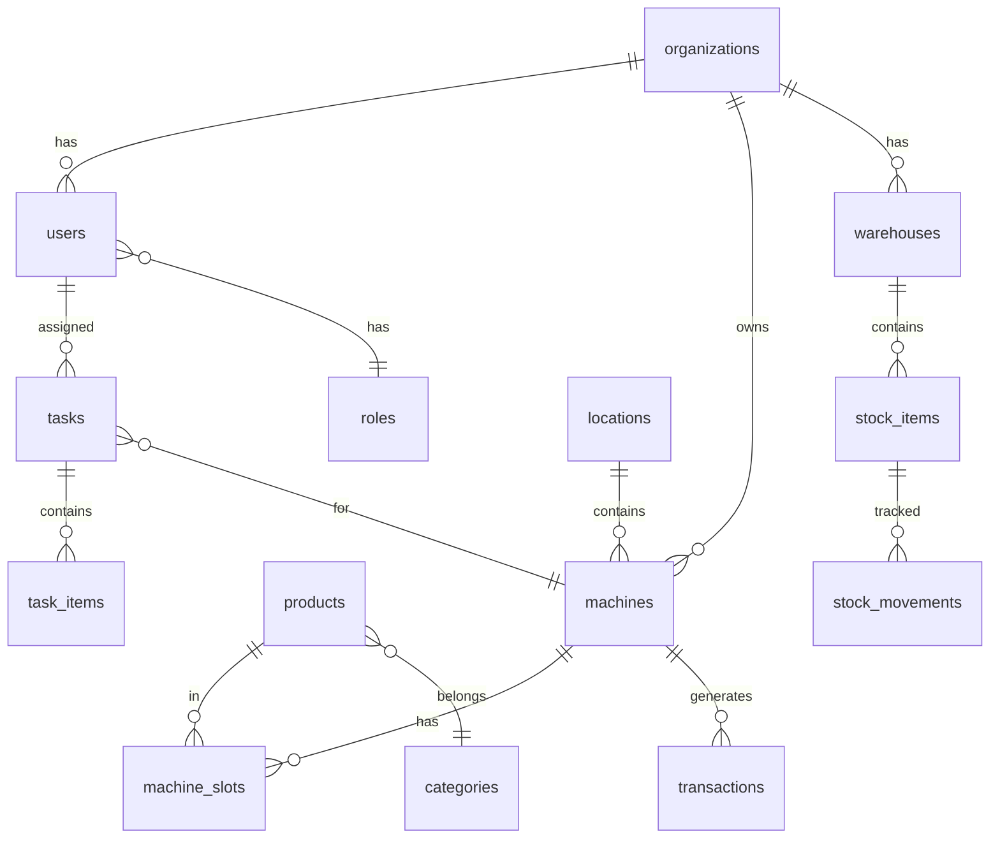

# VendHub Unified - План разработки MVP

> **Версия:** 2.0 (Скорректированная)
> **Дата:** 15 января 2026
> **Длительность MVP:** 6 недель (30 рабочих дней)
> **Базовый проект:** VHM24-repo (с элементами VendHub)
> **Изменения:** +1 неделя на миграцию справочников из VHD

---

## Обзор MVP

### Цели MVP
1. ✅ Работающая админ-панель с базовым функционалом
2. ✅ Управление аппаратами и продуктами
3. ✅ 3-уровневый складской учёт
4. ✅ Базовая система задач
5. ✅ Просмотр продаж и аналитика
6. ✅ Аутентификация и роли

### Что НЕ входит в MVP
- ❌ Multi-tenant (Фаза 2)
- ❌ 2FA (Фаза 2)
- ❌ Рецептуры напитков (Фаза 2)
- ❌ Платёжные интеграции (Фаза 2)
- ❌ AI Import (Фаза 3)
- ❌ Геймификация (Фаза 4)
- ❌ Telegram Bot (Фаза 2)

---

## Спринты

### 📅 Спринт 1: Инфраструктура (Дни 1-5)

**Цель:** Настроить проект, CI/CD, базу данных

#### День 1-2: Настройка проекта
| Задача | Время | Приоритет |
|--------|-------|-----------|
| Форк VHM24-repo, очистка от лишнего | 4ч | P0 |
| Настройка Turborepo структуры | 4ч | P0 |
| Настройка ESLint, Prettier, Husky | 2ч | P1 |
| Docker Compose для dev окружения | 4ч | P0 |
| PostgreSQL + Redis контейнеры | 2ч | P0 |

#### День 3-4: База данных
| Задача | Время | Приоритет |
|--------|-------|-----------|
| Создание базовых миграций | 4ч | P0 |
| Seed данные для разработки | 4ч | P1 |
| Модели: User, Organization, Role | 4ч | P0 |
| Модели: Machine, Location | 4ч | P0 |

#### День 5: CI/CD
| Задача | Время | Приоритет |
|--------|-------|-----------|
| GitHub Actions: lint, test, build | 4ч | P1 |
| Docker build pipeline | 2ч | P1 |
| Документация по запуску проекта | 2ч | P2 |

**Deliverables Спринт 1:**
- ✅ Рабочий dev environment
- ✅ База данных с базовыми моделями
- ✅ CI pipeline

---

### 📅 Спринт 2: Аутентификация и Пользователи (Дни 6-10)

**Цель:** Полная система аутентификации и RBAC

#### День 6-7: Аутентификация Backend
| Задача | Время | Приоритет |
|--------|-------|-----------|
| JWT стратегия (access + refresh) | 4ч | P0 |
| Login/Logout endpoints | 3ч | P0 |
| Password reset flow | 3ч | P1 |
| Session management | 3ч | P1 |
| Rate limiting | 3ч | P1 |

#### День 8: RBAC
| Задача | Время | Приоритет |
|--------|-------|-----------|
| Роли: Admin, Manager, Operator, Viewer | 4ч | P0 |
| Guards и декораторы | 4ч | P0 |

#### День 9-10: Аутентификация Frontend
| Задача | Время | Приоритет |
|--------|-------|-----------|
| Login страница | 3ч | P0 |
| Forgot password страница | 2ч | P1 |
| Auth context/store | 3ч | P0 |
| Protected routes | 2ч | P0 |
| User profile страница | 3ч | P1 |
| Users list (admin) | 3ч | P1 |

**Deliverables Спринт 2:**
- ✅ Работающий вход в систему
- ✅ 4 роли с разными правами
- ✅ Профиль пользователя

---

### 📅 Спринт 3: Аппараты и Локации (Дни 11-15)

**Цель:** Полное управление вендинг-аппаратами

#### День 11-12: Backend Machines
| Задача | Время | Приоритет |
|--------|-------|-----------|
| CRUD endpoints для Machine | 4ч | P0 |
| Machine types enum (drink/snack/combo) | 2ч | P0 |
| Machine status management | 3ч | P0 |
| Locations CRUD | 3ч | P0 |
| Machine-Location связь | 2ч | P0 |
| Фильтрация и пагинация | 2ч | P1 |

#### День 13-14: Frontend Machines
| Задача | Время | Приоритет |
|--------|-------|-----------|
| Machines list с фильтрами | 4ч | P0 |
| Machine detail страница | 4ч | P0 |
| Create/Edit machine формы | 4ч | P0 |
| Locations list | 3ч | P1 |
| Location detail и формы | 3ч | P1 |

#### День 15: Карта
| Задача | Время | Приоритет |
|--------|-------|-----------|
| Интеграция карты (Yandex/Google) | 4ч | P1 |
| Отображение аппаратов на карте | 2ч | P1 |
| Popup с информацией | 2ч | P2 |

**Deliverables Спринт 3:**
- ✅ CRUD для аппаратов
- ✅ CRUD для локаций
- ✅ Карта с маркерами

---

### 📅 Спринт 4: Продукты и Склад (Дни 16-20)

**Цель:** Каталог продуктов и 3-уровневый инвентарь

#### День 16-17: Backend Products
| Задача | Время | Приоритет |
|--------|-------|-----------|
| Product model (drink/snack types) | 3ч | P0 |
| Products CRUD | 4ч | P0 |
| Categories CRUD | 2ч | P1 |
| Pricing (costPrice, sellPrice, markup) | 3ч | P0 |
| Product-Machine связь (slots) | 4ч | P0 |

#### День 18: Backend Inventory
| Задача | Время | Приоритет |
|--------|-------|-----------|
| Warehouse model | 2ч | P0 |
| Stock levels (warehouse/operator/machine) | 4ч | P0 |
| Stock movements | 4ч | P0 |
| Low stock alerts | 2ч | P1 |

#### День 19-20: Frontend Products & Inventory
| Задача | Время | Приоритет |
|--------|-------|-----------|
| Products list с фильтрами | 3ч | P0 |
| Product detail (drink vs snack cards) | 4ч | P0 |
| Create/Edit product формы | 3ч | P0 |
| Inventory dashboard | 4ч | P0 |
| Stock movements history | 3ч | P1 |
| Low stock alerts UI | 3ч | P1 |

**Deliverables Спринт 4:**
- ✅ Каталог продуктов (drink/snack)
- ✅ 3-уровневый инвентарь
- ✅ Оповещения о низких остатках

---

### 📅 Спринт 5: Задачи, Продажи, Dashboard (Дни 21-25)

**Цель:** Завершение MVP функционала

#### День 21-22: Backend Tasks & Sales
| Задача | Время | Приоритет |
|--------|-------|-----------|
| Tasks CRUD | 3ч | P0 |
| Task types (replenish, collect, maintain) | 2ч | P0 |
| Task assignment to operators | 2ч | P0 |
| Task status flow | 2ч | P0 |
| Sales transactions model | 3ч | P0 |
| Sales import (basic CSV) | 4ч | P1 |

#### День 23: Backend Analytics
| Задача | Время | Приоритет |
|--------|-------|-----------|
| Dashboard aggregations | 4ч | P0 |
| Sales reports (daily/weekly/monthly) | 4ч | P1 |

#### День 24: Frontend Tasks
| Задача | Время | Приоритет |
|--------|-------|-----------|
| Tasks list (Kanban view) | 4ч | P0 |
| Task detail | 2ч | P0 |
| Create/Assign task | 2ч | P0 |

#### День 25: Frontend Dashboard & Sales
| Задача | Время | Приоритет |
|--------|-------|-----------|
| Main dashboard с KPIs | 4ч | P0 |
| Sales transactions list | 2ч | P0 |
| Basic charts (Recharts) | 2ч | P1 |

**Deliverables Спринт 5:**
- ✅ Система задач
- ✅ Просмотр продаж
- ✅ Dashboard с метриками

---

## Сводка по модулям MVP

### Backend Endpoints (целевое: 80+)

| Модуль | Endpoints | Статус |
|--------|-----------|--------|
| Auth | 8 | Спринт 2 |
| Users | 10 | Спринт 2 |
| Machines | 12 | Спринт 3 |
| Locations | 8 | Спринт 3 |
| Products | 12 | Спринт 4 |
| Categories | 6 | Спринт 4 |
| Inventory | 10 | Спринт 4 |
| Tasks | 10 | Спринт 5 |
| Sales | 6 | Спринт 5 |
| Dashboard | 4 | Спринт 5 |
| **ИТОГО** | **86** | |

### Frontend Страницы (целевое: 20+)

| Страница | Спринт |
|----------|--------|
| Login | 2 |
| Forgot Password | 2 |
| Profile | 2 |
| Users List | 2 |
| User Detail | 2 |
| Machines List | 3 |
| Machine Detail | 3 |
| Machine Create/Edit | 3 |
| Machines Map | 3 |
| Locations List | 3 |
| Location Detail | 3 |
| Products List | 4 |
| Product Detail | 4 |
| Product Create/Edit | 4 |
| Inventory Dashboard | 4 |
| Stock Movements | 4 |
| Tasks List (Kanban) | 5 |
| Task Detail | 5 |
| Sales Transactions | 5 |
| Main Dashboard | 5 |
| Settings | 5 |
| **ИТОГО** | **21** |

---

## Database Schema MVP

### Entities (15 таблиц)

```
CORE:
├── organizations        - Организации
├── users               - Пользователи
├── roles               - Роли
├── user_sessions       - Сессии

OPERATIONS:
├── locations           - Локации
├── machines            - Аппараты
├── machine_slots       - Слоты аппаратов

PRODUCTS:
├── categories          - Категории
├── products            - Продукты

INVENTORY:
├── warehouses          - Склады
├── stock_items         - Остатки
├── stock_movements     - Перемещения

TASKS:
├── tasks               - Задачи
├── task_items          - Позиции задач

SALES:
├── transactions        - Транзакции продаж
```

### Связи



---

## Технический стек MVP

### Backend
```yaml
Framework: NestJS 11
Language: TypeScript 5.4
ORM: TypeORM 0.3
Database: PostgreSQL 16
Cache: Redis 7.2
Queue: Bull 5 (для фоновых задач)
Validation: class-validator
Documentation: Swagger/OpenAPI
```

### Frontend
```yaml
Framework: Next.js 15 (App Router)
Language: TypeScript 5.4
State: Zustand 5
Server State: React Query 5
UI: TailwindCSS 3.4 + shadcn/ui
Forms: React Hook Form + Zod
Tables: TanStack Table 8
Charts: Recharts 2
Maps: Yandex Maps API
```

### DevOps
```yaml
Containerization: Docker + Docker Compose
CI/CD: GitHub Actions
Monitoring: (отложено до Фазы 2)
```

---

## Критерии готовности MVP

### Definition of Done

- [ ] Все 86 endpoints работают и документированы в Swagger
- [ ] Все 21 страница реализованы и адаптивны
- [ ] Unit тесты для критичных модулей (>60% coverage)
- [ ] E2E тесты для основных flows
- [ ] Нет критических багов
- [ ] Performance: <500ms response time
- [ ] Security: JWT, rate limiting, input validation
- [ ] README с инструкциями по запуску

### Acceptance Criteria

1. **Auth:** Пользователь может войти, выйти, сбросить пароль
2. **Machines:** Админ может создать, редактировать, удалить аппарат
3. **Products:** Можно создать drink и snack продукты с разной логикой цен
4. **Inventory:** Видны остатки на 3 уровнях, работают перемещения
5. **Tasks:** Можно создать и назначить задачу оператору
6. **Dashboard:** Отображаются ключевые KPI

---

## Риски и митигация

| Риск | Вероятность | Влияние | Митигация |
|------|-------------|---------|-----------|
| Сложность интеграции VHM24-repo | Средняя | Высокое | Начать с чистки кода в Спринт 1 |
| Задержка с картой | Низкая | Среднее | Карту можно отложить |
| Производительность БД | Низкая | Высокое | Индексы с первого дня |
| Нехватка времени | Средняя | Высокое | Приоритеты P0/P1/P2 |

---

## После MVP: Фазы 2-4

### Фаза 2 (3 недели)
- Multi-tenant архитектура
- 2FA TOTP
- Рецептуры напитков
- Платёжные интеграции (Payme, Click)
- Telegram Bot (aiogram)
- Сверка данных

### Фаза 3 (2 недели)
- AI Import модуль
- AI агенты для распознавания
- Лояльность (4 уровня)
- TWA для клиентов

### Фаза 4 (TBD)
- Геймификация (квесты, достижения)
- Инвестор портал
- Mobile приложение
- Расширенная аналитика

---

## Команда и ресурсы

### Рекомендуемый состав
| Роль | Количество | Спринты |
|------|------------|---------|
| Backend Developer | 1-2 | 1-5 |
| Frontend Developer | 1-2 | 2-5 |
| DevOps | 0.5 | 1, по необходимости |
| QA | 0.5 | 4-5 |

### Инструменты
- **Трекер:** GitHub Projects / Jira
- **Дизайн:** Figma (если нужны макеты)
- **Документация:** Notion / Confluence
- **Коммуникация:** Telegram / Slack

---

*План создан: 14 января 2026*
*Версия: 1.0*
*Статус: Готов к выполнению*
