# VHM24 Master Data Management — Mermaid Diagrams

## Appendix C to Technical Specification v1.0

Этот документ содержит все диаграммы системы справочников в формате Mermaid.

---

## 1. ER-диаграмма (Entity Relationship)

```mermaid
erDiagram
    directories ||--o{ directory_fields : "has fields"
    directories ||--o{ directory_entries : "contains entries"
    directories ||--o{ directory_sources : "has sources"
    directories ||--o{ directory_permissions : "has permissions"
    directories ||--o| directory_stats : "has stats"
    directories ||--o{ import_jobs : "has imports"
    directories ||--o{ import_templates : "has templates"
    directories ||--o{ webhooks : "has webhooks"

    directory_entries ||--o{ directory_entry_audit : "has audit"
    directory_entries ||--o{ directory_events : "triggers events"
    directory_entries }o--o| directory_entries : "parent/child"
    directory_entries }o--o| directory_entries : "replacement"

    directory_fields }o--o| directories : "ref to directory"

    directory_sources ||--o{ directory_sync_logs : "has logs"

    directory_events ||--o{ webhook_deliveries : "delivered by"
    webhooks ||--o{ webhook_deliveries : "delivers"
    webhook_deliveries ||--o| webhook_dead_letters : "fails to"

    user_recent_selections }o--|| directory_entries : "selects entry"
    user_recent_selections }o--|| directories : "from directory"

    directories {
        uuid id PK
        text name
        text slug UK
        directory_type type
        directory_scope scope
        uuid organization_id FK
        uuid location_id FK
        boolean is_hierarchical
        boolean is_system
        text icon
        jsonb settings
        uuid created_by FK
        timestamptz created_at
        timestamptz updated_at
        timestamptz deleted_at
    }

    directory_fields {
        uuid id PK
        uuid directory_id FK
        text name
        text display_name
        text description
        field_type field_type
        uuid ref_directory_id FK
        boolean allow_free_text
        boolean is_required
        boolean is_unique
        boolean is_unique_per_org
        boolean show_in_list
        boolean show_in_card
        int sort_order
        jsonb default_value
        jsonb validation_rules
        jsonb translations
        timestamptz created_at
        timestamptz updated_at
    }

    directory_entries {
        uuid id PK
        uuid directory_id FK
        uuid parent_id FK
        text name
        text normalized_name
        text code
        text external_key
        text description
        jsonb translations
        entry_origin origin
        text origin_source
        timestamptz origin_date
        entry_status status
        int version
        timestamptz valid_from
        timestamptz valid_to
        timestamptz deprecated_at
        uuid replacement_entry_id FK
        text_array tags
        int sort_order
        jsonb data
        tsvector search_vector
        uuid organization_id FK
        uuid created_by FK
        uuid updated_by FK
        timestamptz created_at
        timestamptz updated_at
        timestamptz deleted_at
    }

    directory_sources {
        uuid id PK
        uuid directory_id FK
        text name
        source_type source_type
        text url
        jsonb auth_config
        jsonb request_config
        jsonb column_mapping
        text unique_key_field
        text schedule
        boolean is_active
        timestamptz last_sync_at
        sync_status last_sync_status
        text last_sync_error
        int consecutive_failures
        text source_version
        timestamptz created_at
        timestamptz updated_at
    }

    directory_sync_logs {
        uuid id PK
        uuid directory_id FK
        uuid source_id FK
        sync_log_status status
        timestamptz started_at
        timestamptz finished_at
        int total_records
        int created_count
        int updated_count
        int deprecated_count
        int error_count
        jsonb errors
        uuid triggered_by FK
    }

    directory_entry_audit {
        uuid id PK
        uuid entry_id FK
        audit_action action
        uuid changed_by FK
        timestamptz changed_at
        jsonb old_values
        jsonb new_values
        text change_reason
        inet ip_address
        text user_agent
    }

    directory_permissions {
        uuid id PK
        uuid directory_id FK
        uuid organization_id FK
        text role
        uuid user_id FK
        boolean can_view
        boolean can_create
        boolean can_edit
        boolean can_archive
        boolean can_bulk_import
        boolean can_sync_external
        boolean can_approve
        boolean inherit_from_parent
        boolean is_deny
        timestamptz created_at
        timestamptz updated_at
    }

    directory_events {
        uuid id PK
        event_type event_type
        uuid directory_id FK
        uuid entry_id FK
        uuid batch_id
        int sequence_num
        jsonb payload
        timestamptz created_at
        timestamptz processed_at
    }

    webhooks {
        uuid id PK
        uuid directory_id FK
        text name
        text url
        text secret
        text_array event_types
        boolean is_active
        jsonb headers
        uuid created_by FK
        timestamptz created_at
        timestamptz updated_at
    }

    webhook_deliveries {
        uuid id PK
        uuid webhook_id FK
        uuid event_id FK
        delivery_status status
        int attempts
        timestamptz last_attempt_at
        timestamptz next_attempt_at
        int response_status
        text response_body
        text error_message
        timestamptz created_at
    }

    webhook_dead_letters {
        uuid id PK
        uuid webhook_id FK
        uuid event_id FK
        uuid delivery_id FK
        int attempts
        text last_error
        jsonb payload
        timestamptz created_at
    }

    import_jobs {
        uuid id PK
        uuid directory_id FK
        import_status status
        import_mode mode
        text file_name
        text file_path
        jsonb column_mapping
        text unique_key_field
        boolean is_atomic
        int total_rows
        int processed_rows
        int success_count
        int error_count
        jsonb errors
        jsonb warnings
        jsonb preview_data
        uuid created_by FK
        timestamptz created_at
        timestamptz started_at
        timestamptz finished_at
    }

    import_templates {
        uuid id PK
        uuid directory_id FK
        text name
        text description
        jsonb column_mapping
        text unique_key_field
        import_mode default_mode
        boolean is_default
        uuid created_by FK
        timestamptz created_at
        timestamptz updated_at
    }

    user_recent_selections {
        uuid user_id PK
        uuid directory_id PK_FK
        uuid entry_id PK_FK
        timestamptz selected_at
        int selection_count
    }

    directory_stats {
        uuid directory_id PK_FK
        int total_entries
        int active_entries
        int official_entries
        int local_entries
        timestamptz last_sync_at
        sync_status last_sync_status
        int consecutive_sync_failures
        timestamptz last_import_at
        numeric avg_search_time_ms
        timestamptz updated_at
    }
```

---

## 2. Workflow статусов записи

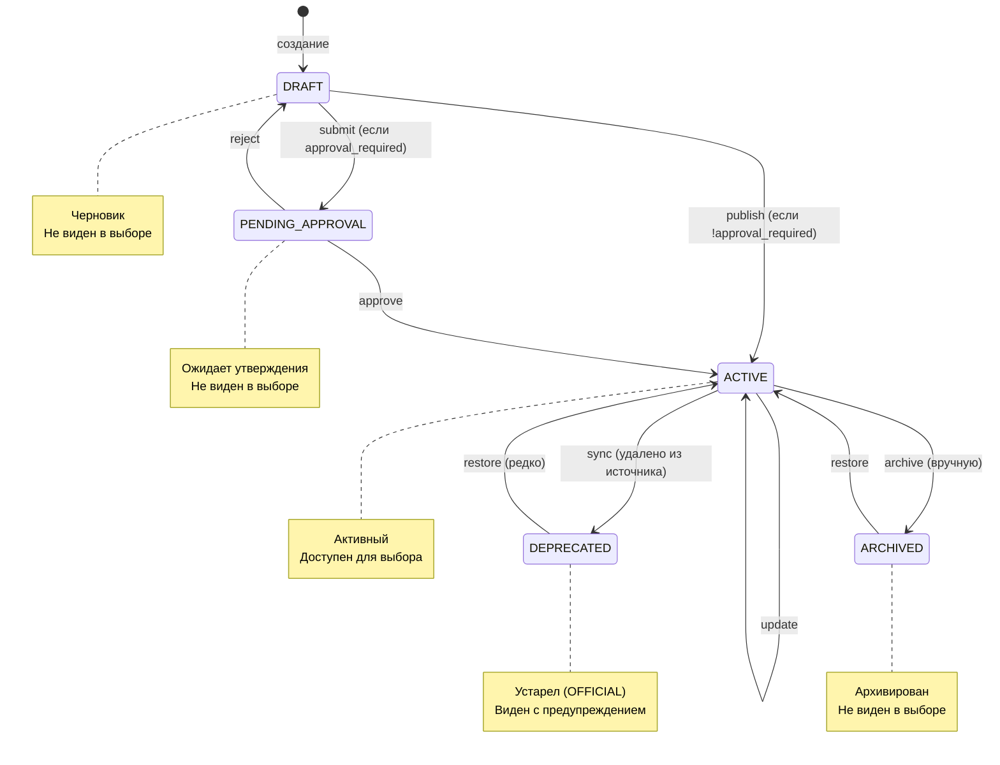

---

## 3. Flow синхронизации внешнего источника

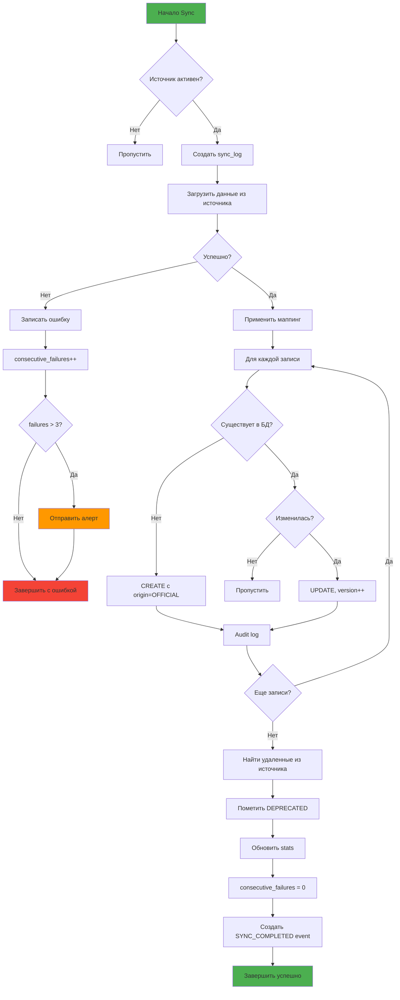

---

## 4. Flow импорта данных

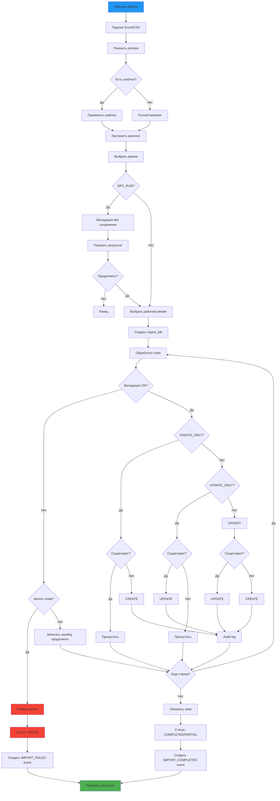

---

## 5. Flow Inline Create

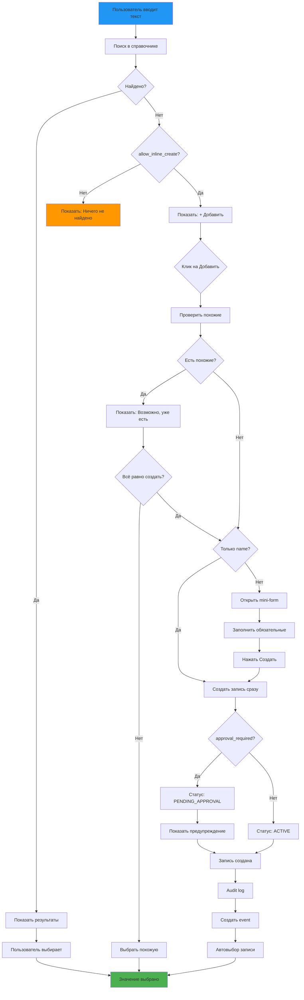

---

## 6. Алгоритм разрешения прав (RBAC)

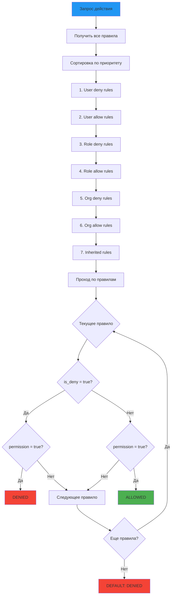

---

## 7. Webhook Delivery Flow

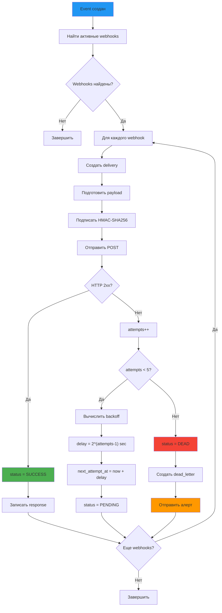

---

## 8. Поиск с ранжированием

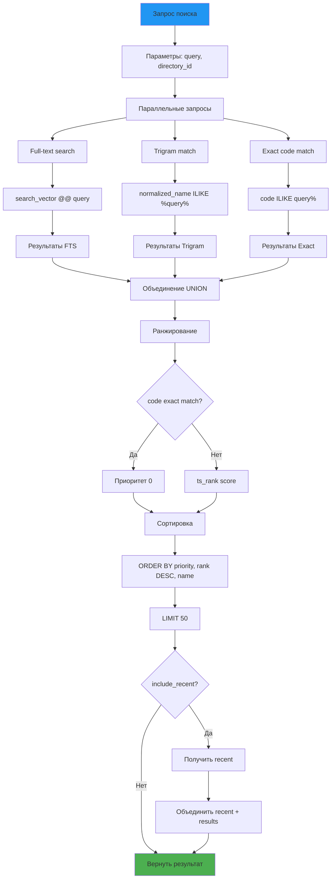

---

## 9. Offline Sync & Conflict Resolution

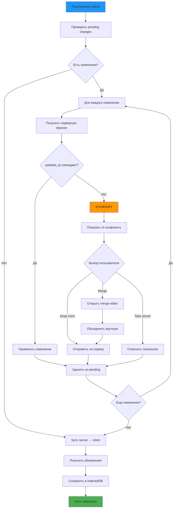

---

## 10. Архитектура компонентов системы

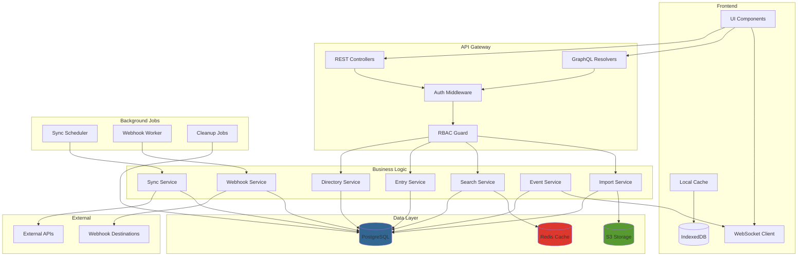

---

## 11. Типы справочников и их особенности

```mermaid
graph TD
    subgraph Types["Типы справочников"]
        MANUAL["MANUAL<br/>Внутренний"]
        EXTERNAL["EXTERNAL<br/>Внешний"]
        PARAM["PARAM<br/>Параметрический"]
        TEMPLATE["TEMPLATE<br/>Шаблон"]
    end

    subgraph MANUALFeatures["MANUAL"]
        MF1[Полный CRUD]
        MF2[origin = LOCAL]
        MF3[Inline Create]
    end

    subgraph EXTERNALFeatures["EXTERNAL"]
        EF1[Auto-sync]
        EF2[OFFICIAL read-only]
        EF3[LOCAL overlay]
        EF4[Versioning]
    end

    subgraph PARAMFeatures["PARAM"]
        PF1[Источник для SELECT]
        PF2[Prefetch enabled]
        PF3[Небольшой объём]
    end

    subgraph TEMPLATEFeatures["TEMPLATE"]
        TF1[System templates]
        TF2[User templates]
        TF3[Clone & create]
    end

    MANUAL --> MF1
    MANUAL --> MF2
    MANUAL --> MF3

    EXTERNAL --> EF1
    EXTERNAL --> EF2
    EXTERNAL --> EF3
    EXTERNAL --> EF4

    PARAM --> PF1
    PARAM --> PF2
    PARAM --> PF3

    TEMPLATE --> TF1
    TEMPLATE --> TF2
    TEMPLATE --> TF3

    style MANUAL fill:#4CAF50
    style EXTERNAL fill:#2196F3
    style PARAM fill:#FF9800
    style TEMPLATE fill:#9C27B0
```

---

## 12. Миграция данных

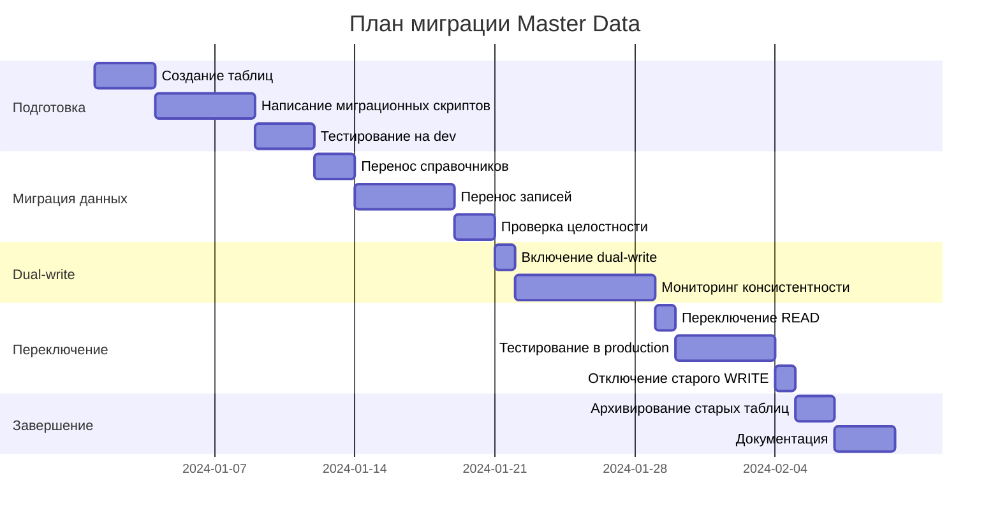

---

**Конец Appendix C**
