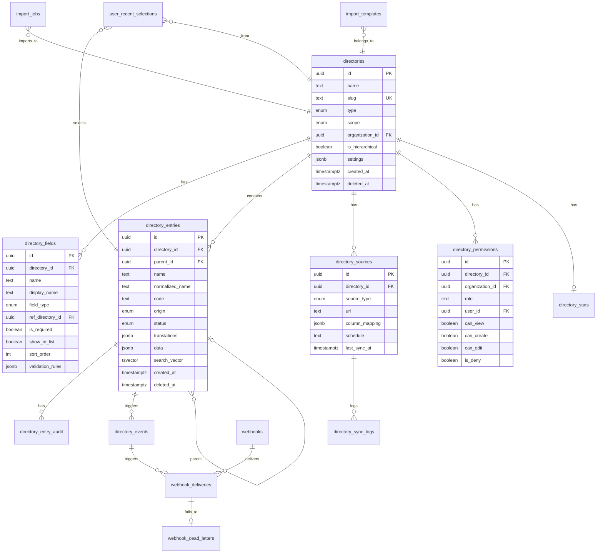

# VHM24 Master Data Management — Technical Specification v1.0

**Версия документа:** 1.0  
**Дата:** Январь 2026  
**Платформа:** VHM24 — Enterprise Vending Machine Management  
**Стек:** NestJS + TypeORM + PostgreSQL  
**Модуль:** Master Data Management (MDM)

---

## Документы спецификации

| Документ                         | Описание                                          |
| -------------------------------- | ------------------------------------------------- |
| **Specification_v1.0.md**        | Основная техническая спецификация (этот документ) |
| **Appendix_A_SQL_Migration.sql** | Полный SQL скрипт миграции PostgreSQL             |
| **Appendix_B_JSONB_Examples.md** | Примеры всех JSONB структур                       |
| **Appendix_C_Diagrams.md**       | Mermaid диаграммы (ERD, flows, архитектура)       |
| **Appendix_D_Checklist.md**      | Чеклист для внедрения (100+ пунктов)              |
| **Appendix_E_NestJS_Backend.md** | Примеры реализации NestJS backend                 |
| **Appendix_F_React_Frontend.md** | Примеры реализации React frontend                 |

---

## Оглавление

- [§1. Введение и назначение](#1-введение-и-назначение)
- [§2. Типы справочников](#2-типы-справочников)
- [§3. Directory Builder Wizard](#3-directory-builder-wizard-ui-flow)
- [§4. Архитектура данных](#4-архитектура-данных-database-schema)
- [§5. Карточки записей](#5-карточки-записей-entry-cards)
- [§6. OFFICIAL / LOCAL происхождение](#6-official--local-происхождение-данных)
- [§7. Версионирование](#7-версионирование-и-устаревание-official-данных)
- [§8. Мультиязычность](#8-мультиязычность-i18n)
- [§9. Иерархические справочники](#9-иерархические-справочники)
- [§10. Статусы, теги, сортировка](#10-статусы-теги-сортировка)
- [§11. Валидация данных](#11-валидация-данных)
- [§12. Поиск и производительность](#12-поиск-и-производительность)
- [§13. Inline Create](#13-inline-create)
- [§14. Bulk операции](#14-bulk-операции)
- [§15. RBAC](#15-rbac-права-доступа)
- [§16. Soft Delete и архивирование](#16-soft-delete-и-архивирование)
- [§17. Audit Log](#17-audit-log)
- [§18. Events и Webhooks](#18-events-и-webhooks)
- [§19. Мониторинг и метрики](#19-мониторинг-и-метрики)
- [§20. Offline режим](#20-offline-режим)
- [§21. Миграция](#21-миграция-существующих-модулей)
- [§22. Кэширование](#22-кэширование)
- [§23. API Endpoints](#23-api-endpoints-rest)
- [§24. Error Codes](#24-error-codes)
- [§25. Testing Requirements](#25-testing-requirements)
- [Приложения](#приложения)

---

# §1. Введение и назначение

## 1.1 Цели системы справочников

**Master Data** в VHM24 — это единая подсистема для хранения и управления всеми справочными (мастер) данными. Основные цели:

| Цель                       | Описание                                       |
| -------------------------- | ---------------------------------------------- |
| **Исключить дубли**        | Единые названия, коды, классификации без хаоса |
| **Удобное заполнение**     | Выбор из списка вместо ручного ввода           |
| **Поддержка франшизы**     | HQ → Организации → Локации с разными правами   |
| **Качественная аналитика** | Единые сущности, коды, связи для отчётов       |
| **Интеграция**             | Внешние классификаторы (ИКПУ, МФО банков)      |

## 1.2 Главные принципы

```
┌─────────────────────────────────────────────────────────────────┐
│  1. Всё, что выбирается из списка — это справочник              │
│  2. Карточка = объект + параметры + связи                       │
│  3. OFFICIAL/LOCAL — обязательное разделение происхождения      │
│  4. Inline Create обязателен везде                              │
│  5. Удалений нет → только archive/soft delete                   │
│  6. Единый Wizard для создания любого справочника               │
└─────────────────────────────────────────────────────────────────┘
```

## 1.3 Глоссарий терминов

| Термин              | Описание                                                         |
| ------------------- | ---------------------------------------------------------------- |
| **Directory**       | Справочник — контейнер для однотипных записей                    |
| **Entry**           | Запись справочника — конкретный элемент (товар, локация)         |
| **Field**           | Поле/параметр карточки — атрибут записи                          |
| **OFFICIAL origin** | Официальные данные из внешнего источника (read-only)             |
| **LOCAL origin**    | Данные, добавленные вручную пользователем                        |
| **Inline Create**   | Создание записи прямо в поле выбора без перехода на другой экран |
| **Overlay**         | Локальные дополнения к внешнему справочнику                      |
| **EAV**             | Entity-Attribute-Value — паттерн хранения гибких атрибутов       |

---

# §2. Типы справочников

## 2.1 MANUAL (внутренний, ручной)

Справочники, которые ведутся пользователем и пополняются в процессе работы.

**Примеры:**

- Товары (goods)
- Ингредиенты (ingredients)
- Локации (locations)
- Автоматы (machines)
- Запчасти (spare_parts)
- Контрагенты (contractors)
- Типы работ (work_types)

**Особенности:**

- Полный CRUD для записей
- Пользователь создаёт записи вручную
- Записи оформлены как карточки с параметрами
- Используются во всех операционных процессах

## 2.2 EXTERNAL (внешний, auto-sync)

Справочники, данные которых берутся из внешних источников и могут автоматически обновляться.

**Примеры:**

- ИКПУ (ikpu) — классификатор товаров/услуг
- МФО банков (bank_mfo)
- Государственные классификаторы

**Особенности:**

- OFFICIAL-часть справочника read-only
- Источник: URL / API / файл / текстовый импорт
- Поддержка обновления вручную или по расписанию (cron)
- Данные имеют атрибут происхождения "официальные"

## 2.3 EXTERNAL + LOCAL Overlay

Внешние справочники с возможностью локальных дополнений. Это режим по умолчанию для всех EXTERNAL справочников.

**Два слоя данных:**

```
┌─────────────────────────────────────────┐
│           EXTERNAL Directory            │
├─────────────────────────────────────────┤
│  🛡️ OFFICIAL Layer (read-only)         │
│  ├── Запись 1 (из источника)           │
│  ├── Запись 2 (из источника)           │
│  └── Запись N (из источника)           │
├─────────────────────────────────────────┤
│  ✍️ LOCAL Layer (editable)              │
│  ├── Запись A (добавлена вручную)      │
│  └── Запись B (добавлена вручную)      │
└─────────────────────────────────────────┘
```

**Правила:**

- OFFICIAL записи — read-only, нельзя редактировать/удалять
- LOCAL записи — можно создавать/редактировать/архивировать
- При выборе показываются оба типа записей
- UI всегда показывает метку происхождения

## 2.4 PARAM (параметрический)

Справочник-источник значений для параметров в карточках других справочников.

**Примеры:**

- Категории товаров (categories)
- Производители (manufacturers)
- Типы автоматов (machine_types)
- Статусы (statuses)
- Единицы измерения (units)

**Особенности:**

- Используется как source для SELECT полей
- Обычно небольшой объём данных
- Часто используется prefetch при старте

## 2.5 TEMPLATE (из шаблона)

Справочники, создаваемые на основе готовых шаблонов.

**System templates (поставляемые системой):**

- Автоматы
- Товары
- Ингредиенты
- Локации
- Запчасти
- Контрагенты

**User templates (создаваемые пользователем):**

- Клонирование справочника как шаблон
- Создание справочника на базе шаблона
- Сохранение структуры полей как шаблон

---

# §3. Directory Builder Wizard (UI Flow)

Единый интерфейс создания любого справочника через пошаговый wizard.

## Шаг 1: Выбор типа справочника

```
┌─────────────────────────────────────────────────────────────┐
│  Создание справочника — Шаг 1 из 6                         │
├─────────────────────────────────────────────────────────────┤
│                                                             │
│  Выберите тип справочника:                                  │
│                                                             │
│  ○ MANUAL — Внутренний справочник                          │
│    Вы ведёте данные самостоятельно                         │
│                                                             │
│  ○ EXTERNAL — Внешний справочник                           │
│    Данные загружаются из внешнего источника                │
│                                                             │
│  ○ PARAM — Параметрический справочник                      │
│    Источник значений для полей других справочников         │
│                                                             │
│  ○ FROM TEMPLATE — Из шаблона                              │
│    Создать на основе готового шаблона                      │
│                                                             │
│                                        [Назад] [Далее →]   │
└─────────────────────────────────────────────────────────────┘
```

## Шаг 2: Базовая информация

| Поле       | Описание                        | Пример                           |
| ---------- | ------------------------------- | -------------------------------- |
| Название   | Отображаемое имя справочника    | "Товары"                         |
| Код (slug) | Уникальный код латиницей        | "goods"                          |
| Описание   | Краткое описание назначения     | "Справочник товаров для продажи" |
| Scope      | Область видимости               | HQ / Organization / Location     |
| Иконка     | Визуальная иконка (опционально) | 📦                               |

## Шаг 3: Конструктор полей (Field Builder)

```
┌─────────────────────────────────────────────────────────────────────────┐
│  Конструктор полей                              │  Live Preview        │
├─────────────────────────────────────────────────┼──────────────────────┤
│                                                 │                      │
│  ☰ Название *          [TEXT]      [В таблице] │  ┌────────────────┐  │
│  ☰ Код                 [TEXT]      [В таблице] │  │ Таблица        │  │
│  ☰ Категория *         [SELECT] → categories   │  ├────┬────┬─────┤  │
│  ☰ Цена                [NUMBER]    [В таблице] │  │Назв│Код │Цена │  │
│  ☰ Единица измерения   [SELECT] → units        │  ├────┼────┼─────┤  │
│  ☰ Фото                [IMAGE]                 │  │... │... │...  │  │
│                                                 │  └────┴────┴─────┘  │
│  [+ Добавить поле]                              │                      │
│                                                 │  ┌────────────────┐  │
│  Настройки выбранного поля:                     │  │ Карточка       │  │
│  ├── Обязательное: ☑                           │  ├────────────────┤  │
│  ├── Уникальное: ☐                             │  │ Название: ___  │  │
│  ├── Показывать в списке: ☑                    │  │ Код: ___       │  │
│  └── Разрешить свободный ввод: ☐               │  │ Категория: ▼   │  │
│                                                 │  │ ...            │  │
│                                                 │  └────────────────┘  │
└─────────────────────────────────────────────────┴──────────────────────┘
```

**Типы полей:**

| Тип           | Описание                             | Пример значения                                  |
| ------------- | ------------------------------------ | ------------------------------------------------ |
| TEXT          | Текстовая строка                     | "Coca-Cola 0.5L"                                 |
| NUMBER        | Число (целое или дробное)            | 5000                                             |
| DATE          | Дата                                 | "2024-01-15"                                     |
| DATETIME      | Дата и время                         | "2024-01-15T10:30:00"                            |
| BOOLEAN       | Да/Нет                               | true                                             |
| SELECT_SINGLE | Выбор одного из списка               | UUID категории                                   |
| SELECT_MULTI  | Выбор нескольких                     | [UUID1, UUID2]                                   |
| REF           | Ссылка на запись другого справочника | UUID записи                                      |
| JSON          | Произвольная структура               | {"key": "value"}                                 |
| FILE          | Файл                                 | {"file_id": "...", "url": "..."}                 |
| IMAGE         | Изображение                          | {"file_id": "...", "url": "...", "thumb": "..."} |

## Шаг 4: Источник данных (только для EXTERNAL)

```
┌─────────────────────────────────────────────────────────────┐
│  Настройка источника данных                                 │
├─────────────────────────────────────────────────────────────┤
│                                                             │
│  Тип источника: ○ URL  ○ API  ○ File  ○ Text               │
│                                                             │
│  URL/Endpoint:                                              │
│  [https://api.example.com/ikpu/list________________]       │
│                                                             │
│  Аутентификация:                                            │
│  ○ Нет  ○ Bearer Token  ○ Basic Auth  ○ API Key            │
│                                                             │
│  Маппинг колонок:                                           │
│  ┌──────────────┬─────────────────┐                        │
│  │ Источник     │ Поле справочника│                        │
│  ├──────────────┼─────────────────┤                        │
│  │ code         │ → code          │                        │
│  │ name_ru      │ → name          │                        │
│  │ name_uz      │ → translations  │                        │
│  └──────────────┴─────────────────┘                        │
│                                                             │
│  Ключ уникальности: [code_________]                        │
│                                                             │
│  Режим обновления:                                          │
│  ○ Вручную  ○ По расписанию: [0 0 * * *] (каждый день)    │
│                                                             │
│  [Тестовый запрос]  Preview: 5 записей загружено ✓         │
│                                                             │
└─────────────────────────────────────────────────────────────┘
```

## Шаг 5: Настройки использования

| Настройка                  | Описание                                     | По умолчанию |
| -------------------------- | -------------------------------------------- | ------------ |
| Где отображается           | Модули системы, где виден справочник         | Все          |
| Разрешить Inline Create    | Можно ли добавлять записи "на месте"         | Да           |
| Разрешить LOCAL дополнения | Для EXTERNAL: можно ли добавлять свои записи | Да           |
| Режим утверждения          | Требуется ли approval для новых записей      | Нет          |
| Prefetch при старте        | Загружать в кэш при запуске приложения       | Нет          |
| Доступен offline           | Синхронизировать для offline-работы          | Нет          |

## Шаг 6: Права доступа

```
┌─────────────────────────────────────────────────────────────┐
│  Права доступа                                              │
├─────────────────────────────────────────────────────────────┤
│                                                             │
│  Роль          │ View │Create│ Edit │Archive│Import│Sync   │
│  ──────────────┼──────┼──────┼──────┼───────┼──────┼─────  │
│  Owner/Admin   │  ✓   │  ✓   │  ✓   │   ✓   │  ✓   │  ✓   │
│  Manager       │  ✓   │  ✓   │  ✓   │   ✓   │  ✓   │  ✗   │
│  Operator      │  ✓   │  ✓   │  ✗   │   ✗   │  ✗   │  ✗   │
│  Viewer        │  ✓   │  ✗   │  ✗   │   ✗   │  ✗   │  ✗   │
│                                                             │
│  ☑ Наследовать права от HQ                                 │
│                                                             │
└─────────────────────────────────────────────────────────────┘
```

---

# §4. Архитектура данных (Database Schema)

## 4.1 ER-диаграмма (Mermaid)



## 4.2 Таблицы

### directories

Основная таблица справочников (метаданные).

```sql
-- =============================================
-- Таблица: directories
-- Описание: Справочники (метаданные)
-- =============================================

create type directory_type as enum ('MANUAL', 'EXTERNAL', 'PARAM', 'TEMPLATE');
create type directory_scope as enum ('HQ', 'ORGANIZATION', 'LOCATION');

create table directories (
    id uuid primary key default gen_random_uuid(),

    -- Основные поля
    name text not null,
    slug text not null,
    description text,

    -- Тип и область
    type directory_type not null,
    scope directory_scope not null default 'HQ',
    organization_id uuid references organizations(id) on delete set null,
    location_id uuid references locations(id) on delete set null,

    -- Флаги
    is_hierarchical boolean not null default false,
    is_system boolean not null default false,

    -- Дополнительно
    icon text,
    settings jsonb not null default '{}'::jsonb,

    -- Аудит
    created_by uuid references users(id) on delete set null,
    created_at timestamptz not null default now(),
    updated_at timestamptz not null default now(),
    deleted_at timestamptz,

    -- Constraints
    constraint uq_directories_slug unique (slug)
        -- Примечание: partial unique index создаётся отдельно
);

-- Комментарии
comment on table directories is 'Справочники (метаданные)';
comment on column directories.slug is 'Уникальный код справочника (латиница)';
comment on column directories.settings is 'Настройки: allow_inline_create, allow_local_overlay, approval_required, prefetch, offline_enabled, offline_max_entries';
comment on column directories.is_system is 'Системный справочник (нельзя удалить)';

-- Индексы
create unique index idx_directories_slug_active
    on directories(slug) where deleted_at is null;
create index idx_directories_type on directories(type);
create index idx_directories_scope_org on directories(scope, organization_id);
create index idx_directories_deleted on directories(deleted_at) where deleted_at is not null;

-- Триггер обновления updated_at
create or replace function update_updated_at()
returns trigger as $$
begin
    new.updated_at = now();
    return new;
end;
$$ language plpgsql;

create trigger trg_directories_updated_at
    before update on directories
    for each row execute function update_updated_at();
```

**Пример settings JSONB:**

```json
{
  "allow_inline_create": true,
  "allow_local_overlay": true,
  "approval_required": false,
  "prefetch": false,
  "offline_enabled": false,
  "offline_max_entries": 1000
}
```

### directory_fields

Поля/параметры справочника.

```sql
-- =============================================
-- Таблица: directory_fields
-- Описание: Поля/параметры справочника
-- =============================================

create type field_type as enum (
    'TEXT', 'NUMBER', 'DATE', 'DATETIME', 'BOOLEAN',
    'SELECT_SINGLE', 'SELECT_MULTI', 'REF',
    'JSON', 'FILE', 'IMAGE'
);

create table directory_fields (
    id uuid primary key default gen_random_uuid(),
    directory_id uuid not null references directories(id) on delete cascade,

    -- Идентификация
    name text not null,
    display_name text not null,
    description text,

    -- Тип и источник
    field_type field_type not null,
    ref_directory_id uuid references directories(id) on delete set null,
    allow_free_text boolean not null default false,

    -- Правила
    is_required boolean not null default false,
    is_unique boolean not null default false,
    is_unique_per_org boolean not null default false,

    -- Отображение
    show_in_list boolean not null default false,
    show_in_card boolean not null default true,
    sort_order int not null default 0,

    -- Значения
    default_value jsonb,
    validation_rules jsonb not null default '{}'::jsonb,

    -- Локализация
    translations jsonb,

    -- Аудит
    created_at timestamptz not null default now(),
    updated_at timestamptz not null default now(),

    -- Constraints
    constraint uq_fields_directory_name unique (directory_id, name)
);

comment on table directory_fields is 'Поля/параметры справочника';
comment on column directory_fields.name is 'Системное имя поля (для API)';
comment on column directory_fields.display_name is 'Отображаемое название';
comment on column directory_fields.ref_directory_id is 'Справочник-источник для SELECT/REF типов';
comment on column directory_fields.allow_free_text is 'Разрешить свободный ввод для SELECT';
comment on column directory_fields.validation_rules is 'Правила валидации (regex, min/max, etc.)';
comment on column directory_fields.translations is 'Переводы названия поля';

-- Индексы
create index idx_fields_directory on directory_fields(directory_id);
create index idx_fields_directory_order on directory_fields(directory_id, sort_order);
create index idx_fields_ref on directory_fields(ref_directory_id)
    where ref_directory_id is not null;

create trigger trg_fields_updated_at
    before update on directory_fields
    for each row execute function update_updated_at();
```

**Пример validation_rules JSONB:**

```json
{
  "regex": "^[A-Z]{2}\\d{6}$",
  "min_length": 3,
  "max_length": 64,
  "min_value": 0,
  "max_value": 999999,
  "allowed_values": ["A", "B", "C"],
  "unique_scope": "DIRECTORY",
  "custom_message": "Код должен быть в формате XX000000",
  "conditional_rules": [
    {
      "if": { "field": "type", "equals": "DRINK" },
      "then": { "field": "volume", "required": true }
    }
  ],
  "async_validator": "check_ikpu_exists",
  "rate_limit": {
    "requests_per_second": 10,
    "batch_size": 100
  }
}
```

### directory_entries

Записи справочника.

```sql
-- =============================================
-- Таблица: directory_entries
-- Описание: Записи справочника
-- =============================================

create type entry_origin as enum ('OFFICIAL', 'LOCAL');
create type entry_status as enum ('DRAFT', 'PENDING_APPROVAL', 'ACTIVE', 'DEPRECATED', 'ARCHIVED');

create table directory_entries (
    id uuid primary key default gen_random_uuid(),
    directory_id uuid not null references directories(id) on delete cascade,

    -- Иерархия
    parent_id uuid references directory_entries(id) on delete set null,

    -- Основные поля
    name text not null,
    normalized_name text not null,
    code text,
    external_key text,
    description text,

    -- Локализация
    translations jsonb,

    -- Происхождение
    origin entry_origin not null default 'LOCAL',
    origin_source text,
    origin_date timestamptz,

    -- Статус и версионирование
    status entry_status not null default 'ACTIVE',
    version int not null default 1,
    valid_from timestamptz,
    valid_to timestamptz,
    deprecated_at timestamptz,
    replacement_entry_id uuid references directory_entries(id) on delete set null,

    -- Организация и метаданные
    tags text[],
    sort_order int not null default 0,
    data jsonb not null default '{}'::jsonb,
    search_vector tsvector,
    organization_id uuid references organizations(id) on delete set null,

    -- Аудит
    created_by uuid references users(id) on delete set null,
    updated_by uuid references users(id) on delete set null,
    created_at timestamptz not null default now(),
    updated_at timestamptz not null default now(),
    deleted_at timestamptz
);

comment on table directory_entries is 'Записи справочника';
comment on column directory_entries.normalized_name is 'Нормализованное имя: lower(trim(unaccent(name)))';
comment on column directory_entries.external_key is 'Ключ из внешнего источника';
comment on column directory_entries.origin is 'Происхождение: OFFICIAL (внешний источник) или LOCAL (ручное добавление)';
comment on column directory_entries.replacement_entry_id is 'Рекомендуемая замена для DEPRECATED записей';
comment on column directory_entries.data is 'Значения полей (EAV через JSONB)';
comment on column directory_entries.search_vector is 'Вектор для полнотекстового поиска';

-- Индексы
create index idx_entries_directory on directory_entries(directory_id);
create index idx_entries_directory_status on directory_entries(directory_id, status);
create index idx_entries_parent on directory_entries(parent_id) where parent_id is not null;
create index idx_entries_code on directory_entries(directory_id, code) where code is not null;
create index idx_entries_external_key on directory_entries(directory_id, external_key) where external_key is not null;
create index idx_entries_origin on directory_entries(directory_id, origin);

-- Уникальность normalized_name в рамках directory + origin
create unique index idx_entries_normalized_unique
    on directory_entries(directory_id, normalized_name, origin)
    where deleted_at is null;

-- Полнотекстовый поиск
create index idx_entries_search_vector on directory_entries using gin(search_vector);

-- Trigram для fuzzy search
create index idx_entries_normalized_trgm
    on directory_entries using gin(normalized_name gin_trgm_ops);

-- JSONB индексы
create index idx_entries_tags on directory_entries using gin(tags);
create index idx_entries_data on directory_entries using gin(data jsonb_path_ops);
create index idx_entries_translations on directory_entries using gin(translations);

create trigger trg_entries_updated_at
    before update on directory_entries
    for each row execute function update_updated_at();
```

**Пример data JSONB:**

```json
{
  "category_id": "550e8400-e29b-41d4-a716-446655440001",
  "price": 5000,
  "unit_id": "550e8400-e29b-41d4-a716-446655440002",
  "manufacturer_id": "550e8400-e29b-41d4-a716-446655440003",
  "volume": 0.5,
  "photo": {
    "file_id": "file_abc123",
    "url": "https://storage.example.com/goods/coca-cola.jpg",
    "name": "coca-cola.jpg"
  },
  "tags": ["напитки", "газированные"]
}
```

**Пример translations JSONB:**

```json
{
  "ru": "Кока-Кола 0.5л",
  "uz": "Coca-Cola 0.5l",
  "en": "Coca-Cola 0.5L"
}
```

### directory_sources

Источники внешних данных.

```sql
-- =============================================
-- Таблица: directory_sources
-- Описание: Источники внешних данных
-- =============================================

create type source_type as enum ('URL', 'API', 'FILE', 'TEXT');
create type sync_status as enum ('SUCCESS', 'FAILED', 'PARTIAL');

create table directory_sources (
    id uuid primary key default gen_random_uuid(),
    directory_id uuid not null references directories(id) on delete cascade,

    -- Идентификация
    name text not null,
    source_type source_type not null,

    -- Подключение
    url text,
    auth_config jsonb,
    request_config jsonb,

    -- Маппинг
    column_mapping jsonb not null,
    unique_key_field text not null,

    -- Расписание
    schedule text,
    is_active boolean not null default true,

    -- Статус синхронизации
    last_sync_at timestamptz,
    last_sync_status sync_status,
    last_sync_error text,
    consecutive_failures int not null default 0,

    -- Версионирование
    source_version text,

    -- Аудит
    created_at timestamptz not null default now(),
    updated_at timestamptz not null default now()
);

comment on table directory_sources is 'Источники внешних данных';
comment on column directory_sources.auth_config is 'Конфигурация аутентификации: {type: "bearer", token: "..."} или {type: "basic", ...}';
comment on column directory_sources.request_config is 'Конфигурация запроса: headers, method, body template';
comment on column directory_sources.column_mapping is 'Маппинг колонок: {"source_col": "field_name", ...}';
comment on column directory_sources.schedule is 'Cron expression для автоматической синхронизации';
comment on column directory_sources.source_version is 'Версия данных источника (для инвалидации кэша)';

-- Индексы
create index idx_sources_directory on directory_sources(directory_id);
create index idx_sources_active_schedule on directory_sources(is_active, schedule)
    where schedule is not null;

create trigger trg_sources_updated_at
    before update on directory_sources
    for each row execute function update_updated_at();
```

**Пример auth_config JSONB:**

```json
{
  "type": "bearer",
  "token": "eyJhbGciOiJIUzI1NiIs..."
}
```

```json
{
  "type": "basic",
  "username": "api_user",
  "password": "secret"
}
```

```json
{
  "type": "api_key",
  "header": "X-API-Key",
  "value": "abc123"
}
```

**Пример column_mapping JSONB:**

```json
{
  "code": "code",
  "name_ru": "name",
  "name_uz": "translations.uz",
  "name_en": "translations.en",
  "category_code": "data.category_code"
}
```

### directory_sync_logs

Логи синхронизации.

```sql
-- =============================================
-- Таблица: directory_sync_logs
-- Описание: Логи синхронизации
-- =============================================

create type sync_log_status as enum ('STARTED', 'SUCCESS', 'FAILED', 'PARTIAL');

create table directory_sync_logs (
    id uuid primary key default gen_random_uuid(),
    directory_id uuid not null references directories(id) on delete cascade,
    source_id uuid not null references directory_sources(id) on delete cascade,

    -- Статус
    status sync_log_status not null,

    -- Время
    started_at timestamptz not null default now(),
    finished_at timestamptz,

    -- Статистика
    total_records int,
    created_count int,
    updated_count int,
    deprecated_count int,
    error_count int,

    -- Ошибки
    errors jsonb,

    -- Кто запустил
    triggered_by uuid references users(id) on delete set null
);

comment on table directory_sync_logs is 'Логи синхронизации';
comment on column directory_sync_logs.triggered_by is 'Кто запустил синхронизацию (null если по расписанию)';
comment on column directory_sync_logs.errors is 'Массив ошибок: [{record, field, message}, ...]';

-- Индексы
create index idx_sync_logs_directory on directory_sync_logs(directory_id);
create index idx_sync_logs_source on directory_sync_logs(source_id);
create index idx_sync_logs_started on directory_sync_logs(started_at desc);
```

**Пример errors JSONB:**

```json
[
  {
    "record": { "code": "123456", "name": "Invalid Item" },
    "field": "code",
    "message": "Code must be 6 digits"
  },
  {
    "record": { "code": "789012", "name": "Another Item" },
    "field": "category_code",
    "message": "Category not found: XYZ"
  }
]
```

### directory_entry_audit

История изменений записей.

```sql
-- =============================================
-- Таблица: directory_entry_audit
-- Описание: История изменений записей
-- =============================================

create type audit_action as enum (
    'CREATE', 'UPDATE', 'ARCHIVE', 'RESTORE',
    'SYNC', 'APPROVE', 'REJECT'
);

create table directory_entry_audit (
    id uuid primary key default gen_random_uuid(),
    entry_id uuid not null references directory_entries(id) on delete cascade,

    -- Действие
    action audit_action not null,

    -- Кто и когда
    changed_by uuid references users(id) on delete set null,
    changed_at timestamptz not null default now(),

    -- Изменения
    old_values jsonb,
    new_values jsonb,

    -- Дополнительно
    change_reason text,
    ip_address inet,
    user_agent text
);

comment on table directory_entry_audit is 'История изменений записей';
comment on column directory_entry_audit.old_values is 'Значения до изменения';
comment on column directory_entry_audit.new_values is 'Значения после изменения';
comment on column directory_entry_audit.change_reason is 'Комментарий к изменению';

-- Индексы
create index idx_audit_entry on directory_entry_audit(entry_id);
create index idx_audit_entry_time on directory_entry_audit(entry_id, changed_at desc);
create index idx_audit_changed_by on directory_entry_audit(changed_by);
create index idx_audit_action on directory_entry_audit(action);
```

**Пример old_values / new_values JSONB:**

```json
// old_values
{
  "name": "Coca-Cola 0.5",
  "data": {
    "price": 4500
  }
}

// new_values
{
  "name": "Coca-Cola 0.5L",
  "data": {
    "price": 5000
  }
}
```

### directory_permissions

Права доступа к справочникам.

```sql
-- =============================================
-- Таблица: directory_permissions
-- Описание: Права доступа к справочникам
-- =============================================

create table directory_permissions (
    id uuid primary key default gen_random_uuid(),
    directory_id uuid not null references directories(id) on delete cascade,

    -- Субъект прав
    organization_id uuid references organizations(id) on delete cascade,
    role text,
    user_id uuid references users(id) on delete cascade,

    -- Права
    can_view boolean not null default true,
    can_create boolean not null default false,
    can_edit boolean not null default false,
    can_archive boolean not null default false,
    can_bulk_import boolean not null default false,
    can_sync_external boolean not null default false,
    can_approve boolean not null default false,

    -- Наследование и deny
    inherit_from_parent boolean not null default true,
    is_deny boolean not null default false,

    -- Аудит
    created_at timestamptz not null default now(),
    updated_at timestamptz not null default now(),

    -- Constraint: должен быть указан role или user_id
    constraint chk_permissions_subject check (role is not null or user_id is not null)
);

comment on table directory_permissions is 'Права доступа к справочникам';
comment on column directory_permissions.role is 'Роль: owner, admin, manager, operator, viewer';
comment on column directory_permissions.inherit_from_parent is 'Наследовать права от родительской организации (HQ)';
comment on column directory_permissions.is_deny is 'Явный запрет (перекрывает allow)';

-- Индексы
create index idx_permissions_directory on directory_permissions(directory_id);
create index idx_permissions_directory_role on directory_permissions(directory_id, role);
create index idx_permissions_user on directory_permissions(user_id) where user_id is not null;
create index idx_permissions_org on directory_permissions(organization_id) where organization_id is not null;

create trigger trg_permissions_updated_at
    before update on directory_permissions
    for each row execute function update_updated_at();
```

### directory_events

События для webhooks и триггеров.

```sql
-- =============================================
-- Таблица: directory_events
-- Описание: События для webhooks и триггеров
-- =============================================

create type event_type as enum (
    'ENTRY_CREATED', 'ENTRY_UPDATED', 'ENTRY_ARCHIVED', 'ENTRY_RESTORED',
    'SYNC_STARTED', 'SYNC_COMPLETED', 'SYNC_FAILED',
    'IMPORT_STARTED', 'IMPORT_COMPLETED', 'IMPORT_FAILED'
);

create table directory_events (
    id uuid primary key default gen_random_uuid(),

    -- Тип события
    event_type event_type not null,

    -- Связи
    directory_id uuid not null references directories(id) on delete cascade,
    entry_id uuid references directory_entries(id) on delete set null,

    -- Batch (для массовых операций)
    batch_id uuid,
    sequence_num int,

    -- Данные
    payload jsonb not null default '{}'::jsonb,

    -- Время
    created_at timestamptz not null default now(),
    processed_at timestamptz
);

comment on table directory_events is 'События для webhooks и триггеров';
comment on column directory_events.batch_id is 'ID группы событий (для массовых операций)';
comment on column directory_events.sequence_num is 'Порядковый номер в группе';
comment on column directory_events.processed_at is 'Когда событие обработано (null = ожидает)';

-- Индексы
create index idx_events_directory on directory_events(directory_id);
create index idx_events_type_time on directory_events(event_type, created_at desc);
create index idx_events_batch on directory_events(batch_id) where batch_id is not null;
create index idx_events_unprocessed on directory_events(created_at) where processed_at is null;
```

**Пример payload JSONB:**

```json
{
  "entry_id": "550e8400-e29b-41d4-a716-446655440000",
  "entry_name": "Coca-Cola 0.5L",
  "entry_code": "COCA05",
  "changes": {
    "price": { "old": 4500, "new": 5000 }
  },
  "changed_by": "user_123",
  "changed_at": "2024-01-15T10:30:00Z"
}
```

### webhooks

Настройки webhooks.

```sql
-- =============================================
-- Таблица: webhooks
-- Описание: Настройки webhooks
-- =============================================

create table webhooks (
    id uuid primary key default gen_random_uuid(),

    -- Связь со справочником (null = все справочники)
    directory_id uuid references directories(id) on delete cascade,

    -- Настройки
    name text not null,
    url text not null,
    secret text,
    event_types text[] not null,
    is_active boolean not null default true,

    -- Дополнительные headers
    headers jsonb,

    -- Аудит
    created_by uuid references users(id) on delete set null,
    created_at timestamptz not null default now(),
    updated_at timestamptz not null default now()
);

comment on table webhooks is 'Настройки webhooks';
comment on column webhooks.secret is 'Секрет для HMAC-SHA256 подписи payload';
comment on column webhooks.event_types is 'Типы событий для отправки: {ENTRY_CREATED, ENTRY_UPDATED, ...}';

-- Индексы
create index idx_webhooks_directory on webhooks(directory_id);
create index idx_webhooks_active on webhooks(is_active) where is_active = true;

create trigger trg_webhooks_updated_at
    before update on webhooks
    for each row execute function update_updated_at();
```

### webhook_deliveries

Логи доставки webhooks.

```sql
-- =============================================
-- Таблица: webhook_deliveries
-- Описание: Логи доставки webhooks
-- =============================================

create type delivery_status as enum ('PENDING', 'SUCCESS', 'FAILED', 'DEAD');

create table webhook_deliveries (
    id uuid primary key default gen_random_uuid(),
    webhook_id uuid not null references webhooks(id) on delete cascade,
    event_id uuid not null references directory_events(id) on delete cascade,

    -- Статус
    status delivery_status not null default 'PENDING',
    attempts int not null default 0,

    -- Время
    last_attempt_at timestamptz,
    next_attempt_at timestamptz,

    -- Результат
    response_status int,
    response_body text,
    error_message text,

    -- Аудит
    created_at timestamptz not null default now()
);

comment on table webhook_deliveries is 'Логи доставки webhooks';
comment on column webhook_deliveries.next_attempt_at is 'Время следующей попытки (для retry)';

-- Индексы
create index idx_deliveries_webhook on webhook_deliveries(webhook_id);
create index idx_deliveries_event on webhook_deliveries(event_id);
create index idx_deliveries_pending on webhook_deliveries(next_attempt_at)
    where status = 'PENDING';
create index idx_deliveries_dead on webhook_deliveries(webhook_id)
    where status = 'DEAD';
```

### webhook_dead_letters

Dead letter queue для неудачных webhook доставок.

```sql
-- =============================================
-- Таблица: webhook_dead_letters
-- Описание: Dead letter queue для webhooks
-- =============================================

create table webhook_dead_letters (
    id uuid primary key default gen_random_uuid(),
    webhook_id uuid not null references webhooks(id) on delete cascade,
    event_id uuid not null references directory_events(id) on delete cascade,
    delivery_id uuid references webhook_deliveries(id) on delete set null,

    -- Информация об ошибке
    attempts int not null,
    last_error text,

    -- Сохранённый payload
    payload jsonb not null,

    -- Аудит
    created_at timestamptz not null default now()
);

comment on table webhook_dead_letters is 'Dead letter queue для неудачных webhook доставок';

-- Индексы
create index idx_dead_letters_webhook on webhook_dead_letters(webhook_id);
create index idx_dead_letters_created on webhook_dead_letters(created_at);
```

### import_jobs

Задачи массового импорта.

```sql
-- =============================================
-- Таблица: import_jobs
-- Описание: Задачи массового импорта
-- =============================================

create type import_status as enum (
    'PENDING', 'PROCESSING', 'COMPLETED', 'PARTIAL', 'FAILED', 'CANCELLED'
);
create type import_mode as enum ('CREATE_ONLY', 'UPSERT', 'UPDATE_ONLY', 'DRY_RUN');

create table import_jobs (
    id uuid primary key default gen_random_uuid(),
    directory_id uuid not null references directories(id) on delete cascade,

    -- Статус
    status import_status not null default 'PENDING',
    mode import_mode not null default 'UPSERT',

    -- Файл
    file_name text,
    file_path text,

    -- Настройки
    column_mapping jsonb not null,
    unique_key_field text,
    is_atomic boolean not null default false,

    -- Статистика
    total_rows int not null default 0,
    processed_rows int not null default 0,
    success_count int not null default 0,
    error_count int not null default 0,

    -- Ошибки и preview
    errors jsonb not null default '[]'::jsonb,
    warnings jsonb not null default '[]'::jsonb,
    preview_data jsonb,

    -- Аудит
    created_by uuid references users(id) on delete set null,
    created_at timestamptz not null default now(),
    started_at timestamptz,
    finished_at timestamptz
);

comment on table import_jobs is 'Задачи массового импорта';
comment on column import_jobs.is_atomic is 'Атомарный режим: всё или ничего';
comment on column import_jobs.errors is 'Массив ошибок: [{row, field, message, data}, ...]';
comment on column import_jobs.preview_data is 'Первые 10 строк для preview';

-- Индексы
create index idx_import_jobs_directory on import_jobs(directory_id);
create index idx_import_jobs_status on import_jobs(status);
create index idx_import_jobs_user on import_jobs(created_by);
create index idx_import_jobs_created on import_jobs(created_at desc);
```

**Пример errors JSONB:**

```json
[
  {
    "row": 15,
    "field": "code",
    "message": "Duplicate value",
    "data": { "code": "ABC123", "name": "Test Item" }
  },
  {
    "row": 23,
    "field": "category_id",
    "message": "Not found: 'Unknown Category'",
    "data": { "code": "XYZ789", "category": "Unknown Category" }
  }
]
```

### import_templates

Шаблоны маппинга для импорта.

```sql
-- =============================================
-- Таблица: import_templates
-- Описание: Шаблоны маппинга для импорта
-- =============================================

create table import_templates (
    id uuid primary key default gen_random_uuid(),
    directory_id uuid not null references directories(id) on delete cascade,

    -- Идентификация
    name text not null,
    description text,

    -- Маппинг
    column_mapping jsonb not null,
    unique_key_field text,
    default_mode import_mode not null default 'UPSERT',

    -- Флаги
    is_default boolean not null default false,

    -- Аудит
    created_by uuid references users(id) on delete set null,
    created_at timestamptz not null default now(),
    updated_at timestamptz not null default now()
);

comment on table import_templates is 'Шаблоны маппинга для импорта';
comment on column import_templates.is_default is 'Шаблон по умолчанию для справочника';

-- Индексы
create index idx_import_templates_directory on import_templates(directory_id);

create trigger trg_import_templates_updated_at
    before update on import_templates
    for each row execute function update_updated_at();
```

**Пример column_mapping JSONB:**

```json
{
  "A": "name",
  "B": "code",
  "C": "data.category_id",
  "D": "data.price",
  "E": null,
  "F": "data.unit_id"
}
```

### user_recent_selections

Недавние выборы пользователя.

```sql
-- =============================================
-- Таблица: user_recent_selections
-- Описание: Недавние выборы пользователя (для autocomplete)
-- =============================================

create table user_recent_selections (
    user_id uuid not null,
    directory_id uuid not null references directories(id) on delete cascade,
    entry_id uuid not null references directory_entries(id) on delete cascade,

    -- Время и счётчик
    selected_at timestamptz not null default now(),
    selection_count int not null default 1,

    -- Composite PK
    primary key (user_id, directory_id, entry_id)
);

comment on table user_recent_selections is 'Недавние выборы пользователя для autocomplete';
comment on column user_recent_selections.selection_count is 'Счётчик выборов (для сортировки по популярности)';

-- Индексы
create index idx_recent_user_dir on user_recent_selections(user_id, directory_id, selected_at desc);
```

### directory_stats

Статистика справочников.

```sql
-- =============================================
-- Таблица: directory_stats
-- Описание: Статистика справочников
-- =============================================

create table directory_stats (
    directory_id uuid primary key references directories(id) on delete cascade,

    -- Счётчики
    total_entries int not null default 0,
    active_entries int not null default 0,
    official_entries int not null default 0,
    local_entries int not null default 0,

    -- Синхронизация
    last_sync_at timestamptz,
    last_sync_status sync_status,
    consecutive_sync_failures int not null default 0,

    -- Импорт
    last_import_at timestamptz,

    -- Производительность
    avg_search_time_ms numeric,

    -- Аудит
    updated_at timestamptz not null default now()
);

comment on table directory_stats is 'Статистика справочников';
comment on column directory_stats.consecutive_sync_failures is 'Количество подряд неудачных синхронизаций';
comment on column directory_stats.avg_search_time_ms is 'Среднее время поиска в миллисекундах';
```

## 4.3 Триггеры и функции

### Нормализация имени

```sql
-- =============================================
-- Функция: Нормализация имени записи
-- =============================================

create extension if not exists unaccent;

create or replace function normalize_entry_name(p_name text)
returns text as $$
begin
    return lower(trim(unaccent(coalesce(p_name, ''))));
end;
$$ language plpgsql immutable;

comment on function normalize_entry_name is 'Нормализует имя: lower + trim + unaccent';

-- Триггер автоматического вычисления normalized_name
create or replace function trg_update_normalized_name()
returns trigger as $$
begin
    new.normalized_name := normalize_entry_name(new.name);
    return new;
end;
$$ language plpgsql;

create trigger trg_entry_normalized_name
    before insert or update of name
    on directory_entries
    for each row execute function trg_update_normalized_name();
```

### Полнотекстовый поиск

```sql
-- =============================================
-- Функция: Обновление search_vector
-- =============================================

create or replace function trg_update_entry_search_vector()
returns trigger as $$
begin
    new.search_vector :=
        setweight(to_tsvector('simple', coalesce(new.normalized_name, '')), 'A') ||
        setweight(to_tsvector('simple', coalesce(new.code, '')), 'A') ||
        setweight(to_tsvector('simple', coalesce(new.external_key, '')), 'B') ||
        setweight(to_tsvector('simple', coalesce(new.translations::text, '')), 'C') ||
        setweight(to_tsvector('simple', coalesce(new.description, '')), 'D');
    return new;
end;
$$ language plpgsql;

create trigger trg_entry_search_vector
    before insert or update of name, normalized_name, code, external_key, translations, description
    on directory_entries
    for each row execute function trg_update_entry_search_vector();
```

### Проверка циклов в иерархии

```sql
-- =============================================
-- Функция: Проверка циклов в иерархии
-- =============================================

create or replace function check_hierarchy_cycle(
    p_entry_id uuid,
    p_new_parent_id uuid
) returns boolean as $$
declare
    v_current_id uuid := p_new_parent_id;
    v_depth int := 0;
    v_max_depth int := 100;
begin
    -- Нет родителя = нет цикла
    if p_new_parent_id is null then
        return false;
    end if;

    -- Сам на себя = цикл
    if p_entry_id = p_new_parent_id then
        return true;
    end if;

    -- Проходим вверх по иерархии
    while v_current_id is not null and v_depth < v_max_depth loop
        select parent_id into v_current_id
        from directory_entries
        where id = v_current_id;

        -- Нашли цикл
        if v_current_id = p_entry_id then
            return true;
        end if;

        v_depth := v_depth + 1;
    end loop;

    return false;
end;
$$ language plpgsql;

comment on function check_hierarchy_cycle is 'Проверяет наличие цикла при установке parent_id';

-- Триггер проверки цикла
create or replace function trg_check_hierarchy_cycle()
returns trigger as $$
begin
    if new.parent_id is not null then
        if check_hierarchy_cycle(new.id, new.parent_id) then
            raise exception 'Cycle detected in hierarchy: entry % cannot have parent %',
                new.id, new.parent_id
                using errcode = 'integrity_constraint_violation';
        end if;
    end if;
    return new;
end;
$$ language plpgsql;

create trigger trg_entry_hierarchy_cycle
    before insert or update of parent_id
    on directory_entries
    for each row execute function trg_check_hierarchy_cycle();
```

### Обновление статистики

```sql
-- =============================================
-- Функция: Обновление статистики справочника
-- =============================================

create or replace function trg_update_directory_stats()
returns trigger as $$
declare
    v_directory_id uuid;
begin
    v_directory_id := coalesce(new.directory_id, old.directory_id);

    insert into directory_stats (
        directory_id,
        total_entries,
        active_entries,
        official_entries,
        local_entries,
        updated_at
    )
    select
        v_directory_id,
        count(*),
        count(*) filter (where status = 'ACTIVE'),
        count(*) filter (where origin = 'OFFICIAL'),
        count(*) filter (where origin = 'LOCAL'),
        now()
    from directory_entries
    where directory_id = v_directory_id
      and deleted_at is null
    on conflict (directory_id) do update set
        total_entries = excluded.total_entries,
        active_entries = excluded.active_entries,
        official_entries = excluded.official_entries,
        local_entries = excluded.local_entries,
        updated_at = excluded.updated_at;

    return coalesce(new, old);
end;
$$ language plpgsql;

create trigger trg_entries_update_stats
    after insert or update or delete on directory_entries
    for each row execute function trg_update_directory_stats();
```

### Очистка recent selections

```sql
-- =============================================
-- Функция: Очистка старых recent selections
-- =============================================

create or replace function cleanup_recent_selections(
    p_user_id uuid default null,
    p_max_per_directory int default 20
)
returns int as $$
declare
    v_deleted int;
begin
    with ranked as (
        select
            user_id,
            directory_id,
            entry_id,
            row_number() over (
                partition by user_id, directory_id
                order by selected_at desc
            ) as rn
        from user_recent_selections
        where p_user_id is null or user_id = p_user_id
    ),
    to_delete as (
        select user_id, directory_id, entry_id
        from ranked
        where rn > p_max_per_directory
    )
    delete from user_recent_selections urs
    using to_delete td
    where urs.user_id = td.user_id
      and urs.directory_id = td.directory_id
      and urs.entry_id = td.entry_id;

    get diagnostics v_deleted = row_count;
    return v_deleted;
end;
$$ language plpgsql;

comment on function cleanup_recent_selections is
    'Удаляет старые записи, оставляя топ-N на directory per user';
```

## 4.4 Расширения PostgreSQL

```sql
-- =============================================
-- Необходимые расширения
-- =============================================

create extension if not exists "uuid-ossp";      -- UUID генерация
create extension if not exists "unaccent";       -- Удаление акцентов (для normalized_name)
create extension if not exists "pg_trgm";        -- Trigram индексы (для fuzzy search)
```

---

# §5. Карточки записей (Entry Cards)

## 5.1 Базовые поля

Каждая запись справочника содержит обязательные базовые поля:

| Поле            | Тип   | Обязательное | Описание                                     |
| --------------- | ----- | ------------ | -------------------------------------------- |
| name            | text  | Да           | Основное название                            |
| normalized_name | text  | Да (auto)    | Нормализованное: lower(trim(unaccent(name))) |
| code            | text  | Нет          | Код/артикул                                  |
| description     | text  | Нет          | Описание                                     |
| translations    | jsonb | Нет          | Переводы названия                            |

## 5.2 Гибкие параметры (EAV через JSONB)

Значения дополнительных полей хранятся в колонке `data JSONB`.

**Структура data:**

```json
{
  "field_name": "value",
  "category_id": "550e8400-e29b-41d4-a716-446655440001",
  "price": 5000,
  "tags": ["uuid1", "uuid2"],
  "photo": {
    "file_id": "abc123",
    "url": "https://...",
    "name": "photo.jpg"
  }
}
```

**Типы значений в data:**

| Field Type    | Формат в data                                      |
| ------------- | -------------------------------------------------- |
| TEXT          | `"value"`                                          |
| NUMBER        | `123` или `123.45`                                 |
| DATE          | `"2024-01-15"`                                     |
| DATETIME      | `"2024-01-15T10:30:00Z"`                           |
| BOOLEAN       | `true` или `false`                                 |
| SELECT_SINGLE | `"uuid-of-selected-entry"`                         |
| SELECT_MULTI  | `["uuid1", "uuid2"]`                               |
| REF           | `"uuid-of-referenced-entry"`                       |
| JSON          | `{...}`                                            |
| FILE          | `{"file_id": "...", "url": "...", "name": "..."}`  |
| IMAGE         | `{"file_id": "...", "url": "...", "thumb": "..."}` |

## 5.3 Связи между справочниками (Reference Chains)

Справочники могут ссылаться друг на друга через поля типа SELECT или REF.

**Примеры цепочек:**

```
Автомат → Локация → Контрагент (арендодатель)
    │
    └──→ Тип автомата → Производитель

Товар → Категория → Родительская категория
    │
    ├──→ Единица измерения
    └──→ Производитель

Рецепт → Товар (выход)
    │
    └──→ Ингредиенты[] → Поставщик
```

**UI отображение связей:**

1. **Ссылки на карточки** — кликабельные названия
2. **Breadcrumbs** — для иерархий: `Напитки > Газированные > Кола`
3. **Preview** — при hover показывать ключевые данные связанной записи

## 5.4 Файлы и изображения

Файлы хранятся в S3/Cloudflare R2. В `data` сохраняется метаинформация.

**Структура FILE:**

```json
{
  "photo": {
    "file_id": "f_abc123",
    "url": "https://storage.example.com/files/f_abc123.pdf",
    "name": "document.pdf",
    "size": 1024000,
    "mime_type": "application/pdf"
  }
}
```

**Структура IMAGE:**

```json
{
  "photo": {
    "file_id": "i_xyz789",
    "url": "https://storage.example.com/images/i_xyz789.jpg",
    "thumb": "https://storage.example.com/images/i_xyz789_thumb.jpg",
    "name": "product.jpg",
    "width": 800,
    "height": 600
  }
}
```

---

# §6. OFFICIAL / LOCAL происхождение данных

## 6.1 Разделение слоёв

Каждая запись имеет атрибут `origin`:

| Origin       | Описание                     | Редактирование |
| ------------ | ---------------------------- | -------------- |
| **OFFICIAL** | Данные из внешнего источника | Read-only      |
| **LOCAL**    | Данные, добавленные вручную  | Full CRUD      |

## 6.2 UI-маркировка

Происхождение должно быть визуально различимо **везде**:

### В таблице справочника

```
┌─────────────────────────────────────────────────────────────┐
│ Название                  │ Код      │ Происхождение       │
├───────────────────────────┼──────────┼─────────────────────┤
│ 🛡️ Услуги связи          │ 17101001 │ ИКПУ / 2024-01-10   │
│ 🛡️ Продукты питания      │ 17101002 │ ИКПУ / 2024-01-10   │
│ ✍️ Кофе (наш)             │ CUSTOM01 │ Иванов / 2024-01-15 │
└───────────────────────────┴──────────┴─────────────────────┘
```

### В карточке записи

```
┌─────────────────────────────────────────────────────────────┐
│ Услуги связи                                    [🛡️ OFFICIAL]│
├─────────────────────────────────────────────────────────────┤
│                                                             │
│ Происхождение                                               │
│ ├── Источник: ИКПУ (Государственный классификатор)         │
│ ├── Дата обновления: 2024-01-10                            │
│ └── Версия: 2024.1                                          │
│                                                             │
│ ⚠️ Эта запись из официального источника и не может быть    │
│    отредактирована. Вы можете добавить локальную запись.   │
│                                                             │
└─────────────────────────────────────────────────────────────┘
```

### В dropdown/autocomplete

```
┌─────────────────────────────────────────────────────────────┐
│ 🔍 Поиск...                                                 │
├─────────────────────────────────────────────────────────────┤
│                                                             │
│ ОФИЦИАЛЬНЫЕ (ИКПУ)                                          │
│   🛡️ 17101001 — Услуги связи                               │
│   🛡️ 17101002 — Продукты питания                           │
│                                                             │
│ ЛОКАЛЬНЫЕ                                                   │
│   ✍️ CUSTOM01 — Кофе (наш)                                  │
│                                                             │
│ ─────────────────────────────────────────────────────────── │
│ ➕ Добавить "..." как локальную запись                      │
│                                                             │
└─────────────────────────────────────────────────────────────┘
```

## 6.3 Правила для EXTERNAL справочников

| Действие       | OFFICIAL               | LOCAL        |
| -------------- | ---------------------- | ------------ |
| Просмотр       | ✅                     | ✅           |
| Создание       | ❌ (только через sync) | ✅           |
| Редактирование | ❌                     | ✅           |
| Удаление       | ❌ (только DEPRECATED) | ✅ (archive) |
| Выбор в формах | ✅                     | ✅           |

---

# §7. Версионирование и устаревание OFFICIAL данных

## 7.1 Поля версионирования

| Поле                 | Тип         | Описание                                           |
| -------------------- | ----------- | -------------------------------------------------- |
| version              | int         | Номер версии записи (увеличивается при обновлении) |
| valid_from           | timestamptz | Начало периода действия                            |
| valid_to             | timestamptz | Конец периода действия                             |
| deprecated_at        | timestamptz | Когда запись помечена устаревшей                   |
| replacement_entry_id | uuid        | Ссылка на запись-замену                            |

## 7.2 Правила обновления при Sync

При синхронизации с внешним источником:

```
┌─────────────────────────────────────────────────────────────┐
│                    SYNC ALGORITHM                           │
├─────────────────────────────────────────────────────────────┤
│                                                             │
│  FOR EACH record IN source:                                 │
│                                                             │
│    IF not exists in DB:                                     │
│      → CREATE with origin=OFFICIAL                          │
│                                                             │
│    ELSE IF changed:                                         │
│      → UPDATE existing record                               │
│      → version++                                            │
│      → write to audit_log                                   │
│                                                             │
│    ELSE:                                                    │
│      → skip (no changes)                                    │
│                                                             │
│  FOR EACH existing OFFICIAL entry NOT in source:            │
│    → status = DEPRECATED                                    │
│    → deprecated_at = now()                                  │
│                                                             │
│  IF code changed (rare):                                    │
│    → CREATE new entry with new code                         │
│    → old_entry.replacement_entry_id = new_entry.id          │
│    → old_entry.status = DEPRECATED                          │
│                                                             │
└─────────────────────────────────────────────────────────────┘
```

## 7.3 UI для deprecated записей

```
┌─────────────────────────────────────────────────────────────┐
│ ⚠️ Услуги связи (старый код)                   [DEPRECATED] │
├─────────────────────────────────────────────────────────────┤
│                                                             │
│ Эта запись устарела с 2024-01-15.                          │
│                                                             │
│ 💡 Рекомендуется заменить на:                               │
│    → Телекоммуникационные услуги (17101099)                │
│                                                             │
│ Эта запись используется в:                                  │
│ • 15 товарах                                                │
│ • 3 рецептах                                                │
│                                                             │
│ [Заменить везде]  [Оставить как есть]                      │
│                                                             │
└─────────────────────────────────────────────────────────────┘
```

**Настройки поведения deprecated:**

| Настройка               | Описание                                       | По умолчанию |
| ----------------------- | ---------------------------------------------- | ------------ |
| allow_select_deprecated | Можно ли выбирать deprecated в новых данных    | false        |
| show_deprecated_warning | Показывать предупреждение при использовании    | true         |
| auto_replace_deprecated | Автоматически заменять при наличии replacement | false        |

---

# §8. Мультиязычность (i18n)

## 8.1 Формат хранения

Переводы хранятся в JSONB поле `translations`:

```json
{
  "ru": "Кофейный автомат",
  "uz": "Qahva avtomati",
  "en": "Coffee vending machine"
}
```

## 8.2 Что переводится

| Сущность          | Поле         | Описание                           |
| ----------------- | ------------ | ---------------------------------- |
| directory_entries | translations | Название записи                    |
| directory_fields  | translations | Название поля                      |
| directories       | (в settings) | Название справочника (опционально) |

## 8.3 Fallback chain

Порядок получения локализованного значения:

```
translations[currentLocale]     // Текущий язык пользователя
    ↓ (если нет)
translations[defaultLocale]     // Язык по умолчанию (обычно 'ru')
    ↓ (если нет)
name                            // Базовое название
```

**Реализация на backend (NestJS):**

```typescript
function getLocalizedName(entry: DirectoryEntry, locale: string): string {
  const defaultLocale = "ru";

  if (entry.translations?.[locale]) {
    return entry.translations[locale];
  }

  if (entry.translations?.[defaultLocale]) {
    return entry.translations[defaultLocale];
  }

  return entry.name;
}
```

**Реализация на frontend (React hook):**

```typescript
function useLocalized<
  T extends { name: string; translations?: Record<string, string> },
>(entity: T): string {
  const { locale, defaultLocale } = useI18n();

  return useMemo(() => {
    return (
      entity.translations?.[locale] ??
      entity.translations?.[defaultLocale] ??
      entity.name
    );
  }, [entity, locale, defaultLocale]);
}
```

## 8.4 Поиск по всем языкам

`search_vector` включает все переводы:

```sql
new.search_vector :=
    setweight(to_tsvector('simple', coalesce(new.normalized_name, '')), 'A') ||
    setweight(to_tsvector('simple', coalesce(new.translations::text, '')), 'C');
    -- translations::text преобразует {"ru": "...", "uz": "..."} в строку для поиска
```

Пользователь может искать на любом языке, и запись будет найдена.

---

# §9. Иерархические справочники

## 9.1 Структура

Иерархия включается флагом `is_hierarchical` в справочнике и использует `parent_id` в записях.

```sql
-- В таблице directories
is_hierarchical boolean not null default false

-- В таблице directory_entries
parent_id uuid references directory_entries(id) on delete set null
```

**Пример иерархии категорий:**

```
📁 Напитки (parent_id = null)
├── 📁 Газированные (parent_id = "Напитки")
│   ├── 📄 Coca-Cola
│   ├── 📄 Pepsi
│   └── 📄 Sprite
├── 📁 Соки (parent_id = "Напитки")
│   ├── 📄 Яблочный
│   └── 📄 Апельсиновый
└── 📁 Вода (parent_id = "Напитки")
    ├── 📄 Газированная
    └── 📄 Негазированная
```

## 9.2 UI режимы отображения

### Table View

```
┌──────────────────────────────────────────────────────────────┐
│ Название              │ Родитель        │ Записей │ Статус   │
├───────────────────────┼─────────────────┼─────────┼──────────┤
│ Напитки               │ —               │ 3       │ Active   │
│ Газированные          │ Напитки         │ 3       │ Active   │
│ Coca-Cola             │ Газированные    │ —       │ Active   │
│ Pepsi                 │ Газированные    │ —       │ Active   │
│ Соки                  │ Напитки         │ 2       │ Active   │
└───────────────────────┴─────────────────┴─────────┴──────────┘
```

### Tree View

```
┌──────────────────────────────────────────────────────────────┐
│ [▼ Table View] [● Tree View]                   🔍 Поиск...  │
├──────────────────────────────────────────────────────────────┤
│                                                              │
│ ▼ 📁 Напитки                                                │
│   ├─ ▼ 📁 Газированные                                      │
│   │    ├─ 📄 Coca-Cola                                      │
│   │    ├─ 📄 Pepsi                                          │
│   │    └─ 📄 Sprite                                         │
│   ├─ ▶ 📁 Соки (2)                                          │
│   └─ ▶ 📁 Вода (2)                                          │
│                                                              │
│ ▶ 📁 Снеки (5)                                              │
│ ▶ 📁 Сладости (8)                                           │
│                                                              │
└──────────────────────────────────────────────────────────────┘
```

## 9.3 Lazy loading

Для больших деревьев (>1000 узлов) используется lazy loading:

1. При открытии загружаются только корневые узлы (`parent_id = null`)
2. При expand узла загружаются его прямые дети
3. API:
   - `GET /entries?parent_id=null` — корневые
   - `GET /entries?parent_id=xxx` — дети узла

**Пример API response:**

```json
{
  "data": [
    {
      "id": "uuid1",
      "name": "Напитки",
      "parent_id": null,
      "has_children": true,
      "children_count": 3
    }
  ],
  "meta": {
    "total": 1,
    "has_more": false
  }
}
```

## 9.4 Защита от циклов

**Проблема:** A → B → C → A создаёт бесконечный цикл.

**Решение:** Триггер `check_hierarchy_cycle` (см. §4.3).

**UI защита:**

При выборе родителя в форме:

- Не показывать текущую запись
- Не показывать детей текущей записи

```typescript
// Получить IDs для исключения
function getExcludedParentIds(entryId: string, entries: Entry[]): string[] {
  const excluded = [entryId];

  function addChildren(parentId: string) {
    entries
      .filter((e) => e.parent_id === parentId)
      .forEach((e) => {
        excluded.push(e.id);
        addChildren(e.id);
      });
  }

  addChildren(entryId);
  return excluded;
}
```

---

# §10. Статусы, теги, сортировка

## 10.1 Статусы записей

| Статус           | Описание            | Виден в выборе         | Редактируемый       |
| ---------------- | ------------------- | ---------------------- | ------------------- |
| DRAFT            | Черновик            | ❌                     | ✅                  |
| PENDING_APPROVAL | Ожидает утверждения | ❌                     | ✅ (ограниченно)    |
| ACTIVE           | Активный            | ✅                     | ✅                  |
| DEPRECATED       | Устарел (OFFICIAL)  | ⚠️ (с предупреждением) | ❌                  |
| ARCHIVED         | Архивирован         | ❌                     | ❌ (только restore) |

## 10.2 Workflow статусов

```
                    ┌─────────────┐
                    │   DRAFT     │
                    └──────┬──────┘
                           │ submit
                           ▼
            ┌──────────────────────────────┐
            │     PENDING_APPROVAL         │ (если approval_required)
            └──────────────┬───────────────┘
                    approve│         │reject
                           ▼         ▼
                    ┌──────────┐  ┌──────────┐
                    │  ACTIVE  │  │  DRAFT   │
                    └────┬─────┘  └──────────┘
                         │
           ┌─────────────┼─────────────┐
           │             │             │
           ▼             ▼             ▼
    ┌────────────┐ ┌────────────┐ ┌────────────┐
    │ DEPRECATED │ │  ARCHIVED  │ │  (update)  │
    │ (при sync) │ │ (вручную)  │ │            │
    └────────────┘ └─────┬──────┘ └────────────┘
                         │
                         │ restore
                         ▼
                  ┌────────────┐
                  │   ACTIVE   │
                  └────────────┘
```

## 10.3 Теги

Теги хранятся как массив строк `tags text[]`.

**Использование:**

- Фильтрация в списке
- Группировка записей
- Быстрый поиск

**UI:**

```
┌─────────────────────────────────────────────────────────────┐
│ Теги: [популярное ×] [акция ×] [новинка ×]  [+ Добавить]   │
└─────────────────────────────────────────────────────────────┘
```

**Автодополнение:**

При добавлении тега показывать существующие теги в справочнике:

```sql
select distinct unnest(tags) as tag
from directory_entries
where directory_id = $1
  and deleted_at is null
order by tag;
```

## 10.4 Сортировка

**Ручная сортировка** через `sort_order`:

```
┌─────────────────────────────────────────────────────────────┐
│ ☰ Coca-Cola 0.5L        [sort_order: 1]                    │
│ ☰ Pepsi 0.5L            [sort_order: 2]                    │
│ ☰ Sprite 0.5L           [sort_order: 3]                    │
│ ☰ Fanta 0.5L            [sort_order: 4]                    │
└─────────────────────────────────────────────────────────────┘
         ↑ drag & drop для изменения порядка
```

**API параметры сортировки:**

| Параметр            | Описание                          |
| ------------------- | --------------------------------- |
| `?sort=sort_order`  | По ручному порядку (по умолчанию) |
| `?sort=name`        | По алфавиту                       |
| `?sort=created_at`  | По дате создания                  |
| `?sort=-created_at` | По дате создания (DESC)           |

---

# §11. Валидация данных

## 11.1 Структура validation_rules

```json
{
  "regex": "^[A-Z]{2}\\d{6}$",
  "min_length": 3,
  "max_length": 64,
  "min_value": 0,
  "max_value": 999999,
  "allowed_values": ["A", "B", "C"],
  "unique_scope": "DIRECTORY",
  "custom_message": "Код должен быть в формате XX000000"
}
```

**Доступные правила:**

| Правило        | Применимо к  | Описание                          |
| -------------- | ------------ | --------------------------------- |
| regex          | TEXT         | Регулярное выражение              |
| min_length     | TEXT         | Минимальная длина                 |
| max_length     | TEXT         | Максимальная длина                |
| min_value      | NUMBER       | Минимальное значение              |
| max_value      | NUMBER       | Максимальное значение             |
| allowed_values | TEXT, SELECT | Список допустимых значений        |
| unique_scope   | все          | DIRECTORY / ORGANIZATION / GLOBAL |
| custom_message | все          | Кастомное сообщение об ошибке     |

## 11.2 Conditional rules (кросс-поле)

Правила, зависящие от значений других полей:

```json
{
  "conditional_rules": [
    {
      "if": { "field": "type", "equals": "DRINK" },
      "then": { "field": "volume", "required": true }
    },
    {
      "if": { "field": "type", "in": ["FOOD", "SNACK"] },
      "then": { "field": "expiry_days", "required": true, "min_value": 1 }
    },
    {
      "if": { "field": "origin", "equals": "OFFICIAL" },
      "then": { "field": "code", "required": true }
    }
  ]
}
```

**Операторы условий:**

| Оператор     | Описание           |
| ------------ | ------------------ |
| equals       | Точное совпадение  |
| not_equals   | Не равно           |
| in           | Входит в список    |
| not_in       | Не входит в список |
| is_empty     | Пустое значение    |
| is_not_empty | Непустое значение  |

## 11.3 Async validators

Для проверок, требующих внешних вызовов:

```json
{
  "async_validator": "check_ikpu_exists",
  "rate_limit": {
    "requests_per_second": 10,
    "batch_size": 100
  }
}
```

**Реализация (NestJS):**

```typescript
@Injectable()
export class IkpuValidator implements AsyncValidator {
  constructor(private readonly ikpuService: IkpuService) {}

  async validate(value: string): Promise<ValidationResult> {
    const exists = await this.ikpuService.checkExists(value);
    return {
      valid: exists,
      message: exists ? null : `IKPU код ${value} не найден`,
    };
  }
}

// Registry
@Injectable()
export class AsyncValidatorRegistry {
  private validators = new Map<string, AsyncValidator>();

  register(name: string, validator: AsyncValidator) {
    this.validators.set(name, validator);
  }

  get(name: string): AsyncValidator | undefined {
    return this.validators.get(name);
  }
}
```

## 11.4 Validator cache

Для оптимизации при bulk import:

```typescript
interface ValidatorCacheConfig {
  key: string; // "check_ikpu_exists:v2024.1:17101001"
  ttl: number; // 86400 (24 часа)
  invalidateOnSync: boolean;
}

// Cache key format
function getCacheKey(
  validator: string,
  sourceVersion: string,
  value: string,
): string {
  return `${validator}:v${sourceVersion}:${value}`;
}
```

**Стратегии оптимизации:**

1. **Dedup** — проверять уникальные значения только один раз
2. **Batching** — группировать запросы по batch_size
3. **Cache** — хранить результаты в Redis
4. **Rate limiting** — ограничивать requests_per_second

## 11.5 Где применяется валидация

| Сценарий          | Sync validators | Async validators | Conditional |
| ----------------- | --------------- | ---------------- | ----------- |
| UI форма          | ✅              | ✅               | ✅          |
| API create/update | ✅              | ✅               | ✅          |
| Inline Create     | ✅              | ⚠️ (упрощённо)   | ✅          |
| Bulk Import       | ✅              | ✅ (с batching)  | ✅          |
| Sync External     | ⚠️ (маппинг)    | ❌               | ❌          |

---

# §12. Поиск и производительность

## 12.1 Механизм поиска

Три уровня поиска:

| Уровень   | Метод                    | Индекс     | Использование        |
| --------- | ------------------------ | ---------- | -------------------- |
| Full-text | `search_vector @@ query` | GIN        | Поиск по словам      |
| Trigram   | `name ILIKE '%query%'`   | GIN (trgm) | Fuzzy match          |
| Exact     | `code = 'query'`         | B-tree     | Точный поиск по коду |

## 12.2 Комбинированный поиск

```sql
-- Оптимизированный поисковый запрос
select
    e.*,
    ts_rank(e.search_vector, plainto_tsquery('simple', $2)) as rank
from directory_entries e
where e.directory_id = $1
  and e.status = 'ACTIVE'
  and e.deleted_at is null
  and (
    -- Full-text search
    e.search_vector @@ plainto_tsquery('simple', $2)
    -- Trigram fallback для коротких запросов и fuzzy
    or e.normalized_name ilike '%' || $2 || '%'
    -- Exact match по коду
    or e.code ilike $2 || '%'
  )
order by
    -- Точное совпадение кода - высший приоритет
    case when e.code ilike $2 || '%' then 0 else 1 end,
    -- Затем по релевантности FTS
    rank desc,
    -- Затем по имени
    e.name
limit 50;
```

## 12.3 UI паттерны по размеру справочника

| Размер  | Компонент              | Поиск       | Особенности                           |
| ------- | ---------------------- | ----------- | ------------------------------------- |
| ≤100    | Dropdown               | Client-side | Загрузить все, фильтровать на клиенте |
| 100–10k | Autocomplete           | Server-side | Debounce 300ms, min 2 символа         |
| >10k    | Autocomplete + Virtual | Server-side | Virtual scroll, lazy load             |

**Технические параметры:**

```typescript
const SEARCH_CONFIG = {
  debounceMs: 300, // Задержка перед запросом
  minQueryLength: 2, // Минимум символов для поиска
  pageSize: 50, // Записей на страницу
  prefetchThreshold: 100, // До этого размера - prefetch
  virtualScrollThreshold: 10000, // После этого - virtual scroll
};
```

## 12.4 Prefetch популярных справочников

Для часто используемых справочников включить prefetch:

```json
// directory.settings
{
  "prefetch": true
}
```

**Реализация:**

1. При старте приложения загрузить справочники с `prefetch=true`
2. Хранить в localStorage/IndexedDB
3. При изменении `directory.updated_at` — инвалидировать

```typescript
// Frontend cache
class DirectoryCache {
  private cache = new Map<string, { data: Entry[]; updatedAt: string }>();

  async get(directoryId: string): Promise<Entry[]> {
    const cached = this.cache.get(directoryId);
    const serverUpdatedAt = await this.checkUpdatedAt(directoryId);

    if (cached && cached.updatedAt === serverUpdatedAt) {
      return cached.data;
    }

    const data = await this.fetch(directoryId);
    this.cache.set(directoryId, { data, updatedAt: serverUpdatedAt });
    return data;
  }
}
```

## 12.5 Recent selections

Порядок в autocomplete:

1. **Недавние** — последние 5 выборов пользователя
2. **Популярные** — топ-5 по частоте использования
3. **Результаты поиска** — по релевантности

```sql
-- Recent selections для пользователя
select e.*
from directory_entries e
join user_recent_selections r on e.id = r.entry_id
where r.user_id = $1
  and r.directory_id = $2
  and e.status = 'ACTIVE'
order by r.selected_at desc
limit 5;
```

**Обновление при выборе:**

```sql
insert into user_recent_selections (user_id, directory_id, entry_id, selected_at, selection_count)
values ($1, $2, $3, now(), 1)
on conflict (user_id, directory_id, entry_id) do update set
    selected_at = now(),
    selection_count = user_recent_selections.selection_count + 1;
```

---

# §13. Inline Create

## 13.1 UX-паттерн

При выборе значения из справочника, если нужного нет в списке:

```
┌─────────────────────────────────────────────────────────────┐
│ Категория товара                                            │
├─────────────────────────────────────────────────────────────┤
│ 🔍 энергетики                                               │
├─────────────────────────────────────────────────────────────┤
│                                                             │
│ Ничего не найдено                                           │
│                                                             │
│ ─────────────────────────────────────────────────────────── │
│ ➕ Добавить «Энергетики» в справочник                       │
│                                                             │
└─────────────────────────────────────────────────────────────┘
```

**Flow:**

1. Пользователь вводит текст в поле
2. Поиск не находит совпадений
3. Показывается опция "➕ Добавить «{текст}»"
4. При клике:
   - Если у справочника только поле `name` → запись создаётся сразу
   - Если есть обязательные поля → открывается mini-form
5. После создания → значение автоматически выбирается в поле

## 13.2 Mini-form для Inline Create

```
┌─────────────────────────────────────────────────────────────┐
│ Добавить категорию                                     [×]  │
├─────────────────────────────────────────────────────────────┤
│                                                             │
│ Название *                                                  │
│ [Энергетики                                            ]    │
│                                                             │
│ Родительская категория                                      │
│ [Напитки                                              ▼]    │
│                                                             │
│ Код (опционально)                                           │
│ [                                                      ]    │
│                                                             │
│                              [Отмена]  [Создать и выбрать]  │
│                                                             │
└─────────────────────────────────────────────────────────────┘
```

## 13.3 Защита от дублей

**Unique index:**

```sql
create unique index idx_entries_normalized_unique
    on directory_entries(directory_id, normalized_name, origin)
    where deleted_at is null;
```

**UX при конфликте:**

```
┌─────────────────────────────────────────────────────────────┐
│ 🔍 энергетики                                               │
├─────────────────────────────────────────────────────────────┤
│                                                             │
│ 💡 Похоже, уже есть:                                        │
│    • Энергетические напитки                                 │
│    • Energy drinks                                          │
│                                                             │
│ ─────────────────────────────────────────────────────────── │
│ ➕ Всё равно добавить «Энергетики»                          │
│                                                             │
└─────────────────────────────────────────────────────────────┘
```

При попытке создать дубль:

1. Показать warning с похожими записями
2. Предложить выбрать существующую
3. Если пользователь настаивает и `normalized_name` совпадает → ошибка

## 13.3 Ограничения

| Условие                                | Inline Create                        |
| -------------------------------------- | ------------------------------------ |
| `settings.allow_inline_create = false` | ❌ Отключено                         |
| `origin = EXTERNAL` (справочник)       | ✅ Создаёт LOCAL запись              |
| Нет прав `can_create`                  | ❌ Не показывать опцию               |
| Approval required                      | ✅ Создаёт с status=PENDING_APPROVAL |

---

# §14. Bulk операции

## 14.1 Import режимы

| Режим       | Описание                | Существующие записи  |
| ----------- | ----------------------- | -------------------- |
| CREATE_ONLY | Только новые            | Пропускаются         |
| UPSERT      | Создать или обновить    | Обновляются по ключу |
| UPDATE_ONLY | Только обновление       | Новые пропускаются   |
| DRY_RUN     | Проверка без сохранения | —                    |

## 14.2 Import flow

```
┌──────────────────────────────────────────────────────────────┐
│                        IMPORT WIZARD                         │
├──────────────────────────────────────────────────────────────┤
│                                                              │
│  [1. Файл] → [2. Маппинг] → [3. Preview] → [4. Результат]   │
│      ●           ○              ○               ○            │
│                                                              │
└──────────────────────────────────────────────────────────────┘

Шаг 1: Загрузка файла
┌──────────────────────────────────────────────────────────────┐
│                                                              │
│  ┌────────────────────────────────────────────────────────┐ │
│  │                                                        │ │
│  │              📁 Перетащите файл сюда                   │ │
│  │                                                        │ │
│  │              или [Выбрать файл]                        │ │
│  │                                                        │ │
│  │              Форматы: .xlsx, .xls, .csv                │ │
│  │                                                        │ │
│  └────────────────────────────────────────────────────────┘ │
│                                                              │
│  Или выберите сохранённый шаблон:                           │
│  ▼ [Стандартный импорт товаров]                             │
│                                                              │
└──────────────────────────────────────────────────────────────┘

Шаг 2: Маппинг колонок
┌──────────────────────────────────────────────────────────────┐
│                                                              │
│  Колонка файла          →    Поле справочника               │
│  ─────────────────────────────────────────────────────────  │
│  A: "Наименование"      →    [name                    ▼]    │
│  B: "Артикул"           →    [code                    ▼]    │
│  C: "Категория"         →    [data.category_id        ▼]    │
│  D: "Цена"              →    [data.price              ▼]    │
│  E: "Примечание"        →    [Пропустить              ▼]    │
│                                                              │
│  Ключ уникальности: [code     ▼]                            │
│  Режим: ○ CREATE_ONLY  ● UPSERT  ○ UPDATE_ONLY              │
│                                                              │
│  [Сохранить как шаблон]                                     │
│                                                              │
└──────────────────────────────────────────────────────────────┘

Шаг 3: Preview
┌──────────────────────────────────────────────────────────────┐
│                                                              │
│  Предпросмотр первых 10 строк:                              │
│                                                              │
│  │ Строка │ name      │ code  │ Действие │ Статус         │ │
│  ├────────┼───────────┼───────┼──────────┼────────────────┤ │
│  │ 2      │ Coca-Cola │ CC01  │ CREATE   │ ✓ OK           │ │
│  │ 3      │ Pepsi     │ PP01  │ UPDATE   │ ✓ OK           │ │
│  │ 4      │ Sprite    │ SP01  │ CREATE   │ ✓ OK           │ │
│  │ 5      │ ???       │       │ —        │ ⚠ name пустое  │ │
│                                                              │
│  Всего строк: 156                                           │
│  Будет создано: 120                                         │
│  Будет обновлено: 34                                        │
│  Ошибок: 2                                                  │
│                                                              │
│  ☐ Атомарный режим (откат при любой ошибке)                 │
│                                                              │
│  [DRY RUN]  [Назад]  [Импортировать]                        │
│                                                              │
└──────────────────────────────────────────────────────────────┘
```

## 14.3 Обработка ошибок

**Режимы:**

| Режим                       | Поведение при ошибке                        |
| --------------------------- | ------------------------------------------- |
| Atomic (`is_atomic=true`)   | Rollback всего импорта                      |
| Partial (`is_atomic=false`) | Валидные строки загружаются, ошибки в отчёт |

**Структура ошибок:**

```json
{
  "errors": [
    {
      "row": 15,
      "field": "code",
      "message": "Duplicate value: code 'ABC123' already exists",
      "data": {
        "name": "Test Item",
        "code": "ABC123"
      }
    }
  ]
}
```

**UI после импорта:**

```
┌──────────────────────────────────────────────────────────────┐
│                     Результат импорта                        │
├──────────────────────────────────────────────────────────────┤
│                                                              │
│  ✅ Импорт завершён частично                                │
│                                                              │
│  Всего строк:    156                                        │
│  ✓ Создано:      118                                        │
│  ✓ Обновлено:    34                                         │
│  ✗ Ошибок:       4                                          │
│                                                              │
│  ─────────────────────────────────────────────────────────  │
│                                                              │
│  Ошибки:                                                    │
│  │ Строка │ Поле │ Ошибка                    │ Данные      │ │
│  ├────────┼──────┼───────────────────────────┼─────────────┤ │
│  │ 15     │ code │ Duplicate value           │ ABC123      │ │
│  │ 23     │ name │ Required field is empty   │ —           │ │
│  │ 45     │ cat. │ Category not found        │ "Unknown"   │ │
│  │ 67     │ code │ Invalid format            │ "12-AB"     │ │
│                                                              │
│  [Скачать отчёт об ошибках]  [Исправить и повторить]        │
│                                                              │
└──────────────────────────────────────────────────────────────┘
```

## 14.4 Bulk Update

**Сценарий:** Выбрать несколько записей и применить изменение.

```
┌──────────────────────────────────────────────────────────────┐
│ ☑ Выбрано: 15 записей                     [Действия ▼]      │
├──────────────────────────────────────────────────────────────┤
│                                                              │
│  Действия:                                                   │
│  ├── Изменить категорию                                     │
│  ├── Добавить теги                                          │
│  ├── Изменить статус                                        │
│  └── Архивировать                                           │
│                                                              │
└──────────────────────────────────────────────────────────────┘
```

**Confirmation:**

```
┌──────────────────────────────────────────────────────────────┐
│ Подтверждение                                           [×] │
├──────────────────────────────────────────────────────────────┤
│                                                              │
│ Вы собираетесь изменить категорию для 15 записей.           │
│                                                              │
│ Новая категория: [Газированные напитки]                     │
│                                                              │
│ Записи:                                                      │
│ • Coca-Cola 0.5L                                            │
│ • Pepsi 0.5L                                                │
│ • Sprite 0.5L                                               │
│ • ... и ещё 12                                              │
│                                                              │
│                           [Отмена]  [Применить изменения]   │
│                                                              │
└──────────────────────────────────────────────────────────────┘
```

## 14.5 Export

```
GET /api/directories/:id/entries/export
    ?format=xlsx|csv
    &status=ACTIVE
    &origin=LOCAL
    &tags=tag1,tag2
    &columns=name,code,data.category_id,data.price
```

**UI:**

```
┌──────────────────────────────────────────────────────────────┐
│ Экспорт справочника                                     [×] │
├──────────────────────────────────────────────────────────────┤
│                                                              │
│ Формат: ○ Excel (.xlsx)  ○ CSV                              │
│                                                              │
│ Фильтры:                                                     │
│ ├── Статус: [Все ▼]                                         │
│ ├── Происхождение: [Все ▼]                                  │
│ └── Теги: [                                            ]    │
│                                                              │
│ Колонки:                                                     │
│ ☑ Название                                                  │
│ ☑ Код                                                       │
│ ☑ Категория                                                 │
│ ☑ Цена                                                      │
│ ☐ Описание                                                  │
│ ☐ Дата создания                                             │
│                                                              │
│                                    [Отмена]  [Экспортировать]│
│                                                              │
└──────────────────────────────────────────────────────────────┘
```

---

# §15. RBAC (права доступа)

## 15.1 Уровни прав

| Право             | Описание                                     |
| ----------------- | -------------------------------------------- |
| can_view          | Просмотр записей справочника                 |
| can_create        | Создание новых записей                       |
| can_edit          | Редактирование существующих записей          |
| can_archive       | Архивирование записей                        |
| can_bulk_import   | Массовый импорт                              |
| can_sync_external | Запуск синхронизации (для EXTERNAL)          |
| can_approve       | Утверждение записей (если approval workflow) |

## 15.2 Субъекты прав

Права могут назначаться на:

| Субъект         | Приоритет  | Описание                                       |
| --------------- | ---------- | ---------------------------------------------- |
| user_id         | 1 (высший) | Конкретный пользователь                        |
| role            | 2          | Роль (owner, admin, manager, operator, viewer) |
| organization_id | 3          | Организация                                    |
| (inherited)     | 4 (низший) | Наследуемые от HQ                              |

## 15.3 Наследование

`inherit_from_parent = true`:

```
HQ (головной офис)
├── Справочник "Товары" с правами:
│   └── Manager: can_view, can_create, can_edit
│
├── Organization A (франчайзи)
│   └── inherit_from_parent = true
│   └── → Manager в Org A автоматически имеет те же права
│
└── Organization B (франчайзи)
    └── inherit_from_parent = false
    └── Права настраиваются отдельно
```

## 15.4 Deny rules

`is_deny = true` — явный запрет, перекрывающий все allow.

**Пример:**

```
Manager role: can_view=true, can_create=true, can_edit=true
+
User "Ivan": is_deny=true, can_edit=true
=
Ivan не может редактировать (deny перекрывает role allow)
```

**Алгоритм разрешения:**

```typescript
function resolvePermission(
  userId: string,
  directoryId: string,
  permission: string,
): boolean {
  const rules = getPermissionRules(userId, directoryId);

  // Сортируем по приоритету: user > role > org > inherited
  rules.sort((a, b) => getPriority(a) - getPriority(b));

  for (const rule of rules) {
    // Явный deny — сразу отказ
    if (rule.is_deny && rule[permission]) {
      return false;
    }
    // Явный allow — разрешаем
    if (!rule.is_deny && rule[permission]) {
      return true;
    }
  }

  // По умолчанию — запрещено
  return false;
}
```

## 15.5 Стандартные роли

| Роль     | view | create | edit | archive | import | sync | approve |
| -------- | ---- | ------ | ---- | ------- | ------ | ---- | ------- |
| owner    | ✅   | ✅     | ✅   | ✅      | ✅     | ✅   | ✅      |
| admin    | ✅   | ✅     | ✅   | ✅      | ✅     | ✅   | ✅      |
| manager  | ✅   | ✅     | ✅   | ✅      | ✅     | ❌   | ❌      |
| operator | ✅   | ✅\*   | ❌   | ❌      | ❌     | ❌   | ❌      |
| viewer   | ✅   | ❌     | ❌   | ❌      | ❌     | ❌   | ❌      |

\*operator может создавать только через Inline Create

---

# §16. Soft Delete и архивирование

## 16.1 Механизм

Два способа "удаления":

| Способ      | Поле                | Описание                            |
| ----------- | ------------------- | ----------------------------------- |
| Soft delete | `deleted_at`        | Полное скрытие (как будто удалено)  |
| Archive     | `status = ARCHIVED` | Мягкое скрытие (можно восстановить) |

**Различия:**

| Аспект                | Soft delete      | Archive                         |
| --------------------- | ---------------- | ------------------------------- |
| Виден в списках       | ❌               | ❌ (но можно показать фильтром) |
| Доступен для выбора   | ❌               | ❌                              |
| В существующих данных | Остаётся         | Остаётся                        |
| Восстановление        | Сложнее          | Просто (status = ACTIVE)        |
| Использование         | Критичные ошибки | Обычное "удаление"              |

## 16.2 Каскадное поведение

При архивировании записи, на которую есть ссылки:

**Правило:** НЕ блокировать архивирование, но предупредить.

```
┌──────────────────────────────────────────────────────────────┐
│ ⚠️ Предупреждение                                      [×]  │
├──────────────────────────────────────────────────────────────┤
│                                                              │
│ Запись «Газированные напитки» используется в:               │
│                                                              │
│ • 15 товарах                                                │
│ • 3 рецептах                                                │
│ • 2 отчётах                                                 │
│                                                              │
│ После архивирования:                                         │
│ • Запись будет недоступна для нового выбора                 │
│ • В существующих данных останется                           │
│ • Ссылки будут помечены как "⚠️ Archived"                   │
│                                                              │
│                     [Отмена]  [Всё равно архивировать]      │
│                                                              │
└──────────────────────────────────────────────────────────────┘
```

**UI ссылок на archived записи:**

```
Категория: ⚠️ Газированные напитки (архив)
```

## 16.3 Восстановление

```sql
-- Восстановление из архива
update directory_entries
set status = 'ACTIVE',
    updated_at = now(),
    updated_by = $2
where id = $1;

-- Запись в audit log
insert into directory_entry_audit (entry_id, action, changed_by, old_values, new_values)
values ($1, 'RESTORE', $2, '{"status": "ARCHIVED"}', '{"status": "ACTIVE"}');
```

---

# §17. Audit Log

## 17.1 Логируемые действия

| Action  | Описание                    | Триггер                      |
| ------- | --------------------------- | ---------------------------- |
| CREATE  | Создание записи             | INSERT                       |
| UPDATE  | Изменение полей             | UPDATE                       |
| ARCHIVE | Архивирование               | status → ARCHIVED            |
| RESTORE | Восстановление              | status ARCHIVED → ACTIVE     |
| SYNC    | Изменение при синхронизации | Sync job                     |
| APPROVE | Утверждение                 | status → ACTIVE (из PENDING) |
| REJECT  | Отклонение                  | status → DRAFT (из PENDING)  |

## 17.2 Структура лога

```json
{
  "id": "uuid",
  "entry_id": "uuid",
  "action": "UPDATE",
  "changed_by": "user-uuid",
  "changed_at": "2024-01-15T10:30:00Z",
  "old_values": {
    "name": "Coca-Cola",
    "data": {
      "price": 4500
    }
  },
  "new_values": {
    "name": "Coca-Cola 0.5L",
    "data": {
      "price": 5000
    }
  },
  "change_reason": "Обновление цены после нового прайса",
  "ip_address": "192.168.1.100",
  "user_agent": "Mozilla/5.0..."
}
```

## 17.3 UI

Вкладка "История" в карточке записи:

```
┌──────────────────────────────────────────────────────────────┐
│ История изменений                                            │
├──────────────────────────────────────────────────────────────┤
│                                                              │
│ Фильтр: [Все действия ▼]                                    │
│                                                              │
│ ─────────────────────────────────────────────────────────── │
│                                                              │
│ ▼ 15 янв 2024, 10:30 — UPDATE — Иванов И.И.                 │
│   ├── name: "Coca-Cola" → "Coca-Cola 0.5L"                  │
│   └── price: 4500 → 5000                                    │
│   Комментарий: "Обновление цены после нового прайса"        │
│                                                              │
│ ▶ 10 янв 2024, 15:45 — UPDATE — Петров П.П.                 │
│                                                              │
│ ▶ 01 янв 2024, 09:00 — CREATE — Иванов И.И.                 │
│                                                              │
│ [Показать ещё]                                              │
│                                                              │
└──────────────────────────────────────────────────────────────┘
```

---

# §18. Events и Webhooks

## 18.1 Типы событий

| Event            | Описание                | Payload        |
| ---------------- | ----------------------- | -------------- |
| ENTRY_CREATED    | Создана запись          | entry data     |
| ENTRY_UPDATED    | Обновлена запись        | old/new values |
| ENTRY_ARCHIVED   | Архивирована запись     | entry data     |
| ENTRY_RESTORED   | Восстановлена запись    | entry data     |
| SYNC_STARTED     | Начата синхронизация    | source info    |
| SYNC_COMPLETED   | Завершена синхронизация | stats          |
| SYNC_FAILED      | Ошибка синхронизации    | error info     |
| IMPORT_STARTED   | Начат импорт            | job info       |
| IMPORT_COMPLETED | Завершён импорт         | stats          |
| IMPORT_FAILED    | Ошибка импорта          | error info     |

## 18.2 Batch events

При массовых операциях события группируются:

```json
{
  "event_type": "ENTRY_CREATED",
  "directory_id": "uuid",
  "entry_id": "uuid",
  "batch_id": "uuid-of-import-job",
  "sequence_num": 1,
  "payload": {...}
}
```

## 18.3 Webhook delivery policy

```
                    ┌─────────────┐
                    │   Event     │
                    └──────┬──────┘
                           │
                           ▼
                    ┌─────────────┐
                    │  Webhook 1  │
                    └──────┬──────┘
                           │
              ┌────────────┼────────────┐
              │            │            │
              ▼            ▼            ▼
         [Attempt 1]  [Attempt 2]  [Attempt 3]...
           1 sec       2 sec        4 sec
              │            │            │
              ▼            ▼            ▼
           FAILED       FAILED       FAILED
                                        │
                                        ▼ (после 5 попыток)
                               ┌─────────────────┐
                               │ Dead Letter Queue│
                               └─────────────────┘
```

**Параметры:**

- Max attempts: 5
- Backoff: exponential (1s, 2s, 4s, 8s, 16s)
- Timeout: 30s per request

## 18.4 Webhook payload

```json
{
  "id": "event-uuid",
  "event_type": "ENTRY_UPDATED",
  "timestamp": "2024-01-15T10:30:00Z",
  "directory": {
    "id": "directory-uuid",
    "slug": "goods",
    "name": "Товары"
  },
  "entry": {
    "id": "entry-uuid",
    "name": "Coca-Cola 0.5L",
    "code": "CC05"
  },
  "changes": {
    "price": {
      "old": 4500,
      "new": 5000
    }
  },
  "actor": {
    "id": "user-uuid",
    "name": "Иванов И.И."
  },
  "batch_id": null,
  "sequence_num": null
}
```

**Подпись (HMAC-SHA256):**

```
X-Signature: sha256=abc123...
```

```typescript
const signature = crypto
  .createHmac("sha256", webhook.secret)
  .update(JSON.stringify(payload))
  .digest("hex");
```

## 18.5 Dead letter queue

Неудачные доставки сохраняются для:

- Ручного retry
- Анализа ошибок
- Автоудаления через 30 дней

```
┌──────────────────────────────────────────────────────────────┐
│ Dead Letters                                                 │
├──────────────────────────────────────────────────────────────┤
│                                                              │
│ │ Webhook        │ Event          │ Attempts │ Ошибка      │ │
│ ├────────────────┼────────────────┼──────────┼─────────────┤ │
│ │ CRM Sync       │ ENTRY_CREATED  │ 5        │ Timeout     │ │
│ │ Analytics      │ ENTRY_UPDATED  │ 5        │ 500 Error   │ │
│                                                              │
│ [Retry Selected]  [Delete Old]                              │
│                                                              │
└──────────────────────────────────────────────────────────────┘
```

---

# §19. Мониторинг и метрики

## 19.1 directory_stats

| Метрика                   | Описание                       |
| ------------------------- | ------------------------------ |
| total_entries             | Всего записей                  |
| active_entries            | Активных записей               |
| official_entries          | OFFICIAL записей               |
| local_entries             | LOCAL записей                  |
| last_sync_at              | Последняя синхронизация        |
| last_sync_status          | Статус последней синхронизации |
| consecutive_sync_failures | Подряд неудачных синхронизаций |
| last_import_at            | Последний импорт               |
| avg_search_time_ms        | Среднее время поиска           |

## 19.2 Алерты

| Условие                       | Уровень     | Описание                  |
| ----------------------------- | ----------- | ------------------------- |
| consecutive_sync_failures > 3 | 🔴 Critical | Синхронизация не работает |
| import error_rate > 20%       | 🟡 Warning  | Много ошибок при импорте  |
| avg_search_time_ms > 500      | 🟡 Warning  | Медленный поиск           |
| dead_letters count > 100      | 🟡 Warning  | Webhooks не доставляются  |

## 19.3 Prometheus метрики

```
# Счётчики записей
directory_entries_total{directory="goods", status="ACTIVE", origin="LOCAL"} 1523
directory_entries_total{directory="goods", status="ACTIVE", origin="OFFICIAL"} 0
directory_entries_total{directory="ikpu", status="ACTIVE", origin="OFFICIAL"} 15000

# Синхронизация
directory_sync_duration_seconds{directory="ikpu"} 45.2
directory_sync_last_status{directory="ikpu"} 1  # 1=success, 0=failed

# Поиск
directory_search_duration_seconds_bucket{directory="goods", le="0.1"} 950
directory_search_duration_seconds_bucket{directory="goods", le="0.5"} 999
directory_search_duration_seconds_bucket{directory="goods", le="1.0"} 1000

# Импорт
directory_import_rows_total{directory="goods", status="success"} 5000
directory_import_rows_total{directory="goods", status="error"} 23

# Webhooks
webhook_delivery_attempts_total{webhook="crm", status="success"} 1500
webhook_delivery_attempts_total{webhook="crm", status="failed"} 5
```

---

# §20. Offline режим

## 20.1 Selective sync

Не все справочники нужны offline:

```json
// directory.settings
{
  "offline_enabled": true,
  "offline_max_entries": 1000
}
```

**Приоритет записей для offline:**

1. Недавно используемые
2. Часто используемые
3. Недавно изменённые

## 20.2 Хранение на клиенте

```typescript
// IndexedDB schema
const db = {
  directories: {
    keyPath: "id",
    indexes: ["slug", "updated_at"],
  },
  entries: {
    keyPath: "id",
    indexes: ["directory_id", "normalized_name", "updated_at"],
  },
  pendingChanges: {
    keyPath: "id",
    indexes: ["entry_id", "created_at"],
  },
};
```

## 20.3 Conflict resolution

При синхронизации offline → online:

```
┌──────────────────────────────────────────────────────────────┐
│ ⚠️ Конфликт                                             [×] │
├──────────────────────────────────────────────────────────────┤
│                                                              │
│ Запись: «Coca-Cola 0.5L»                                    │
│                                                              │
│ ┌─────────────────────┬─────────────────────┐               │
│ │   Ваша версия       │   Серверная версия  │               │
│ │   (offline)         │                     │               │
│ ├─────────────────────┼─────────────────────┤               │
│ │ Цена: 5000          │ Цена: 5500          │               │
│ │ Изменено: 10:30     │ Изменено: 10:15     │               │
│ │ Автор: Вы           │ Автор: Петров П.    │               │
│ └─────────────────────┴─────────────────────┘               │
│                                                              │
│ [Оставить мою] [Взять серверную] [Объединить вручную]      │
│                                                              │
└──────────────────────────────────────────────────────────────┘
```

**"Объединить вручную"** → diff-editor по полям.

## 20.4 Стратегия по умолчанию

- **last-write-wins** + запись в audit log
- Уведомление о конфликте

---

# §21. Миграция существующих модулей

## 21.1 План миграции

```
┌─────────────────────────────────────────────────────────────┐
│                    MIGRATION PLAN                           │
├─────────────────────────────────────────────────────────────┤
│                                                             │
│  Этап 1: Подготовка                                         │
│  ├── Создать Master Data (новые таблицы)              │
│  ├── Создать маппинг старых → новых структур               │
│  └── Написать миграционные скрипты                         │
│                                                             │
│  Этап 2: Миграция данных                                    │
│  ├── Перенести данные из старых таблиц в directories       │
│  └── Проверить целостность                                 │
│                                                             │
│  Этап 3: Dual-write                                         │
│  ├── Включить запись в ОБЕ системы                         │
│  └── Мониторить консистентность                            │
│                                                             │
│  Этап 4: Переключение READ                                  │
│  ├── Переключить чтение на directories                     │
│  └── Проверить работу приложения                           │
│                                                             │
│  Этап 5: Отключение старого                                 │
│  ├── Отключить WRITE в старые таблицы                      │
│  └── Архивировать старые таблицы                           │
│                                                             │
└─────────────────────────────────────────────────────────────┘
```

## 21.2 Маппинг модулей

| Старый модуль              | Новый справочник                  | Тип    |
| -------------------------- | --------------------------------- | ------ |
| nomenclature (goods)       | directories(slug='goods')         | MANUAL |
| nomenclature (ingredients) | directories(slug='ingredients')   | MANUAL |
| categories                 | directories(slug='categories')    | MANUAL |
| units                      | directories(slug='units')         | PARAM  |
| machine_types              | directories(slug='machine_types') | PARAM  |

## 21.3 Rollback план

```
┌─────────────────────────────────────────────────────────────┐
│                    ROLLBACK PLAN                            │
├─────────────────────────────────────────────────────────────┤
│                                                             │
│  Если обнаружен критичный баг после переключения:          │
│                                                             │
│  1. Вернуть READ на старые таблицы                         │
│     (feature flag или конфиг)                              │
│                                                             │
│  2. Если dual-write был активен:                           │
│     → Данные консистентны, rollback безопасен              │
│                                                             │
│  3. Если dual-write уже выключен:                          │
│     → Запустить reverse sync из directories                │
│     → Проверить потерю данных                              │
│                                                             │
│  4. Расследовать и исправить баг                           │
│                                                             │
│  5. Повторить миграцию                                      │
│                                                             │
└─────────────────────────────────────────────────────────────┘
```

---

# §22. Кэширование

## 22.1 Frontend cache

```typescript
// Уровни кэширования на фронте

// 1. Memory cache (в рамках сессии)
const memoryCache = new Map<string, Entry[]>();

// 2. LocalStorage (между сессиями, маленькие справочники)
localStorage.setItem("directory:units", JSON.stringify(entries));

// 3. IndexedDB (большие справочники, offline)
await db.put("entries", entries);
```

**Инвалидация:**

```typescript
// По updated_at справочника
const cached = localStorage.getItem(`directory:${id}:updatedAt`);
const server = await api.getDirectoryUpdatedAt(id);

if (cached !== server) {
  // Инвалидировать и перезагрузить
}
```

## 22.2 Backend cache

```typescript
// Redis cache для популярных справочников
@Injectable()
export class DirectoryCacheService {
  constructor(private readonly redis: Redis) {}

  async getEntries(directoryId: string): Promise<Entry[] | null> {
    const cached = await this.redis.get(`dir:${directoryId}:entries`);
    return cached ? JSON.parse(cached) : null;
  }

  async setEntries(directoryId: string, entries: Entry[]): Promise<void> {
    await this.redis.set(
      `dir:${directoryId}:entries`,
      JSON.stringify(entries),
      "EX",
      3600, // 1 час
    );
  }

  async invalidate(directoryId: string): Promise<void> {
    await this.redis.del(`dir:${directoryId}:entries`);
  }
}
```

**HTTP caching (ETag):**

```typescript
@Get(':id/entries')
async getEntries(
  @Param('id') id: string,
  @Headers('if-none-match') ifNoneMatch: string,
  @Res() res: Response
) {
  const directory = await this.service.findOne(id);
  const etag = `"${directory.updated_at.getTime()}"`;

  if (ifNoneMatch === etag) {
    return res.status(304).send();
  }

  const entries = await this.service.getEntries(id);
  res.setHeader('ETag', etag);
  return res.json(entries);
}
```

## 22.3 Cache invalidation

```typescript
// При любом изменении записей
@Injectable()
export class DirectoryService {
  async createEntry(data: CreateEntryDto): Promise<Entry> {
    const entry = await this.repository.save(data);

    // Обновить updated_at справочника
    await this.updateDirectoryTimestamp(entry.directory_id);

    // Инвалидировать cache
    await this.cacheService.invalidate(entry.directory_id);

    // Отправить event через WebSocket
    this.wsGateway.emit("directory.updated", {
      directoryId: entry.directory_id,
    });

    return entry;
  }
}
```

---

# §23. API Endpoints (REST)

## 23.1 Directories

| Method | Endpoint             | Описание                |
| ------ | -------------------- | ----------------------- |
| GET    | /api/directories     | Список справочников     |
| POST   | /api/directories     | Создать справочник      |
| GET    | /api/directories/:id | Получить справочник     |
| PATCH  | /api/directories/:id | Обновить справочник     |
| DELETE | /api/directories/:id | Архивировать справочник |

### GET /api/directories

```http
GET /api/directories?type=MANUAL&scope=HQ&page=1&limit=20
```

**Response:**

```json
{
  "success": true,
  "data": [
    {
      "id": "uuid",
      "name": "Товары",
      "slug": "goods",
      "type": "MANUAL",
      "scope": "HQ",
      "is_hierarchical": false,
      "stats": {
        "total_entries": 1523,
        "active_entries": 1500
      },
      "created_at": "2024-01-01T00:00:00Z",
      "updated_at": "2024-01-15T10:30:00Z"
    }
  ],
  "meta": {
    "page": 1,
    "limit": 20,
    "total": 15,
    "total_pages": 1
  }
}
```

### POST /api/directories

```http
POST /api/directories
Content-Type: application/json

{
  "name": "Товары",
  "slug": "goods",
  "type": "MANUAL",
  "scope": "HQ",
  "is_hierarchical": false,
  "settings": {
    "allow_inline_create": true,
    "prefetch": false
  },
  "fields": [
    {
      "name": "category_id",
      "display_name": "Категория",
      "field_type": "SELECT_SINGLE",
      "ref_directory_id": "categories-uuid",
      "is_required": true,
      "show_in_list": true
    }
  ]
}
```

## 23.2 Fields

| Method | Endpoint                         | Описание      |
| ------ | -------------------------------- | ------------- |
| GET    | /api/directories/:id/fields      | Получить поля |
| POST   | /api/directories/:id/fields      | Добавить поле |
| PATCH  | /api/directories/:id/fields/:fid | Обновить поле |
| DELETE | /api/directories/:id/fields/:fid | Удалить поле  |

## 23.3 Entries

| Method | Endpoint                                  | Описание            |
| ------ | ----------------------------------------- | ------------------- |
| GET    | /api/directories/:id/entries              | Список записей      |
| POST   | /api/directories/:id/entries              | Создать запись      |
| GET    | /api/directories/:id/entries/:eid         | Получить запись     |
| PATCH  | /api/directories/:id/entries/:eid         | Обновить запись     |
| DELETE | /api/directories/:id/entries/:eid         | Архивировать запись |
| POST   | /api/directories/:id/entries/:eid/restore | Восстановить запись |
| GET    | /api/directories/:id/entries/:eid/audit   | История изменений   |

### GET /api/directories/:id/entries

```http
GET /api/directories/:id/entries
    ?status=ACTIVE
    &origin=LOCAL
    &parent_id=null
    &q=coca
    &tags=popular,new
    &page=1
    &limit=50
    &sort=name
```

**Response:**

```json
{
  "success": true,
  "data": [
    {
      "id": "uuid",
      "name": "Coca-Cola 0.5L",
      "normalized_name": "coca-cola 0.5l",
      "code": "CC05",
      "origin": "LOCAL",
      "status": "ACTIVE",
      "translations": {
        "ru": "Кока-Кола 0.5л",
        "uz": "Coca-Cola 0.5l"
      },
      "data": {
        "category_id": "uuid",
        "price": 5000
      },
      "created_at": "2024-01-01T00:00:00Z",
      "updated_at": "2024-01-15T10:30:00Z"
    }
  ],
  "meta": {
    "page": 1,
    "limit": 50,
    "total": 1523,
    "total_pages": 31
  }
}
```

## 23.4 Search

| Method | Endpoint                            | Описание      |
| ------ | ----------------------------------- | ------------- |
| GET    | /api/directories/:id/entries/search | Поиск записей |

```http
GET /api/directories/:id/entries/search
    ?q=coca
    &status=ACTIVE
    &limit=50
    &include_recent=true
```

**Response:**

```json
{
  "success": true,
  "data": {
    "recent": [{ "id": "uuid", "name": "Coca-Cola 0.5L", "code": "CC05" }],
    "results": [
      { "id": "uuid", "name": "Coca-Cola 1L", "code": "CC10" },
      { "id": "uuid", "name": "Coca-Cola Zero", "code": "CCZ" }
    ]
  }
}
```

## 23.5 Bulk operations

| Method | Endpoint                                     | Описание               |
| ------ | -------------------------------------------- | ---------------------- |
| POST   | /api/directories/:id/entries/bulk-import     | Импорт                 |
| GET    | /api/directories/:id/import-jobs/:jid        | Статус импорта         |
| POST   | /api/directories/:id/import-jobs/:jid/cancel | Отмена импорта         |
| POST   | /api/directories/:id/entries/bulk-update     | Массовое обновление    |
| POST   | /api/directories/:id/entries/bulk-archive    | Массовое архивирование |
| GET    | /api/directories/:id/entries/export          | Экспорт                |

### POST /api/directories/:id/entries/bulk-import

```http
POST /api/directories/:id/entries/bulk-import
Content-Type: multipart/form-data

file: [Excel/CSV file]
mapping: {"A": "name", "B": "code", "C": "data.price"}
mode: UPSERT
unique_key_field: code
is_atomic: false
```

**Response:**

```json
{
  "success": true,
  "data": {
    "job_id": "uuid",
    "status": "PROCESSING",
    "total_rows": 156
  }
}
```

## 23.6 Sync

| Method | Endpoint                       | Описание                |
| ------ | ------------------------------ | ----------------------- |
| POST   | /api/directories/:id/sync      | Запустить синхронизацию |
| GET    | /api/directories/:id/sync-logs | Логи синхронизаций      |

## 23.7 Templates

| Method | Endpoint                                   | Описание        |
| ------ | ------------------------------------------ | --------------- |
| GET    | /api/directories/:id/import-templates      | Список шаблонов |
| POST   | /api/directories/:id/import-templates      | Создать шаблон  |
| DELETE | /api/directories/:id/import-templates/:tid | Удалить шаблон  |

## 23.8 Recent selections

| Method | Endpoint                                      | Описание          |
| ------ | --------------------------------------------- | ----------------- |
| GET    | /api/users/me/recent-selections/:directory_id | Получить недавние |
| POST   | /api/users/me/recent-selections/:directory_id | Записать выбор    |

## 23.9 Response format

**Success:**

```json
{
  "success": true,
  "data": {...} | [...],
  "meta": {
    "page": 1,
    "limit": 50,
    "total": 1234,
    "total_pages": 25
  }
}
```

**Error:**

```json
{
  "success": false,
  "data": null,
  "errors": [
    {
      "code": "ENT_002",
      "field": "name",
      "message": "Duplicate entry with this name already exists"
    }
  ]
}
```

---

# §24. Error Codes

## Directories

| Code    | HTTP | Описание                       |
| ------- | ---- | ------------------------------ |
| DIR_001 | 404  | Directory not found            |
| DIR_002 | 409  | Directory slug already exists  |
| DIR_003 | 403  | Cannot delete system directory |
| DIR_004 | 400  | Invalid directory type         |

## Entries

| Code    | HTTP | Описание                                   |
| ------- | ---- | ------------------------------------------ |
| ENT_001 | 404  | Entry not found                            |
| ENT_002 | 409  | Duplicate entry (normalized_name conflict) |
| ENT_003 | 400  | Validation failed                          |
| ENT_004 | 403  | Cannot edit OFFICIAL entry                 |
| ENT_005 | 400  | Cycle detected in hierarchy                |
| ENT_006 | 404  | Parent entry not found                     |
| ENT_007 | 400  | Entry is archived                          |

## Import

| Code    | HTTP | Описание                       |
| ------- | ---- | ------------------------------ |
| IMP_001 | 400  | Invalid file format            |
| IMP_002 | 400  | Column mapping required        |
| IMP_003 | 404  | Import job not found           |
| IMP_004 | 409  | Import already in progress     |
| IMP_005 | 400  | Unique key field not specified |

## Sync

| Code    | HTTP | Описание                      |
| ------- | ---- | ----------------------------- |
| SYN_001 | 400  | Sync source not configured    |
| SYN_002 | 502  | Sync failed: connection error |
| SYN_003 | 502  | Sync failed: invalid response |
| SYN_004 | 409  | Sync already in progress      |

## Permissions

| Code    | HTTP | Описание                                 |
| ------- | ---- | ---------------------------------------- |
| PER_001 | 403  | Access denied                            |
| PER_002 | 403  | Insufficient permissions for this action |

---

# §25. Testing Requirements

## 25.1 Unit tests

| Компонент  | Тесты                                  |
| ---------- | -------------------------------------- |
| Validators | Sync validators (regex, min/max, etc.) |
| Validators | Async validators (mock external API)   |
| Validators | Conditional rules                      |
| Utils      | normalize_entry_name()                 |
| Utils      | check_hierarchy_cycle()                |
| Utils      | getLocalizedName() fallback            |
| RBAC       | Permission resolution algorithm        |

## 25.2 Integration tests

| Сценарий         | Проверки                                              |
| ---------------- | ----------------------------------------------------- |
| CRUD directories | Create, Read, Update, Archive                         |
| CRUD entries     | Create, Read, Update, Archive, Restore                |
| Bulk import      | All modes (CREATE_ONLY, UPSERT, UPDATE_ONLY, DRY_RUN) |
| Bulk import      | Atomic vs Partial                                     |
| Bulk import      | Error handling                                        |
| Sync external    | Mock API, mapping, DEPRECATED handling                |
| Search           | FTS, trigram, exact match                             |
| Search           | Performance on 100k+ entries                          |
| Inline create    | Duplicate detection, conflict handling                |
| Hierarchy        | Tree operations, cycle prevention                     |

## 25.3 Performance tests

| Тест                     | Критерий      |
| ------------------------ | ------------- |
| Search on 100k+ entries  | < 500ms       |
| Bulk import 10k rows     | < 60s         |
| Concurrent inline create | No duplicates |
| Tree load (1000 nodes)   | < 2s          |
| Full sync (10k records)  | < 5 min       |

## 25.4 Acceptance criteria

- [ ] Все CRUD операции работают корректно
- [ ] OFFICIAL записи read-only
- [ ] LOCAL записи можно создавать/редактировать/архивировать
- [ ] Inline create создаёт запись и выбирает её
- [ ] Search находит по name, code, translations
- [ ] Hierarchy не допускает циклы
- [ ] Audit log записывает все изменения
- [ ] Webhooks доставляются с retry
- [ ] RBAC правильно разрешает/запрещает действия
- [ ] Import обрабатывает ошибки корректно

---

# Приложения

## A. Полная SQL миграция

**Файл:** `VHM24_Master_Data_Appendix_A_SQL_Migration.sql`

Содержит:

- PostgreSQL extensions (uuid-ossp, unaccent, pg_trgm)
- 13 enum types
- 15 таблиц с индексами
- Триггеры и функции
- Начальные данные (системные справочники)

## B. Примеры JSONB структур

**Файл:** `VHM24_Master_Data_Appendix_B_JSONB_Examples.md`

17 примеров JSONB для всех полей:

- settings, validation_rules, translations
- data (товары, ингредиенты, автоматы, локации)
- auth_config, column_mapping
- errors, payload, preview_data

## C. Mermaid диаграммы

**Файл:** `VHM24_Master_Data_Appendix_C_Diagrams.md`

12 диаграмм:

- ER-диаграмма (полная схема БД)
- Workflow статусов записи
- Flow синхронизации
- Flow импорта данных
- Flow Inline Create
- Алгоритм RBAC
- Webhook Delivery Flow
- Поиск с ранжированием
- Offline Sync & Conflict Resolution
- Архитектура компонентов
- Типы справочников
- План миграции (Gantt)

## D. Checklist для внедрения

**Файл:** `VHM24_Master_Data_Appendix_D_Checklist.md`

100+ пунктов по этапам:

- База данных
- Backend API
- Frontend
- Интеграции
- Тестирование
- Миграция
- Документация

## E. NestJS Backend Implementation

**Файл:** `VHM24_Master_Data_Appendix_E_NestJS_Backend.md`

Примеры реализации:

- Entities (TypeORM)
- DTOs (class-validator)
- Services (CRUD, Search, Import, Sync)
- Guards (RBAC)
- Controllers (REST API)
- Module structure

## F. React Frontend Implementation

**Файл:** `VHM24_Master_Data_Appendix_F_React_Frontend.md`

Примеры реализации:

- Types (TypeScript interfaces)
- API Client (axios)
- Hooks (useDirectory, useEntries, useSearch, useLocalized)
- Components (DirectorySelect, InlineCreateModal, EntryList)
- Store (Zustand)

---

**Конец документа**

_VHM24 Master Data Management — Technical Specification v1.0_
